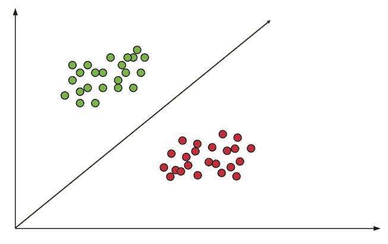
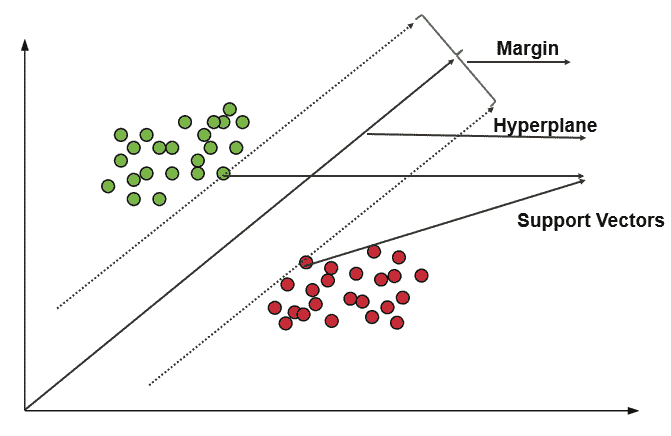
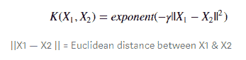
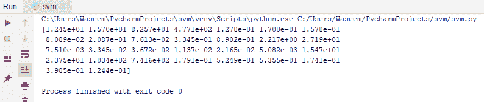
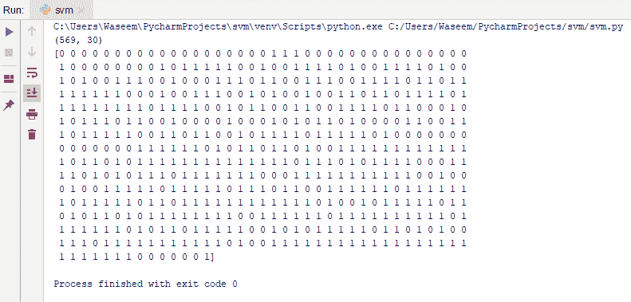
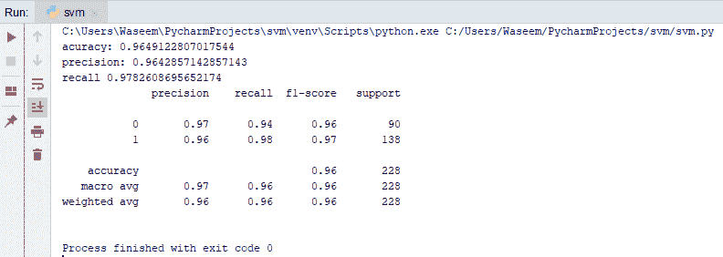
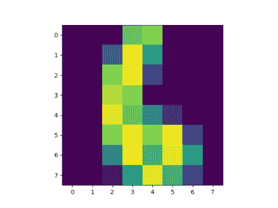

# Python 支持向量机快速学习指南

> 原文：<https://www.edureka.co/blog/support-vector-machine-in-python/>

[机器学习](https://www.edureka.co/blog/machine-learning-tutorial/)是计算机时代的新时代革命。我们可以用正确的数据集和相关的[算法](https://www.edureka.co/blog/machine-learning-algorithms/)来处理数据，获得最佳结果，从而完成人们只能梦想的任务。在本文中，我们将通过使用 python 的[机器学习中的一个分类算法，即 python 中的支持向量机。本博客涵盖了以下主题:](https://www.edureka.co/machine-learning-certification-training)

*   [机器学习简介](#ml)
*   [什么是支持向量机](#svm)
*   SVM 是如何工作的？
*   [SVM 仁](#kernel)
*   [支持向量机用例](#usecase)
*   [SVM 例子](#example)

## **机器学习简介**

机器学习是向机器输入足够的数据来训练和预测使用海湾算法的可能结果的过程。输入机器的数据越多，机器的效率就越高。让我们用一个真实的例子来理解这一点。


我相信你们大多数人都知道在任何重大比赛前对任何运动的预测。在这种情况下，让我们举一个足球点球环节的例子。

考虑到之前表现的数据，假设门将在最近扑出的 50 个点球中，所有的点球都扑到了他的右边。这些数据对于预测他是否会挽救接下来的点球面至关重要。还有其他因素需要考虑。

另一个例子是我们在网上冲浪时得到的建议，我们以前选择的数据经过处理，给我们最喜欢的内容，我们最有可能观看。

总之，[机器学习](https://www.edureka.co/blog/top-10-machine-learning-frameworks/)不仅仅是给机器输入大量的数据，还有许多过程、算法和决定性因素来获得最佳结果。

在这篇博客中，我们将通过一个这样的支持向量机算法来理解它如何与 python 一起工作。在此之前，让我们也来看看[机器学习的类型](https://www.edureka.co/blog/machine-learning-tutorial/)

### **机器学习的类型**

*   **监督学习**–学习以受控的方式进行，以相应地监督结果。顾名思义，它是在某种程度上被监督的，机器学习用户想要它学习的东西。

*   **无监督学习**——在这种情况下，机器只是探索给它的数据。数据有时是未标记和未分类的，机器在没有任何监督的情况下做出可能的参考和预测。

*   **强化学习**——基本意思是强化一种行为模式。机器需要在强化学习中建立一个系统的方法模式。

## **什么是支持向量机**

支持向量机最早出现在 20 世纪 60 年代，后来在 20 世纪 90 年代得到了发展。这是一种[监督学习](https://www.edureka.co/blog/supervised-learning/)机器学习分类算法，由于其极其高效的结果，如今已经成为**极其流行的**。

SVM 的实现方式与其他机器学习算法略有不同。它能够执行分类、[回归](https://www.edureka.co/blog/linear-regression-in-python/)和异常值检测。

支持向量机是一种由分离超平面形式化设计的判别分类器。它将示例表示为空间中的点，这些点被映射，使得不同类别的点被尽可能宽的间隙分隔开。除此之外，SVM 还可以执行非线性分类。让我们来看看支持向量机是如何工作的。

### **SVM 的优势**

*   在高维空间中有效

*   在维数大于样本数的情况下仍然有效

*   在决策函数中使用一个训练点子集，以提高记忆效率

*   可以为决策函数指定不同的核函数，这也使其具有通用性

**SVM 的劣势**

*   如果特征的数量远大于样本的数量，在选择核函数和正则项时避免过拟合是至关重要的。

*   支持向量机并不直接提供概率估计，而是使用五重交叉验证进行计算。

## SVM 是如何工作的？

支持向量机的主要目标是以最好的方式分离给定的数据。当分离完成后，最近的点之间的距离称为边距。该方法是在给定的[数据集](https://www.edureka.co/blog/25-best-free-datasets-machine-learning/)中选择一个在支持向量之间具有最大可能余量的超平面。



为了在给定集合中选择最大超平面，支持向量机遵循以下集合:

*   生成超平面，以尽可能好的方式分离类

*   从最近的数据点中选择具有最大分离的右超平面

****

**如何处理不可分的非线性平面**

在某些情况下，超平面可能不是很有效。在这些情况下，支持向量机使用一个内核技巧来将输入转换到一个更高维度的空间。这样，分离这些点就变得更容易了。让我们来看看 SVM 玉米粒。

## **SVM 仁**

SVM 核基本上是在低维空间中增加了更多的维度，从而更容易分离数据。它通过使用核技巧增加更多维度，将不可分问题转化为可分问题。支持向量机实际上是由内核实现的。内核技巧有助于制造更准确的分类器。让我们看看支持向量机中不同的核。

*   **线性核**–线性核可用作任意两个给定观察值之间的标准点积。两个向量之间的乘积是每对输入值的乘积之和。下面是线性核方程。

*   **多项式内核**–它是线性内核的一种相当一般化的形式。它可以区分弯曲或非线性输入空间。以下是多项式核方程。

*   **径向基函数核**——径向基函数核常用于 SVM 分类，它可以映射无限维的空间。下面是 RBF 核方程。 

## **支持向量机用例**

*   人脸检测

*   文本和超文本分类

*   图像分类

*   生物信息学

*   蛋白质折叠和远程同源性检测

*   手写识别

*   广义预测控制

## **SVM 例子**

现在让我们尝试使用 [scikit-learn 来实现我们到目前为止在 python 中所学的内容。](https://www.edureka.co/blog/scikit-learn-machine-learning/)要制作一个支持向量机分类器，我们将遵循以下步骤。

*   [加载数据](https://www.edureka.co/blog/python-csv-files/)

*   [探索数据](https://www.edureka.co/blog/exploratory-data-analysis-in-python/)

*   拆分数据

*   [生成模型](https://www.edureka.co/blog/machine-learning-classifier/)

*   模型评估

**加载数据**

我们正在使用 [sklearn](https://www.edureka.co/blog/scikit-learn-machine-learning/) 库中的癌症数据集，我们将制作一个分类器来预测癌症是恶性还是良性。我们可以用以下方式加载数据集。

```
from sklearn import datasets

cancer_data = datasets.load_breast_cancer()
print(cancer_data.data[5]

```

**输出:**

在此之后，我们将探索数据。看看数据集中的各种值。检查目标变量等。

**探索数据**

该形状意味着该数据集有 569 行和 30 列。

```
print(cancer_data.data.shape)
#target set
print(cancer_data.target)

```

**输出:**

其中，0 代表恶性，1 代表良性。

**拆分数据**

我们将数据集分为训练集和测试集，以获得准确的结果。之后，我们将使用 train_test_split()函数拆分数据。我们将需要 3 个参数，如下例所示。训练模型、目标和测试集大小的特征。

```
from sklearn.model_selection import train_test_split

cancer_data = datasets.load_breast_cancer()

X_train, X_test, y_train, y_test = train_test_split(cancer_data.data, cancer_data.target, test_size=0.4,random_state=109)

```

**生成模型**

为了生成模型，我们将首先从 sklearn 导入 SVM 模块，通过传递自变量内核作为线性内核，在 svc()中创建支持向量分类器。

然后，我们将使用 set()训练数据集，并使用 predict()函数进行预测。

```
from sklearn import svm
#create a classifier
cls = svm.SVC(kernel="linear")
#train the model
cls.fit(X_train,y_train)
#predict the response
pred = cls.predict(X_test)

```

### **评估模型**

这样，我们可以预测模型或分类器预测患者是否患有心脏病的准确性。因此，我们将计算评估的准确度、召回率和精确度。

```
from sklearn import metrics
#accuracy
print("acuracy:", metrics.accuracy_score(y_test,y_pred=pred))
#precision score
print("precision:", metrics.precision_score(y_test,y_pred=pred))
#recall score
print("recall" , metrics.recall_score(y_test,y_pred=pred))
print(metrics.classification_report(y_test, y_pred=pred))

```

**输出:**

我们得到的准确度、精确度和召回值分别为 0.96、0.96 和 0.97，这是极不可能的。因为我们的数据集非常具有描述性和决定性，所以我们能够得到如此精确的结果。通常，任何高于 0.7 的准确度分数都是好分数。

让我们看另一个例子来理解我们如何以不同的方式使用支持向量机分类算法。

**用支持向量机进行字符识别**

在本例中，我们将使用现有的数字数据集并训练分类器。在此之后，我们将使用分类器来预测一个数字，并将图像绘制得更加清晰。

```
import matplotlib.pyplot as plt
from sklearn import datasets
from sklearn import svm
#loading the dataset
letters = datasets.load_digits()
#generating the classifier
clf = svm.SVC(gamma=0.001, C=100)
#training the classifier
X,y = letters.data[:-10], letters.target[:-10]
clf.fit(X,y)
#predicting the output 
print(clf.predict(letters.data[:-10]))
plt.imshow(letters.images[6], interpolation='nearest')
plt.show()

```

**输出:**

为了提高精度，我们可以改变 SVC 参数中的 gamma 值或 C 值，但这也会影响速度。如果我们增加伽玛值，精确度会降低，但速度会增加。

这就把我们带到了本文的结尾，在这里我们学习了如何在 Python 中使用支持向量机。我希望你清楚本教程中与你分享的所有内容。

*如果您发现这篇文章与“Python 中的支持向量机”相关，请查看  Edureka 的 Python 认证培训，  一家值得信赖的在线学习公司，拥有遍布全球的 250，000 多名满意的学习者。*

*我们在这里帮助你踏上旅程的每一步，并为想要成为  [Python 开发者](https://www.edureka.co/blog/how-to-become-a-python-developer/)的学生和专业人士设计课程。该课程旨在让您在 Python 编程方面有一个良好的开端，并训练您掌握核心和高级 Python 概念以及各种  [Python 框架](https://www.edureka.co/blog/python-frameworks/) ，如  [Django。](https://www.edureka.co/blog/django-tutorial/)*

如果您遇到任何问题，请在“Python 中的支持向量机”的评论区提出您的所有问题，我们的团队将很乐意回答。