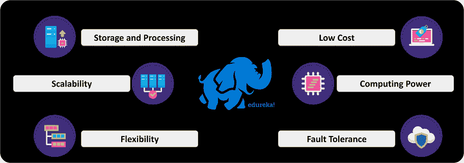
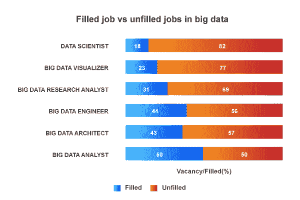
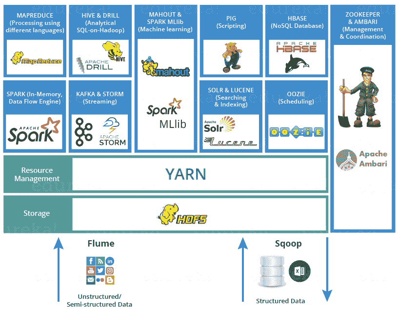
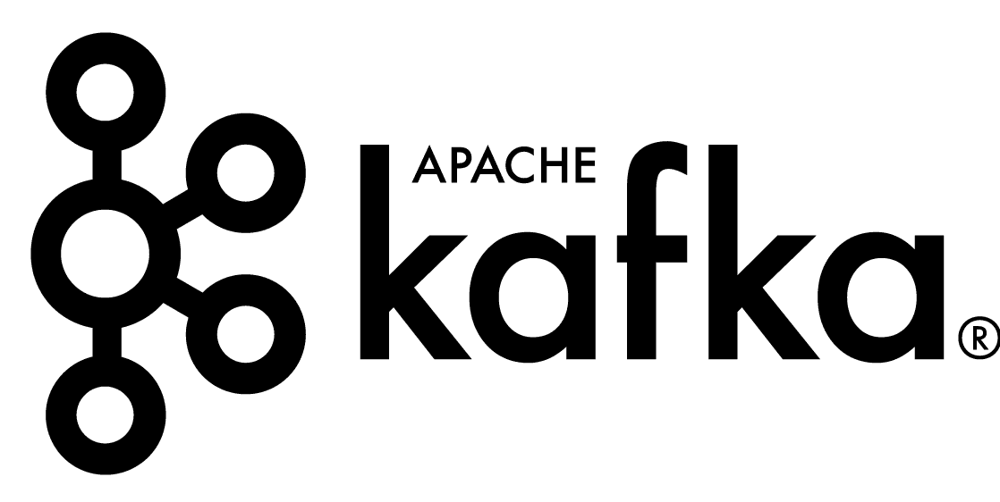
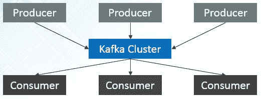

# 2023 年你需要掌握的顶级 Hadoop 开发者技能

> 原文：<https://www.edureka.co/blog/top-hadoop-developer-skills/>

数据是 21 世纪的新燃料，Hadoop 凭借卓越的数据处理能力成为细分市场的领导者。如果没有拥有杰出技能的高素质 Hadoop 开发人员，这一切都是不可能的。在本文中，我们将学习重要的 Hadoop 开发人员技能。

*   [谁是 Hadoop 开发者？](#who)
*   [如何成为一名 Hadoop 开发者？](#how)
*   [为什么 Hadoop 的需求如此之高？](#why)
*   [成为 Hadoop 开发人员所需的技能](#skill)
*   [Hadoop 开发人员的角色和职责](#role)
*   [雇佣 Hadoop 开发人员的公司](#company)
*   [Hadoop 开发者面试问题](#interview)

## **谁是 Hadoop 开发者？**

[** Hadoop 开发人员**](https://www.edureka.co/blog/hadoop-developer/) 是一名专业的程序员，拥有 Hadoop 组件和工具的尖端知识。一个 Hadoop 开发者，基本设计、开发和  部署 Hadoop 应用，文档功底很强。

您是否正在寻找 Hadoop 工具及其概念的实时体验，那么本在线 **[大数据培训](https://www.edureka.co/big-data-hadoop-training-certification)** 课程将帮助您获得顶级行业专家的实时项目体验。

## **如何成为一名 Hadoop 开发者？**

要成为一名 Hadoop 开发者，你得经历  **路线图** 所描述的。

*   牢牢掌握  [**SQL 基础知识**](https://www.edureka.co/blog/sql-basics/) 和  [**分布式系统**](https://www.edureka.co/blog/spark-architecture/) 是强制的。

对于初学者来说，理解 SQL 和数据库的术语将有助于学习 Hadoop 组件。

*   **[Java](https://www.edureka.co/blog/java-tutorial/) ，  [Python](https://www.edureka.co/blog/python-tutorial/) ，  [JavaScript](https://www.edureka.co/blog/javascript-tutorial/) ，  [NodeJS](https://www.edureka.co/blog/nodejs-tutorial/)** 等语言编程能力强

Hadoop 是使用 Java 开发的，Java 诞生了许多编程语言，如 Scala 和脚本语言 PigLatin。精通编程语言对初学者来说是有益的。

*   构建自己的 Hadoop 项目，以便理解术语  [**Hadoop**](https://www.youtube.com/watch?v=WNITzdRJVB8)

构建自己的 Hadoop 项目将让您对 Hadoop 工具和组件的工作有一个简单的了解。

*   **计算机科学**学士或硕士学位

计算机科学和工程技术学士学位是深入了解 Hadoop 技术细节的必备条件。

*   最低经历 **2** 至 **3** 年

你可能想实习或加入一家初创公司，以获得相关技术的最低经验，从而有更好的机会成为一名专业的 Hadoop 开发人员

现在，我们将理解为什么 Hadoop 会有如此大的需求。

## **为什么 Hadoop 的需求如此之高？**

在最近根据最大的就业门户网站**indeed.com**进行的就业调查中，我们发现 **Hadoop** 在所有领先的跨国公司中广泛应用于主要行业。原因是:

*   它高度灵活

*   它被设计成**容错**几乎任何潜在的攻击

*   它的超级数据处理能力

*   与传统的数据服务器相比，它具有很高的成本效益。

*   维护 T1 很容易，最重要的是，它很容易进行 T2 扩展。

此外，空缺职位和可用的 Hadoop 开发人员之间存在巨大差距。下面的图表解释得更清楚。

*   印度有大约 **50，000 个**Hadoop 开发人员的职位空缺。

*   印度贡献了全球市场 **12%的 Hadoop 开发者工作岗位**。

*   印度的许多大型跨国公司为印度的 Hadoop 开发者提供了**丰厚的薪水**。

*   **80%的市场**雇主都在寻找 **Hadoop** 专家。

*   **大数据** 分析 **市场** 在 **印度** 目前估值为**20 亿美元**并有望以 **CAGR** 占**26%**的速度增长，到 2025 年创造 **印度**达到约**160 亿美元******

*   这促成了印度  **KPO** 市值**56 亿美元。**

*   《印度教徒报》预测，到 2019 年底，仅印度就将面临接近 30 万数据科学家的短缺。

*   这提供了一个巨大的职业发展机会。

*   从 [数据工程师认证](https://www.edureka.co/microsoft-azure-data-engineering-certification-course) 了解更多大数据及其应用。

## **成为 Hadoop 开发人员所需的技能**

对于作为初学者的任何 Hadoop 开发人员来说，所需的基本和重要技能如下所述。

*   [Hadoop 基础单元](#fundamental)
*   [数据摄取工具](#ingest)
*   [写代码解决问题](#write)
*   [顶级 ETL 工具](#etl)
*   [机器学习工具](#ml)
*   [作业调度工具](#job)
*   [集群计算工具](#cluster)

首先，他或她必须熟悉 Hadoop 生态系统及其组件。

*   Hadoop 有两个基本单元——**S*存储*** 和 ***处理*** 。 Hadoop 旨在处理海量大数据。除非开发人员对 Hadoop 中使用的大量数据存储组件有实际经验，否则很难处理这些数据。初学者需要了解的基本 Hadoop 存储单元有:

[**HDFS Hadoop 分布式文件系统**](https://www.edureka.co/blog/hdfs-tutorial)

HDFS ( Hadoop 分布式文件系统)是一个基于 Java 的分布式文件系统，允许您在 Hadoop 集群中的多个节点上存储大量数据。几乎所有的处理框架，如 Apache Spark、MapReduce 等，都运行在 HDFS 之上。

[**HBase**](https://www.edureka.co/blog/hbase-tutorial)

Hadoop 开发者在(Hadoop 分布式文件系统)之上运行 HBase。它为 Hadoop 提供了类似 BigTable 的功能。它旨在提供一种存储大量稀疏数据集的容错方式。

[**火花 SQL**](https://www.edureka.co/blog/spark-sql-tutorial/)

你也可以考虑学习 **Spark SQL** ，它在数据查询方面非常快。 Spark SQL 集成了关系处理和 Spark 的函数式编程。它提供了对各种数据源的支持，并使得将 SQL 查询与代码转换结合起来成为可能，从而产生了一个非常强大的工具。

*   更好地了解**数据摄取工具**

数据来自各种来源，Hadoop 是一个旨在处理几乎所有类型数据的框架，与结构化、半结构化或非结构化数据无关。在处理来自不同来源的数据时，对数据摄取工具的良好了解将会派上用场。Hadoop 中可用的流行数据获取工具有:

[**水槽**](https://www.edureka.co/blog/apache-flume-tutorial/)

Hadoop 开发人员使用 **Apache Flume** 来收集、聚合和传输大量的流数据，如日志文件、来自网络流量、社交媒体、电子邮件等各种来源的事件。去 HDFS。 水槽是高度可靠的&分布式。

Flume 设计背后的主要思想是从各种网络服务器上获取流数据，然后传输到 HDFS。它有一个简单灵活的基于数据流的架构。它是容错的，并为容错&故障恢复提供可靠性机制。

[**【sqooo】**](https://www.edureka.co/blog/apache-sqoop-tutorial/)

Hadoop 开发者，使用 **Apache Sqoop** 在(Hadoop 存储)和关系数据库服务器如 MySQL、Oracle RDB、SQLite、Teradata、Netezza、Postgres 等等之间传输数据。

Apache Sqoop 将关系数据库中的数据导入到 HDFS，并将 HDFS 的数据导出到关系数据库。它在 Hadoop 和外部数据存储(如企业数据仓库、关系数据库)之间高效地传输批量数据。

[**卡夫卡**](https://www.edureka.co/blog/apache-kafka-next-generation-distributed-messaging-system)

Hadoop 开发者使用 **Apache Kafka** 作为实时分布式发布-订阅消息系统。它最初是在 LinkedIn 上开发的，后来成为 Apache 项目的一部分。Kafka 的设计是快速、敏捷、可扩展和分布式的。它有以下组件。

**卡夫卡建筑与术语:**

**主题:**属于特定类别的消息流称为主题

**生产者:**生产者可以是能够向主题发布消息的任何应用程序

**消费者:** 消费者可以是订阅主题和消费消息的任何应用程序

**代理:** Kafka 集群是一组服务器，每个服务器称为一个代理

*   一旦您熟悉了数据摄取工具，下一个关键技能就是能够**编写代码来解决大数据的问题**。要写出完美的代码，需要对 Hadoop 中的数据处理工具有更好的理解。重要的数据处理工具是 MapReduce 和 Spark。

[**Mapreduce**](https://www.edureka.co/blog/mapreduce-tutorial/)

Hadoop 开发初学者，使用 **MapReduce** 作为编程框架，在分布式环境下对大型数据集进行分布式并行处理。

MapReduce 有两个细分的任务。映射器任务和缩减器任务。 映射器或映射作业(键值对)的输出被输入到缩减器。reducer 从多个 map 作业接收键值对。

[**阿帕奇火花**](https://www.edureka.co/blog/spark-tutorial/)

**Spark** 集群计算框架被开发者用于 ***的实时处理。*** 拥有庞大的开源社区，是活跃的 Apache 项目。它为具有隐式数据并行性和容错性的集群编程提供了一个接口。

*   一旦您对 Hadoop 生态系统的基本工作有了很好的理解，那么您就可以更进一步，学习 **[数据仓库以及提取、转换和加载流程。【T2](https://www.edureka.co/blog/big-data-and-etl-are-family/)**
*   [**Hadoop 中最顶级的 ETL 工具**](https://castbox.fm/episode/Episode-16%3A-Top-ETL-tools-of-2019-id1814029-id171687577?country=us) 有:

[**猪**](https://www.edureka.co/blog/pig-tutorial)

**开发人员**过去常常分析大型数据集，将它们表示为数据流。它旨在提供 MapReduce 的抽象，降低编写 MapReduce 程序的复杂性。

[**鼠标**](https://www.edureka.co/blog/introduction-to-apache-hive/)

Apache Hive 是一个数据仓库项目，开发人员使用它在 Hadoop 基础上进行数据查询和数据分析。它最初是由脸书的数据基础设施团队构建的。

[**GraphX**](https://www.edureka.co/blog/spark-graphx/)

GraphX 是 Apache Spark 的 API，开发者用于图形和图形并行计算。GraphX 在单个系统中统一了 ETL(提取、转换&加载)过程、探索性分析和迭代图计算。

*   我们都知道，大数据分析正在人工智能和机器学习领域得到广泛应用。机器学习中使用的顶级 Hadoop 框架有 **Mahout** 和 **Spark ML-Lib。**

[看象人](https://www.edureka.co/blog/introduction-to-apache-mahout/)

Hadoop 开发者使用 **Mahout** 进行 ML。它让机器无需过度编程就能学习。它产生可扩展的机器学习算法，以简化的方式从数据集中提取建议。

[**火花 ML-Lib**](https://www.edureka.co/blog/spark-mllib)

**Spark MLlib** 由阿帕奇基金会设计。它主要用于在 Apache Spark 之上执行机器学习。 MLlib 由流行的算法和实用程序组成。

*   管理 Hadoop 生态系统并在集群中执行 Hadoop Jos 至关重要，而 Apache Oozie 恰好是这方面的完美选择。

[**Oozie**](https://www.edureka.co/blog/apache-oozie-tutorial/)

**Apache Oozie** 是一个调度系统，用于在分布式环境中管理&执行 Hadoop 作业。

开发人员通过组合不同种类的任务来创建所需的管道。可以是你的**蜂巢，猪， Sqoop** 或者 **MapReduce** 任务。使用 Apache Oozie，你还可以安排你的工作。在一个任务序列中，两个或多个作业也可以被编程为彼此并行运行。这是一个**可扩展的、可靠的**和**可扩展的**系统。

*   Hadoop 开发人员需要管理 Hadoop 集群。Ambari 是管理 Hadoop 集群最简单、最容易的界面。

安巴里

  **Apache Ambari** 是 Apache 软件基金会的一个软件项目。Hadoop 开发者使用 **Ambari** 为系统管理员  到**调配、管理**和**监控**一个 Hadoop 集群，同时  到**将** Hadoop 与主流的集成

所以，这些是 Hadoop 开发人员需要的一些关键技能。现在，让我们进一步了解 Hadoop 开发人员的关键角色和职责。

你甚至可以用浦那 的 [Azure 数据工程课程查看大数据的细节。](https://www.edureka.co/microsoft-azure-data-engineering-certification-course-pune)

## **Hadoop 开发人员的角色和职责**

[**Hadoop 开发人员的角色和职责**](https://www.edureka.co/blog/hadoop-developer-roles-and-responsibilities) 需要多种多样的技能，以便能够用即时解决方案处理多种情况。因为不同的公司有不同的数据问题。Hadoop 开发人员的一些主要和一般的角色和职责如下。

*   **设计、构建、安装、配置**和**支持** Hadoop 系统

*   能够翻译详细设计中的复杂技术要求。

*   维护**安全**和**数据隐私。**

*   设计**可扩展的**和**高性能的** web 服务用于数据跟踪。

*   **高速**数据查询。

*   使用像 [**动物园管理员**](https://www.youtube.com/watch?v=Qhc6RMaDkgY)这样的调度器定义作业流

*   **集群**协调服务通过**动物园管理员**

## **雇佣 Hadoop 开发人员的公司**

当前 IT 行业对 Hadoop 开发者的需求巨大。一些主要的科技巨头雇佣了 Hadoop 开发人员，如下所示。

接下来，我们将讨论 Hadoop 开发人员的面试问题。

## **Hadoop 开发者面试问题**

这篇 [**Hadoop 面试问题文章**](https://www.edureka.co/blog/interview-questions/top-50-hadoop-interview-questions-2016/) 将引导您进入 Hadoop 开发人员档案中最常见的面试问题

到此，我们来结束这篇文章**。**我希望我已经让你了解了一些关于 **Hadoop 开发人员技能** 以及  ***角色和职责、** 工作趋势* 和 *工资趋势、*

*既然您已经了解了大数据及其技术，请查看 Edureka 在印度举办的**大数据培训，edu reka 是一家值得信赖的在线学习公司，拥有遍布全球的 250，000 多名满意的学习者。Edureka 大数据 Hadoop 认证培训课程使用零售、社交媒体、航空、旅游、金融领域的实时用例，帮助学员成为 HDFS、Yarn、  [MapReduce](https://hadoop.apache.org/docs/current/hadoop-mapreduce-client/hadoop-mapreduce-client-core/MapReduceTutorial.html) 、Pig、Hive、HBase、Oozie、Flume 和 Sqoop 领域的专家。*

如果您对这篇“Hadoop 开发人员技能”文章有任何疑问，请在下面的评论区给我们写信，我们会尽快回复您，或者参加我们在 Bhubaneswar 举办的 [Hadoop 培训。](https://www.edureka.co/big-data-hadoop-training-certification-bhubaneswar)