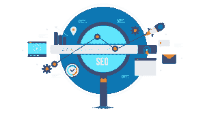
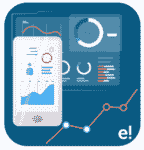
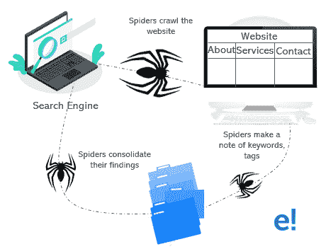
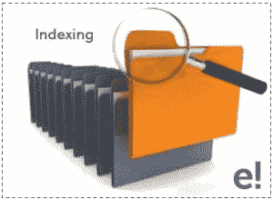
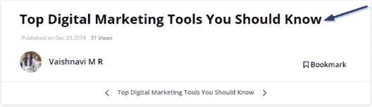

# SEO 初学者教程:你的一站式解决方案

> 原文：<https://www.edureka.co/blog/seo-tutorial/>

几乎所有使用互联网的人都很熟悉，并且都在利用搜索引擎来寻找任何有希望并且值得搜索的东西。更准确地说，高达 93%的在线体验通常是从使用搜索引擎开始的。所以，我给你带来了一个完整的初学者 SEO 速成教程。这篇文章将是你搜索引擎优化*营销*的最佳解决方案。

本博客将带您了解以下主题:

*   [为什么需要搜索引擎优化？](#Why_SEO?)
*   [什么是搜索引擎优化？](#What_is_Search_Engine_Optimization?)
*   [SEO 的类型](#Types_of_SEO)
*   搜索引擎是如何工作的？
*   [战术和方法](#Tactics_and_Methods)
*   [如何优化关键词？](#How_to_optimize_Keywords?)
*   [标题优化](#Title_Optimization)
*   [SEO 工具](#SEO_Tools)
*   [指导方针](#Guidelines)

我们开始吧！

## **为什么需要搜索引擎优化？**

嗯，SEO 是一个顶级的 *[数字营销](https://www.edureka.co/blog/what-is-digital-marketing/)* 渠道，用来为你的网站产生流量。这个营销渠道非常重要，因为它不仅与搜索引擎有关，还与良好的 SEO 有关，改善用户体验，最终提高网站流量。

那么，这和你的生意有什么关系？

想象一下，你拥有一家公司，你正在网上冲浪，增加网站流量的最好方法是什么？一个简单的答案是 SEO。几乎所有的网站都需要优化才能在 **Google** 上排名。

因此，简而言之，我会说你需要 SEO 服务，因为它将有助于向搜索引擎发送正确的信号，也将你的网站推上结果列表的首位。

## **SEO 初学者教程:什么是搜索引擎优化？**

搜索引擎优化通常称为 SEO，基本上是一个提高网站流量质量的过程。

像谷歌、雅虎和必应这样的主要搜索引擎都有主搜索结果。这里，基于搜索引擎根据上下文选择的最相关的内容来显示和排列网页。

当潜在客户搜索与您的产品或服务相关的特定关键词时，SEO 可以帮助网站在搜索引擎结果页面上获得更好的排名。因此，这增加了质量和数量的交通在您的网站上通过有机的结果。

让我们来看看关于 SEO 过程有哪些误区。实际上，SEO 和人们想象的不一样。

### **关于搜索引擎优化的神话**

神话 : SEO 就是优化谷歌。 **现实**:肯定不会，更多像雅虎、必应之类的平台也取决于你的业务。

**神话**:你应该为流量付费才能获得 SEO。 **现实**:这个过程在数字营销中被称为黑帽。

现在，让我们弄清楚数字营销是如何产生的，它的根源和分支是如何蔓延的。

### **SEO 初学者教程:历史**

搜索引擎优化被认为是一个千禧年。据信 SEO 出生于 1991 年。在这期间，世界上第一个网站(www)诞生了。这导致了许多此类网站的推出，挤满了互联网。

这个流行的搜索引擎是由拉里·佩奇和谢尔盖·布林共同创建的。有趣的是，SEO 在 1997 年被正式使用。

这些是证明 SEO 发展的一系列事件。

*   **1993** : 搜索引擎 Excite 由斯坦福的学生首先推出。
*   1993 年 6 月:环球漫游者发布，后来被命名为 Wandex。同年，ALIWEB 被引入，它允许网站所有者提交自己的页面。
*   **1994 年**:雅虎、Vista、Lycos 搜索引擎诞生。
*   **1995 年**:创造了 LookSmart、Excite、AltaVista。
*   **1996** :开始建立一个叫做 BackRub 的搜索引擎。
*   **1997 年** : MSN 搜索引擎建成，Google 上线。

这甚至可以追溯到我们将谷歌作为注册域名之前。现在我们知道 SEO 和 Google 的立场了。

继续讨论下一个话题，让我们来了解一下正在使用的 SEO 的类型。

## **SEO 初学者教程:SEO 的类型**

谈到现有的不同类型的 SEO，我们有各种各样的 SEO 在使用。几个值得注意的例子是:

*   [白帽 SEO](#White_Hat_SEO)
*   [黑帽 SEO](#Black_Hat_SEO)
*   [灰帽子 SEO](#Gray_Hat_SEO)

[SEO 技巧](#SEO_Techniques)

*   [页面搜索引擎优化](#On-page_SEO)
*   [离页 SEO](#Off-page_SEO)
*   [技术 SEO](#Technical_SEO)

SEO 实际上是用来增加搜索引擎对你网站的有机流量。因此，使用正确类型的搜索引擎优化，你将能够实现这个伟大的目标。

### **白帽 SEO**

顾名思义，白帽 SEO 基本上是指全球数字营销人员采用的最正直的做法，以帮助您的产品在搜索引擎结果页面上排名靠前( **SERP** )。这种类型严格遵守谷歌指南。所以，为了更好的搜索引擎优化，你应该遵循谷歌的指导方针。您将能够更加关注元标签、标题中的关键字和内容主体。

这种类型也叫**伦理 SEO** 。这是在网站上发布高质量内容、重组链接以及其他许多方面最广泛使用的实践。

继续，让我们看看什么是黑帽 SEO。

### **黑帽 SEO**

这种黑帽 SEO 包括某些实践，这些实践专注于**在谷歌的算法中寻找漏洞**，以便在搜索引擎结果页面(SERP)中将特定内容排名更高。 

黑帽 SEO 和白帽 SEO 是死对头。我的意思是，黑帽 SEO 所遵循的实践完全违背了谷歌及其算法所提供的指导方针..

现在谈谈技术，它包括

*   垃圾链接
*   关键词填充
*   大衣料
*   隐藏文本
*   链接

所以，使用这些技术，你可以让你的内容出现在 SERPs 上。

### **灰帽子 SEO**

通常，我们使用黑帽或白帽 SEO，但有时，我们也使用灰帽 SEO。那么，这个灰帽 SEO 是什么呢？定义灰帽 SEO 有点难。但是我已经用简单的术语解释清楚了。灰色帽子不是介于黑色帽子和白色帽子之间的东西，它和人们所说的有很大不同。在这里，这是一种使用合法手段帮助提高网站流量的做法。

这些也被认为是可疑的，有一天会变成黑帽子。此外，这属于中间的某个地方，因为这些策略和技术在谷歌的指导方针中没有明确提出。

让我们来学习一下 SEO 的技巧。

### **SEO 技术:页面 SEO**

你可能遇到过这些关键词，页面内和页面外搜索引擎优化。这些只是你通过在页面上和页面外增加内容来获得更多流量的策略。谈到页面内 SEO，这涉及到 ***内容呈现在*** 网页上。现在，您可能会想，处理页面上的内容有什么特别之处？嗯，有。

所有页面上的活动主要包括:

*   关键词在正确位置的分布
*   插入外部链接
*   Meta tags
*   描述
*   向内容添加自定义 URL
*   形象

所有这些都存在于页面上，因此以一种更好的方式优化它最终会给你的网站带来更多的流量。

### **SEO 技术:离页 SEO**

离页搜索引擎优化也需要增加你的网站的流量，但它主要侧重于外部排名媒介，如**反向链接、** **内部链接**等等。这是最广泛地指的活动，执行后，网页上的生活在互联网上。

**链接建设**、**品牌推广**都是离页 SEO 的一部分。除此之外，离页搜索引擎优化还包括评论帖子，分享，比如，建立用户参与度。

名单上的下一个是技术搜索引擎优化。

### **SEO 技术:技术性 SEO**

技术型 SEO 往往和没有内容的部分有关。这是什么意思？这意味着你会有改善网站后台结构的策略。此外，顾名思义，它处理影响您的网站在搜索引擎上的可见性的技术参数。

这都是关于搜索引擎优化的使用类型。接下来，让我们了解搜索引擎的工作原理。

## **SEO 初学者教程:搜索引擎是如何工作的？**

搜索引擎是用来产生更好的结果的，你可以去查找。了解搜索引擎的工作肯定会有助于更好的最终结果。所以，让我们看看这些搜索引擎是如何工作的。

从技术上讲，搜索引擎有以下主要功能:

*   [爬行](#Crawling)
*   [索引](#Indexing)
*   [排名](#Ranking)

下面我们就来详细了解一下。

#### **爬行**:

这个过程也被称为**蜘蛛/网络爬虫**。它会自动浏览网页，并存储有关您访问的网页的信息。

#### ****

它也可以被称为 **Googlebot** (它们帮助找到新的和更新的内容)。这种方法首先获取一些你曾经寻找过的网页，然后根据这些网页上的链接找到新的网址。通过跟踪链接，爬行器将能够找到新的内容并将其添加到索引中。这被称为 ***咖啡因**，*一个巨大的先前搜索过的网址的数据库，当你在寻找某个特定网址上的内容的信息并认为它是一个很好的匹配时，以后可以检索到它。

#### **索引**:

一旦蜘蛛抓取了一个网页，它的副本就会被存储到一个**数据中心。**这些数据中心是一个巨大的存储库，拥有所有被抓取的网页副本。网页很容易被搜索引擎发现，通过添加一个叫做 ***索引的数据结构  可以更好地发现网页。***

****

它也可以被定义为网页的存储库，这些网页统称为索引。这个概念很简单，如果你的网站不在他们的索引中，它就不会出现在任何搜索中。同样，如果你在搜索引擎索引中有更多的页面，你出现在搜索结果中的机会就越多。

#### **排名**:

这是一个搜索引擎将挑选高度相关的内容并将其显示在 SERP 上最高位置的过程。这些只是你创建的内容，由搜索引擎精心挑选，以更好地优化特定关键字的结果。Y 你也可以说，一个网站排名越高，搜索引擎认为它的解决方案就越相关。

#### ****

还有， ***PageRank*** 是改善网页搜索结果最好的算法之一。也被认为是衡量网站重要性的方法之一。除此之外，出现在搜索引擎第一页的网站和内容都是 PageRank 认为最好的。

这正是搜索引擎的工作方式。

现在你已经理解了搜索引擎的工作原理，让我们继续讨论在 SERP 上优化你的网页的捷径或策略。

## **SEO 初学者教程:战术与方法**

仅仅拥有一个好的网站和伟大的内容并不能帮助你在搜索引擎页面的相关关键词上排名。你应该遵循一些有助于更好的流量和线索生成的技巧。所以，这里有一些策略可以帮助你的内容在搜索引擎页面上排名。

*   #### **Good user experience**

登陆你的网站的人通常会寻找一个平滑的界面，你应该能够轻松地为他们提供这种界面。这是因为谷歌只挑选那些提供相关和高质量搜索结果的网站。所以，谷歌要把你的网站作为独特的内容，你应该有一个好的用户界面和合理的查询解决方案。

根据最近的一项调查，也表明你的内容应该是有用的，可取的，可找到的。有价值的，可信的，可及的。

*   #### **Content creation**

内容越长=排名越高。这是实际的真相。你创建的内容对你的网站排名有很大的影响。最近的一项研究也表明*“内容越长，其在 SERPs 中排名靠前的可能性就越大”。*

有机流量比通过社交媒体平台产生流量要好得多。所以，以不妨碍公司发展的方式组织你的商业目标。一般的商业企业仅在广告上花费总收入的 1%。所以，如果你的生意每年赚 100 万美元，你可能要花将近 1 万美元在广告上。

*   #### **Keyword research**

**关键词**对你的内容排名起着至关重要的作用。谷歌在进化，它的算法也在进化，现在，它的目标是理解观众的意图。他们想要什么，他们的兴趣，搜索量，更具体地说，关键字的搜索结果将有助于回答查询。

现在，比如说，搜索引擎显示“数字营销”每月的搜索量为38600000。这是一个巨大的数字，你将接触到数百万人，你将不得不瞄准它。

*   #### **Content marketing**

在创造好的内容并将其传递给正确的受众的领域中成为一个英雄。**内容创作**是必须的，但是在营销渠道中推广和分发内容是一项任务。如果你的公司在私营部门，比如说工业或教育部门，就需要有相应的文章或视频。

你得抓住机会多写文章，多做长视频。即使在这种情况下，你也必须确保你在搜索量最高的关键字上工作。这一定会让你的内容在 SERP 上排名前 10 的文章或视频。

*   #### **Create a large number of reverse links**

反向链接对于让你的网站在谷歌上排名很重要。链接仍然是决定网站排名的*第一*因素，因为如果没有这些链接，你的网站将很难排名。还有，链接可以通过优质内容，有影响力的营销等等来赚取。这些被认为是非常有效的。

这些是你在优化内容时应该考虑采用的一些方法。

下一个话题是如何优化你的关键词？让我们看看这是如何做到的。

## **SEO 初学者教程:如何优化关键词？**

按照这些步骤进行更好的关键字优化。

*   #### **Select your domain name and lock the hottest keywords**

了解你将要从事的领域，并锁定该领域中搜索次数最多的关键词。这将有助于更好的内容创作，并为你的网站带来更多的流量。

*   #### **Write effective content according to keyword research**

在您的网站内容中添加适当的优化关键词，您将能够**与您的潜在客户**和客户建立联系。通过这样做，你可以用一种简单的方式向你的观众表达。

*   #### **Add title tag, content strategy, link, URL and meta description**

当你从事 *[数字营销](https://www.edureka.co/blog/digital-marketing-tutorial/)* 时，你的组织的成功主要是由有机交通贡献的，有机交通主要集中在**研究、分析**等等。你内容的标题很重要。所以，一定要在标题中添加你的目标关键词，因为这个是你网站上最重要的作品，无论是在页面上还是在页面外。

为你觉得相关的主题添加相应的链接，我们有*内部*、*入站*和*出站*链接，帮助你更好地优化关键词。

永远要确定你在文章的关键部分添加了什么。这应该包含你的焦点关键字。*查看该页面的网址以供参考*。*它包含关键字。*

## **SEO 初学者教程:标题优化**

#### 什么是标题标签？

甚至在浏览者点击 SERP 上的链接之前，帖子的标题就吸引了更多的注意力。一个写得好的标题能引起读者的兴趣。但那都是站在观众这边的。

标题标签是 SEO 策略的重要组成部分。这是因为这些**是唯一的**、**短的**并且应该有**焦点关键字 i** n。这也是用户搜索与你的产品相关的特定查询时首先看到的东西。所以，你需要专注于制作吸引人的标题。

#### **如何优化标题？**

*   注意你标题的**长度。不要奇怪地显示它。通常，搜索引擎只显示网页标题的前 50-60 个字符。所以，确保你在给定的 50 个字符内填写正确的标题。**
*   总是有**个唯一的头衔**。不要试图复制或剽窃你的内容或标题。所有的网页都是独一无二的，所以，定制你的标题。
*   优先考虑你的**关键词**。这是必须要做的，因为根据最近的研究，据说标题开头的关键词可能对你的页面排名有更多的影响。
*   打造自己的品牌很重要。如果你有一个众所周知的品牌，通过把它加到标题的末尾来利用它。这样，你的网站会有更多的流量，同时，潜在客户也会了解你的工作。

这是关于优化你的标题。现在，让我们来看看你应该考虑使用的搜索引擎优化工具。

## **SEO 初学者教程:SEO 工具**

如果你想优化你的网站，工具是很重要的。你会发现市场上有各种各样的工具可以帮助你。蓬勃发展的工具有 Google Analytics、Ahrefs、Moz、SEMRush、UberSuggest 等等。在这篇文章中，我解释了两个领先的搜索引擎优化工具。

*   [Ahrefs](#Ahrefs)
*   塞姆拉什

#### **AHRS**

这款 SEO 工具是最受欢迎的数字营销工具之一，用于分析、准备反向分析、审计报告、URL 排名等等。Ahrefs 工具也用于关键字分析。

这不是一个免费的版本，但是这个工具拥有的特性是值得花一美元购买的。

该工具处理大量点击流数据，维护全球最大的第三方数据库的搜索查询。这基本上是估计的每月搜索量和高级关键字研究指标。

几乎所有的顶级公司都使用 Ahrefs，比如脸书、LinkedIn、网飞等等。

#### 塞姆拉什

嗯，这是搜索引擎优化营销的另一个重要工具。SEMRush 会对你的关键词进行研究(T2)，跟踪你的商业战略(T4)，并对你的博客进行搜索引擎优化审计。该工具的主要目的是  为所有数字营销领域创造最佳竞争情报解决方案。

SEMRush 非常适合 **PPC** (点击付费)，因为它允许大量的关键词研究，有助于规划和跟踪你的付费搜索活动的表现。

所以，伙计们！这是最好的搜索引擎优化营销工具之一，目前在市场上蓬勃发展。

接下来，我们将看看你应该遵循什么准则来创建更好的内容并优化它。

## **SEO 初学者教程:指南**

*   *创建与 ***焦点关键词极其相关的内容*。***
*   **写一个小的题目介绍。**这也叫元描述。在这里，不要忘记添加你的关键字。
*   **标题标签的正确使用**。主题使用不同的标题，副主题使用不同的标题。
*   **给内容添加合适的图片**。给图片添加 Alt 标签，甚至在这里添加 focus 关键字。
*   **内部链接**是必须的。这对于相关页面的排名非常重要。
*   可读性应该很好。造句应该很简单。

说到这里，我们就到了这篇“SEO 初学者教程”的结尾。我希望你清楚所讨论的话题，并增加数字营销知识的价值。

*如果你想报名参加一个完整的[在线数字营销课程](https://www.edureka.co/digital-marketing)，Edureka 有一个专门策划的 [PG 课程](https://www.edureka.co/post-graduate/digital-marketing-certification)，专门从事数字营销，这将帮助你获得各种数字媒体方面的专业知识，如关键词规划、搜索引擎优化、社交媒体营销、搜索引擎营销、电子邮件营销、联盟营销和谷歌分析。*