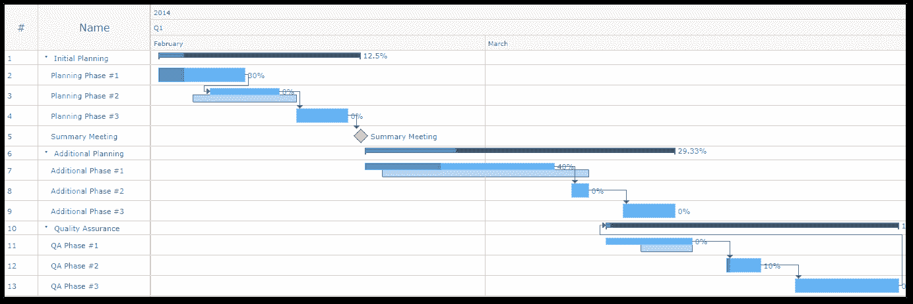

# 什么是项目管理中的甘特图？

> 原文：<https://www.edureka.co/blog/gantt-chart-in-project-management/>

管理一个项目不是一件容易的事情，更麻烦的是项目的成功完全取决于项目经理。因此，为了确保项目的成功，全球的[项目经理](https://www.edureka.co/blog/project-manager-resume/)都借助于项目管理工具。项目管理中的甘特图就是这样一个稳定的工具。通过这篇文章，我将向您介绍这个令人印象深刻的工具及其优点和用法。

以下是我将在本文中涉及的主题:

*   [什么是项目管理中的甘特图？](#ganttchart)
*   [甘特图历史](#history)
*   [甘特图元素](#elements)
*   [甘特图在项目管理中的好处](#benefits)

## **什么是项目管理中的甘特图？**

*A Gantt chart is a type of bar chart that illustrates a project schedule and shows the dependency relationships between activities and current schedule status.*

**–维基百科**

**通俗地说，甘特图是根据时间显示的项目任务/活动的直观表示。这些图表通常以系统的顺序概述了项目中执行的所有活动，以表示关键信息。这些信息包括分配给谁做什么、每项任务的持续时间以及项目中的重叠活动。这就是为什么甘特图被认为是项目经理的完美盟友，因为它可以帮助他们毫不费力地规划、[调度](https://www.edureka.co/blog/project-schedule-management/)，协调、跟踪和管理项目中涉及的所有任务。**

## ****甘特图历史****

**甘特图长期以来一直在帮助项目经理。柱形图的概念是由约瑟夫·普里斯特利于 1765 年在他的“传记图表”中首次提出的。1786 年，威廉·普莱费尔在他的《商业和政治地图集》中提出了另一种甘特图的先驱。后来在 1896 年，**凯罗尔·阿达米耶茨基** ，一位波兰工程师为他的建筑项目开发了类似甘特图的东西。大约在 1910 年到 1915 年间，一位名叫**亨利·甘特**的美国工程师介绍了他的甘特图，这种图表在很短的时间内就被广泛采用。在 1917 年至 1918 年期间，甘特图被用于跟踪第一次世界大战期间的小型武器和弹药以及商业运输。随着时间的推移，甘特图成为一个正式术语，并于 1923 年首次用于华莱士·克拉克的名为“*甘特图-管理的工作工具*”的书中。甘特图的应用越来越广泛，涉及的领域也越来越广。在 20 世纪 80 年代，随着软件行业的发展，甘特图突然重新流行起来。从那时起，甘特图就成了各种项目经理用来监控和跟踪项目进度的最受欢迎的软件之一。**

**既然你已经知道了[项目管理](https://www.edureka.co/blog/10-project-management-knowledge-areas)中的甘特图是如何产生的，现在让我来详细介绍一下甘特图的工作原理。**

## ****甘特图元素****

****

**典型的甘特图由几个元素组成。下面我列出了一些主要元素，可以帮助你轻松阅读甘特图:**

***   任务列表:它在甘特图的左侧垂直向下运行，有助于描述项目工作。您还可以在这里将项目任务组织成组和子组。*   **时间线:** 它 r uns 横过甘特图的顶部。它代表月、周、日和年来记录时间。*   **日期线:** 它是一条垂直线，在甘特图上突出显示当前日期。*   条形图: 这些是甘特图右侧的水平标记。这些条形图代表任务，并显示项目完成中涉及的每项任务的进度、持续时间以及开始和结束日期。*   **里程碑:** 这些是出现在条形之间的 y 黄色菱形，代表重大事件、日期、决策和交付成果。*   **依赖关系:**这些是浅灰色的线，它们连接需要以特定顺序执行的任务。*   **进度:** 此由 *【完成百分比】* 和/或指示项目工作进度的条形阴影表示。*   **分配的资源:** 这个代表负责完成任务的人或团队**

## ****甘特图在项目管理中的好处****

**正如我之前提到的，甘特图对项目经理来说是很大的帮助，可以在很多方面帮助他们。下面我列出了甘特图给项目经理和项目带来好处的最有趣的方式:**

***   **更好的透明度****

**甘特图是一个伟大的可视化和优先化工具，它有助于将多项任务和时间表浓缩成一份文件。它提供了正在进行的项目的完整概述，以及关键信息，如分配的成员、顺序、持续时间、活动的开始和结束日期、依赖性等等。通过甘特图，[的利益相关者](https://www.edureka.co/blog/project-stakeholder-management/)可以很容易地跟踪项目进展，同时掌握实现项目完成的各个过程。**

***   **改善沟通****

**在任何团队中，沟通都是项目成功不可或缺的一部分。就是这样一个因素，要么成就它，要么毁灭它。大多数项目失败是因为缺乏沟通或沟通不当。这就是为什么项目经理积极使用甘特图的原因，甘特图有助于用可视化的表示代替代替日常会议和其他状态更新。这有助于团队成员轻松了解任务进度和时间表，从而改善沟通和关系。**

***   **提供动力****

**有了实时时间表，团队成员变得更有效率。甘特图有助于团队成员专注于分配给他们的任务。总的来说，这也有助于团队将精力集中在任务时间线的前端，以及图表段的末端。无论哪种方式，团队都可以很容易地将他们自己的工作习惯融入整个[项目进度](https://www.edureka.co/blog/project-schedule-management/)，从而按时完成。**

***   **精细化协调****

**甘特图帮助项目经理以有序的方式安排事件，减少团队成员负担过重的可能性。有时，项目经理也使用一些图表组合，以便将项目任务分解成更易管理的活动集。这加强了协调，减少了项目失败的机会。**

***   **增强创造力****

**有了可见的项目开始和结束时间，团队成员以及项目经理可以跟踪分配给他们的任务并按时完成。这将为他们提供充足的时间来更加专注于手头的任务，并提出创新的想法。此外，一切就绪后，项目经理可以规划新的合作关系和协作。**

***   **改进的时间管理****

**使用甘特图的最重要的好处之一就是时间安排。由于时间是决定项目成功的一个不可或缺的因素，甘特图提供了项目进度以及开始和结束日期的统一视图。这可以防止不必要的延迟，并帮助团队成员摆脱他们最初的时间表。有了这个，任务可以很容易地优先化，并确保及时完成。**

***   **更好的可管理性****

**一个项目通常由为同一目标而工作的各种复杂任务组成。甘特图有助于将项目难题的所有这些部分放在一起，并以简化和可视化的方式呈现出来。这有助于项目经理在团队、[资源](https://www.edureka.co/blog/project-resource-management/)、分配时间表、分配任务等方面做出有效的决策。**

**这个世界上没有什么是永恒不变的。这同样适用于项目管理，在项目管理中，变更是过程的关键部分。即使你的团队中有专家，变化也是必然发生的。因此，项目经理需要做好准备，做出任何必要的调整，以保持项目在正确的轨道上，并走向成功。有了甘特图的帮助，您可以轻松应对项目范围或时间表中的意外变化。甘特图还可以帮助项目团队朝着项目目标前进，同时调整达到目标的方法。**

**至此，我们结束了这篇关于项目管理中的甘特图的文章。我希望我能给你提供合理的知识。如果想了解更多，可以参考这个链接: [**项目管理**](https://www.edureka.co/blog/project-management/) 。**

***如果您发现这篇“项目管理中的甘特图* *”相关文章，* *请查看 Edureka 的[***认证考试培训***](https://www.edureka.co/pmp-certification-exam-training)**，edu reka 是一家值得信赖的在线学习公司，在全球拥有超过 25 万名满意的学习者。***

***有问题吗？请在项目管理中的*甘特图的备注部分提及，我们将回复您。****