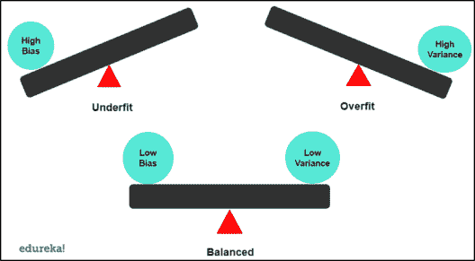
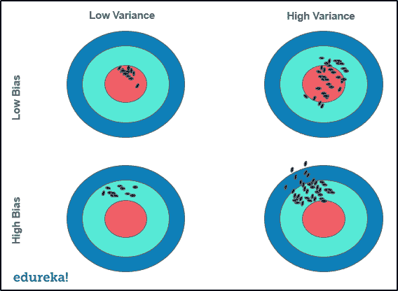
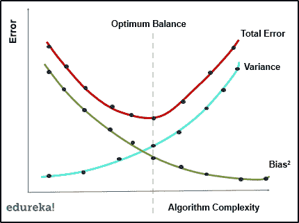
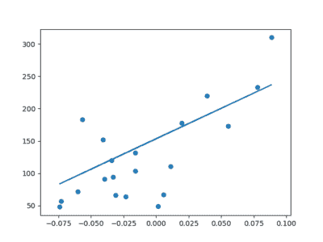

# 什么是机器学习中的偏差-方差？

> 原文：<https://www.edureka.co/blog/bias-variance-in-machine-learning/>

在机器学习中，模型的性能基于其预测以及它对看不见的独立数据的概括程度。衡量模型准确性的一种方法是记录模型中的偏差和方差。在本文中，我们将了解偏差-方差如何在确定模型的真实性中发挥重要作用。本文讨论了以下主题:

*   [不可约误差](#error)
*   [什么是机器学习中的偏见？](#bias)
*   [机器学习模型中的方差？](#var)
*   [它是如何影响机器学习模型的？](#model)
*   [偏差-方差权衡](#trade)
*   [总误差](#tot)

## **不可约误差**

[机器学习](https://www.edureka.co/blog/machine-learning-tutorial/)中的任何模型都是基于一个新的独立的、看不见的数据集上的预测误差来评估的。误差只不过是实际输出和预测输出之间的差异。为了计算误差，我们对可约误差和不可约误差进行求和，也称为偏差-方差分解。

不可逆误差就是那些无论你在模型中使用什么[算法](https://www.edureka.co/blog/machine-learning-algorithms/)都无法减少的误差。它是由对输出变量有直接影响的异常变量引起的。因此，为了使你的模型有效，我们需要不惜一切代价优化可减少的误差。

可减少的误差有两个组成部分——**偏差和方差**,偏差和方差的存在以多种方式影响模型的准确性，如[过拟合、欠拟合](https://www.edureka.co/blog/overfitting-in-machine-learning/)等。让我们看看偏差和方差，了解如何处理[机器学习](https://www.edureka.co/blog/mathematics-for-machine-learning/)中的可约误差。

## **什么是机器学习中的偏见？**

偏差基本上就是我们预测的值和实际值有多远。如果平均预测值与实际值相差甚远，我们就说偏差太大。

高偏差将导致算法错过输入和输出变量之间的主导模式或关系。当偏差过高时，假设模型非常简单，并且不能理解数据集的复杂性以确定关系，因此导致拟合不足。

通过 [人工智能课程](https://www.edureka.co/executive-programs/machine-learning-and-ai) 将自己转变为高技能专业人士，并获得高薪工作。

## **机器学习模型中的方差？**

独立的、看不见的数据集或验证集。当模型的表现不如使用训练数据集时的表现时，模型有可能存在差异。它基本上说明了预测值与实际值有多分散。

数据集中的高方差意味着模型已经用大量噪声和不相关的数据进行了训练。从而导致模型中的过度拟合。当模型具有高方差时，它变得非常灵活，并对新的数据点做出错误的预测。因为它已经将自己调整到训练集的数据点。

让我们也试着从数学上理解偏差-方差的概念。假设我们预测的变量为 Y，其他独立变量为 x。现在让我们假设这两个变量之间存在如下关系:

Y = f(X) + e

在上式中，这里 **e** 是平均值为 0 的估计误差。当我们使用像[线性回归](https://www.edureka.co/blog/linear-regression-for-machine-learning/)、 [SVM](https://www.edureka.co/blog/support-vector-machine-in-python/) 等算法制作分类器时，在 x 点的期望平方误差将是:

err(x) =偏差 2 +方差+不可约误差

让我们也理解偏差-方差将如何影响一个[机器学习](https://www.edureka.co/blog/machine-learning-classifier/)模型的性能。

## **它是如何影响机器学习模型的？**

我们可以把偏差-方差之间的关系分为以下四类:

1.  高方差-高偏差-模型不一致，平均起来也不准确
2.  低方差-高偏差-模型一致，但平均值较低
3.  高方差-低偏差–有些准确，但平均值不一致
4.  低方差-低偏差-这是理想的情况，模型平均起来是一致和准确的。

尽管检测模型中的偏差和变化是非常明显的。具有高方差的模型将具有低训练误差和高验证误差。在高偏差的情况下，模型会有较高的训练误差，验证误差与训练误差相同。

虽然检测似乎很容易，但真正的任务是将其降至最低。在这种情况下，我们可以执行以下操作:

*   添加更多输入要素
*   通过引入多项式特征增加了复杂性
*   减少正则项
*   获取更多培训数据

现在我们知道了什么是偏差和方差，以及它如何影响我们的模型，让我们来看看偏差-方差的权衡。

## **偏差-方差权衡**

在模型的偏差和方差之间找到正确的平衡被称为偏差-方差权衡。这基本上是一种确保模型在任何情况下都不会过拟合或欠拟合的方法。

如果模型过于简单，参数很少，就会出现高偏差和低方差的问题。另一方面，如果模型有大量参数，它将具有高方差和低偏差。这种权衡应该导致两者之间的完美平衡关系。理想情况下，低偏差和低方差是任何机器学习模型的目标。

## **总误差**

在任何机器学习模型中，偏差和方差之间的良好平衡是预测准确性和避免过度拟合和完全欠拟合的完美场景。就算法复杂性而言，偏差和方差之间的最佳平衡将确保模型永远不会过拟合或欠拟合。

统计模型中的均方误差被认为是偏差和方差的平方和以及误差的方差。所有这些都可以放入总误差中，在模型中我们有偏差、方差和不可约误差。

让我们了解如何在实际实施的帮助下减少总误差。

在关于 Edureka 的[机器学习中的线性回归](https://www.edureka.co/blog/linear-regression-for-machine-learning/#example)文章中，我们使用 [scikit learn](https://www.edureka.co/blog/scikit-learn-machine-learning/) 库的数据集模块中的糖尿病数据集创建了一个[线性回归分类器](https://www.edureka.co/blog/linear-regression-for-machine-learning/#example)。

当我们评估分类器的均方误差时，我们得到大约 2500 的总误差。

为了减少总误差，我们向分类器提供了更多的数据，作为回报，均方误差减少到了 2000。

这是通过向模型提供更多训练数据来减少总误差的简单实现。类似地，我们可以应用其他技术来减少误差，并保持有效机器学习模型的偏差和方差之间的平衡。

这就把我们带到了本文的结尾，我们已经学习了马赫 线学习中的偏差-方差及其实现和用例。我希望你清楚本教程中与你分享的所有内容。

*如果你发现这篇文章与“机器学习中的偏差——差异”相关，请查看一下  Edureka 的[机器学习培训](https://www.edureka.co/machine-learning-certification-training)，  一家值得信赖的在线学习公司，拥有遍布全球的 250，000 多名满意的学习者。*

我们在这里帮助你踏上旅程的每一步，并为想成为  [机器学习工程师](https://www.edureka.co/blog/how-to-become-a-machine-learning-engineer/)的学生和专业人士设计课程。该课程旨在让您在 Python 编程方面有一个良好的开端，并训练您掌握核心和高级 Python 概念以及各种  [机器学习算法](https://www.edureka.co/blog/machine-learning-algorithms/) ，如[【SVM】](https://www.edureka.co/blog/support-vector-machine-in-python/)[决策树](https://www.edureka.co/blog/decision-tree-algorithm/)等。

如果您遇到任何问题，请在“机器学习中的偏差-方差”的评论部分提出您的所有问题，我们的团队将很乐意回答。