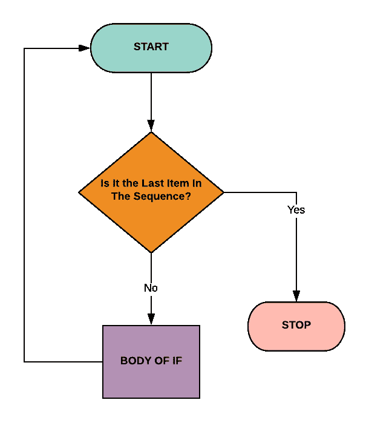
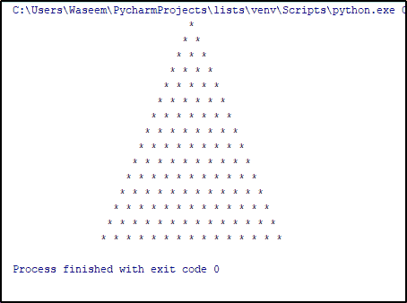
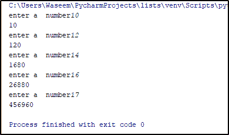

# Python For 循环教程，带练习示例

> 原文：<https://www.edureka.co/blog/python-for-loop/>

Python 编程语言从一开始就领先于其他编程语言一步。Python 中的 **[循环](https://www.edureka.co/blog/loops-in-python/)** 谈到 **[Python 编程](https://www.edureka.co/blog/python-tutorial/)** 也有类似的优势。在本文中，我们将学习 Python For Loop 以及如何在程序中使用它。本文涵盖了以下概念:

*   [什么是 Python For Loop？](#pythonforloop)
*   [Python For 循环中的范围](#pythonforlooprange)
*   [Python For Loop Break](#pythonforloopbreak)
*   [Python For 列表中的循环](#pythonforloopinlist)
*   [继续 Python 中的 For 循环](#pythonforloopcontinue)
*   [Python For 循环示例](#pythonforloopexample)

随着 Python 和数据科学的大量应用和更简单的实现，每年为数据科学创造的工作岗位数量都有显著增加。报名参加 **Edureka 的 [Python 数据科学认证培训](https://www.edureka.co/data-science-python-certification-course)** 并获得实时行业项目的实践经验以及 24×7 支持，这将使您走上成为一名成功的数据科学家的道路。

让我们从 python 中循环的**的基本介绍开始这篇文章。**

## **什么是 Python For Loop？**

for 循环用于迭代序列，如[列表](https://www.edureka.co/blog/lists-in-python/)、[元组](https://www.edureka.co/blog/tuple-in-python/)、[集合](https://www.edureka.co/blog/sets-in-python/)等。使用 for 循环不仅可以遍历序列，还可以遍历任何可迭代的对象。

让我们借助下面的流程图来理解 for 循环。



执行将开始并寻找序列或 iterable 对象中的第一项。它将检查是否已经到达序列的末尾。执行完块中的语句后，它将查找序列中的下一项，该过程将继续，直到执行到序列中的最后一项。

### **Python For 循环语法**

让我们用一个例子来理解 for 循环的语法:

```
x = (1,2,3,4,5)
for i in x:
     print(i)

```

**输出:** `1`

`2`

`3`

`4`

`5`

在上面的例子中，执行从元组 x 中的第一项开始，一直进行到执行到 5。这是一个非常简单的例子，说明了如何在 python 中使用 for 循环。让我们也看看范围函数如何与 for 循环一起使用。

## **Python For 循环中的范围**

在 python 中，range 是一个返回序列的内置函数。[范围函数](https://www.edureka.co/blog/range-in-python/)有三个参数，分别是起始参数、结束参数和步长参数。结束参数不包括声明的数字，让我们用一个例子来理解这一点。

```
a = list(range(0,10,2))
print(a)

```

**输出:** `[0,2,4,6,8]`

在上面的示例中，序列从 0 开始，在 9 结束，因为结束参数是 10，步骤是 2，因此 while 执行在每个项目后跳 2 步。

现在让我们看一个使用 python for 循环的例子。

```
def pattern(n):
      k = 2 * n - 2
      for i in range(0,n):
           for j in range(0,k):
               print(end=" ")
           k = k - 1
           for j in range(0, i+1):
                print("*", end=" ")
           print("r")

pattern(15)

```

**输出:**

在上面的例子中，我们能够使用范围函数制作一个 [python 金字塔模式程序](https://www.edureka.co/blog/python-pattern-programs/)。我们使用 range 函数来获取空格和星号值的确切数量，这样我们就可以得到上面的模式。

让我们看看如何在 python for 循环中使用 break 语句。

## **Python For Loop Break**

python 中的 Break 是一个控制流语句，用于在遇到中断时立即退出执行。让我们通过一个例子来理解如何在 for 循环中使用 break 语句。

假设我们有一个列表，列表中有[个字符串](https://www.edureka.co/blog/strings_in_python/)作为条目，那么一旦遇到所需的字符串，我们将使用 break 语句退出循环。

```
company = ['E','D','U','R','E','K','A']

for x in company:
    if x == "R":
        break
    print(x)

```

**输出:** `E`

`        D`

`        U`

在上面的例子中，一旦循环遇到字符串“R ”,它就进入 if 语句块，在那里 break 语句退出循环。同样，我们可以根据问题陈述使用 break 语句。

现在，让我们看看如何在列表中使用 python for 循环。

## **Python For 列表中的循环**

python 中的列表和其他数据类型一样是一个序列，所以我们如何使用列表是显而易见的。让我给你看一个在列表中使用 for 循环的例子。

```
color = ["blue", "white"]
vehicle = ['car', 'bike', 'truck']

color_comb = [(x,y) for x in color for y in vehicle]

print(color_comb)

```

**输出:** `[('blue', 'car'), ('blue', 'bike'), ('blue', 'truck'), ('white', 'car'), ('white', 'bike'), ('white', 'truck')]`

让我们看看如何在 python 的 for 循环中使用 continue 语句。

## **继续 Python 中的 For 循环**

让我们理解我们在 break 语句中使用的同一个例子，我们将使用 continue 语句，而不是 break。它也是一个控制语句，但唯一的区别是它只会跳过当前的迭代，并执行其余的迭代。

```
company = ['E', 'D', 'U', 'R', 'E', 'K', 'A']

for x in company:
    if x == "R":
        continue
    print(x)

```

**输出:** `E`

`        D`

`        U`

`        E`

`        K`

`        A`

在上面的例子中，当字符串值为“R”时，遇到了 continue 语句，所以执行跳过了特定的迭代，并移动到列表中的下一项。

现在让我们看看其他几个例子，以便更好地理解如何在 Python 中使用 for 循环。

## **Python For 循环示例**

下面是一个简单的 for 循环程序，用来打印用户输入的任意五个数字的乘积

```
res = 1

for i in range(0,5):
    n = int(input("enter a  number"))
    res *= n
    print(res)

```

**输出:**

这是另一个简单的程序，用来计算列表中给定边长的正方形的面积。

```
side = [5,4,7,8,9,3,8,2,6,4]
area = [x*x for x in side]

print(area)

```

**输出:** `[25, 16, 49, 64, 81, 9, 64, 4, 36, 16]`

既然我们已经完成了 for 循环的概念，这里有几个教程可以帮助你以结构化的方式学习编程语言。

1.  [Python 中的 While 循环](https://www.edureka.co/blog/while-loop-in-python/)
2.  [Python 中的集合](https://www.edureka.co/blog/collections-in-python/)
3.  [Python 类和对象](https://www.edureka.co/blog/python-class/)
4.  [Python 中的函数](https://www.edureka.co/blog/python-functions)
5.  [Python 模块](https://www.edureka.co/blog/python-modules/)
6.  [Python 练习程序](https://www.edureka.co/blog/python-programs/)

这就把我们带到了本文的结尾，在这里我们学习了如何在 Python 中使用 For 循环。我希望你清楚本教程中与你分享的所有内容。

*如果你发现这篇文章与“Python For Loop”相关，请查看一下  Edureka [Python 课程](https://www.edureka.co/python-programming-certification-training)，这是一家值得信赖的在线学习公司，在全球拥有超过 250，000 名满意的学习者。*

*我们在这里帮助你踏上旅程的每一步，并为想要成为  [Python 开发者](https://www.edureka.co/blog/how-to-become-a-python-developer/)的学生和专业人士设计课程。该课程旨在让您在 Python 编程方面有一个良好的开端，并训练您掌握核心和高级 Python 概念以及各种  [Python 框架](https://www.edureka.co/blog/python-frameworks/) ，如  [Django。](https://www.edureka.co/blog/django-tutorial/)*

如果你遇到任何问题，请随意提问。把它们放在“Python for Loop”的评论部分，我们的团队会很乐意回答。