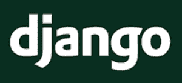
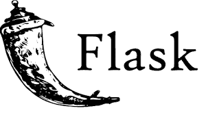
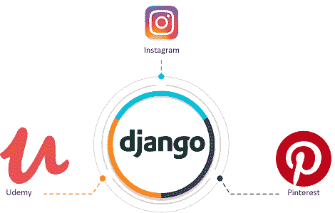

# Django vs Flask:哪个最适合你的 Web 应用？

> 原文：<https://www.edureka.co/blog/django-vs-flask/>

如果你对 [Python Web 开发](https://www.edureka.co/python-django)感兴趣，那么你肯定听说过两个框架，比如 Django 和 Flask。但是如果你对选择哪一个作为你的 web 应用程序感到困惑，那么在读完这篇关于 Django Vs Flask 的博客后，你的困惑一定会结束。我将在这里讨论的要点如下:

*   什么是 Django？
*   [什么是烧瓶？](#whatisflask)
*   Django Vs Flask
*   [结论](#conclusion)

好吧，让我们开始我们的第一个话题。

## 姜戈

***[Django](https://www.djangoproject.com/)*** 是一个全栈、基于 Python 的高级 Web 框架。它鼓励快速开发和干净实用的设计。Django 是由经验丰富的开发人员构建的，它优雅地处理了 Web 开发的许多麻烦。这样做是为了让你可以专注于编写你的应用程序，而不需要重新发明轮子。最重要的是，它是免费的开源框架。

## **烧瓶**

 *** [烧瓶](https://flask.palletsprojects.com/en/1.1.x/) *** 是一个轻量级的 WSGI (  Web 服务器网关接口) web 应用微框架。它旨在帮助您快速轻松地开始 web 开发。此外，它还提供了扩展到复杂应用程序的能力。最初，它是一个围绕 Werkzeug 和 Jinja 的简单包装器，现在它已经成为最流行的 Python web 应用框架之一。

## Django Vs Flask

### **框架类型**

Django 是一种全栈框架，而 Flask 属于微框架的范畴。

### **数据库**

如果您的应用程序需要 [SQLite](https://www.edureka.co/blog/sqlite-tutorial/) 、 [PostgreSQL](https://www.edureka.co/blog/postgresql-tutorial) 、 [MySQL](https://www.edureka.co/blog/mysql-tutorial/) 或 Oracle，您应该更喜欢使用 Django。另一方面，如果你正在使用 NoSQL 或者根本没有数据库，那么 Flask 是一个更好的选择。

### **项目规模**

Flask 对于较小的、不太复杂的项目很方便，这些项目有明确的范围和较短的预期生命周期。因为 Django 强制使用一致的应用程序结构，而不管项目的大小，几乎所有的 Django 项目都有相似的结构。因此，Django 更适合处理拥有更长生命周期和大量增长潜力的大型团队的大型项目。

### **项目布局**

Django 使用传统的项目结构，而 Flask 使用任意的项目结构。

### **应用类型**

Django 太擅长用服务器端模板创建全功能的 web 应用程序了。如果您只是想要一个静态网站或 RESTful web 服务来支持您的 SPA 或移动应用程序，Flask 是首选。Django 和 Django REST 框架在后一种情况下也能很好地工作。

### **RESTful API**

Django REST Framework (DRF)，最流行的第三方 Django 包之一，是一个用于通过 RESTful 接口公开 Django 模型的框架。它包括您需要的一切(视图、序列化器、验证、授权)和更多(可浏览 API、版本控制、缓存)来快速轻松地构建 API。Flask 也有很多很棒的扩展，比如用于视图的 Flask-RESTful、Flask-class、Flask-RESTPlus、用于序列化的 Flask-Marshmallow、用于认证的 Flask-JWT、Flask-JWT 扩展。

### **性能**

Flask 的性能比 Django 稍好，因为它的体积更小，层数更少。不过，这种差别可以忽略不计，尤其是当你把 I/O 考虑进去的时候。

### **使用它们的公司**

以下是使用 Django 的公司:

以下是使用 Flask 的公司:

| **参数** | 姜戈 | **烧瓶** |
| **框架类型** | 全栈 | 微观的，具体领域的 |
| **数据库** | SQLite，PostgreSQL，MySQL | 任何数据库，包括 NoSQL |
| **项目规模** | 大型项目 | 较小且不太复杂的项目 |
| **项目布局** | 常规项目结构 | 任意结构 |
| **应用类型** | 具有服务器端模板的全功能网络应用 | 静态 web 应用程序或 RESTful web 服务，为您的 SPA 或移动应用程序提供信息 |
| **RESTful API** | Django Rest 框架(DRF) | Flask-RESTful(views)，Flask 棉花糖(Serialization)，Flask JWT(Auth) |
| **性能** | 不比烧瓶好 | 比姜戈好 |
| **使用它们的公司** | *   【insta gram】*   【Pinterest】*   【乌代米】*   【courserra】【zaber】 | 

 |

## **结论**

那么，您应该使用哪个框架呢？准确地说，这要看情况。决定使用特定的框架、语言或工具，几乎完全取决于当前的环境和问题。

Django 功能齐全，因此您或您的团队需要做的决策更少。那样你可能会走得更快。但是，如果您对 Django 为您做出的选择不满意，或者您有独特的应用程序需求，限制了您可以利用的特性的数量，您也可以看看 Flask。

总会有权衡和妥协。最后，这两个框架都降低了构建 web 应用程序的门槛，使得它们的开发更加容易和快捷。

*既然你已经理解了题目 **Django Vs Flask** ，那就来看看 Edureka 的 [**Python Django 训练**](https://www.edureka.co/python-django)* *。Edureka 的 Django 课程帮助你获得 Django REST 框架、Django 模型、Django AJAX、Django jQuery 等方面的专业知识。您将在处理实时用例的同时掌握 Django web 框架，并在课程结束时获得 Django 认证。*

*有问题吗？请在这篇“Django Vs Flask”文章的评论部分提到它，我们会尽快回复您。*