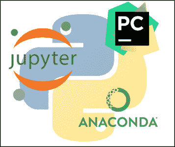
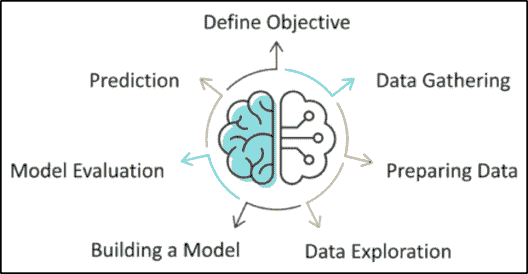
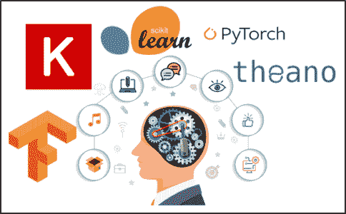
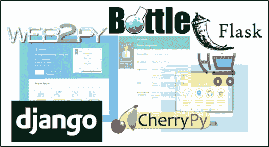

# 学习 Python 编程——初学者的一站式解决方案

> 原文：<https://www.edureka.co/blog/learn-python/>

Python 编程语言是目前世界上最流行的编程语言之一。由于易于访问和实现复杂的任务，Python 编程语言已经在 IT 行业留下了印记。转向 Python 的开发人员的数量表明，全球各地的人们都在坚定地学习 Python。

Python 编程语言的可伸缩性是巨大的，几乎可以在每个领域实现。[数据科学](https://www.edureka.co/blog/data-science-career-opportunities-your-guide-to-top-data-scientist-jobs)用 Python 达到了另一个里程碑，每年流入的数据量，Python 成了救世主，帮助实现了数据科学市场的革命性发展。

每年创造的就业岗位数量也呈直线增长，仅在 2020 年就有望达到 200 万个。这就是数据科学的情况，当谈到其他 T2 的职业道路时，Python 同样受到任何其他组织的青睐。亚马逊、脸书、Instagram、[、YouTube](https://goo.gl/6ohpTV) 等行业巨头只是冰山一角。当我们探索 Python 就业市场时，与数据科学相关的工作预计会增加，仅在 2020 年就将达到近 700，000 个工作。

本文是学习 Python 编程的结构化方法。即使您是初学者，也可以从 Python 编程语言开始您的旅程，本文涵盖了从最基础开始的 Python 编程的深入知识。

*Python has been an important part of Google since the beginning and remains so as the system grows and evolves. Today dozens of Google engineers use Python, and we’re looking for more people with skills in this language. – Peter Norvig, director of search quality at Google, Inc*

## ****Python 入门****

**开始 Python 之旅要求您熟悉该技术的实际工作方式。你要学习的第一件事就是如何在你的系统上设置 Python 环境，并选择最好的 IDE 来以最好的方式帮助你。**

****

***   **[Python 安装](https://www.edureka.co/blog/python-tutorial/#pythoninstallation)***   [**如何设置 Python 路径？**](https://www.edureka.co/blog/add-python-to-path/)*   [**Python IDE 的**](https://www.edureka.co/blog/best-ide-for-python/)*   [**运行第一个 Python 程序**](https://www.edureka.co/blog/how-to-run-a-python-script/)**

***I have the students learn Python in our undergraduate and graduate Semantic Web courses. Why? Because basically there’s nothing else with the flexibility and as many web libraries. – Prof. James A. Hendler, University Of Maryland***

## ******Python 基础知识******

****在完成 Python 环境的设置、安装合适的 ide 之后，您必须从最基础的开始学习。尽管基础知识与任何其他编程语言都非常相似，但是您也必须在 Python 中掌握它们，以构建强大的调试和脚本技能。****

********

*****   [**Python 变量**](https://www.edureka.co/blog/variables-and-data-types-in-python/#1)*   **[Python 中的数据类型](https://www.edureka.co/blog/variables-and-data-types-in-python/#3)**
    *   [**列举了 Python 中的**](https://www.edureka.co/blog/lists-in-python/)
    *   **[Python 中的字典](https://www.edureka.co/blog/dictionary-in-python/)**
    *   [**Python 中的元组**](https://www.edureka.co/blog/tuple-in-python/)
    *   [**套在蟒蛇身上**](https://www.edureka.co/blog/sets-in-python/)*   [**Python 中的高级数据结构**](https://www.edureka.co/blog/collections-in-python/)*   [**Python 中的运算符**](https://www.edureka.co/blog/operators-in-python/)*   [**Python 中的条件和控制语句**](https://www.edureka.co/blog/if-else-in-python/)*   [**Python 中的循环**](https://www.edureka.co/blog/loops-in-python/)*   **[为 Python 中的循环](https://www.edureka.co/blog/python-for-loop/)***   **[Python While 循环](https://www.edureka.co/blog/while-loop-in-python/)***   [**Python 函数**](https://www.edureka.co/blog/python-functions)*   [**类和对象**](https://www.edureka.co/blog/python-class/)*   [**Python 中的文件处理**](https://www.edureka.co/blog/file-handling-in-python/)*   [**Python 中的异常处理**](https://www.edureka.co/blog/python-try-except/)*   [**程序练习**](https://www.edureka.co/blog/python-programs/)*   **[Python 模式程序](https://www.edureka.co/blog/python-pattern-programs/)******

*****Python is fast enough for our site and allows us to produce maintainable features in record times, with a minimum of developers, – Cuong Do, Software Architect, YouTube.com*****

## ********Python 全程——12 小时学会 Python | Python 初学者教程| Edureka********

************

******[//www.youtube.com/embed/WGJJIrtnfpk?rel=0&showinfo=0](//www.youtube.com/embed/WGJJIrtnfpk?rel=0&showinfo=0)************This Edureka video on Python Full Course will help you learn the Python programming language and its core concepts with examples from scratch.******

## ********高级 Python 概念********

******当您学习完 Python 中的基本概念后，请阅读 Python 中的高级概念，这将让您更清楚地了解如何使用 Python 和高级 Python 概念来处理事情。******

************

*******   [**Python 中的发电机**](https://www.edureka.co/blog/generators-in-python/)*   [**Python 中的迭代器**](https://www.edureka.co/blog/python-iterator)*   [**巨蟒装饰者**](https://www.edureka.co/blog/python-decorator-tutorial/)*   [**Python 模块**](https://www.edureka.co/blog/python-modules/)*   **[系统编程](https://www.edureka.co/blog/os-module-in-python)***   [**数据库**](https://www.edureka.co/blog/python-database-connection/)******

## ********用于数据科学的 Python********

******当您掌握了 Python 中的基础和高级概念后，您就可以开始使用 Python 进行数据科学之旅了。由于数据科学是当前市场场景中最热门的工作，学习 Python 数据科学也会给你带来职业发展。******

************

*******   [**数据科学简介**](https://www.edureka.co/blog/what-is-data-science/)*   [**数据科学的统计与概率**](https://www.edureka.co/blog/statistics-and-probability/)*   [**数据科学 Python 库**](https://www.edureka.co/blog/learn-python-for-data-science/)
    *   [**Numpy**](https://www.edureka.co/blog/python-numpy-tutorial/)
    *   [**熊猫**](https://www.edureka.co/blog/python-pandas-tutorial/)
    *   [**【matplot lib】**](https://www.edureka.co/blog/python-matplotlib-tutorial/)
    *   [**海博**](https://www.edureka.co/blog/python-seaborn-tutorial/)
    *   [**Scikit-learn**](https://www.edureka.co/blog/scikit-learn-machine-learning/)*   [**数据科学项目和模型**](https://www.edureka.co/blog/data-science-projects/)******

## ********Python For Data Science 全程课程——9 小时| Python 数据科学| Edureka********

************

******[//www.youtube.com/embed/-6RqxhNO2yY?rel=0&showinfo=0](//www.youtube.com/embed/-6RqxhNO2yY?rel=0&showinfo=0)************This Edureka video on the ‘Python For Data Science’ will help you learn Python for Data Science including all the relevant libraries.******

## ********用于机器学习的 Python********

******机器学习是学习 Python 的另一个方面。借助 Python 提供的复杂的库支持和功能，您可以处理不同的项目并掌握自己的技能，成为机器学习专家。******

************

*******   [**机器学习简介**](https://www.edureka.co/blog/machine-learning-tutorial/)*   **[机器学习的数学](https://www.edureka.co/blog/mathematics-for-machine-learning/)***   **[监督学习](https://www.edureka.co/blog/supervised-learning/)***   **[无监督学习](https://www.edureka.co/blog/unsupervised-learning/)***   [**强化学习**](https://www.edureka.co/blog/q-learning/)*   [**用于机器学习的 Python 库**](https://www.edureka.co/blog/machine-learning-libraries/)
    *   **[张量流](https://www.edureka.co/blog/tensorflow-tutorial/)**
    *   **[Scikit-learn](https://www.edureka.co/blog/cheatsheets/python-scikit-learn-cheat-sheet/)**
    *   [**机器学习算法**](https://www.edureka.co/blog/machine-learning-algorithms/)
    *   [**分类**](https://www.edureka.co/blog/classification-in-machine-learning/)
    *   **[朴素贝叶斯](https://www.edureka.co/blog/naive-bayes-tutorial/)**
    *   **[【kn】](https://www.edureka.co/blog/k-nearest-neighbors-algorithm/)**
    *   **[决策树](https://www.edureka.co/blog/decision-tree-algorithm/)**
    *   **[支持向量机](https://www.edureka.co/blog/support-vector-machine-in-python/)**
    *   **人工神经网络***   [**回归**](https://www.edureka.co/blog/linear-regression-in-python/)
    *   **[逻辑回归](https://www.edureka.co/blog/logistic-regression-in-python/)**
    *   **[线性回归](https://www.edureka.co/blog/linear-regression-for-machine-learning/)***   [**神经网络**](https://www.edureka.co/blog/neural-network-tutorial/)*   [**深度学习**](https://www.edureka.co/blog/deep-learning-with-python/)******

## ********机器学习用 Python 6 小时全课程| Python for Machine Learning 教程| Edureka********

************

******[//www.youtube.com/embed/0D-PCtUJInE?rel=0&showinfo=0](//www.youtube.com/embed/0D-PCtUJInE?rel=0&showinfo=0)************This Edureka Machine Learning with Python video will help you understand and learn the fundamentals of Machine Learning from scratch.******

## ********用于人工智能的 Python**T2******

******使用 Python 的人工智能是技术进步的一种手段，用 Python 掌握你的人工智能技能。******

************

*******   [**AI 简介**](https://www.edureka.co/blog/artificial-intelligence-with-python/)*   [**AI 的种类**](https://www.edureka.co/blog/types-of-artificial-intelligence/)*   **[the ano](https://www.edureka.co/blog/theano-vs-tensorflow/)***   **[OpenCV](https://www.edureka.co/blog/python-opencv-tutorial/)***   [**Pytorch**](https://www.edureka.co/blog/pytorch-tutorial/)*   [**人工智能算法**](https://www.edureka.co/blog/artificial-intelligence-algorithms/)
    *   [**K 表示聚类**](https://www.edureka.co/blog/k-means-clustering-algorithm/)
    *   [**渐变助推**](https://www.edureka.co/blog/boosting-machine-learning/)*   **[模式识别](https://www.edureka.co/blog/pattern-recognition/)***   [**物体探测**](https://www.edureka.co/blog/tensorflow-object-detection-tutorial/)*   [**语音识别**](https://www.edureka.co/blog/speech-recognition-python/)*   [**聊天机器人**](https://www.edureka.co/blog/how-to-make-a-chatbot-in-python/)******

## ********使用 Python 的人工智能|使用 Python 的人工智能教程| edu reka********

************

******[//www.youtube.com/embed/7O60HOZRLng?rel=0&showinfo=0](//www.youtube.com/embed/7O60HOZRLng?rel=0&showinfo=0)************This Edureka video on “Artificial Intelligence With Python” will provide you with a comprehensive and detailed knowledge of Artificial Intelligence concepts with hands-on examples.******

## ********Python Web 开发********

******使用 Python 进行 Web 开发就像用简单的英语编写程序一样简单。******

************

*******   [**GUI 编程**](https://www.edureka.co/blog/tkinter-tutorial/)*   [**Python Web 框架**](https://www.edureka.co/blog/python-frameworks/)*   [**姜戈教程**](https://www.edureka.co/blog/django-tutorial/)*   [**Python App 开发**](https://www.edureka.co/blog/kivy-tutorial/)******

## ********其他 Python 练习教程********

******这里有一些其他的 Python 教程，可以帮助你快速掌握 Python 编程。******

*******   [**Python 中的网页抓取**](https://www.edureka.co/blog/web-scraping-with-python/)*   [**Python 中的机器人框架**](https://www.edureka.co/blog/robot-framework-tutorial/)*   [**顶级 Python 项目**](https://www.edureka.co/blog/python-projects/)*   [**请求在 Python 中**](https://www.edureka.co/blog/python-requests/)*   [**硒带蟒**](https://www.edureka.co/blog/selenium-using-python/)*   [**Python Visual Studio**](https://www.edureka.co/blog/python-visual-studio/)*   [**DevOps 与 Python**](https://www.edureka.co/blog/python-devops/)*   [**蟒蛇和网飞**](https://www.edureka.co/blog/how-netflix-uses-python/)*   [**Ruby vs Python**](https://www.edureka.co/blog/ruby-vs-python/)*   [**Java vs Python**](https://www.edureka.co/blog/java-vs-python/)*   [**R vs Python**](https://www.edureka.co/blog/r-vs-python/)******

******这就把我们带到了本文的结尾。我希望你清楚学习 Python 应该遵循的结构化方法。******

*******如果您发现这篇文章与“学习 Python”相关，请查看一下  [Edureka 的 Python 编程认证课程](https://www.edureka.co/python-programming-certification-training) 这是一家值得信赖的在线学习公司，拥有遍布全球的 250，000 多名满意的学习者。*******

*******我们在这里帮助你踏上旅程的每一步，并为想要成为  [Python 开发者](https://www.edureka.co/blog/how-to-become-a-python-developer/)的学生和专业人士设计课程。该课程旨在让您在 Python 编程方面有一个良好的开端，并训练您掌握核心和高级 Python 概念以及各种  [Python 框架](https://www.edureka.co/blog/python-frameworks/) ，如  [Django。](https://www.edureka.co/blog/django-tutorial/)*******

*******如果你遇到任何问题，欢迎在“学习 Python”的评论区提出你的所有问题。我们团队很乐意回答。*******