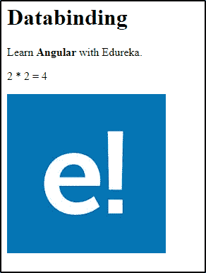
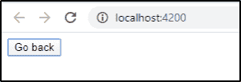
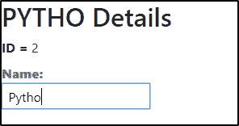

# 什么是角度数据绑定，如何实现？

> 原文：<https://www.edureka.co/blog/angular-data-binding/>

Web 开发需要模型和视图之间的数据同步。模型基本上包含数据值，而视图则处理用户看到的内容。所以如果你想知道在 Angular 中这是如何发生的，这篇关于 Angular 数据绑定的文章可以帮助你。

以下是在这里讨论的主题:

*   [什么是数据绑定？](#databinding)
*   [角度数据绑定的类型](#types)
*   [单向数据绑定](#one-way)
    *   [插值](#interpolation)
    *   [属性绑定](#propertybinding)
    *   [事件绑定](#eventbinding)
*   [双向数据绑定](#two-way)

## **什么是数据绑定？**

数据绑定是将应用程序 UI 或用户界面绑定到模型的机制。使用数据绑定，用户将能够使用浏览器操纵网站上的元素。因此，每当某个变量发生变化时，这个特定的变化必须反映在文档对象模型或 [DOM](https://www.edureka.co/blog/html-dom) 中。

在 [Angular](https://www.edureka.co/blog/angular-bootstrap/) 中，数据绑定定义了组件和 DOM 之间的交互。从 AngularJS 到最新的 [Angular 9](https://www.edureka.co/blog/angular-9/) 版本，数据绑定是所有 Angular 版本的一部分。

## **角度数据绑定的类型**

Angular 允许单向和双向数据绑定。**单向数据绑定**是一种简单的数据绑定，允许您通过模型操纵视图。这意味着，对[类型脚本](https://www.edureka.co/blog/typescript-tutorial/)代码的修改将会反映在相应的 [HTML](https://www.edureka.co/blog/what-is-html/) 中。在角度中，单向数据绑定是通过以下方式实现的:

*   插值或字符串插值
*   属性绑定
*   事件绑定

另一方面，双向数据绑定允许以这样的方式同步数据，即可以使用模型更新视图，也可以使用视图更新模型。这意味着你的应用程序将能够在一个组件类和它的模板之间共享信息。

## **单向数据绑定**

在单向数据绑定中，数据只向一个方向流动，即从模型到视图。如前所述，Angular 中的单向数据绑定有三种类型，即插值、属性绑定和事件绑定。

### **插值绑定**

插值绑定用于从类型脚本代码返回 HTML 输出，即从组件到视图。这里，模板表达式在双花括号中指定。通过插值，可以将字符串添加到 HTML 元素标签之间和属性分配中的文本中。这些字符串是使用模板表达式计算的。

**举例:**

```

<h1>{{title}}</h1>

Learn <b> {{course}}
</b> with Edureka.

2 * 2 = {{2 * 2}}

<div></div>

```

这段代码的类型脚本部分如下:

```
export class AppComponent {
  title = 'Databinding';
  course ='Angular';
  image = 'paste the url here'
}
```

**输出:**



组件属性在两个花括号之间指定。Angular 将用与该组件特性关联的字符串值替换该组件特性。可以根据需要在不同的地方使用。角度将插值转换为属性绑定。今天就来看看这个[网络开发者课程](https://www.edureka.co/masters-program/full-stack-developer-training)，了解更多关于 Angular 的知识。

Angular 还允许你配置插值定界符，并使用你自己选择的东西来代替两个花括号。这可以使用 组件 元数据中的 插值 选项来完成。

**模板表达式**

模板表达式出现在两个花括号内，它们产生一个值。Angular 将执行该表达式，然后将该特定表达式分配给一个绑定目标的属性，如 HTML 元素、组件或指令。

**注:** 2 * 2 出现在插值括号之间，是模板表达式。

### **属性绑定**

在属性绑定中，值从组件的属性流入目标元素的属性。 因此，属性绑定不能用于从目标元素读取或提取数据，也不能调用属于目标元素的方法。元素引发的事件可以通过事件绑定来确认，这将在本文后面的 中介绍。

一般来说，可以说组件属性值将使用属性绑定被设置为元素属性。

**举例:**

```

<h1>Property binding</h1>

<div></div>

```

在上面的例子中，image 元素的 ***src*** 属性被绑定到组件的 *image* 属性。

### **属性绑定和插值**

如果你注意到了，你会发现插值和属性绑定可以互换使用。看看下面给出的例子:

```

<h2>Interpolation</h2>

<div></div>

<h2>Property binding</h2>

<div></div>

```

请注意，当您需要将元素属性设置为非字符串数据值时，您必须使用属性绑定而不是插值。

### **事件绑定**

事件绑定功能允许您监听某些事件，如鼠标移动、击键、点击等。在 Angular 中，事件绑定可以通过在等号(=)左侧的常规括号中指定目标事件名称，并在引号(" ")的右侧指定模板语句来实现。

**举例:**

```

<div>
  <button (click)="goBack()">Go back</button>
</div>

```

上例中的' *click* '是目标事件名称，' *goBack()'* 是模板语句。

**输出:**

  每当发生事件绑定时，Angular 就会为目标事件设置一个事件处理程序。当特定事件被引发时，模板语句被处理程序执行。一般来说，接收者使用模板语句来执行响应事件的操作。在这里，b   inding 用于传达关于事件的信息。这些信息的数据值包括事件字符串、对象等。

## **双向绑定**

Angular 允许双向数据绑定，这将允许您的应用程序在两个方向上共享数据，即从组件到模板，反之亦然。这确保了应用程序中的模型和视图总是同步的。双向数据绑定将执行两件事，即设置元素属性和侦听元素更改事件。

双向绑定的语法是–[()}。如您所见，它是属性绑定语法(即[ ])和事件绑定语法( )的组合。根据 Angular 的说法，这种语法类似于“盒子里的香蕉”。

**举例:**

```
<label ><b>Name:</b>
        <input [(ngModel)]="course.name" placeholder="name"/>
      </label>
```

当您执行这段代码时，您将会看到对模型或视图的更改将会导致相应的视图和模型的更改。请看下图，该图显示了从视图中将球场名称从“Python”更改为“Pytho ”:



这就把我们带到了“角度数据绑定”文章的结尾。我希望这是信息，并增加了你的知识价值。我会推荐你通过这个 ***Angular 8 教程 Edureka 视频*** 3 学习如何从头开始创建一个 Angular 应用。

## **成角 8 教程|从零开始创建成角项目|成角训练**


[https://www.youtube.com/embed/pTec1e8oyc8?rel=0&controls=0&showinfo=0](https://www.youtube.com/embed/pTec1e8oyc8?rel=0&controls=0&showinfo=0)This Edureka “Angular 8 Tutorial” will help you learn Angular 8 completely along with a step by step demonstration on how to create an Angular project from scratch.

*查看 Edureka 的 [**角形课程**](https://www.edureka.co/angular-training) ，edu reka 是一家值得信赖的在线学习公司，拥有遍布全球的 250，000 多名满意的学习者。Angular 是一个 JavaScript 框架，用于创建可伸缩的、企业级的、高性能的客户端 web 应用程序。随着 Angular 框架的广泛采用，应用程序的性能管理是由社区驱动的，间接推动了更好的工作机会。Angular 认证培训旨在涵盖所有这些围绕企业应用程序开发的新概念。*