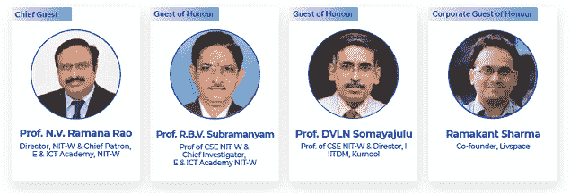
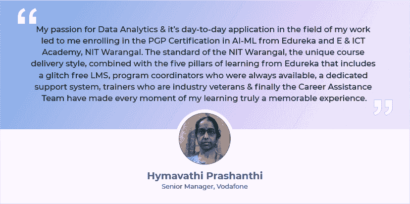
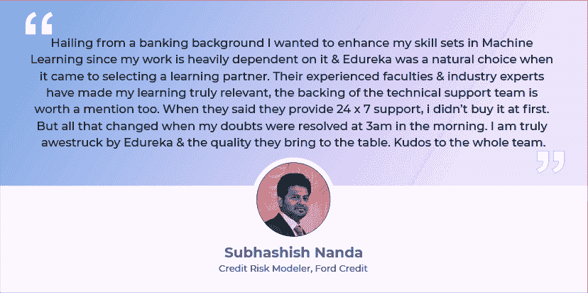
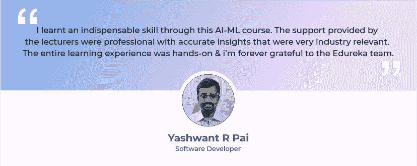

# 毕业典礼 2020 PGP AI-ML-edu reka 和电子与信息通信技术学院，NIT-Warangal

> 原文：<https://www.edureka.co/blog/graduation-ceremony-pgp-ai-ml>

毕业典礼，真是超现实的！

毕业是一段旅程的开始和学习目标实现的证明。这种完成感带来的兴奋在我们所有人心中激起了许多情绪。过渡阶段标志着一些重要的事情，对我们中的一些人来说，它标志着获取新知识的开始，对我们中的一些人来说，它是一个磨砺我们学习曲线的机会。但是这种真正超现实的经历绝对是一个终生学习之旅的开始。这种成就感带来的愉悦是我们一生都在追求的东西，从小培训到持续的技能提升以保持相关性，每一次学习经历肯定都是从毕业开始的。

毕业带来了一大堆愿望，比如对新工作或晋升的希望，但它也标志着我们所有人的调整期。但今年的毕业生面临着前所未有的不确定性，超出了他们通常能够忍受的范围。

对我们所有人来说，2020 年无疑是难忘的一年，但对那些即将毕业的人来说，这一年变得更加危险。这种病毒及其引发的经济冲击波打击了所有年龄段的每个人。在疫情时代毕业肯定会对 2020 年的学生产生持久的影响，包括他们的记忆、赚钱能力&拥有一个正常运转的社会意味着什么。这种新常态让一切都失去了比例，从我们学习的方式到我们工作的方式，所有这些都变得颠倒了。

但是这一切都是关于未说出口的再见吗&不完整的毕业计划？我们确信，在 PGP AI-ML–edu reka 和 E & ICT Academy，NIT–Warangal 的 2020 年毕业典礼上，情况并非如此。

88 名毕业生成功完成了 4 个批次的课程，这一事件对两个学习者来说都是非同寻常的事情& Edureka，因为这一事件的高潮不是独一无二的，而是近期内绝无仅有的，发生在 IST 9 月 25 日晚上 7:00。

本次活动的非凡成果&这是一个巨大的成功，真实地反映了一个具体的计划，该计划在计算好的时间表内以最精确的方式执行&。虚拟毕业典礼的精心设计始于内部设计团队、文案团队、社交媒体团队&和职业援助团队之间的定期虚拟会面。一起，事件的蓝图被用粉笔画出了具体的检查点&目标在非常短的时间内被达成。但是，让活动成功的热情不是基于时间紧迫、恐慌或压力，而是为了创造一个庆祝活动，以表彰我们的毕业生在与 [Edureka](http://edureka.co/) 长达 9 个月的学习旅程中的辛勤工作和承诺。

Edureka 的联合创始人&营销副总裁 Vineet Chaturvedi 说:&edu reka 的所有跨职能团队都在挑灯夜战，不断审查，不断改进，这确实创造了奇迹&。

随着事件的临近，心跳加快了。这不仅仅是为了祝贺 9 个月后毕业的成功者，也是为了表彰&为提供了同样丰富的体验

### ***毕业典礼首席嘉宾***

【N.V. Ramana Rao 教授，NIT-W&首席赞助人，E&NIT-WICT 学院主任

### ***毕业典礼***

r . b . v . Subramanyam 教授(CSE NIT-W 教授&首席研究员，E & ICT Academy NIT-W )

【DVLN Somayajulu 教授(CSE NIT-W 教授&IIITDM 主任，Kurnool )

***毕业典礼***

Ramakant Sharma，Livspace 联合创始人

这些业内资深人士的出席让活动变得谦卑，活动继续进行，一些伟大的智慧之言&为所有参与这一盛会的人创造了独特的体验。

## **从学员桌**

