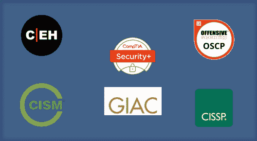
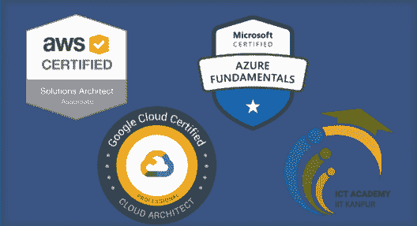
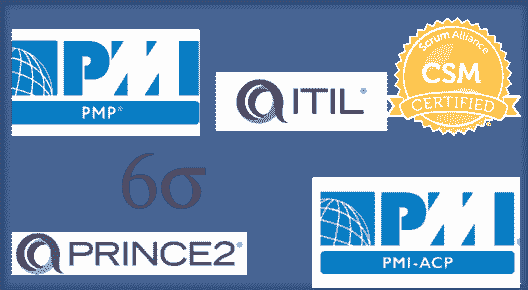
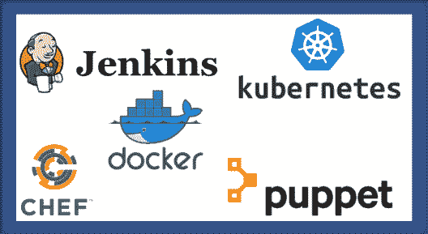
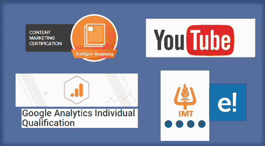
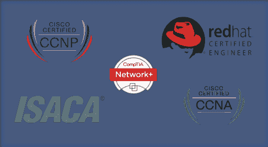
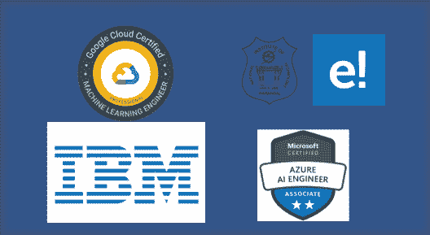

# 2023 年十大认证:你今年的技能提升指南！

> 原文：<https://www.edureka.co/blog/top-10-certifications>

信息技术邀请你进入一个有利可图、令人满意的职业，而获得一个认证是在你想从事的领域建立你的信誉的一个稳赚不赔的方法。 甚至 Google Trends 也暗示 仅在 2020 年 5 月至 10 月间，对 IT 认证的兴趣就上升了 40%。 无论是在网络安全、Web-Development 还是系统管理方面，你都可以放心，各种认证都会与你的职业目标相匹配。 所以，下面这篇文章旨在给大家快速看一下 2023 的 ***十大认证。***

因此，在新的一年里，让我们下定决心，通过以下认证之一来提升自己的技能:

## 【2023 年十大认证

*   [**网络安全认证**](#cybersecurity)
*   [**云架构师认证**](#cloudarchitect)
*   [**项目管理& IT 服务管理认证**](#itservicemanagement)
*   [**DevOps 工程师认证**](#devopsengineer)
*   [**数据库管理员认证**](#databaseadmin)
*   [**数字营销认证**](#digitalmarketing)
*   [**网络工程师认证**](#networkengineer)
*   [**网页开发认证**](#webdev)
*   [**大数据工程师认证**](#bigdataengineer)
*   [**人工智能和机器学习工程师认证**](#aimlengineer)

如果你是一个视觉学习者，你也可以参考我们关于 2023 年 十大认证 ***的视频演示！***

## **2023 年十大认证|薪酬最高的 IT 认证|最佳 IT 认证| Edureka**

[https://www.youtube.com/embed/SY4TWhXyr0I?rel=0&controls=0&showinfo=0](https://www.youtube.com/embed/SY4TWhXyr0I?rel=0&controls=0&showinfo=0)This Edureka Video talks about the list of “Top 10 Certifications for 2023” that will help you to boost your career and have a good salary hike. These are the Best IT Certifications for 2023 which help you in getting into High Paying IT jobs with ease.

那么，让我们开始我们的 2023 年十大认证清单。

## **1。网络安全认证**

随着全世界都在努力应对这一史无前例的疫情，远程工作成为了新的常态。但是，由于远程访问 it 基础架构和在终端设备上使用协作工具，这带来了许多网络威胁。在这样的时刻， [***网络安全认证专家***](https://www.edureka.co/post-graduate/cybersecurity) 是无名英雄， 是抵御从攻击缓解到渗透测试的潜在网络攻击的关键。

行业认可的网络安全认证包括:

*   **认证道德黑客( CEH)**
*   [**【康普证券+】**](https://www.edureka.co/comptia-security-plus-certification-training)
*   **进攻安全认证专家(【OSCP】)**
*   **注册信息系统安全专家(【CISSP】)**
*   **注册信息安全经理(【CISM】)**
*   **【GIAC】**

这一领域的专业人士在美国挣 215，000 美元，在₹挣 29，000，000 美元，他们来自于像法国兴业银行、戴尔和 NetApp 这样的公司。

## **2。云架构师**认证

在过去的十年里，没有任何一个 IT 领域像云计算一样吸引了如此多的关注、兴趣和投资。 IDC 预测，到明年，公共云服务价值将达到 2770 亿美元，五年增长率为 22%。 对于最终用户、服务提供商和各种规模的组织来说，云现在是一个永久的固定设备。这导致了市场上对熟练云架构师的大量需求和少量供应。

当然，有各种云架构师认证来弥补技能差距。即:

*   **AWS 认证解决方案架构师**
*   **谷歌认证专业云架构师**
*   **微软认证:微软 Azure 基础知识**
*   [**E&ICT 学院**](https://www.edureka.co/post-graduate/advanced-cloud-computing-program) 云计算高级认证

这些认证旨在为 SAP、Deloitte、Seimens 和 Red Hat 等公司培养能够设计、开发和管理健壮、安全、可扩展的动态云解决方案的专业人员，这些公司在美国的平均工资为 153，000 美元，在印度的平均工资为 ₹ 30，000，000 美元。

## **3。项目管理& IT 服务管理** **认证**

预计 2021 年全球经济增长率为 5.4%。总体而言，这将使 GDP 比疫情危机前的预测低 6.5%。在这种经济绝望的情况下， 利益相关者和消费者需要得到保证，他们的产品掌握在能够展示经验和专业知识的人手中，以有效地定义、规划和交付他们的项目。 还有什么比认证更能显示这种熟练程度的方式呢。

有许多项目管理认证你可以追求:

*   [**PMP 认证培训**](https://www.edureka.co/pmp-certification-exam-training)
*   [**受控环境中的项目(【王子 2】)**](https://www.edureka.co/prince2-foundation-and-practitioner-certification-training)
*   [认证 Scrum Master(CSM)](https://www.edureka.co/certified-scrum-master-certification-training)
*   **信息技术基础设施库( ITIL)**
*   **6 适马**
*   ****PMI** 敏捷认证从业者( PMI-ACP)**

这将证明你作为一名经理的能力，并让你在美国的年收入增加到 143，493 美元，或者在₹的年收入增加到 20，000，000 美元，这些公司包括 Sunsilk、宝洁、西门子和育碧。

## **4。开发工程师** **认证**

随着对快速开发战略和持续应用程序部署需求的增加，未来几年对熟练开发运维专业人员的需求只会增加。 获得 DevOps 认证是潜在求职者和员工验证和展示其技能以获得竞争优势的一种方式。你可以在市场上找到 Jenkins、Puppet、Docker、Kubernetes、Chef 等工具专用认证。

市场上顶尖的 DevOps 认证如下:

*   **Azure DevOps 解决方案认证**
*   **AWS DevOps 建筑师认证**
*   [**Edureka 的 DevOps 工程师硕士项目**](https://www.edureka.co/masters-program/devops-engineer-training)

在霍尼韦尔、思科、Wipro、IBM、戴尔等跨国公司，DevOps 工程师的平均工资在美国高达 15.5 万美元，在₹高达 210 万美元。

## **5。数据库管理员** **认证**

在过去的三十年里，我们看到了许多数据库平台的出现和消失，但数据库对于所有计算任务来说都是一个至关重要的组件，这一点从未被质疑过。数据库认证可能不像云计算或计算机取证那样前沿。也就是说，精明、有才华、知识渊博的数据库专业人员总是受欢迎的。

目前市场上最受行业认可的 DBA 认证有:

*   **IBM 认证数据库管理员**
*   **微软 SQL Server 数据库认证**
*   **甲骨文认证专家**
*   **SAP HANA**
*   **Salesforce**

甲骨文(Oracle)、IBM、凯捷(Capgemini)和法国兴业银行(Societe Generale)等公司在美国支付了大约 11.3 万美元，在₹支付了 15 万美元。

## **6。数字营销** **认证**

企业只有在拥有购买客户时才会成功，这使得数字营销成为任何企业运营的关键部分。随着营销领域在数字时代的变化，对接受新技能培训的专业人员的需求急剧增长。 数字营销认证旨在证明您在基本领域的专业知识，例如:

*   **搜索引擎优化(SEO)**
*   **社交媒体**
*   **点击付费(PPC)**
*   **转换优化**
*   **网络分析**
*   **内容营销**
*   **电子邮件和移动营销**

虽然在这个领域还没有数字营销认证的标准机构，但最流行的有以下几个:

*   **谷歌分析智商认证**
*   **YouTube 认证**
*   **HubSpot 内容营销认证**
*   edu reka 营销专业 PG 认证项目

Wipro、Honeywell、Cisco、VMWare 等公司每天都雇佣数字营销认证员工，收入非常可观。

## **7。网络工程师** **认证**

简单来说，网络工程包含以下职责:

*   **评估、配置和维护计算机硬件组件和操作系统**
*   **评估并减轻风险**
*   **分析和选择技术**
*   **选择合适的网络设计**
*   **解决 IT 问题**

你可以通过一些网络认证学会做上述所有的事情，比如:

*   **思科认证网络助理(CCNA)**
*   **思科认证网络专家(CCNP)**
*   **信息系统审计与控制协会 (ISACA)**
*   **CompTIA 网络+**
*   **红帽认证工程师(RHCE)**

一旦获得认证，你就能得到一份相当不错的工作，从思科、L & T、埃森哲、HCL、Tech Mahindra 等公司拿到的薪水在美国平均为14.3 万美元，在印度平均为 ₹ 14 万美元。

至此，我们进入了 2023 年十大认证名单中的最后三项认证。

## **8。网络开发** **认证**

为当代人构建网络体验确实需要前端和后端的大量工作。 从开发一个纯文本的静态页面到复杂的网络应用、电子商务和社交网络服务。 这使得网络开发成为一个蓬勃发展的职业，这一领域的认证只会增加你获得那些有利可图的工作机会。

你可以选择用任何编程语言来证明自己，例如 [**Python**](https://www.edureka.co/python-programming-certification-training) 、 **Angular、** **React、** **Node、** **HTML、** **CSS、** **JavaScript 等**或者你可以选择参加 *[**Web 开发人员课程**](https://www.edureka.co/masters-program/full-stack-developer-training)* ，这些将使你能够使用

网络开发认证的一大好处是，即使你是学生，你也可以追求它们。根据经验、技能和地理位置的不同，亚马逊、Facebook、育碧和谷歌等科技巨头在美国雇佣开发人员的薪水高达 17 万美元，在₹高达 3 万美元。

## **9。大数据工程师认证**

随着行业中大数据、数据分析和机器学习应用的增加，大数据工程师的职位空缺比以往任何时候都多。 大数据工程师直接与数据架构师和动手开发人员合作，将架构师的大数据愿景和蓝图转化为大数据现实。 大数据是一个总称，包含了很多技术 如 HDFS、YARN、MapReduce、Sqoop 等。

要考虑的几个流行的大数据工程师认证是:

*   **Cloudera 认证专家**
*   **Hortonworks Hadoop 认证**
*   [**E&ICT 学院**](https://www.edureka.co/post-graduate/big-data-engineering) 大数据工程高级执行官项目

数据工程师从亚马逊、沃尔玛、法国兴业银行和摩根大通等市场巨头那里获得高达 15 万美元或₹16,00,000 的可观收入。

## 10。人工智能&机器学习工程师认证

作为人类，我们思考和形成观点&决策的能力使我们与众不同。这有助于我们找到解决我们今天面临的许多问题的方法。因此，在使用智能机器处理单调工作的同时，保留我们大脑做出更重要决定的功能，这难道不是一个绝妙的主意吗？这使得 AI 成为最受欢迎的职业选择之一。它显示了去年高达 344%的增长趋势。

该类别中受欢迎的 AI-ML 工程师认证有:

*   **IBM AI 工程专业证书**
*   **谷歌专业 ML 工程师认证**
*   **微软认证:Azure AI 工程师助理**
*   **[人工智能课程](https://www.edureka.co/executive-programs/machine-learning-and-ai) E & ICT 学院 NIT Warangal**

人工智能已经创造了近 200 万个工作岗位，未来还会有更多。优步(Uber)、亚马逊(Amazon)、贝宝(PayPal)、Instagram、谷歌(Google)和 Facebook 等全球公司在美国的平均薪资为 14.6 万美元，在印度的平均薪资为₹16,00,000 的 14.6 万美元。

这就是 2023 年十大认证的全部内容。我希望这篇文章对你有用。请继续关注本系列即将发布的文章！你还可以了解更多关于 IT 领域的 ***[十大趋势技术](https://www.edureka.co/blog/top-10-trending-technologies/)*** 和  [***十大高薪职位***](https://www.edureka.co/blog/top-10-highest-paying-jobs/) 来明确你想从事的职业。

不要忘了看看我们的【2021 年十大编程语言博客

*有问题吗？请在这篇文章的评论部分提到它，我们会尽快回复你。*

*要深入了解任何 [DevOps](https://www.edureka.co/devops-certification-training) 、[大数据](https://www.edureka.co/big-data-hadoop-training-certification)、[网络安全](https://www.edureka.co/comptia-security-plus-certification-training)和其他趋势技术，您可以注册我们的实时在线认证培训计划，提供全天候支持和终身访问课程材料。*