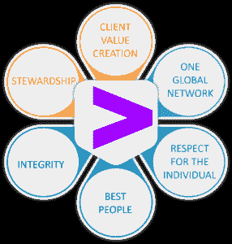
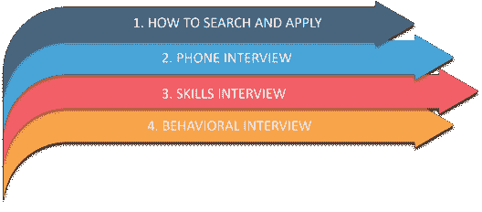

# 埃森哲面试问答 2023

> 原文：<https://www.edureka.co/blog/interview-questions/accenture-interview-questions/>

埃森哲是一家专注于服务和咨询的服务型公司。埃森哲拥抱变革的力量，在印度为其客户、员工、股东、合作伙伴和社区创造 360°价值和共享成功。根据 Naukri . com 的数据，埃森哲一次就有大约 22574 个职位空缺。在一次采访中，人才咨询公司 Han Digital 的首席执行官 Saravanan Balasundaram 表示，“我们的估计显示，埃森哲在 2023 财年在印度雇佣了 7 万多名员工。”根据这一比例，我们可以肯定地得出结论，尽管埃森哲有巨大的需求和招聘，但要破解面试过程还是相当困难的。如果这是你所关心的，那么你来对地方了。这个关于埃森哲面试问题的博客涵盖了一切，从埃森哲面试流程到埃森哲最常问的问题以及破解埃森哲面试的额外技巧。


涵盖的主题:

[关于埃森哲](#AboutAccenture) [埃森哲核心价值观](#AccentureCoreValues) [面试流程在埃森哲](#InterviewProcessinAccenture) [备考行为题](#PreparingforBehavioralQuestions) [备考技术题](#PreparingforTechnicalQuestions) [加分提示](#BonusTips)

如果你不喜欢阅读，请查看下面的埃森哲面试问题视频。

[//www.youtube.com/embed/_c9e-NJANvc](//www.youtube.com/embed/_c9e-NJANvc)

## **关于埃森哲**

埃森哲是 1989 年成立的财富 500 强公司之一，被认为是顶尖的 IT 公司之一。现在，作为埃森哲的一部分，人们需要知道他们严格坚持自己的核心价值观。每个员工都需要知道并遵守他们的价值观。除此之外，人们可以选择埃森哲职业的一些其他原因是因为品牌名称、工作与生活的平衡、工作环境和工作质量。如果你是一名在埃森哲开始职业生涯的新人，那么这是一个额外的优势，因为这家基于服务的公司将以一种美妙的方式塑造你的职业生涯。那么，在申请埃森哲之前，你需要知道哪些价值观呢？

让我们进入埃森哲面试问题博客，了解埃森哲的核心价值观

## **埃森哲核心价值观**

*   **创造客户价值**:让客户成为高绩效企业，并通过积极响应、保持相关性和持续提供价值来建立长期关系。
*   **一个全球网络** : 利用全球洞察力、关系、协作和学习的力量，为客户提供卓越的服务，无论他们在哪里开展业务。
*   **尊重个人** : 重视多样性和独特贡献，营造信任、开放和包容的环境，以体现埃森哲价值观的方式对待每一个人。
*   **最佳人才**:为我们的业务吸引、培养和留住最优秀的人才，挑战我们的员工，展示“我能行”的态度，营造协作和支持的环境。
*   **正直** : 在道德上不屈不挠，诚实守信，通过说出我们的意思、言行一致以及对我们的行为负责来赢得信任
*   **管理**:履行我们的义务，为子孙后代建设一个更好、更强、更持久的公司，保护埃森哲品牌，履行我们对利益相关者的承诺，以所有者的心态行事，发展我们的员工，帮助改善社区和全球环境。

让我们进入埃森哲面试问题博客，了解埃森哲的面试流程

## **埃森哲**面试流程

*   **如何搜索和申请**:在[埃森哲职业](https://www.accenture.com/in-en/careers?c=in_brandexpression_11797429&n=psgs_0121&src=inFY21pscgoogle&gclid=Cj0KCQiAkNiMBhCxARIsAIDDKNXmyWT3Kq4bhkxjzPf_3yxWp4HXFsavGWT7aGDl6_5ZhwY3oR6XA-waAjmuEALw_wcB)网站上申请总是明智的，专注于让你兴奋的工作，并与你的技能、经验和抱负相匹配，而不是提交大量申请。你也可以在 LinkedIn 和许多第三方求职网站上申请。如果你能与现有员工建立联系，为你推荐埃森哲的任何职位，这将是一个额外的优势。下一件事是你会收到一封电子邮件，你应该准备一个电话/视频面试。
*   电话面试 : 当被要求对你的资历做一个高层次的概述时，准备好简洁地讲述你的职业经历。在这里，他们想听听你以前的角色，你为什么离开，以及你在职业生涯中做了哪些与你申请的工作相关的事情。 言简意赅，但如有要求，可说得更详细。他们通常会在与招聘经理的讨论中提出后续问题。这些问题旨在探究最适合该角色的领域。
*   **技能面试**:这里总有例子可以分享。在讨论你过去的经历时，让它们与埃森哲目前的工作相关联。或者，更好的是，将你的经历与你申请的职位联系起来。这是你的研究真正有回报的地方。准备好你擅长并在简历中提到的技能，因为你会在这方面受到更多的质疑。如果有人问你一个问题，而你不知道答案，要开诚布公。借此机会提及这是你希望提高技能的领域。如果你夸大你所知道的，它最终会显示出来。注意不要歪曲你自己，或者更糟，显得不诚实。同样重要的是不要低估自己。要自信；你有很多可以提供的。
*   **行为面试**:埃森哲的许多职位需要与客户密切合作。你在某些情况下的反应对成功至关重要。与评估你的功能或技术知识不同，行为面试评估你管理和克服挑战性情况的方式。在本文中，我们将找到一些在埃森哲面试中被问得最多的行为问题。

让我们进入埃森哲面试问题博客，浏览埃森哲行为面试问题。

## **准备埃森哲 HR 面试问题**

1.  告诉我关于你自己的情况 这个问题主要关注你的优势、技能、品质和经验，这些都将与你的工作职位相匹配。如前所述，埃森哲基本上是一家成就卓越的服务型公司。因此，你积极热情的回答将证明你可以为已经建立的组织增加价值。现在，确保你不要一直重复你的句子，这在你给出这样的答案时是非常重要的。示例性回答: *“我是一个积极性高、目标明确的人，坚信在埃森哲这样的组织中，只有团队中的每个人都朝着同一个方向努力，才能取得重大进步。在我以前的经历中，我学到并理解了完全符合工作描述的技能。加上我以前的经理对我的评价和我的表现，表明我是一个合适的候选人，愿意为像埃森哲这样的成熟和高成就的组织做出最好的贡献。”在这里，你已经介绍了你想介绍的关于公司的一切，以及你能为公司做些什么，这样你就可以简单地描述一下你自己。*
2.  你认为在埃森哲工作的三个品质是什么？ 在这个问题中，你应该给出三个突出的品质，或者如前所述，你可以选择埃森哲的任何三个核心价值观。除此之外，你的研究是否了解埃森哲并给出准确的答案。在回答这个问题时，没有确切的正确答案，明智的做法是，向他们展示你了解埃森哲的核心价值观，并让招聘人员认为你愿意更多地了解公司，并为公司做出贡献。示例性回答: *“在学习和了解了埃森哲的核心价值观后，我明白一个人必须是一名优秀的团队成员，并对他们被聘用的工作充满热情。站出来支持球队，尊重并以同样的态度对待每一个人会有所帮助。埃森哲的一些核心价值观是实现预期目标、积极的态度和与员工的伙伴关系，以欢迎和考虑每个人的想法，并建立一个快乐的环境。这些是埃森哲的一些主要目标，帮助他们达到了今天的高度。”*
3.  告诉我你在工作中冒险的时候 这是一个非常棘手的问题。这里的招聘人员正在考察你处理风险的方式，并期待着如果你被埃森哲聘用，你将如何处理未来。因此，非常重要的是，你不要从消极的场景或情况开始，你也必须考虑你的优势，这对你有利。你可以考虑一个你需要立即采取行动的关键例子或关键情况，如果你在过去的经历中没有遇到过任何这样的情况，重要的是你至少要经历某些例子，在这些例子中你可以创造情景并做好准备，这样招聘人员就会明白你有能力处理任何类型的风险。此外，你还可以包括你的同事或合作者，他们基本上是你在取得相同成就时压制住的。示例性回答: *“当我在一个项目上工作时，项目的截止日期很紧，一个问题需要我的一个同事来解决，我不得不在他不在的时候做这件事，我甚至在周末也投入额外的时间来学习需求和理解概念，以满足截止日期。此外，我不仅在期望的期限内完成了项目，还让我的同事避免了麻烦，避免了公司的巨大损失。”你在这里包括了我刚才提到的所有要点，你用你的技能制服了某人，也告诉了你如何在关键时刻使用它。正如这里提到的，你的风险处理能力也很明显。*
4.  **你为什么想加入 extension？这是一个非常重要的问题，无论你选择什么样的面试或职位描述，都肯定会被问到。非常重要的一点是，你要说出埃森哲作为一家公司的所有目标和成就，这样才能让他们明白你已经了解了埃森哲的一切。因此，你愿意真正奉献自己，因为大多数时候，一个人可能会去申请一家公司，而对该公司一无所知。对埃森哲有了很好的了解后，这会让招聘人员认为你在学习公司的目标和成就，因此提及要点是很重要的。比如品牌名称、你的工作生活平衡、同事、工作环境、工作质量等等。现在，如果你是一名新生，这是一个额外的优势，因为你是这个行业的新人，你也可以说这是一个开始职业生涯的好地方，并提到有关人员、快节奏的环境、持续学习等因素。示例性回答: " *埃森哲是市场上的知名品牌，这是我在这家公司求职的主要原因。而且有一个良好的工作平衡。埃森哲提供良好的工作环境，并迫使员工在学习环境中一起工作。这些事情激励着我，鼓励我成为这样一个组织的一员。如果你是大一新生:“*因为这是我职业生涯的开始，我可以观察从低层到高层的每个人。在埃森哲工作让我不断学习和成长，因为我将持续接触新技术和各种业务战略。”****

让我们进入埃森哲面试问题博客，了解如何准备埃森哲技术面试问题

## **准备埃森哲技术面试问题**

**Q1。写一个有效的程序来打印一个数组中 k 个最大的元素。数组中的元素可以按任意顺序排列。**

**例如，如果给定的数组是[1，23，12，9，30，2，50]并且你被要求输入最大的 3 个元素，即 k = 3，那么你的程序应该输出 50，30 和 23。**

有许多方法可以解决这个问题。

**方法一**

1) Modify Bubble Sort to run the outer loop at most k times.  2) Print the last k elements of the array obtained in step 1. Time Complexity: O(n*k) **Method 2**

arr[0]中的 k 个最大元素..n-1]

1)将前 k 个元素存储在临时数组 temp[0..k-1]。 2)找出 temp[]中的最小元素，设最小元素为  *min* 。 3-a)对于 arr[k]到 arr[n-1]中的每个元素  *x* 。  O(n-k) 如果  *x* 大于 min 则从 temp[]中删除*min*并插入  *x* 。 3-b)然后，从 temp[]确定新的*min*。【k】4)打印  *temp[]* 的最后 k 个元素

时间复杂度:O((n-k)*k)。如果我们希望输出排序，那么 O((n-k)*k + k*log(k))

**方法三**

1)按 O(n*log(n)) 降序排列元素 2)打印排序后数组的前 k 个数字 O(k)。

`#include <bits/stdc++.h>` `using``namespace``std;` `void``kLargest(``int``arr[],` `int``n,` `int``k)` `{`

`sort(arr, arr + n, greater<``int`

``for``(``int``

``cout << arr[i] <<` `" "``

``}``

```int` `main()```

```{```

```int```

```int``n =` `sizeof``(arr) /` `sizeof```

```int```

 ```kLargest(arr, n, k);```

````}````

```**Q2。C++中的类和对象是什么？** 类是用户自定义的数据类型，具有数据成员和成员函数。数据成员是数据变量，成员函数是用于对这些变量执行操作的函数。对象是一个类的实例。因为类是用户定义的数据类型，所以对象也可以被称为该数据类型的变量。`class` `A {````

```**Q3。给定一个整数数组，写一个函数，如果有一个三元组(a，b，c)满足 a<sup>2</sup>+b<sup>2</sup>= c<sup>2</sup>，则返回 true。**```

````class PythagoreanTriplet {````

````static boolean isTriplet(int ar[], int n)``{``for (int i = 0; i < n; i++) {``for (int j = i + 1; j < n; j++) {````

````int x = ar[i] * ar[i], y = ar[j] * ar[j], z = ar[k] * ar[k];````

````if (x == y + z || y == x + z || z == x + y)``return true;``}``}````

````return false;````

````public static void main(String[] args)``{``int ar[] = { 3, 1, 4, 6, 5 };``int ar_size = ar.length;``if (isTriplet(ar, ar_size) == true)``System.out.println("Yes");``else``System.out.println("No");``}``}````

```**Q4。什么是运算符重载？**```

```在 C++和 Java 中都可以问这个问题。```

```运算符重载是对用户定义的数据类型执行运算的一个非常重要的元素。通过运算符重载，我们可以修改运算符的默认含义，如+、-、*、/、< =，等等。```

<section id="operator-overloading" class="ibpage-article-header">

<article class="ibpage-article">

```
```class complex{
private:
 float r, i;
public:
 complex(float r, float i){
  this->r=r;
  this->i=i;
 }
 complex(){}
 void displaydata(){
  cout<<”real part = “<<r<<endl;
  cout<<”imaginary part = “<<i<<endl;
 }
 complex operator+(complex c){
  return complex(r+c.r, i+c.i);
 }
};
int main(){
complex a(2,3);
complex b(3,4);
complex c=a+b;
c.displaydata();
return 0;
}```
```

</article>

</section>

<section id="polymorphism-in-c++" class="ibpage-article-header">

### ```Q5。在 C++中如何分配和释放内存？```

```在 C++中，new 运算符用于内存分配，deletes 运算符用于内存释放。 `int value=new  int; //allocates memory for storing 1 integer delete value; // deallocates memory taken by value````

````int *arr=new  int[10]; //allocates memory for storing 10 int  delete []arr; // deallocates memory occupied by arr````

</section>

```除此之外，还会有很多用不同编程语言提出的问题。```

```让我们继续阅读埃森哲面试问题博客，了解破解埃森哲面试的额外技巧。```

## ```**奖金秘诀破解埃森哲面试**```

```请注意，这里的提示直接来自处理埃森哲组织的面试的专家。因此，请务必仔细阅读每一项，并在准备中加以实施，以取得成功。```

```*   **做好功课** : 了解你申请的职位，包括实际工作和整个公司。提前做一些探索，无论是研究公司网站还是和在那里工作的朋友坐下来。能够回答问题， *  “你觉得生活中的一天在这个角色里是什么样子的？”**   给人留下深刻印象的着装 : 第一印象很重要。有疑问的时候，穿得正式点，不要穿得太正式，把口香糖留在家里。*   收纳你的配饰 : 在面试的时候把它们收好。把你的太阳镜从头顶上摘下来，把你的手机调成飞行模式，收起来，然后在课程结束后拿起你的外卖食品。你唯一应该带的东西是用来做笔记的。*   仔细考虑你的回答:虽然面试的话题可以包括过去的经验、案例研究、行为或技能，但要事先考虑好如何回答这些问题。思考你的成就、角色要求和个人抱负，并决定如何在对话中恰当地运用它们。*   准备好问题:大多数时候，你的面试官会留出提问的时间。准备好要问的问题很重要！不是已经被回答的问题，而是证明你对这个职位的洞察力和兴趣的问题。```

```最后，我们已经结束了这里的内容。当你一直在思考面试过程时，任何面试都可能看起来很难。诀窍是从你的准备开始。一旦你开始了，你甚至不知道你什么时候会成功。我们希望这些信息能解答你对埃森哲面试问题的所有疑问，并祝你面试顺利。如果您需要更好地理解，请务必查看视频。快乐学习！```