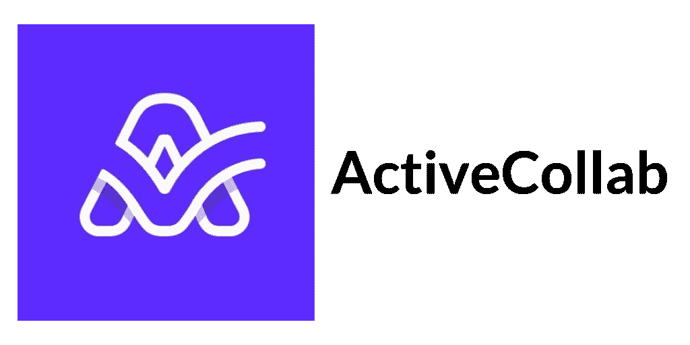

# 敏捷项目管理——敏捷项目管理初学者指南

> 原文：<https://www.edureka.co/blog/introduction-to-agile-project-management>

据世界顶级敏捷项目管理认证机构项目管理协会(PMI)称，到 2030 年，全球经济将需要 2500 万额外的项目管理专业人员。为了满足需求，每年将有 230 万工人需要进入面向项目管理的就业(PMOE)。

根据 Glassdoor 的说法，经理们最终的年薪可以达到 90，890 美元。一个 Scrum 大师的平均底薪是 99492 美元，低端是 72000 美元，高端是 137000 美元。然而，当您开始研究哪种方法最适合您时，您可能会遇到一个再次出现的术语。传统上，项目管理是以线性方式进行的。

项目经理传统上接受的教育是，基于项目具有“完成”的明确含义的思想，朝着特定的和预定义的期限、预算和范围努力然而，这种观念正变得越来越不正确。随着敏捷成为规范，驱动我们许多企业的系统正在从固定向连续转变。当我们宣布一个系统“完成”的时候，它就开始进入有用状态。

敏捷 方法论 有 横扫项目 管理 在这个博客中，我们将讨论所有关于敏捷项目管理的内容，并将涵盖以下主题:

*   *[12 项敏捷项目管理原则](#The12agileprojectmanagementprinciples)*
*   *[敏捷项目管理的好处是什么？](#Whatarethebenefitsofagileprojectmanagement?)*
*   *[敏捷项目管理工具](#AgileProjectManagementTools)*

## 什么是敏捷项目管理？

敏捷项目管理是软件开发项目的一种迭代方法，它保证输入立即得到响应，并且在冲刺或产品周期的每个阶段做出响应性的变更。这使得项目团队能够使用敏捷的项目管理方法，在项目的截止日期和预算内快速协作地运作。许多敏捷项目管理方法都是在考虑软件的情况下创建的，但是潜在的敏捷理念和敏捷项目管理概念可能适用于广泛的团队，从产品团队到营销团队。

如果你只是在寻找敏捷项目管理的定义，这里有一个很好的敏捷项目管理定义。

"敏捷项目管理是一种协作的、迭代的项目管理方法，它结合了持续的测试和对变化的响应."

## **敏捷项目管理简史**

早在 20 世纪 90 年代，软件团队就发现高度组织化的“重量级”传统项目管理方法(如瀑布)在他们需要的工作方式上并不奏效。他们发现这些重量级方法的缺点，例如缺乏灵活性、适应性，甚至缺乏自主性，使得他们在工作中更难应对变化和应用他们的知识。没有惊喜的空间，因为项目计划从一开始就被指定，偏离可能是昂贵的。这一切始于 2000 年春天，当时一个由 17 名软件专业人员组成的小组，包括马丁·福勒、吉姆·海史密斯、乔恩·克恩、杰夫·萨瑟兰、肯·施瓦伯和鲍伯·马丁，聚集在俄勒冈州，探讨如何缩短开发周期，以便更快地将新产品推向市场。他们确定了实现这一目标的两种重要可能性:

缩短向消费者交付利益所需的时间，以克服产品市场适应性和开发墓地问题尽快接收用户的意见，以验证新软件的实用性，并根据需要继续增强它。

虽然这次会议没有产生我们今天所知道的敏捷技术，但它是敏捷历史上的一个分水岭，因为上市速度、快速反馈和持续改进都是敏捷方法的标志。

## **敏捷项目管理的 4 个核心价值**

无论你是在创建软件还是其他完全不同的东西(比如营销活动)，无论你在哪个行业工作，都有很多经验可以借鉴。最初的敏捷宣言宣称敏捷有 4 个核心价值观:

1.  个人和交互胜过过程和工具。
2.  综合文档之上的工作软件。
3.  合同谈判中的客户协作。
4.  响应变化而不是遵循计划。

这些核心价值是所有敏捷项目管理方法的核心。从核心价值观中可以清楚地看到，敏捷方法首先是协作的和以人为本的。

这不仅适用于工作流程(通过“个人和互动”和“客户协作”取得进展，将人的因素放在前面和中心)，也适用于成品。也就是说，我们的目标是创造一些功能性的东西，为最终用户提供最大的价值。

## **12 项敏捷项目管理原则**

根据敏捷宣言，敏捷项目管理有 12 个关键原则。用宣言自己的话说，它们是:

1.  首要任务是通过早期和持续交付有价值的软件来满足客户。
2.  欢迎不断变化的发展，即使是在发展的后期。敏捷流程利用变化为客户带来竞争优势。
3.  频繁地交付工作软件，从几个星期到几个月，优先选择较短的时间尺度。
4.  业务人员和开发人员必须在整个项目中每天一起工作。
5.  围绕有积极性的个人建立项目。给他们需要的环境和支持，相信他们能完成工作。
6.  向开发团队传达信息的最有效的方法是面对面的交谈。
7.  工作软件是进步的主要衡量标准。
8.  敏捷过程促进可持续发展。发起人、开发人员和用户应该能够无限期地保持恒定的步调。
9.  对技术优势和良好设计的持续关注增强了敏捷性。
10.  简单——最大化未完成工作量的艺术——至关重要。
11.  最好的架构、需求和设计来自自组织团队。
12.  团队定期反思如何变得更有效，然后相应地调整自己的行为。

归根结底，无论你是在谈论实际的软件，还是用它来比喻你正在创造的任何东西(姑且称之为“东西”)，敏捷方法都鼓励你快速、经常地交付“东西”的迭代——因为“东西”存在于有缺陷的现实中比存在于完美的理论中更好。

## 敏捷项目管理的好处是什么？

### **优质产品:**

测试是敏捷项目管理中项目执行阶段不可或缺的组成部分，这意味着最终产品的整体质量更高。客户仍然活跃在开发过程中，可以根据市场现实要求调整。因为敏捷是一个迭代的过程，自组织的团队随着时间的推移不断学习和发展，他们不断改进。

### **客户满意度:**

在敏捷中，消费者不断地参与决策过程，这导致了更高的客户保持率。客户只参与计划阶段，对执行没有影响，这降低了灵活性和适应性。你给予客户价值，并通过让他们参与进来并根据他们的意见进行修改来保证最终产品确实符合他们的期望。

敏捷项目管理的另一个优势是上市时间大大减少。这使得产品所有者能够抓住机会，在某些情况下，享受先发优势。

### **更好的控制:**

由于其开放性、反馈整合和质量控制的特性，敏捷让管理者对项目有更大的影响力。通过现代化的报告工具和程序，在整个项目实施阶段都可以保证质量，并且所有利益相关者都参与到这个过程中，每天都有进度更新。

### **提高项目可预测性:**

有了更好的可视性，预测危险和设计有效的风险缓解策略变得更加容易。有许多方法可以检测和预见敏捷框架中的危险，以及准备保证项目成功运行。

例如，Scrum 方法使用 sprint backlogs 和 burndown 图表来提高项目的可见性，允许管理者预测性能并做适当的准备。

### **降低的风险:**

原则上，遵循敏捷过程的每个项目都不会失败。敏捷是在强调持续交付的小冲刺中实现的。即使某项技术不尽如人意，总有一个微小的元素可以保存下来，供将来使用。

### **适应性增强:**

当敏捷在项目团队中被恰当地应用时，它为他们提供了前所未有的灵活性。团队以更短的速度工作，由产品负责人的持续投入和参与来补充。其他项目管理方法的变更通常既耗时又昂贵。

另一方面，敏捷将项目分解成小的冲刺，这些冲刺既可管理又足够灵活，允许团队快速适应变化。充满活力的公司想要在他们的项目中使用敏捷的主要原因之一是它无与伦比的适应性。

### **更多相关指标:**

与传统技术相比，敏捷团队在预测时间和成本以及监控项目绩效方面采用了更精确和相关的度量标准。敏捷技术关注的是创造成果和优化性能，而瀑布方法关注的是项目如何紧密地跟踪预期的成本和时间。

敏捷生成关键的度量，如交付时间、周期时间和吞吐量，这些度量有助于测量团队绩效，识别瓶颈，并做出数据驱动的选择来解决它们。

### **提高团队士气:**

敏捷团队增强了自主性和决策权，因为他们是自组织和自管理的。项目经理保护团队不受发起人和管理层的影响。

团队的跨职能结构还允许成员学习新的项目管理技能，并在目前的工作中取得进展。团队经常开会讨论困难和情况，让他们更有效地互动。因为团队规模是有限的，敏捷培养了一种紧密结合的氛围，在这种氛围中，团队可以拥有灵活的团队配置。

## **敏捷项目管理工具**

现在，让我们来看看适用于小型和大型企业的最佳敏捷项目管理工具列表。

### ProofHub

ProofHub 是一款智能且功能丰富的敏捷项目管理软件，被许多大公司所采用。有了这个协作应用程序，团队可以轻松地交换想法、汇编论文、开始辩论并继续前进。该计划包括了你利用敏捷技术成功完成项目所需的所有工具和能力。它也适用于利用其他项目管理方法来管理您的项目，如关键路径方法(CPM)，完成事情(GTD)等等。

### **箭牌**

Wrike 非常适合集中和链接众多项目，以及提高团队效率。它有一个功利主义的用户界面的负面名声，但是就像团队周的工具一样，设置你的项目任务将是小菜一碟。尽管 Wrike 不断更新他们的版本和功能，但他们的移动版本在这个过程中有轻微的延迟。如果您希望在桌面上出现更新的同时在移动设备上看到更新，这可能不太方便。

### **智能表**

Smartsheet 描述了团队如何在项目和活动中合作，例如运营管理、营销活动跟踪和活动规划。Smartsheet 分析许多业务解决方案，包括不同的角色和部门。它统一了跨职能的目标，允许自由和开放的合作，并允许您不受限制地组建团队。

### **主动协作**

Active Collab 是作为一种出色的商业解决方案而创建的。有了 Active Collab，您将不再需要让您的客户等待。您可以控制每个用户看到和访问的内容，让他们了解最新信息，并与他们共享重要内容。它提供了项目规划、文件共享、时间监控、支出跟踪、头脑风暴和关键话题讨论等功能。

### 体式

Asana 是一个终极的基于云的项目和任务管理应用程序，用于任务规划、组织和跟踪。从棋盘到时间线，体式从头到尾提供你的团队需要的特征。Asana 跟踪启动和迭代，项目和冲刺计划，以及与同事的交流，以实现敏捷项目管理。

我们可以总结说，敏捷项目管理方法使您的公司更具适应性，并对紧急发展做出反应。当项目中存在以下特征时，如透明的客户服务、适应性、所有权感(共同领导)、持续改进等，则认为。

如果你想成为项目管理方面的专家，一定要参加 [Edureka 的项目管理计划认证培训](https://www.edureka.co/pmp-certification-exam-training)，该培训将通过认证项目经理对你进行项目管理培训！