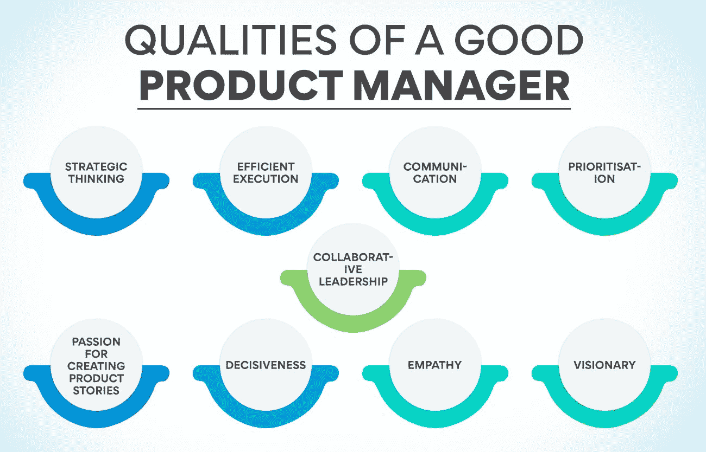
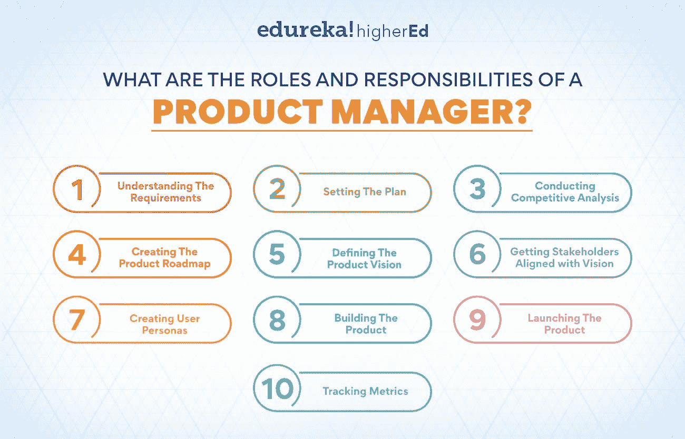
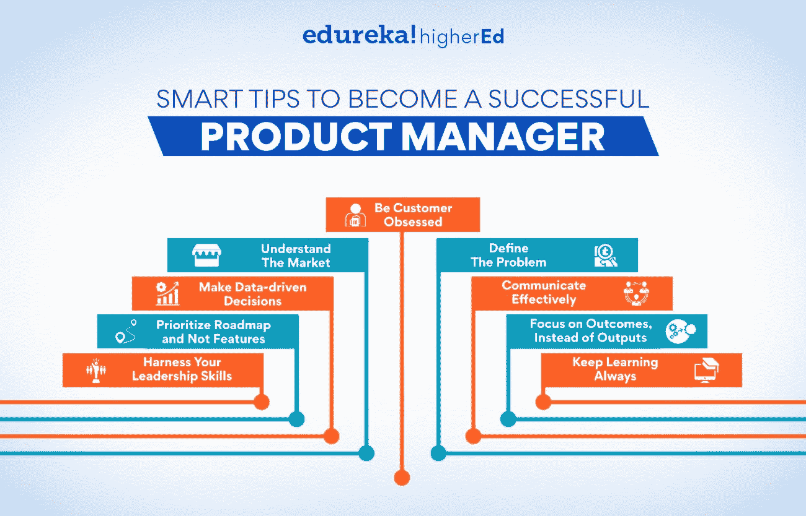

# 如何成为更好的产品经理:10 大技巧

> 原文：<https://www.edureka.co/blog/product-manager>

在当今的商业世界中，产品经理越来越被视为组织的重要成员。这是因为产品经理在开发新产品和服务并将其推向市场的过程中起着至关重要的作用。

产品经理管理整个产品生命周期，从构思到发布，再到发布后的分析。他们与工程、营销、销售和客户服务等其他部门合作，以确保产品满足市场需求并能成功销售。

产品经理必须了解产品的技术层面和市场竞争。他们必须能够识别客户需求，然后将这些需求转化为具体的产品要求。此外，他们必须是优秀的沟通者，能够清楚地向内部和外部利益相关者阐述产品的特性和好处。

一个有效的产品经理可以极大地影响一个组织的底线。他们负责确保开发的产品满足客户的需求，并能盈利销售。此外，他们通过成功将新产品推向市场的能力，在推动收入增长方面发挥着关键作用。简而言之，他们在形成[走向市场战略](https://www.edureka.co/blog/go-to-market-strategy/)中起着关键作用。

由于这些原因，企业越来越重视雇佣有才能的人担任产品管理职务。对于一个充满挑战和回报的职业道路，考虑成为一名产品经理。

产品经理负责产品的方向和成功。这是一个具有挑战性的角色，但也是非常值得的。

你想成为更好的 PM 吗？如果是这样，你很幸运！在这篇博文中，我们将讨论一些技巧，帮助你提高作为产品经理的技能。

## **优秀产品经理的素质**

**战略思维**

要成为更好的产品经理，具备战略思维能力是必不可少的。它意味着能够思考产品的长期目标以及如何实现这些目标。还包括能够做出对未来产品有积极影响的决策。

对于任何产品经理来说，良好的战略思维技能都是必不可少的，因为他们需要超越眼前的问题和需要解决的挑战。他们需要能够思考他们的决策将如何影响未来的产品，以及这些影响是积极的还是消极的。

要培养良好的战略思维技能，你可以做几件事:

阅读有关战略的书籍或文章，并将所学应用到产品经理的工作中。

与其他擅长战略思考的人交谈，向他们请教技巧和建议。

练习用头脑风暴的不同方法来解决你的产品面临的问题。试着想出创造性的解决方案，这些方案可能会产生积极的影响。

每天花些时间想想你的产品的长期目标，以及如何帮助它实现这些目标。

如果你能发展强大的战略思维能力，你将会成为一名更好的产品经理。

**高效执行**

高效的执行力是优秀产品经理的素质。他们需要能够接受一个想法，并迅速将其转化为团队可以执行的计划。这需要对细节和组织能力的高度关注。

优秀的产品经理对自己的产品也有清晰的愿景。他们知道自己想要实现什么，以及如何实现。它允许他们有效地向团队传达他们的计划，并获得利益相关者的认同。

最后，优秀的产品经理总是在学习。他们不断尝试提高他们的技能和知识，以更好地服务于他们的团队和产品。

**通信**

对于产品经理来说，最重要的是能够有效地沟通。这意味着能够阐明产品的愿景，并能够与所有利益相关者沟通，以获得认同和一致。这也意味着倾听反馈，理解用户在说什么。

如果你想成为一名成功的产品经理，你必须拥有出色的沟通技巧。这意味着在传达你的产品愿景时要清晰、简洁、清晰。这也意味着能够与所有利益相关者建立关系和协作。最后，这意味着成为一个伟大的倾听者，这样你就可以将反馈整合到你的产品路线图中。

**优先顺序**

作为产品经理，对产品的各个方面进行优先排序和管理是非常重要的。它包括评估产品各方面的相对重要性及其对产品整体质量的影响。

确定优先级的一个好方法是考虑对客户来说什么是最重要的。他们的需求是什么，你的产品如何满足这些需求？一旦你确定了顾客的需求，你就可以相应地对产品的各个方面进行优先排序。

同样重要的是要记住，并非所有顾客都是平等的。一些客户可能比其他客户要求更高，需要更高的优先级。因此，根据谁是你的目标市场来调整你的优先顺序是很重要的。

总的来说，作为一个优秀产品经理的品质，优先顺序归结为理解客户的需求和对你的产品有一个清晰的愿景。如果你能掌握这两件事，你将会成为一名优秀的产品经理。

**协同领导**

协同领导是一个好的产品经理必备的素质。最好的产品经理可以与他们的团队、其他部门和利益相关者合作，以获得产品的最佳结果。

一个好的产品经理能够与他们的团队建立牢固的关系和信任。他们理解沟通和协作对产品成功的重要性。一个好的产品经理也明白没有放之四海而皆准的领导方法，必须让他们的风格适应环境和人们。

成为更好的协作型领导者的最好方法是练习积极倾听，乐于接受反馈，并且总是愿意从错误中学习。

**创作产品故事的热情**

一个好的产品经理热衷于创造能抓住团队和用户想象力的产品故事。他们明白，一个好的故事可以让最复杂的产品变得更容易理解和使用。热情的产品经理总是在寻找方法来改进他们的工艺，使他们的产品更有吸引力。

与用户产生共鸣并理解他们需求的能力

一个好的产品经理知道如何同情用户，了解他们的需求。他们可以从用户的角度看产品，设身处地为用户着想。它允许他们看到用户可能看不到的东西，并理解他们的痛点。好的产品经理利用这些知识做出更人性化的产品，解决现实问题。

**也可阅读:[专属产品定价:它是什么，为什么要这样做？](https://www.edureka.co/blog/captive-product-pricing/)**

**果断**

果断是优秀产品经理的必备素质之一。一个好的产品经理可以在不影响质量的情况下快速有效地做出决策。

一个好的产品经理也可以从各种利益相关者那里获取信息，包括客户、开发人员和销售团队，并做出最符合产品利益的决策。

要成为一名成功的产品经理，果断是必不可少的。但是，决策必须由产品经理做出。如果你对一个决定没有把握，咨询他人并获得他们的意见是很重要的。

做决定可能很困难，但这是成为一名成功的产品经理的必要条件。如果你想提高你的果断力，你必须每天练习做决定。你做决定的经验越多，就越容易。

**感同身受**

同理心是优秀产品经理的必备素质之一。产品经理必须了解目标市场的需求，并创造出满足这些需求的产品。他们还必须能够同情他们的客户，理解他们的痛点和他们试图实现的目标。

成为一个更有同情心的产品经理的最好方法是设身处地为客户着想。试着理解他们的观点，以及他们在产品中寻找什么。直接与他们交谈，询问他们对你的产品的体验。此外，注意来自客户服务和支持团队的反馈，因为他们经常与客户直接接触，提供有价值的见解。

移情对产品经理来说至关重要，因为它让他们能够创造出解决真正客户问题的产品。没有同理心，产品经理可能会创造出功能齐全的产品，却无法满足客户需求。

**远见者**

一个好的产品经理总是展望未来，思考如何改进产品。他们总是在寻找如何改进产品，使其更加用户友好。一个好的产品经理会一直寻找改进产品的方法，让产品更成功。

有远见的产品经理总是从用户和其他产品经理那里寻求反馈。他们想知道人们对产品的看法，以及如何改进。一个好的产品经理总是愿意得到反馈，并在做出产品决策时考虑这些反馈。

一个好的产品经理会提高产品的质量。他们想确保产品制作精良，满足用户的需求。好的产品经理会让产品更耐用，更持久。

## 产品经理的角色和职责是什么？

一个产品经理负责整个[产品生命周期](https://www.edureka.co/blog/what-are-the-stages-and-examples-of-a-product-lifecycle/)的产品规划和执行。以下是项目经理的一些核心任务:

### **了解需求**

产品经理需要了解他们所负责的产品需求。这包括了解客户需求，以及公司的业务目标。

### **设定计划**

在理解了需求之后，经理需要为如何生产和推出产品制定一个计划。这包括设定时间表和里程碑，并与跨职能团队合作，以确保每个人都在正轨上。

### **进行竞争分析**

产品经理需要了解竞争，了解他们做得好的地方以及他们可以改进的地方。这种分析可用于更新产品路线图，并有助于使产品更具竞争力。

### ****

### **创建产品路线图**

产品路线图是[产品开发](https://www.edureka.co/blog/dynamic-stages-of-the-new-age-product-development-process/)流程的高级视图。它包括产品的主要里程碑、特性和时间表。它允许项目经理根据需要对计划进行修改，并跟踪进度。

### **定义产品愿景**

产品愿景是描述产品长期目标的简短陈述。它用于指导产品的决策，并且应该与公司的使命和目标相一致。产品愿景应该是客户需求、业务目标和竞争分析的积累。

### **让利益相关方与愿景保持一致**

在创建产品愿景之后，产品经理需要让所有利益相关者都参与进来。这包括获得高层管理人员以及跨职能团队的认可。产品经理应该能够传达愿景，以及为什么这对产品的成功很重要。

### **创建用户角色**

用户角色是代表产品不同类型用户的虚构角色。它们是基于市场研究和数据分析而产生的。用户角色有助于理解不同类型用户的需求，以及他们将如何与产品交互。

### **构建产品**

一旦掌握了所有必要的变量和结果，就该开始构建产品了。产品经理与工程部门紧密合作，确保产品按照计划生产。他们还与其他利益相关者合作，如销售和营销，以确保每个人都在同一页上，并且产品满足客户的需求。

**又念:[可选产品定价:是什么，怎么用？](https://www.edureka.co/blog/optional-product-pricing/)**

### **推出产品**

一旦产品建成，就该推出了。产品经理与营销团队一起创建发布计划，并与销售团队一起确保他们为销售产品做好准备。他们还与支持团队合作，确保他们随时准备帮助客户解决任何问题。

### **跟踪指标**

产品推出后，跟踪指标以了解产品的表现非常重要。产品经理与团队一起确定[关键指标](https://www.edureka.co/blog/product-management-metrics)，然后定期跟踪它们。他们使用度量标准中的数据为产品决策提供信息，并根据需要对产品进行更改。

产品经理的角色在不断演变，而且总是有更多东西需要学习。然而，这些是项目经理要取得成功需要完成的一些核心任务。

你想成为更好的产品经理吗？查看我们的产品管理高级管理人员证书课程，该课程深入介绍项目管理知识，并帮助您成为一名成功的项目经理。

## **成为成功产品经理的聪明技巧**

产品管理是一项既有挑战性又有回报的职业选择。要成为一名成功的产品经理，你需要具备强大的技术能力、商业头脑和人际交往能力。您需要能够理解您的客户和利益相关者的需求，然后将这些转化为您的团队的需求。

看一看管理产品时必须掌握的一些技巧。

### **让顾客着迷**

作为一名产品经理，你需要专注于你的客户和他们的需求。花时间去了解你的目标市场以及他们对产品的需求。构建用户角色，并在做出关于特性和功能的决策时牢记这些角色。永远要考虑如何让你的产品对你的客户更有价值。

*   定期与你的顾客交谈。了解客户需求的最佳方式是直接与他们交谈。
*   安排客户面谈，定期与他们交谈。
*   尽早并经常获得反馈。在你的产品开发过程中建立反馈循环，这样你就可以在每个阶段都得到顾客的反馈。

### **了解市场**

市场是产品管理引擎的燃料，所以确保你很好地理解它。很重要的一点是，要很好地理解竞争格局以及你的产品在哪里。了解你的竞争对手提供什么，他们的优势和劣势是什么。这将有助于您在市场中定位您的产品，并就功能和定价做出决定。

*   你可以阅读行业报告和分析师观点。这将让您对市场格局有一个高层次的了解。
*   你可以直接与客户和潜在客户交谈，获得关于你的产品的反馈，以及他们对解决方案的期望。
*   你可以参加贸易展览和会议，看看什么是新的，什么是流行的。

### ****

### **定义问题**

一个好的产品经理能够清楚地定义问题，并提出优雅且用户友好的解决方案。当你遇到一个问题时，花些时间从不同的角度思考一下。根本原因是什么？潜在的解决方案是什么？这将如何影响产品的其他部分？通过花时间思考问题，你将能够提出更好的解决方案。

*   思考问题的一种方式是考虑它们对产品其他部分的影响。例如，如果你试图解决结账过程中的一个问题，你需要考虑它会如何影响产品的其他方面，比如购物车。
*   你还应该记住，有时候最简单的解决方案是最好的。不要把事情复杂化！

### **做出数据驱动的决策**

作为一名产品经理，你必须能够自如地做出基于数据的决策。从所有来源收集数据(客户反馈、使用数据、市场研究等)。)并用它来指导你的决定。不要害怕实验和尝试新事物——知道什么有效的唯一方法就是去测试它。做决策时参考数据将有助于你开发出相关的、完美的产品。

*   了解什么数据对你可用，数据来自哪里。
*   了解如何使用 Excel 或 Google Analytics 等工具分析这些数据。
*   确保你从所有来源收集数据，而不仅仅是那些支持你当前信念的来源。
*   愿意尝试新事物，即使它们违背你的直觉。
*   使用数据为你的决策提供信息，但也不要忘记使用你的常识！

### **有效沟通**

对于一个产品经理来说，最重要的技能之一就是有效的沟通。你需要能够传达你对产品的愿景和你想要达到的目标。听取团队成员和利益相关者的反馈，并将其纳入你的计划，这也是沟通的一部分。良好的沟通将帮助你与你的团队和利益相关者建立牢固的关系。

*   确保你对你的[产品](https://www.edureka.co/blog/product)有一个清晰简洁的愿景。这将有助于你向你的团队和利益相关者阐明你的目标。
*   对反馈持开放态度，并愿意将其纳入你的计划。倾听他人的意见有助于你创造更好的产品。
*   让你的利益相关者了解你的最新进展，并对变化保持透明。这会建立信任和尊重。
*   当你需要帮助时，请不要犹豫。寻求帮助表明你愿意作为一名产品经理学习和成长。

**也可阅读:[产品定价和成本理论:含义、基本原理&框架](https://www.edureka.co/blog/theory-of-product-pricing/)**

### **优先考虑路线图而不是功能**

产品经理必须优先考虑路线图，而不是单个功能。路线图应该与公司的战略保持一致，并且应该专注于解决最重要的问题。不要沉迷于添加新功能，而是要专注于为用户提供价值。对路线图进行优先排序将有助于您保持专注并交付成功的产品。

*   从了解你的用户需要什么开始。与您的客户和用户交谈，更好地了解他们的需求和痛点。
*   不要试图取悦每个人。不可能创建一个让所有人都满意的路线图。相反，专注于创建一个最能满足目标用户需求的路线图。
*   对你能达到的目标要现实一点。不要试图在你的路线图中塞进太多东西，否则你最终会让你自己和你的团队过于分散。
*   保持路线图的灵活性。在你开发产品的过程中，事情不可避免地会发生变化，所以不要害怕相应地调整你的路线图。

### **关注结果，而不是产出**

产品经理常犯的一个错误是关注产出而不是结果。输出是像特性、代码或设计资产这样的东西。结果是你希望你的产品达到的结果。例如，如果您正在构建一个新功能，您的成果可能是提高客户满意度或减少客户流失。把你的眼睛放在奖励上，专注于交付成果，而不是产出。

*   定义你希望你的产品取得的成果。
*   围绕这些结果调整你的团队。
*   持续跟踪和衡量实现这些成果的进展。
*   根据需要进行修改，以确保达到你想要的结果。

### **利用你的领导技能**

作为一名产品经理，你需要成为一名强有力的领导者。你需要能够激励你的团队，让他们对产品感到兴奋。你还需要能够做出艰难的决定，让团队专注于目标。当你领导一个团队时，注重培养信任和尊重是很重要的。

*   你需要能够激励你的团队，让他们对产品感到兴奋。你还需要能够做出艰难的决定，让团队专注于目标。
*   当你领导一个团队时，你的团队必须信任和尊重你。这将有助于他们更愿意跟随你的领导，一起朝着共同的目标努力。
*   让团队专注于目标是很重要的，这样每个人都会朝着同一个目标努力。这可以通过设定明确的目标和期限来实现，并确保每个人都意识到这一点。
*   你需要能够传达你对产品的愿景，并让每个人都参与进来。你还需要能够倾听你团队的想法和反馈，这样你才能为产品做出最好的决定。

### **永远保持学习**

[产品管理](https://www.edureka.co/blog/what-is-product-management/)领域一直在变化和发展。要成为一名成功的产品经理，你需要不断学习。看书，参加会议，试验新产品。通过不断学习，你将能够保持领先地位，提供一流的产品。学习会丰富你的技能，让你轻松爬上产品管理的阶梯。

*   了解[什么是产品管理](https://www.edureka.co/blog/what-is-product-management/)的一个好方法是阅读相关主题的书籍。有许多不同的标题可用，所以找到一个你感兴趣的，并投入进去。
*   另一个很好的学习方法是参加会议。在这些活动中，您将能够听到业内一些顶级产品经理的观点，并了解最新趋势。
*   另一种保持学习的方法是尝试新产品。这将让你亲身体验不同产品的工作原理以及它们提供的功能。

遵循这些建议可以为你的职业生涯打下坚实的基础，并为你的成功做好准备。那么，你还在等什么？今天就开始成为成功的产品经理的旅程吧！

从我们的高级[产品管理课程](https://www.edureka.co/highered/advanced-executive-program-in-product-management-iitg)开始您的旅程，它将帮助您磨练成为成功的产品经理所需的技能。了解[产品战略](https://www.edureka.co/blog/how-to-formulate-an-excellent-product-strategy/)，如何制定产品路线图，等等。

## **更多信息:**

[什么是产品线:定价、策略&基本面](https://www.edureka.co/blog/product-line-pricing/)

[什么是产品分析:完全指南](https://www.edureka.co/blog/product-analytics/)

[什么是客户分析？如何执行？](https://www.edureka.co/blog/customer-analytics/)

[数据处理:含义、框架&举例](https://www.edureka.co/blog/data-handling/)