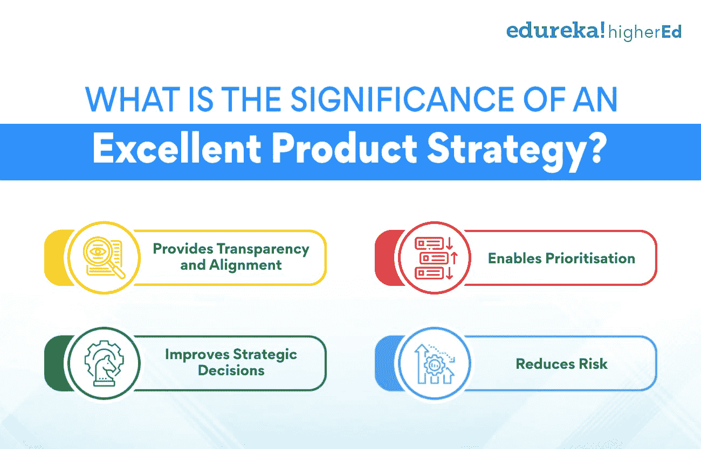
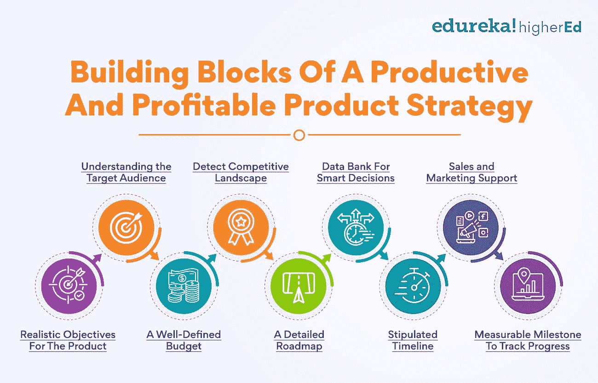

# 制定优秀产品战略的指南

> 原文：<https://www.edureka.co/blog/product-strategy/>

对任何企业来说，推出新产品总是一项艰巨的任务。大多数企业都会同意，精心设计的产品策略对于确立市场主导地位至关重要。但是，制定一个伟大的产品开发战略需要什么呢？

从最初的规划阶段到最终的发布，有许多事情需要考虑。许多因素开始起作用，包括市场分析、竞争对手分析、客户需求等等。

你必须有一个坚实的战略，以确保新产品上市的成功。在本指南中，我们将带您熟悉制定优秀产品战略的步骤。

我们将讨论精心酝酿的产品战略的成分，最后，[你将了解](https://www.edureka.co/blog/product-management-learning)如何创建一个能帮助你的企业成功的有效战略。我们开始吧！

## **一个优秀的产品策略的意义是什么？**

卓越的[产品策略](https://www.edureka.co/blog/how-to-formulate-an-excellent-product-strategy/)是任何产品开发计划成功的关键。它允许组织将资源集中在正确的目标上，并优先考虑其产品最重要的特性和功能。

此外，精心设计的产品开发战略可以帮助公司在开发过程中避免代价高昂的错误，并确保所有新产品成功投放市场。它就像一张地图，指导产品开发团队从概念到发布。

**提供透明度和对齐方式**

一个深思熟虑的战略可以在组织内部提供透明度和一致性。所有利益相关者都应该了解该计划及其目标。这确保每个人都朝着相同的目标努力，并清楚地了解产品的方向。此外，共享的产品战略可以帮助团队成员达成共识，并确保每个人都在同一页上。

**启用优先级**

没有在正确的时间优先处理正确的事情会导致致命的后果。因此，产品战略使组织能够有效地优化资源。有了对产品目标的清晰理解，公司可以专注于开发的最关键方面。这使得他们能够明智地花费时间和金钱，避免将资源浪费在对产品成功不重要的功能上。

**改善战略决策**

一个优秀的战略能让公司更容易对其产品做出明智的战略决策。做出合理的决策以实现最佳产品定位变得至关重要。通过清楚地定义产品的目标，组织可以设定成功的标准，并且[确定用于衡量进展的关键指标](https://www.edureka.co/blog/product-management-metrics)。这有助于他们跟踪自己实现这些目标的进度，并根据需要调整策略。

**降低风险**

最后，优秀的产品策略可以帮助公司降低失败的风险。有了反映产品愿景和目标的清晰简明的计划，组织可以避免在开发过程中犯代价高昂的错误。此外，精心设计的战略可以帮助公司在潜在问题发生之前预测并解决它们。通过降低失败的风险，一个优秀的计划可以帮助公司增加在市场上成功的机会。

一个强有力的策略是任何产品开发计划成功的秘方。它允许组织将资源集中在正确的目标上，并优先考虑其产品最重要的特性和功能。

想了解更多关于[产品管理](https://www.edureka.co/blog/product-management/)的复杂细节吗？看看我们的产品管理高级执行官证书，它将带您了解产品管理的所有核心主题，包括如何制定产品战略。

**同时阅读:[如何成为更好的产品经理:10 大技巧](https://www.edureka.co/blog/product-manager)**

## **生产性和盈利性产品战略的组成部分**

在建立新的产品战略之前，有几个基本因素需要考虑。我们来详细讨论一下:

**了解目标受众**

制定一个优秀的战略有几个方面。也许最重要的是了解你的目标市场的需求。你的客户在产品中寻找什么？本质特征和功能是什么？一旦你对你的目标市场了如指掌，你就可以开始制定你的战略目标。

**发现竞争格局**

在制定你的产品战略时，也必须考虑竞争格局。谁是你的竞争对手，他们提供什么？你的产品有什么独特的卖点吸引你的目标市场？你将采用什么样的定价策略来保持竞争力？当你为新产品开发工作策略时，这些都是需要回答的重要问题。

**智能决策数据库**

数据库将有助于你对产品策略做出明智的决定。这个数据库应该包括你的目标市场、竞争对手、产品和整个行业的信息。这些信息可以让你对产品策略的各个方面做出明智的决定。

****

**销售和营销支持**

另一个需要考虑的重要因素是检查你是否拥有成功推出产品所必需的销售和营销支持。你有走向市场的策略吗？你有一个强大的团队来执行这个战略吗？在产品发布之前，确保你已经做好了准备。

**产品的现实目标**

你希望用你的产品实现什么目标？为你的策略设定现实的目标是很重要的。如果你的目标过于宏大，你可能会发现自己对结果感到失望。然而，如果你的目标过于保守，你可能看不到你所期望的增长。为你的产品战略设定目标时，找到一个合理的媒介是很重要的。

**明确的预算**

预算是制定产品战略的重要因素。你有多少钱来工作？你的营销和广告费用是多少？了解整个产品开发和上市过程中的预算将有助于您对战略做出更好的决策。

**详细的路线图**

最后，你需要为你的产品战略制定一份详细的路线图。该路线图将作为产品开发和上市的指南。它应该包括里程碑、截止日期和可交付成果。路线图将帮助你跟踪你的进展，并在此过程中做出必要的调整。拥有一份详细的路线图将确保你的策略得到完美的执行。

**规定的时间表**

为你的战略设定一个时间表是很重要的。该时间表将作为您产品开发和上市的指南。有一个时间表将有助于确保你的产品按时推出。这也将帮助你跟踪你的进展，并在此过程中做出必要的调整。

**跟踪进度的可衡量里程碑**

最后，建立一个可衡量的里程碑来跟踪你的产品战略的进展是很重要的。没有一个可量化的里程碑，将很难衡量你的进展，并对战略做出必要的调整。这个练习将帮助你确定你是否正在实现你的目标。

产品战略是任何产品发布的必要组成部分。在制定一个优秀的、目标导向的战略时，所有这些因素都是需要考虑的重要因素。当你为你的产品发布制定目标时，考虑这些要点。有了对目标市场的清晰了解和明确的路线图，您就可以确保产品发布的成功。

**也可阅读:[产品生命周期的阶段和例子有哪些？](https://www.edureka.co/blog/product-lifecycle/)**

## **如何创建一个有效且优秀的战略？**

产品策略对任何企业都至关重要，无论是推出新产品还是开发现有产品。一个好的战略可以帮助你评估你的竞争对手，了解你的目标市场，并对你的产品开发做出正确的决定。创建一个有效而优秀的战略需要[精心的计划](https://www.edureka.co/blog/what-is-product-planning-and-how-is-it-done/)和执行。以下是一些开始的提示:

**定义产品愿景和目标**

制定全面产品战略的第一步是定义你的产品愿景和目标。你想通过你的产品获得什么？它解决了什么需求？一旦你有了这些问题的答案，你就可以开始为你的产品开发做决定了。让团队中的每个人都参与到这个过程中，以获得他们的投入和认同。定义愿景和目标将有助于塑造你的产品战略方向。

**进行市场调查和竞争分析**

在做出任何重要决定之前，了解你的目标市场和竞争对手是至关重要的。进行市场调查，更多地了解你的目标客户及其需求。这将有助于您对产品特性和定位做出决策。此外，了解您的竞争对手以及他们在市场中的定位也很重要。通过适当的市场调查，你可以发现你的产品的机会和威胁。

**定义您独特的销售主张(USP)**

是什么让你的产品独一无二？它为您的客户提供了什么价值？回答这些问题将有助于您定义产品的 USP。你的 USP 应该让你的产品在竞争中脱颖而出，并为你的客户提供价值。这是产品差异化的一部分，将有助于获得市场优势。保持简单易懂。

**制定路线图**

在您进行了市场调查、定义了您的产品愿景和目标并确定了您的 USP 之后，是时候制定产品路线图了。本文档包含了实现产品目标所需的步骤。它还应包括该进程每一步的时间表。路线图将随着你的产品战略的发展而发展。

**定义你需要解决的问题**

重要的是要找到你的目标受众面临的共同问题，这些问题可以通过新产品来解决。这既包括技术问题，也包括业务问题。一旦你发现了这些问题，你就可以开始为你的产品开发做决定了。对问题有了更好的了解，你就能开发出满足目标市场需求的产品。

**制作商业案例**

在你进行了市场调查并确定了你的产品的机会后，是时候做一个商业案例了。商业案例应包含对市场机会、您的产品愿景和目标、您的 USP 和您的产品路线图的分析。它还应该包括财务预测和走向市场战略。商业案例将帮助你获得利益相关者的认同，并对你的产品开发做出决策。

**创建最小可行产品(MVP)**

在了解你的市场、客户和竞争后，你可以开始开发你的 MVP。最低可行产品是具有核心特性和功能的产品版本。尽快发布 MVP 是很重要的，这样你就可以开始从客户那里得到反馈。有了适当的客户反馈，您将能够迭代产品并使其变得更好。

**产品差异化优势**

下一步是确定什么样的产品差异会让你的产品在市场上脱颖而出。这可以是任何东西，从一个独特的功能到一个更有效的制造过程。选择对您的客户有意义并为他们提供价值的产品差异化优势至关重要。通过合适的产品差异化，您可以增加市场份额和盈利能力。

**设定产品设计和开发原则**

在你确定了你的产品优势后，是时候设定设计和开发原则了。这些原则将指导你的团队把产品引向正确的方向。它们应该基于你的策略和目标。一些设计原则的例子包括以用户为中心的设计、简单性和模块化。通过在早期设定这些原则，你将能够确保你的产品是按照客户的偏好来设计和开发的。

**创建发布计划**

制定有效战略的最后一步是制定投放计划。本文档包含成功推出产品所需的步骤。它应该包括走向市场战略、营销计划、销售计划和运营计划。发布计划将帮助你确保你的产品在市场上获得成功。

**根据需要进行调整**

随着你在[产品开发](https://www.edureka.co/blog/dynamic-stages-of-the-new-age-product-development-process/)的进展，根据需要做出调整是很重要的。这可能包括对您的产品路线图、里程碑或指标的更改。它也可能包括改变你的产品策略。随着你对你的产品和市场的了解越来越多，要灵活并愿意做出改变。

**创建里程碑和指标**

有必要创建里程碑和衡量标准来跟踪进度，确保您的产品目标得以实现。里程碑应该是具体的和可衡量的。它们还应该与您的产品路线图保持一致。指标应该用来衡量你的策略是否成功。它们应该基于你的产品目标和目的。

**决定产品定价**

你对产品做出的最重要的决定之一就是定价。在定价时，你需要考虑商品、营销和销售的成本。你还需要考虑产品的感知价值。在获取利润和让顾客买得起你的产品之间建立平衡变得非常重要。应该定期审查产品定价，以确保它仍然符合您的产品战略。

**推出产品**

在你开发并测试了 MVP 之后，是时候推出[产品](https://www.edureka.co/blog/product)了。这是你的产品向公众公开的时候。发布是产品开发过程中的关键一步。重要的是要确保产品已经准备好上市，并且你有一个可靠的计划。

**监控和调整**

产品推出后，监控其进展并根据需要进行调整是至关重要的。这包括监控销售、客户反馈和网络流量。密切关注竞争是非常必要的。通过监控你的产品，你将能够做出必要的改变，以确保它在市场上的成功。

以上步骤只是如何制定一个优秀的产品策略的指南。每个企业都不一样，都会有不同的需求。重要的是要根据你的具体行业量身定制策略。请记住，保持灵活性并随时做出调整是非常重要的。有了深思熟虑的产品策略**、**、你就能开发出满足客户需求的成功产品。

学习我们的[产品管理](https://www.edureka.co/highered/advanced-executive-program-in-product-management-iitg)高级管理人员证书，为您的产品管理职业生涯打下坚实的基础。

## 更多信息:

[品牌管理 v/s 产品管理:了解关键差异](https://www.edureka.co/blog/brand-and-product-management/)

[什么是产品流程矩阵？](https://www.edureka.co/blog/what-is-the-product-process-matrix/)

[什么是产品管理？](https://www.edureka.co/blog/what-is-product-management/)

[产品变化的原因是什么？原因&原因](https://www.edureka.co/blog/what-are-the-reasons-of-variations-in-product-causes-reasons/)