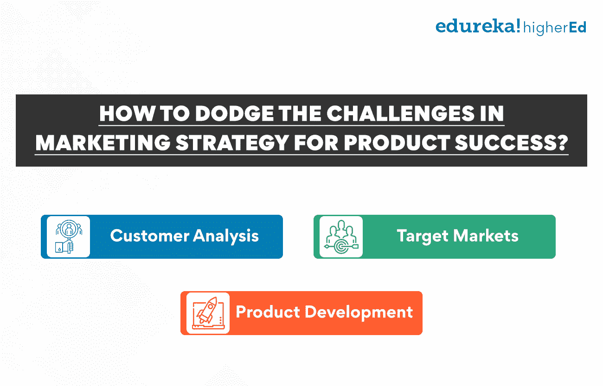

# 新时代产品开发过程的 7 个动态阶段

> 原文：<https://www.edureka.co/blog/product-development/>

在当今快节奏和不断变化的商业环境中，公司必须不断创新并将新产品推向市场，以保持竞争力。随着时间的推移，产品开发流程也在不断发展，以满足企业和消费者的需求。

创建一维产品开发流程的日子已经一去不复返了。为了开发成功的新产品，企业需要采用更加动态和流畅的方法。现在新产品开发过程有 7 个动态阶段，公司可以利用它们来制造满足客户需求的突破性产品。

在这篇博文中，我们将讨论产品开发过程的每个阶段，以及它如何帮助您的企业取得成功！

## **什么是新产品开发，为什么它很重要？**

新产品开发是创造新产品并将其推向市场的过程。它包括构思、研发、制造、营销和销售。

产品开发对所有企业来说都是至关重要的，因为它允许企业将新产品推向市场，从而创造收入并提高市场价值。成功的新产品开发过程可以帮助公司在竞争中保持领先，跟上不断变化的客户需求，并增加利润。此外，它还能帮助企业跟上竞争步伐，满足客户需求。

想了解如何制定定制产品开发流程吗？浏览我们的产品管理高级管理人员证书，该证书以全面的方式教你关于[产品管理](https://www.edureka.co/blog/product-management/)的一切。

## **新时代产品开发流程有哪些阶段？**

新产品开发的阶段定义了组织开发新产品所遵循的流程。这是一种有助于将新产品推向市场的系统化和循序渐进的方法。

产品开发过程可以分为七个阶段:想法产生、想法筛选、概念开发和测试、业务分析和市场策略、产品开发、部署和商业化。让我们详细讨论每个产品开发阶段，以便更好地理解这个过程

### **第一阶段:创意产生**

新产品开发流程的第一阶段是创意产生。在这个阶段，组织识别和评估新产品的机会。这是你优化的阶段。市场调查、头脑风暴会议、客户反馈等。，可以帮你打通

每天都有成百上千的想法在企业中萌芽，但并不是每个想法都值得追求。所以，有一个系统来过滤掉不好的想法，关注好的想法是很重要的。

**同时阅读:[如何成为更好的产品经理:10 大技巧](https://www.edureka.co/blog/product-manager)**

想法的不同来源是什么？

一些熟悉的想法来源是:

*   头脑风暴会议
*   客户反馈
*   市场调查
*   竞争对手分析

所有想法的来源大致可分为内部和外部来源。内部资源是指组织内部的资源，如员工、客户等。外部来源在组织之外，如供应商、行业专家等。最大限度地利用所有的想法来源以确保最好的想法被采纳是至关重要的。

### **第二阶段:创意筛选**

一旦组织产生了一系列想法，下一步就是筛选这些想法。进行筛选的主要原因是为了识别和选择进一步发展的最佳想法。

许多标准可用于筛选创意。这些标准可能包括:

*   产品的潜在市场
*   产品的技术可行性
*   产品的制造成本
*   开发和商业化产品所需的组织资源。

创意筛选在新产品开发中至关重要，因为它有助于识别最佳创意，并使公司能够将其资源导向这些创意。例如，如果一个组织的资源有限，它可能希望将其资源集中在最有可能成功的想法上。

创意筛选阶段可分为两个子阶段:

*   初筛
*   详细筛选

在最初的筛选阶段，组织将快速筛选创意，以确定进一步发展的最佳创意。这个阶段通常由一个了解[产品](https://www.edureka.co/blog/product)和市场的小团队进行。

在详细筛选阶段，组织将对创意进行更深入的评估。这一阶段通常由一个更大的团队来执行，该团队包括来自不同职能部门的专家，如营销、工程和制造部门。

创意经过筛选后，组织将选出最合适的创意，这些创意将进入产品开发的进一步阶段。不确定的想法将不再考虑。

### **第三阶段:概念开发和测试**

新产品开发流程的下一阶段是概念开发和测试。在这一阶段，组织对产品创意进行详细描述，并与潜在客户一起进行测试。

概念开发包括创建产品概念的详细描述，包括其特点和优势。这一阶段让组织了解产品理念是否清晰简洁，是否符合目标市场的要求。

一旦概念被开发出来，就要和潜在客户一起测试。这允许组织收集关于产品想法的反馈并做出必要的改变。

概念测试包括四个步骤:

**发展概念:** 第一步是对产品理念进行详细的描述。这包括确定产品的特点和优点。目标是确保概念清晰简洁。

**确定目标市场:** 下一步是确定产品的目标市场。这包括确定目标市场的需求。

**创建原型:** 第三步是开发产品的原型。这使得潜在客户可以测试产品创意并给出反馈。

**进行市场调查:** 最后一步是进行市场调查。这包括收集关于目标市场和竞争的数据。这些信息用于对产品概念进行必要的修改。

概念测试有几个好处，包括:

*   允许组织从潜在客户那里收集关于产品想法的反馈。
*   使组织能够对产品概念做出必要的改变。
*   帮助组织更好地了解目标市场的需求。
*   允许组织创造更有可能在市场上获得成功的产品。

### **第四阶段:业务分析和营销策略**

收集和分析完产品需求后，是时候制定业务分析和营销策略了。这个阶段是关于了解产品的潜在客户，他们的需求和愿望，以及如何最好地接触他们。目标是为新产品的营销和销售制定详细的计划。

可靠的业务分析和市场战略的一些关键要素包括:

*   详细的客户调查
*   竞争对手分析
*   销售和营销计划
*   定价策略
*   分销策略

**如何制定营销策略？**

一个好的营销策略应该建立在对你的目标市场彻底了解的基础上。你需要了解你的潜在客户，他们关心的问题，以及接近他们的理想方式。您可以进行客户研究、竞争对手分析和市场分析来收集这些信息。

熟悉目标市场后，你可以开始制定营销计划。这个计划应该包括你的销售和营销目标、预算以及达到目标市场的策略。

随着时间的推移，随着你对客户和市场的了解越来越多，营销策略通常会发生变化。确保定期更新你的方法，以保持相关性和实用性。

**也可阅读:[产品生命周期的阶段和例子有哪些？](https://www.edureka.co/blog/product-lifecycle/)**

如何规避营销策略中的挑战以获得产品成功？

营销策略的挑战归结为三件主要的事情:顾客分析、目标市场和产品开发。看看这些挑战，以及如何克服它们。

****

**客户分析:** 营销中最大的挑战之一就是了解你的目标市场。你需要了解你的潜在客户，他们的需求，以及如何接触他们。您可以进行客户研究、竞争对手分析和市场分析来收集这些信息。

目标市场: 另一个挑战是找到你产品的目标市场。你需要确定一群对你的产品感兴趣并愿意购买的潜在客户。你可以进行客户调研和市场分析，找到合适的目标市场。

**产品开发:** 最后一个挑战是开发出符合目标市场需求的产品。你需要为你的目标客户创造一个有价值和吸引力的产品。要做到这一点，你必须了解他们的需求，并设计出满足这些需求的产品。

通过了解这些挑战以及如何克服它们，你可以为你的产品制定一个积极的营销策略。

### **第五阶段:产品开发**

在最初的[研究和计划](https://www.edureka.co/blog/product-planning/)阶段之后，是时候开始开发你的产品了。产品开发阶段可以分为设计和原型制作。在这里，你将把你所有的想法变成现实。

设计就是专注于产品的外观、目标和感觉。这包括从整体美学到用户界面的一切。你需要考虑如何使用你的产品，以及你的目标受众是谁。设计应该基于用户将如何使用产品以及它的目标受众是什么。

成功的产品设计是有效研究和规划的结果。创建原型并与属于目标受众的人一起测试它们是至关重要的。它有助于获得关于产品的反馈，并相应地进行改进。一旦你对你的产品有了清晰的愿景，就该开始创建原型了。

原型制作是产品开发过程中不可或缺的一部分。它允许你测试你的想法，并从潜在用户那里获得反馈。创建几个原型并和不同的人一起测试是很重要的。这将帮助你完善你的产品，并确保它满足你的目标受众的需求。

创建一个成功的原型需要仔细的计划和执行。以下是一些帮助你创建成功原型的技巧:

*   保持简单: 原型应该被设计用来测试一个特定的想法或功能。你的原型不一定要完美；它应该只是能够清楚地传达你的愿景。
*   **让它坚固:** 一个原型应该能够经得起被利用和被滥用。它必须具有足够的持久性，能够承受常规使用。
*   **尽早并经常获得反馈:** 反馈对于完善一个原型是必不可少的。确保在这个过程中尽早获得潜在用户的反馈。

创建成功的原型对于成功的产品开发至关重要。有了这些建议，你可以确保你的原型有效地传达你的想法，满足你的目标受众的需求。

### **第六阶段:产品部署**

产品开发和测试完成后，就该部署了。这一阶段包括将产品投入生产并提供给客户。部署新产品需要大量的工作；以下是一些需要考虑的因素:

**制造:** 第一步是找到一个可以规模化生产你产品的制造合作伙伴。你必须考虑成本、质量和交付周期等因素。

分销: 一旦产品生产出来，你就需要把它送到顾客手中。这包括制定分销战略和寻找能够帮助你到达目标市场的合作伙伴。

**营销:** 在你能卖出你的产品之前，你需要让人们知道它的存在。这包括创建一个营销计划，并通过各种渠道推广你的产品。

部署新产品可能具有挑战性，但仔细的规划和执行将有助于确保其成功。通过考虑这些因素，你可以[制定一个战略](https://www.edureka.co/blog/product-strategy/)把你的产品送到你的客户手中。

### 第七阶段:商业化

产品开发流程的最后阶段是商业化。这是你把你的产品推向市场并开始销售给顾客的地方。以下是将新产品商业化时需要考虑的事项:

定价: 你需要制定一个符合目标市场需求的定价策略。

一旦你有了定价策略，你就需要开始销售你的产品。这需要制定销售策略，寻找能够帮助你到达目标市场的合作伙伴。

**营销:** 为了销售你的产品，你需要让人们知道它的存在。这包括创建一个营销计划，并通过各种渠道推广你的产品。

产品开发流程是创造在市场上受欢迎并解决目标受众关注的新产品的基础。通过遵循这七个阶段，你可以确保你的产品满足目标市场的需求，并取得商业上的成功。

要了解产品开发的来龙去脉，请花点时间查看我们的[产品管理高级执行官证书](https://www.edureka.co/highered/advanced-executive-program-in-product-management-iitg)，该证书详细介绍了产品管理。

## **更多信息:**

[品牌管理 v/s 产品管理:了解关键差异](https://www.edureka.co/blog/brand-and-product-management/)

[什么是产品流程矩阵？](https://www.edureka.co/blog/what-is-the-product-process-matrix/)

[什么是产品管理？](https://www.edureka.co/blog/what-is-product-management/)

[产品变化的原因是什么？原因&原因](https://www.edureka.co/blog/what-are-the-reasons-of-variations-in-product-causes-reasons/)