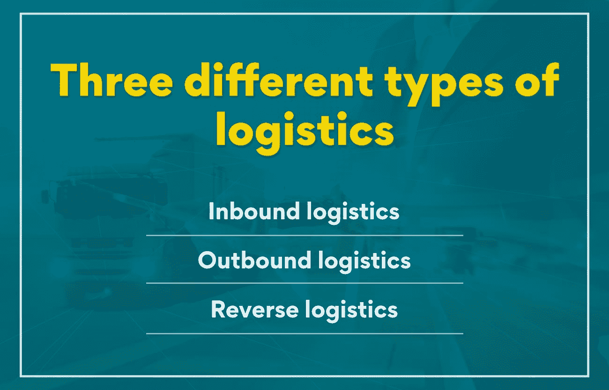
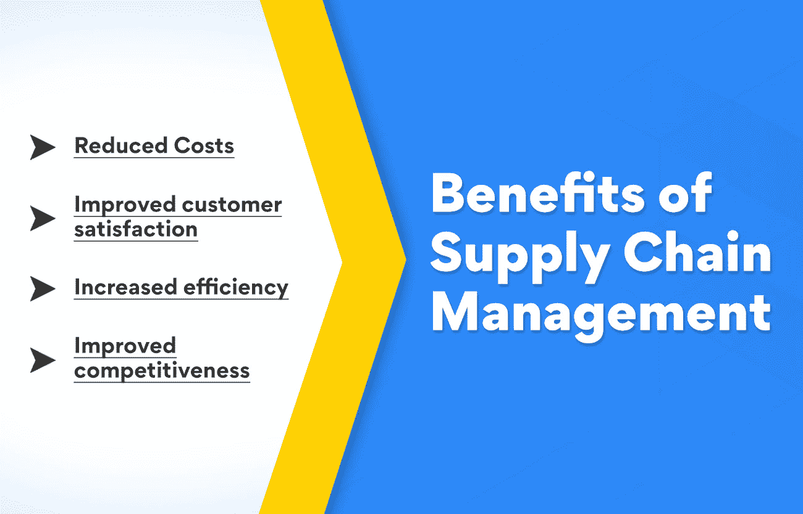

# 物流和供应链管理有什么区别？

> 原文：<https://www.edureka.co/blog/difference-between-logistics-and-supply-chain-management/>

术语“物流”和“供应链管理”之间有很大的混淆很多人互换使用它们，但它们实际上是完全不同的概念。对于那些计划在商界申请供应链职业的人来说，了解物流和供应链管理之间的区别是至关重要的。在这篇博文中，我们将探讨这两个术语之间的区别，以及它们对彼此的重要性。

## **供应链管理和物流是一样的吗？**

即使是相关的概念，两者也有显著的区别。

物流是供应链管理的一部分，涉及货物的运输、储存和交付。换句话说，物流负责在正确的时间把正确的产品送到正确的客户手中。

供应链管理是一个更宽泛的术语，它涵盖了商品和服务从制造到消费的运输过程中的所有任务。从商品的采购到制造和分销，它包含了一切。

了解物流和供应链管理的主要区别对于确保您的企业平稳高效地运营至关重要。了解了这一点，你就可以为每个领域制定具体的策略，并确保你的整个运作像一台运转良好的机器。

## **什么是供应链管理？示例概述**

供应链管理(SCM)被定义为计划、执行和控制将货物和服务从供应商带到客户手中的过程。

供应链管理包括管理物料、信息和资金在供应链各点之间的流动。 [SCM 的目标是](https://www.edureka.co/blog/objectives-of-supply-chain-management-explained/)确保货物和服务准时送达正确的地点，同时将成本降至最低。

供应链可能看起来简单，也可能复杂，这取决于供应商的数量和将产品交付给客户的步骤。例如，一个品牌直接制造和销售产品给客户，有一个简单的供应链。

另一方面，一家公司从供应商那里采购材料，将其转化为成品，然后将这些产品销售给客户，这样的公司拥有更复杂的供应链。

公司可以使用不同的供应链管理战略来改善他们的运营。一些常见的供应链管理战略包括准时制(JIT)制造、精益制造和敏捷制造。

除了这些策略，还有大量的软件应用可以用来更有效地管理供应链。这些应用包括企业资源规划(ERP)系统、供应链管理软件(SCM)和运输管理系统(TMS)。

**也可理解为:[供应链管理中的主要决策领域](https://www.edureka.co/blog/major-decision-areas-in-supply-chain-management/)**

**供应链管理的好处**

实施有效的供应链管理战略有很多好处。一些最重要的优势包括:

**降低成本:** 供应链管理的一个重要好处是，它可以帮助降低经营企业的总体成本。这是因为供应链管理有助于简化操作和提高效率。

**提高顾客满意度:** 供应链管理的另一个至关重要的好处是它可以导致顾客满意度的提高。供应链管理的流程旨在确保产品按时交付到正确的地点。

**提高效率:** 效率是任何企业成功的关键，无论其商业模式如何。供应链管理可以通过自动化整个流程、消除浪费和减少完成任务所需的时间来略微提高效率。

**提高竞争力:** 说到竞争力，每个企业都努力保持领先。高效的供应链管理增强了公司的竞争力，提高了产品质量，促进了销售和及时交货。

如你所见，实施有效的供应链管理战略可以带来许多好处。如果你想了解更多关于供应链管理的知识，以及如何成为一名聪明的供应链经理，请参加我们的[运营、供应链和项目管理](https://www.edureka.co/highered/advanced-program-in-operations-supply-chain-project-management-iitg)高级证书课程。

## **什么是物流？示例概述**

从计划、执行和控制货物的储存和运输开始，就被认为是物流。物流的主要目标是确保货物在正确的时间交付给客户。

有三种不同类型的物流:

**入站物流:** 入站物流就是接收和存储货物。这一切都是为了管理来料的流动。有了入站物流，供应链经理可以控制货物进入组织的运动。

**出境物流:** 出境物流涉及将货物运送给客户。这一切都是为了管理外发材料的流动。它使供应链经理能够控制组织外的货物流动。

**逆向物流:** 逆向物流是将商品退回给供应商。这一切都是为了管理外发材料的流动。有了逆向物流，供应链经理就可以控制商品回流到组织中。

为了有效地管理物流，供应链经理需要很好地理解不同类型的物流及其运作方式。事实上，物流是一个复杂的过程，但只要有一点点知识，就可以有效地管理它，以达到最佳效果。

**物流的好处**

物流有很多好处。这些是最重要的好处:

**更好的运营流程:** 物流有助于确保运营流程的顺畅和高效。它优化了资源的利用，最大限度地减少了浪费。

**改善客户服务:** 物流通过确保在正确的时间将正确的货物运送到正确的地点来改善客户服务。

**发货管理:** 物流有助于有效管理发货。它有助于跟踪货物，并确保它们按时交付。

**可扩展性:** 物流有效地扩展了业务。它有助于管理增长，并确保公司能够满足客户的需求。通过物流管理，供应经理可以计算扩张成本，并有效地管理业务的发展。

**仓库管理:** 有效地监控和储存货物是物流的好处之一。它有助于降低库存成本，并确保货物储存在安全可靠的环境中。

## **物流和供应链管理的区别**

虽然它们是相关的概念，但它们之间有许多不同之处，了解它们之间错综复杂的差异是至关重要的。简单来说，物流是供应链管理的一部分。供应链管理是指协调和管理公司内部的所有活动，以便从开发的初始阶段向客户提供产品或服务。物流是将产品从供应商处运送到客户处的管理。

虽然物流只是供应链管理的一个方面，但却是非常重要的一个方面。毕竟，如果一家公司不能把产品送到顾客手中，那么整个供应链就会崩溃。这就是为什么物流对任何成功的供应链管理战略都至关重要。

**也可阅读:[了解供应链管理的基本要素](https://www.edureka.co/blog/components-of-supply-chain-management/)**

**物流和供应链管理的主要区别:**

*   物流是供应链管理的一部分，主要关注运输和储存。
*   供应链管理是对公司内部所有活动的管理和协调，这些活动是从产品或服务开发的初始阶段一直到客户手中所必需的。
*   供应链管理优先考虑创造战略来简化商品和服务的流动，而物流则通过实现这些战略来提高客户满意度。
*   没有高效的物流，就没有良好的供应链管理，但反之则不然。
*   供应链管理实践始于 20 世纪 80 年代，而“物流”一词自军事时代就已存在。

对于任何想要成功的企业来说，物流和供应链管理都是必不可少的。没有这两个环节中的任何一个，供应链都可能崩溃。因此，如果你想优化公司的供应链，考虑物流和供应链管理。

## **物流和供应链管理的相似之处**

物流和供应链管理有许多相似之处，因为它们都处理资源的协调以实现特定的目标。例如，物流和供应链管理涉及规划和执行运输路线，协调原材料和成品等资源，以及管理信息流。

另一个相似之处是两者都致力于实现公司的相同目标，即确保客户满意。物流和供应链管理有一个共同的目标，那就是确保产品顺利交付给客户。

将商品与竞争对手区分开来也是两家公司的共同点之一。一个公司要想成功，它的利益必须比竞争对手的利益质量更好，更快，和/或更便宜。这就是为什么物流和供应链管理都致力于寻找缩短运输时间、降低库存水平和寻找具有成本效益的供应商的方法。

## **物流在供应链管理中的作用是什么？**

物流是计划、实施和控制高效、充分的货物、服务和相关信息流动以满足客户需求的过程。

供应链管理(SCM)是一种跨职能的方法，用于管理原材料进入组织以及成品从组织流向最终客户的过程。

简而言之，物流是供应链管理中的一个过程，但有所不同。物流指的是货物的运输、仓储和协调，而供应链管理包括这些活动，还有更多。物流负责货物“如何”移动、储存和交付。SCM 负责从开始到结束的整个过程。只有高效的物流才能保证良好的供应链管理。

拥有高效的物流系统有许多好处，其中包括:

*   提高客户满意度
*   降低库存水平
*   降低运输和仓储成本
*   缩短交付周期
*   提高生产灵活性

## **为什么物流对于供应链管理是必要的？**

简单来说，物流管理 A 点和 b 点之间的货物和资源流动。另一方面，供应链是将产品从制造阶段运送到消费阶段所需的设施和流程网络。

物流处理的是货物的运输和储存，而供应链管理包含了更广泛的活动，包括原材料采购、制造和配送。供应链管理涉及到产品或服务的整个过程，从构思到到达客户手中。

高效的物流运作对供应链管理至关重要，因为它确保货物和资源在供应链的不同点之间快速高效地移动。另一方面，管理良好的供应链可以帮助企业提高整体效率和竞争力。

虽然物流和供应链管理之间有着明显的区别，但必须注意到它们是相互依赖的。没有高效的物流，成功的供应链管理运作是不可能的，反之亦然。因此，为了取得成功，企业需要确保他们既有管理良好的物流运作，又有健全的供应链管理战略。

## **底线**

物流和供应链管理的主要区别在于，物流侧重于货物的移动，而供应链管理涵盖从采购到交付的整个过程。物流是供应链管理的一部分。

虽然两者对企业都很重要，但它们的运营方式不同。物流经理通常处理运输、仓储和客户服务，而供应链经理监督整个流程，并制定策略来简化运营和降低成本。

高效的物流系统对企业来说至关重要，因为它能确保货物在良好状态下按时交付。另一方面，运行良好的供应链可以成为一种竞争优势，使公司能够改变客户需求，以更低的成本更快地交付货物。

无论您是想了解物流和供应链管理之间的区别，还是想探索管理项目的不同方面，我们的[运营、供应链](https://www.edureka.co/blog/operations-management/)和项目管理高级证书将帮助您深入了解细节，并从主题中获得最大收益。请查看我们的证书课程以了解更多信息。

## **更多信息:**

绿色供应链管理:它是什么，为什么重要？

[什么是数字化供应链/供应链 4.0？](https://www.edureka.co/blog/what-is-digital-supply-chain/)

[什么是绿色供应链？概述](https://www.edureka.co/blog/green-supply-chain)