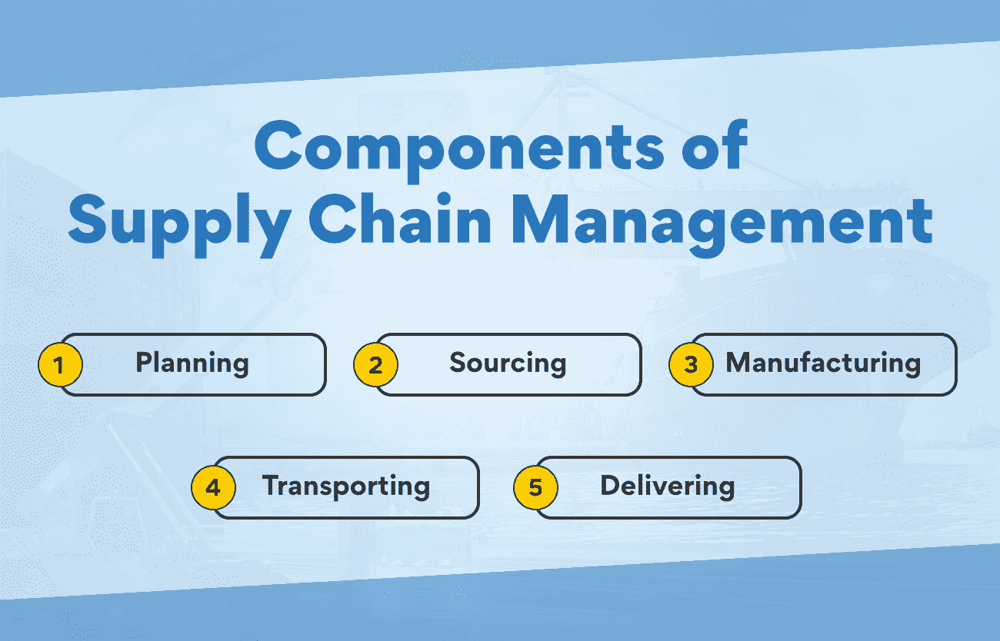

# 了解供应链管理的基本组成部分

> 原文：<https://www.edureka.co/blog/components-of-supply-chain-management/>

为了理解和优化供应链管理，了解这一流程的基本组成部分至关重要。供应链管理的组成部分可以根据业务类型和提供的产品或服务而有所不同，但一些基本功能对所有公司来说都是必要的。在这篇博文中，你将了解供应链管理的关键要素，以及这些要素如何帮助你取得成功！

## **供应链管理在商业中的意义是什么？**

供应链管理(SCM)管理从获得到交付的整个供应链中的货物和材料的移动。换句话说，这一切都是为了确保你的公司为正确的受众提供正确的产品。

对于依赖货物和材料的移动来保持运营顺畅的企业来说，供应链管理是一项至关重要的职能。一个管理良好的供应链可能意味着一个盈利的企业和一个挣扎着生存的企业之间的区别。

[供应链管理](https://www.edureka.co/blog/objectives-of-supply-chain-management-explained/)的组成部分确保您的公司拥有一个协调高效的系统来采购、制造和向客户交付产品。通过了解供应链管理的关键组成部分，你可以制定一个供应链管理战略，推动你的企业在竞争中领先。

任何成功的供应链管理战略的第一步都是了解客户的需求。他们在产品中寻找什么？他们什么时候需要它？通过了解客户的需求，你可以开发出满足这些动态需求的供应链。

下一步是发展一个供应商网络，为你的产品提供必要的材料和组件。选择供应商时，你需要考虑成本、质量和交货时间等因素。一旦你选择了一些潜在的供应商，与他们建立关系并建立融洽的关系是很重要的。

一旦你有了一个供应商网络，你就需要开发一个生产产品的系统。该系统的设计应满足客户的需求，同时最大限度地提高效率和降低成本。

你必须开发一个向客户交付产品的系统。它非常适合将您的产品以完美的状态准时送达客户手中。有了供应链管理的组成部分，你可以加强你的业务战略。

供应链管理的组成部分对于制定成功的商业战略至关重要。通过了解客户需求，与供应商建立关系，并建立高效的制造和交付系统，您可以创建满足您业务需求的供应链

与身边的专家一起学习供应链管理的这些组成部分。我们策划了一个[运营、供应链和项目管理](https://www.edureka.co/highered/advanced-program-in-operations-supply-chain-project-management-iitg)高级证书，在那里你可以详细了解与供应链管理相关的一切。

## **供应链管理的角色**

供应链管理的作用是确保供应链的所有组成部分高效、有效地协同工作。供应链的组成部分包括供应商、制造商、分销商、零售商和客户。每个要素都有自己独特的要求和需求，必须满足这些要求和需求，供应链才能正常运行。

供应链管理负责协调和管理供应链平稳运行所需的所有活动。这包括从采购到将成品交付给最终客户的一切。

供应链管理的一个重要部分是确保所提供的产品和服务满足客户的需求。这需要很好地理解客户需求和预测未来需求的能力。

为了取得成功，供应链管理必须不断努力提高供应链的效率。这包括确定和实施流程改进、开发新技术以及寻找更好地利用现有资源的方法。供应链管理是当今商业世界的一项重要职能，那些能够有效管理供应链的人将处于成功的有利位置。

**也读:[运营管理入门](https://www.edureka.co/blog/operations-management/)**

## **供应链管理的组成部分**

如前所述，供应链管理的组成部分负责协调和控制将产品从原始状态带到最终客户所需的所有资源、信息和活动。供应链管理的重要组成部分是 1)计划、2)采购、3)制造、4)运输和 5)交付

那么，供应链管理的这些组成部分包括什么呢？让我们仔细看看:

### **策划**

供应链管理中的计划流程负责从头到尾规划整个生产流程。这包括决定将使用哪些原材料，将采用哪些制造流程，将使用哪些运输方法将成品[产品](https://www.edureka.co/blog/product)推向市场，等等。通过有效的规划，企业可以避免供应链进一步中断。

计划在供应链管理中的作用是什么？

计划对于供应链管理来说是必不可少的，因为它让管理者能够预见问题，并在问题造成破坏之前找到解决方案。通过了解供应链的不同组成部分，管理者可以制定计划来优化效率和降低成本。

供应链管理的主要目标是在最大化效率的同时创建一个响应客户需求的系统。要做到这一点，管理者必须了解供应链的不同组成部分以及它们之间的相互作用。

没有一个好的计划，控制整个供应链并不容易。因此，规划在每个小型或大型企业中都扮演着重要的角色。

### **采购**

采购就是从供应商那里获取商品或服务。为了有效地采购，组织必须首先识别和评估潜在的供应商。一旦确定了潜在的供应商，组织就可以选择最能满足其需求的供应商。

选择供应商是供应链管理中的重要决策之一。组织在选择供应商时必须仔细考虑几个因素，如质量、成本、交付和能力。

**采购在供应链管理中的作用**

采购需要寻找和获得商品和服务来满足公司的需求。在供应链管理中，采购是指从供应商处采购商品和服务所必需的活动和技术。

采购流程从确定潜在供应商开始，然后根据质量、价格和交付时间等标准选择供应商。一旦供应商被选定，公司将与供应商签订合同。合同将提及协议的所有条款和条件，如价格、交货日期以及所提供的货物或服务的数量。

采购流程是供应链管理的重要组成部分，因为它会对商品和服务的成本、质量和交付产生重大影响。采购也是一个复杂的过程，因为它涉及到协调公司内部多个职能部门之间以及与供应商之间的活动。

有几种不同的采购模式，大致可分为两类:自制或外购和外包。

自制或外购采购是指在内部生产商品或服务，还是从外部供应商处购买。自制或购买决策通常基于几个因素，如公司的核心竞争力、资源的可用性和生产成本。

外包是从外部供应商处购买商品或服务的决定。外包可以用来提高公司运营的效率，降低成本。外包时，公司必须仔细考虑供应商的质量、交货和价格。此外，企业还必须考虑外包对自身劳动力的影响。

### **制造**

制造业包括将原材料转化为成品。这是供应链管理最重要的方面之一，因为它会对成本、质量和交付时间产生重大影响。

有几种不同的制造工艺，每一种都有其优缺点。最常见的制造工艺有:

组装: 这是最简单的制造过程，常用于由少量零件制成的产品。组装通常是高度自动化的过程，并且可以非常快速和高效。

**制造:** 这种工艺用于由原材料制成的产品，这些产品在组装之前需要切割、成型或其他处理。制造时间可能会很长，成本也会很高，但对于需要复杂零件或高精度的产品来说，这是必要的。

**机械加工:** 该工艺用于制造过于复杂而无法通过装配或制造来制造的零件。加工是一个精确的过程，但它可能非常缓慢和昂贵。

### **运输**

运输是供应链管理的重要组成部分，因为它涉及到将货物从一个地方运送到另一个地方。有许多不同类型的交通工具，包括空运、陆运和水运。每种交通方式都有其优点和缺点，因此针对不同情况选择合适的交通方式至关重要。

为了确保货物的高效运输，供应链经理必须仔细计划和协调运输时间表。他们还必须考虑可用的不同运输方式，以及货物可以走的不同路线。

运输的另一个重要方面是追踪。供应链经理必须跟踪货物从一个地方到另一个地方的移动。这使他们可以随时看到货物的位置，并确保货物按照计划运输。

**运输在供应链管理中的作用**

运输负责将货物从供应商处运送到客户处。一个有效的运输系统对于企业保持高效运营和在市场上竞争是至关重要的。

设计运输系统时，必须考虑各种因素，包括运输的货物类型、服务的地理区域和运输的频率。运输系统可能很复杂，有许多不同的运输方式可供选择。最常见的运输方式包括卡车、火车、轮船和飞机。

每种模式都有自己的优势和劣势，因此根据您的需求选择正确的模式非常重要。例如，对于短途运输，卡车运输通常是最经济的选择，而对于长途运输，铁路可能更具成本效益。空运通常是最贵的，但也是最快的选择。

### **交付**

交付组件是指将成品从制造地运输到客户处。它还包括与不同的人，如客户、零售商和供应商的协调和沟通。该组件的目标是确保产品按时交付且无任何损坏。

**也可阅读:[绿色供应链管理:它是什么，为什么重要？](https://www.edureka.co/blog/green-supply-chain-management)**

**交付在供应链管理中的作用**

它确保货物准时完好地到达顾客手中。这需要供应链不同部分之间的协调，包括供应商、制造商、物流供应商和客户。交付还涉及管理风险，如货物延误或损坏的风险。

有效的供应链管理系统应该能够跟踪和监控交货进度，并在出现任何延迟或问题时发出警报。它还应该具备快速有效地解决问题的机制。

交付是供应链管理的重要组成部分，为了确保客户满意，做好交付至关重要。通过了解交付在供应链管理中的作用，企业可以确保他们的货物和材料按时完好地交付。

## **底线**

供应链管理的支柱是有效的沟通、计划和执行。供应链管理的各个组成部分协同工作，以确保流程平稳高效地运行。

那些想在供应链管理领域开始职业生涯的人很幸运，因为他们可以通过我们的证书课程详细了解这些基本要素。我们的运营、供应链和项目管理高级证书是专门为有抱负的供应链经理、运营经理和项目经理设计的。看一看，了解更多。

## **更多信息:**

[物流和供应链管理有什么区别？](https://www.edureka.co/blog/difference-between-logistics-and-supply-chain-management/)

[什么是数字化供应链/供应链 4.0？](https://www.edureka.co/blog/what-is-digital-supply-chain/)

[什么是绿色供应链？概述](https://www.edureka.co/blog/green-supply-chain)

[供应链管理的主要决策领域](https://www.edureka.co/blog/major-decision-areas-in-supply-chain-management/)