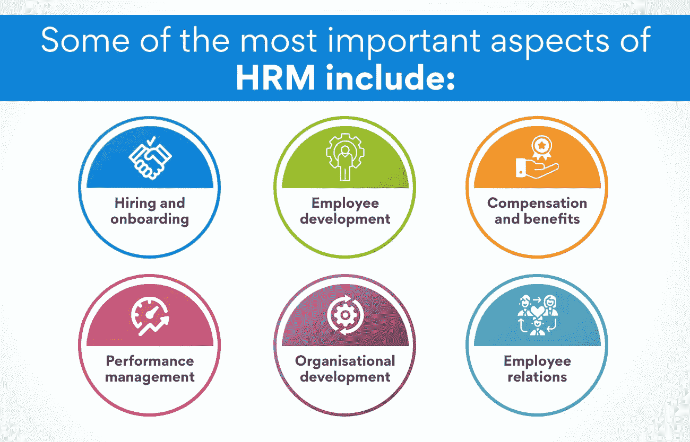
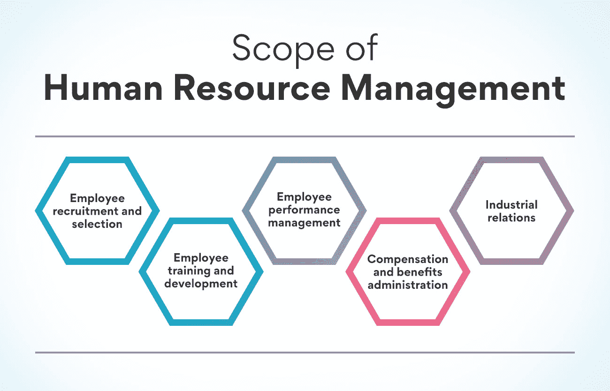

# 分解人力资源管理的范围

> 原文：<https://www.edureka.co/blog/scope-of-human-resource-management/>

人力资源管理是一个广阔而复杂的领域，包含了工作场所的许多不同方面。从筛选和招聘到培训和发展，人力资源专业人员负责确保员工在工作中高效和满意。通过这篇博文，我们将进一步了解人力资源管理的范围，并讨论属于其范围内的一些关键职能。

## **什么是人力资源管理？它如何提升企业地位？**

[人力资源管理](https://www.edureka.co/blog/role-of-human-resource-management-in-an-organization/)是一个术语，用来描述组织内部旨在管理人员的正式系统。它负责确保组织的人员配备，以及员工发展和培训、绩效管理、薪酬和福利管理、组织发展和员工关系。

没有一支高效的员工队伍，任何公司或组织都不可能成功，无论他们的产品或服务有多好。人力资源管理的责任是确保公司拥有合适的人才和技能组合来实现其业务目标。此外，人力资源管理还必须提供支持和资源，使员工能够高效地履行职责。

了解人力资源管理设定了一个组织如何对待其员工的路线是很重要的。一个拥有强大人力资源管理实践的公司通常会有较低的离职率、较高的员工满意度和较高的生产力水平。

人力资源管理(HRM)有许多方面，但其中一些最重要的方面包括:

*   招聘和入职
*   员工发展
*   薪酬和福利
*   绩效管理
*   组织发展
*   员工关系

这些领域中的每一个都很重要，但是如果得到有效管理，它们会对公司的整体文化和业绩产生积极的影响。

## **概述:人力资源管理的范围**

[HRM 的范围是不断演变的](https://www.edureka.co/blog/evolution-of-human-resource-management)。随着组织变得越来越复杂，人力资源的角色也必须随之改变。最基本的形式是，人力资源管理负责管理一个组织的劳动力。这包括招聘、雇用和新员工入职。人力资源管理还监督员工关系，福利和工资。

近年来， [HRM 的范围已经扩展到包括战略规划](https://www.edureka.co/blog/strategic-human-resource-management)、人才管理和员工发展。人力资源现在必须与其他部门合作，以确保实现组织的目标。这需要对业务有深刻的理解，并有能力做出数据驱动的决策。

随着组织变得更加复杂，员工队伍变得更加全球化，人力资源管理的范围将继续发展。人力资源必须适应能力强，随时准备满足不断变化的业务需求。

**也读:[什么是战略人力资源管理？](https://www.edureka.co/blog/strategic-human-resource-management)定义和例子**

## **人力资源管理范围:详细说明**

组织可以选择采用许多不同范围的人力资源管理活动。人力资源管理活动的范围将由组织文化、组织规模和组织的具体需求决定。人力资源管理活动的范围可大致分为五类:

*   员工招聘和选拔
*   员工培训和发展
*   员工绩效管理
*   薪酬福利管理局
*   劳资关系

我们来详细讨论一下范围。

### **员工招聘和选拔**

员工招聘和选择中人力资源管理活动的范围包括为一个组织识别、吸引、筛选和选择员工的所有活动。员工招聘和选拔中人力资源管理活动的范围还包括制定和实施政策。

招聘和选拔是界定人力资源管理范围的最关键的过程。因此，这一领域的人力资源管理活动必须透明，以便本组织能够为空缺职位找到最合适的候选人。如果在员工招聘和选拔中没有适当的人力资源管理活动范围，组织最终可能会招聘到不适合该组织的员工。

**员工招聘和选拔的好处:**

**确定合适的候选人**

没有人力资源管理活动在员工招聘和选拔中的作用，组织最终可能会雇佣不适合自己的员工。

**评估候选人的技能&能力**

员工招聘和选拔中人力资源管理活动的范围有助于评估候选人的技能、知识和能力。这有助于组织为空缺职位确定最合适的候选人。

### **员工培训和发展**

组织在员工培训和发展项目上投入了大量资源。人力资源管理的范围包括设计、交付和评估这些项目。

管理培训是一个很受欢迎的员工发展项目。管理培训生学习经营一个商业单位或组织的基本知识。他们还学习如何激励和领导员工。

组织也提供培训项目来帮助员工提高他们的工作表现。这些项目可能是针对特定工作的，也可能是一般的技能培训。例如，一个组织可能会提供一个客户服务培训项目来帮助员工提高他们的沟通和解决问题的技能。

最后，一些组织提供员工发展计划，帮助员工为未来在组织中的角色做准备。例如，一个组织可能会为高潜力员工提供管理发展计划。这个项目帮助参与者发展他们在管理岗位上取得成功所需的技能和知识。

人力资源管理范围还包括评估员工发展计划的有效性。组织使用各种方法来评估这些项目的有效性，包括调查、访谈和焦点小组。

**员工培训和发展的好处:**

**提高工作绩效**

员工培训和发展计划对组织来说有很多好处。这些计划可以通过向员工传授他们在工作中取得成功所需的技能来帮助提高工作绩效。

提供员工发展计划的组织也倾向于看到员工工作表现的改善。这是因为参与这些计划的员工有机会学习新的技能和知识，并将其应用到工作中。

**增加员工保留率**

员工培训和发展计划也有助于留住员工。参与这些计划的员工通常会对他们的组织产生更强的责任感。他们也倾向于更好地理解组织的目标和目的。

员工发展计划通常能提高员工的忠诚度。参与的员工对公司和雇主都很忠诚。

### **员工绩效管理**

人力资源管理的范围在不断发展。随着员工队伍的不断变化和多样化，用于管理员工的[战略和实践](https://www.edureka.co/blog/ultimate-guide-to-developing-an-effective-hr-strategy/)也必须随之发展。近年来发生重大变化的一个领域是员工绩效管理。

随着新技术的出现，现在有更多的工具和资源可以帮助管理者有效地评估和提高员工绩效。然而，在这方面还有很大的改进余地。

人力资源专业人员面临的挑战之一是如何跟上员工绩效管理的最新趋势和最佳实践。另一个挑战是如何有效地向员工传达人力资源管理的范围和[目标。](https://www.edureka.co/blog/objectives-of-human-resource-management/)

尽管面临这些挑战，员工绩效管理对人力资源管理至关重要。通过定期更新趋势，人力资源专业人员可以确保他们的组织使用最有效的方法来管理员工绩效。

**员工绩效管理的好处**

**确定并解决员工发展需求**

绩效管理为识别和解决员工发展需求提供了一个结构化的流程。通过定期评估员工，经理可以确定员工需要改进的地方。

这些信息用于制定满足这些需求的发展计划。因此，员工更有可能发挥自己的潜力，为组织做出积极贡献。

此外，绩效管理有助于发现有潜力的员工，他们可能是晋升或其他机会的候选人。

**促进经理和员工之间的沟通**

绩效管理为经理和员工之间的定期交流提供了一个平台。这种沟通有助于确保员工了解期望，并允许他们对自己的表现提出反馈。

此外，定期沟通有助于在经理和员工之间建立信任和融洽的关系。这种信任和融洽对于有效的工作关系至关重要。最后，关于绩效的沟通有助于在问题变得严重之前尽早发现问题。

**提高整体组织绩效**

通过提高员工个人的绩效，绩效管理有助于提高整个组织的绩效。当员工表现最佳时，他们会更有生产力和参与度。

这种生产力和参与度的提高可以提高组织在盈利能力、客户满意度和员工保留率方面的绩效。

### **薪酬福利管理局**

这是设计和维护员工薪酬和福利计划的过程。它包括制定资格标准、对员工进行分类和管理工资扣减。人力资源专业人员与会计人员一起工作，以确保员工得到正确和及时的支付。他们还与福利提供商合作，建立和管理员工福利计划，如健康保险和退休计划。

彻底理解管理员工薪酬和福利的州法律变得至关重要。这些法律是不断变化的，所以人力资源专业人员必须跟上最新的发展。他们必须将这些变化有效地传达给员工和经理。

除了[薪酬福利管理](https://www.edureka.co/blog/compensation-in-hrm)，人力资源专业人员也负责员工关系。这包括调查和解决工作场所问题，如骚扰和歧视投诉。人力资源专业人员创造积极的工作环境，培养员工和经理之间的良好关系。

**补偿保险金及保险金管理保险金:**

**鼓舞员工士气**

薪酬和福利管理对员工士气有积极的影响。当员工得到公平的补偿和良好的福利时，他们更有可能对自己的工作感到满意。这可以提高生产率，减少人员流动。

薪酬和福利管理也有助于吸引和留住顶尖人才。通过提供有竞争力的工资和福利，雇主可以吸引最优秀的候选人申请公开职位。一旦被聘用，这些员工更有可能长期留在公司。

**降低成本**

薪酬和福利管理有助于降低雇主的成本。人力资源专业人员可以通过正确管理工资扣除额来确保员工的工资不会过高或过低。这有助于防止错误并为公司节省资金。

此外，通过提供健康保险和退休计划等福利，雇主可以节省税收。这些福利对企业来说是免税的，可以节省大量开支。

### **劳资关系**

劳资关系是人力资源管理的一个领域，涉及企业和组织中员工的管理。劳资关系的范围包括雇员关系、劳动关系和集体谈判等方面。

人力资源管理是一个不断发展壮大的领域。随着企业变得更加全球化，人力资源管理的范围也变得更加复杂。人力资源管理的范围现在包括管理不同国家和文化的员工。随着企业变得更加全球化，劳资关系是一个越来越重要的领域。

**也读作:[人力资源管理的性质和目标](https://www.edureka.co/blog/nature-and-objectives-of-human-resource-management/)**

**劳资关系的好处**

**增进沟通和理解**

有效的沟通对任何组织都至关重要，但在工会化的工作场所更是如此。劳资关系有助于增进员工和管理层之间的沟通和理解。

**解决冲突**

在任何组织中，冲突都是不可避免的，但它尤其具有破坏性。劳资关系有助于在冲突失控并破坏工作文化之前解决冲突。

劳资关系是人力资源管理的重要组成部分。随着企业变得更加全球化，劳资关系的范围也在扩大和变化。劳资关系有助于改善员工和管理层之间的沟通和理解，也有助于解决冲突。

## **底线**

人力资源管理的范围还包括管理远程工作的员工。随着技术的发展，越来越多的员工远程工作，这对人力资源经理提出了新的挑战。

随着人力资源管理的范围不断扩大和发展，人力资源经理需要了解该领域的最新趋势和发展。通过跟上最新的发展，人力资源经理可以确保他们为员工提供最好的服务。

打算踏入 HR 领域？从 PG 课程开始，它将让你接触到关于不断发展的人力资源领域的所有必要信息。看看我们的[人力资源管理研究生证书](https://www.edureka.co/highered/human-resourse-management-course-iim-shillong)。

## **更多信息:**

[人力资源管理的关键基础](https://www.edureka.co/blog/fundamentals-of-human-resource-management/)

[什么是人力资源管理系统？](https://www.edureka.co/blog/human-resource-management-system/)

[人事管理与人力资源管理的区别](https://www.edureka.co/blog/difference-between-personnel-management-and-human-resource-management/)

[什么是人力资源业务伙伴:终极指南](https://www.edureka.co/blog/hr-business-partner)