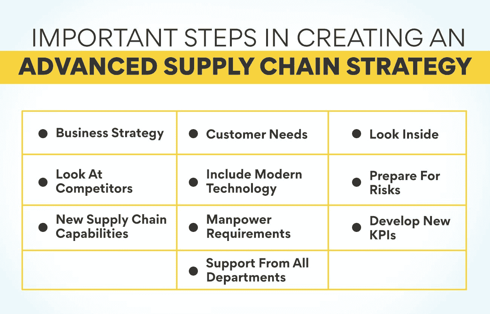

# 如何制定先进的供应链战略？

> 原文：<https://www.edureka.co/blog/how-to-formulate-advanced-supply-chain-strategy/>

听到公司讨论降低成本和提高利润的供应链战略是很常见的。这个术语对于非该领域的人来说可能是新的。但这是每个公司都希望实现的事情。拥有正确的商品采购和供应策略可以极大地提高公司利润和客户满意度。但在我们了解它的含义之前，理解供应链管理是至关重要的。对于一个公司来说，达到目标是至关重要的。

## **了解供应链管理**

**满足市场需求的供应链管理**

它是对企业中货物、信息和货币流动的管理。[供应链管理](https://www.edureka.co/blog/components-of-supply-chain-management/)从计划需求开始。一个公司必须首先知道在特定时期需要多少数量的成品。从市场到生产团队的信息必须不断流动。基于这些信息，公司将计划商品或服务的生产。战略供应链管理流程确保公司能够满足市场需求。股票的短缺或过剩会影响组织的财务和声誉。

**原材料采购**

供应链管理并不局限于销售方面。原材料的计划和采购也属于这一类。供应链员工还确定原材料来源，并安排适当的运输工具将它们运送到公司。原材料的及时供应对满足市场需求至关重要。该公司还必须以提高其盈利能力的价格购买这些产品。同样，实时信息对于防止原材料短缺或不可用非常重要。一个好的供应链战略可以确保流程中没有任何差错。

**仓库管理**

供应链的另一个重要组成部分是存储。原材料和成品都需要妥善储存。公司必须找到足够的空间来存放货物，以便于取出。所有这些项目都要公司花钱。因此，它必须确保在任何时间点仅存储所需的数量。仓库还必须易于运输。需要一个适当的供应链策略来防止浪费和损失。

**物流**

[物流是供应链的另一个重要组成部分](https://www.edureka.co/blog/difference-between-logistics-and-supply-chain-management/)。公司必须能够从源头准时带来原材料。组织还必须经济地做到这一点，以降低产品成本，提高盈利能力。安排成品的运输甚至更为关键。在激烈的竞争中，产品必须完好无损地按时到达客户手中。货物到达顾客手中的任何延误都会给公司带来坏名声。寻找理想的运输设施是每个公司供应链战略的一部分。

**信息流**

供应链中最后也是最重要的元素是信息。信息的正常双向流动对公司的正常运转至关重要。公司必须掌握市场需求的最新信息来计划生产。这些数据必须提前准备好，以计划原材料的采购和生产。关于原材料的可获得性或稀缺性的信息也至关重要。这将有助于计划这些项目的采购。使用最新的数据收集和传输技术是供应链战略的重要组成部分。

现在我们已经了解了供应链及其对公司业绩的重要性，是时候看看什么是供应链战略，以及它如何帮助有效地管理这一过程了。未来的供应链专业人士将从加入我们的[Ops、SCM 和 PM](https://www.edureka.co/highered/advanced-program-in-operations-supply-chain-project-management-iitg) 高级证书中受益匪浅。访问 Edureka 网站会给你更多关于这门课程的信息。

## 什么是供应链战略？

供应链战略详细说明了一家公司将如何带来原材料，并将成品发送给客户。该战略旨在降低成本，提高供应链各环节的利润。在制定计划时，组织必须考虑供应链的所有组成部分。在一个高度不稳定的市场中，拥有一个好的战略有助于企业有效地管理所有的供应链实体。这项工作的另一个重要目标是客户满意度。每个公司都必须根据外部和内部因素制定自己的战略。

大公司和小公司都需要战略供应链管理，因为它有助于满足客户需求。当公司能够让顾客满意时，它就自动在市场上建立了良好的声誉。这将带来更多的业务和更多的利润。公司需要这种策略的另一个原因是，它可以大大减少不确定性，从而防止损失。拥有实时信息是战略的一部分，这有助于公司规划其生产，以迎合不断变化的市场需求。这些信息也有助于根据客户偏好改变产品特性。

## **创建先进供应链战略的重要步骤**

在制定供应链战略时，公司必须牢记各种因素。公司可以通过观察这些因素以及它们与公司整体业绩的关系来制定最佳战略。

**经营战略**

商业战略可以被定义为利用公司的核心竞争力来实现其目标的方法。供应链战略必须与此保持一致。它应该为有助于实现公司目标的活动提供支持。对一些公司来说，目标是给市场一个低成本的产品。在这种情况下，供应链的所有活动都必须着眼于降低成本。供应链中有各种实体有可能降低成本。

**客户需求**

一个好的供应链战略会最大限度地重视客户需求。除非一家公司提供客户想要的东西，否则它就无法销售自己的产品。组织必须了解其客户在质量、价格、包装和交付方面的需求。制定战略时，必须考虑所有这些因素。不同的客户群可能需要不同的物流方式。影响客户满意度的另一个重要方面是可用性。一个公司必须规划一个迎合所有顾客的经销商网络。

**看里面**

虽然了解客户需求很重要，但分析公司的内部能力同样重要。在开始制定供应链战略之前，组织必须着眼于当前和未来的需求与实际可用性之间的差距。这可能是在产品可用性、库存管理、[产品开发](https://www.edureka.co/blog/dynamic-stages-of-the-new-age-product-development-process/)、需求、供应差异等方面。该战略必须包括偏差，并有一个明确的计划来弥补差距。在分析时，必须考虑当前和未来可能影响公司业绩的全球化挑战。

**看竞争对手**

在规划供应链管理时，了解竞争对手在做什么是非常重要的。观察他们的经营方式会让你对如何赢得客户有宝贵的见解。对于商业和供应链都是如此。了解竞争对手如何降低运输成本可以帮助你以更低的成本销售你的产品。有时做一些与竞争对手不同的事情有助于你取悦客户。你的供应链战略必须牢记你的竞争对手。

**包括现代技术**

供应链管理的新技术每天都在发展。采用现代软件解决方案有助于减少过程中的人工干预。这将降低成本，提高效率。销售预测软件程序使公司对未来的销售有一个更精确的概念。库存管理系统防止库存过多。有运输管理系统帮助找到到达目的地的最快和最经济的路线。包括 CRM 软件使公司能够以更好的方式迎合客户，并帮助保持最佳库存。

**做好风险准备**

公司可能面临各种影响其业绩和盈利能力的风险。这些风险以市场波动的形式出现。需求的突然增加或减少可能会扰乱运营。预测也有可能出错。新竞争者的进入影响了公司的销售。在供应商方面，由于短缺，原材料价格可能会上涨。它们的质量会因供应商而异。供应链战略还必须包括管理此类风险并降低其对公司业绩影响的解决方案。

**新的供应链能力**

公司未来是否也应该遵循同样的供应链战略？理想情况下，这些计划是为未来三年制定的。但这并不意味着供应链不应该有任何变化。应该成立一个独立的委员会来研究有助于减少损失和提高盈利能力的新能力。这应该包括公司所有部门的员工。他们收集的信息可用于评估当前的供应链能力。这将有助于决定应该进行哪些更改来提高性能。

**人力需求**

实施战略性供应链管理计划需要不同的组织结构。可能需要更多的人员或将一些工作人员从一个部门调到另一个部门。开发一个新的供应链并管理它当然需要额外的技能。那些实施战略的人必须着眼于公司内部可用的技能。他们还应该计划对员工进行有效管理供应链所需的新技能培训。公司必须计划额外的劳动力需求，人力资源部门必须开始招聘他们。

**开发新的关键绩效指标**

当供应链将拥有不同的能力时，绩效指标自然也必须改变。公司需要开发新的 KPI 来评估实施新供应链战略的人员。必须严格实施维持变革所需的新行为模式，以便公司在未来快速达到预期的位置。人力资源部门应该查看供应链管理常用的绩效指标，并使用它们进行评估。

**各部门的支持**

实施新的供应链战略是一项重大活动，需要公司各个部门的支持。最高管理者还必须理解实施变革的重要性并提供必要的资源。战略团队必须让高层明白公司将从这种新的供应链管理方法中获得的好处。让所有部门的人都参与进来对团队来说是有益的，这样他们就可以影响业务负责人，让他们合作实现变革。必须向所有利益相关者提供关于变更进展的定期更新。

## **供应链战略顺利实施的障碍**

1.  组织中的人不理解新战略的必要性及其好处。
2.  管理层不关注长期战略，而是更关注短期解决方案。
3.  与新供应链战略不一致的其他人的自私目标。
4.  公司没有分配必要的时间、精力或金钱来实施或维持计划。
5.  团队成员和利益相关者之间缺乏沟通。

我们在上面看到了如何实施计划以及必须采取的措施。人们可以通过加入我们的[Ops、SCM 和 PM](https://www.edureka.co/highered/advanced-program-in-operations-supply-chain-project-management-iitg) 高级证书的计划来了解详细的过程。请访问网站，了解更多关于本课程的信息。

**结论**

从上面可以明显看出，新的供应链战略在各个方面都对公司有利。它还让员工有机会学习新技能，并转向更具挑战性的工作。无论公司的目标是什么，[一个好的供应链对于实现这些目标](https://www.edureka.co/blog/objectives-of-supply-chain-management-explained/)并朝着这个方向前进是必要的。新计划的实施给了公司一个探索现代供应链能力并采用它们来提高利润的机会。