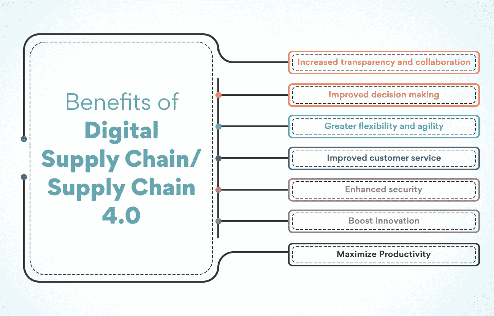
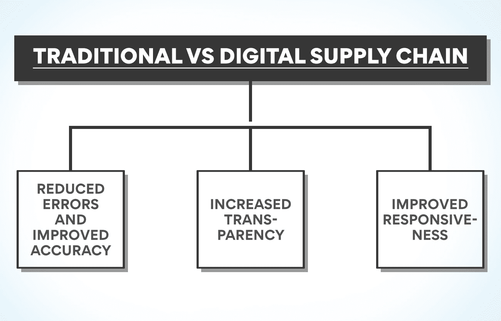
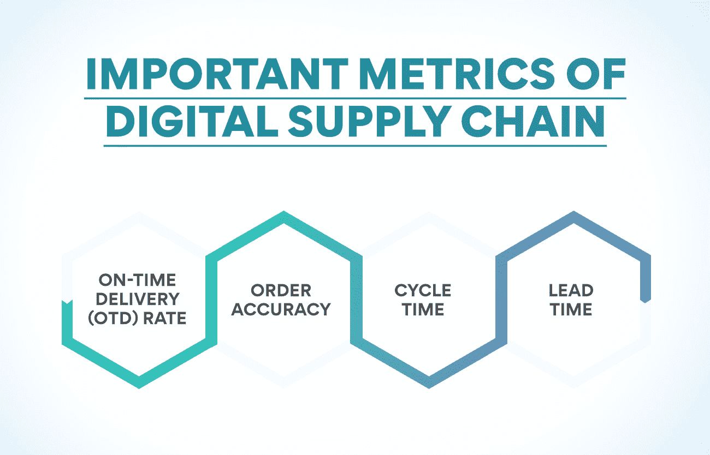

# 什么是数字供应链/供应链 4.0？

> 原文：<https://www.edureka.co/blog/what-is-digital-supply-chain/>

## **什么是数字化供应链/供应链 4.0？**

在数字时代，一切都在以更快的速度前进。我们不断被新技术和创新所淹没，这些技术和创新改变了我们的生活和工作方式。数字供应链就是这些创新之一。它正迅速成为物流的未来，不适应的企业将被甩在后面。

数字供应链(DSC)或供应链 4.0 是物流的未来。它指的是企业将如何在数字世界中管理其运营。它包括使用智能设备、物联网和人工智能来简化供应链和提高效率。什么是数字供应链，它能为你的企业做什么？请继续阅读，寻找答案！

## **数字供应链/供应链 4.0——下一代供应链**

近年来，数字供应链在商业领域变得越来越重要。它是一个由人员、流程、数据和事物组成的连接网络，能够实现信息和商品从供应商到客户的有效流动。这种新型供应链因技术进步而成为可能，包括物联网、大数据和云计算。

与传统供应链相比，数字供应链提供了许多优势，包括更高的可见性、更大的灵活性和更高的效率。然而，也存在一些挑战，例如需要新的技能和技术以及网络攻击的风险。然而，对于希望在数字时代保持竞争力的企业来说，数字供应链至关重要。

## **DSC 的重要性**

数字供应链将数字技术整合到供应链的所有领域。这包括使用数字技术来管理从供应商到客户的信息流、商品流和服务流。

DSC 代表了下一代[供应链管理](https://www.edureka.co/blog/major-decision-areas-in-supply-chain-management/)，供应链的所有方面都被数字化连接和管理。

数字技术正在改变企业运营以及与客户和供应商互动的方式。数字供应链使组织更加敏捷、高效，并对市场变化做出更快的反应。它还提供了对整个供应链端到端的可见性。

## **数字供应链/供应链 4.0 的优势**

**增加透明度和协作**

当每个人都在同一个数字平台上时，跟踪进度、发现潜在问题并实时做出改变就变得很容易。这种增加的透明度导致所有供应链成员之间更好的合作。这将帮助您避免中断，并让您的客户满意。

**改进决策制定**

借助数字工具，您可以更快、更有效地收集和分析数据。这使您能够对供应链做出更好的决策，从而提高效率和节约成本。

**更高的灵活性和敏捷性**

数字化供应链比传统供应链更加敏捷和灵活。这意味着它可以快速适应需求或市场的变化。在当今快节奏的商业环境中，这一点至关重要。借助数字化供应链，您可以迅速满足客户需求，并在竞争中保持领先地位。

**改善客户服务**

数字工具可以帮助您更好地了解客户的需求和偏好。这样，您就可以根据他们的具体需求定制产品，从而提高客户满意度和忠诚度。

**增强的安全性**

保护您的数字数据比保护实物资产更容易。借助数字供应链，您可以使用加密和访问控制等安全措施来保护您的数据。这将降低盗窃、欺诈和其他恶意活动的风险。

**推动创新**

它可以帮助你推动业务创新。通过收集数据和使用分析，您可以发现新的改进机会。你也可以使用数字工具快速廉价地测试新想法。这让你可以在不危及整个运营的情况下冒险和尝试新事物。

**最大化生产力**

数字化供应链可以帮助你充分利用你的劳动力。自动化任务和使用数字工具可以解放员工的时间，让他们专注于更有价值的活动。最终，它将提高您的生产效率和运营效率。

这些只是 DSC 的部分优势。如您所见，这是帮助您的企业取得成功的强大工具。如果你在供应链中没有使用数字工具，现在是时候开始了。我们可以帮助您在涉足供应链管理方面提供优势。我们有一个证书课程，将在数字供应链的基础上启发你。

## **传统与数字供应链**

数字化供应链是物流的未来。这是一种新的思考供应链的方式，利用数字技术来创造效率和优化绩效。

相比之下，传统供应链依赖手工流程，并且通常涉及纸质文件。这可能导致错误和效率低下，以及成本增加。与传统供应链相比，数字供应链有几个优势，包括:

**减少错误和提高准确性:** 通过自动化流程和使用数字技术，数字供应链可以减少出错的可能性。这可以提高整个供应链的准确性和效率。

**提高透明度:** 由于实时数据跟踪，数字供应链提供了更高的透明度。这使得企业可以随时清楚地了解其供应链，这有助于发现问题并优化绩效。

**提高响应能力:** 由于数字化供应链由实时数据驱动，因此比传统供应链响应能力更强。这意味着企业可以快速适应需求或其他因素的变化，确保供应链始终高效运转。

数字时代彻底颠覆了企业的运营方式，并催生了新的商业模式，这在几十年前可能是不可想象的。公司必须适应的最重要的变化之一是他们管理供应链的方式。

传统上，供应链是通过纸质文件进行人工管理的。然而，这在数字时代已经行不通了。为了在竞争中保持领先，企业需要能够电子化地管理他们的供应链。这就是数字供应链的用武之地。

## **数字供应链的重要指标**

数字供应链是一个用来描述传统供应链数字化的术语。数字供应链涵盖供应链的所有方面，从采购到制造，再到物流和交付。数字供应链旨在更灵活地响应需求变化，从而提高效率和节约成本。

为了正确管理它，了解一些用于衡量其绩效的关键指标是非常重要的。这些指标包括:

**按时交货(OTD)率:** 此指标衡量按时交货的订单百分比。通过确保有足够的库存水平、适当的员工调度和有效的运输计划，可以提高 OTD 率。

**订单准确率:** 衡量订单被正确填写的百分比。它可以通过确保订单流程中涉及的所有各方(包括供应商、制造商和物流提供商)之间的适当沟通来增强。

**周期时间:** 它有助于衡量完成订单所需的时间，从下单到交付给客户。通过简化流程和改善所有相关方之间的协调，可以缩短周期时间。

**提前期:** 它衡量订单从供应商交付到客户手中所需的时间。通过确保供应商位于制造和物流设施附近，可以缩短交付周期。

数字供应链正在彻底改变企业在当今全球市场的运营和竞争方式。通过了解一些用于衡量数字供应链绩效的关键指标，企业可以确保正确管理其数字供应链，并从这项新技术中获益。

## 与之相关的挑战有哪些？

数字化供应链是物流行业的热门话题。许多公司希望采用数字技术来改善他们的运营。然而，这种转变也带来了一些挑战。

一个挑战是数字供应链通常比传统供应链更复杂。这种复杂性会给管理和优化系统带来挑战。此外，数字供应链通常依赖于来自多个来源的数据，这可能很难集成。

另一个挑战是数字技术在不断变化和发展。这意味着公司需要能够快速调整他们的系统以跟上最新的创新。此外，实施和维护数字技术的成本可能很高。

尽管面临这些挑战，许多公司仍然希望采用数字技术来改善他们的运营。数字供应链提供了几个好处，如提高可见性和效率。此外，数字供应链可以帮助公司更好地响应客户需求。***

## **DSC 示例**

可口可乐是全球公认的品牌。该公司通过利用数字供应链管理技术取得了如此大的成功。通过利用数字工具和技术，可口可乐已经能够优化其供应链运作，从而提高效率和生产力。

可口可乐的数字供应链是数字工具和技术如何改善供应链管理的一个很好的例子。通过利用数字资产管理和数字订单管理等 DSC 管理技术，可口可乐已经能够优化其供应链运营，从而提高效率和生产力。

## **数字供应链管理领域不断增长的职业机会**

数字供应链是下一代供应链，它将数字技术与供应链的其他领域互联，从最初的客户订单到最终交付。这一流程通过降低成本、改善供应商之间的沟通和协作以及提高整个流程的透明度，使公司能够拥有更高效、更有效的供应链。

数字供应链在当今的商业世界中越来越受欢迎，因为它们比传统供应链有许多优势。或许实时连接供应链上从供应商到客户的所有成员的能力是最重要的好处。它允许参与该过程的所有各方之间进行更好的沟通和协作。

此外，数字供应链通常比传统供应链更加高效和有效，因为它们使用数字技术来简化流程。例如，数字供应链通常利用自动化流程和数据分析来优化材料和信息的流动。通过实施数字供应链，可以为企业节省大量成本。

在当今的商业世界中，数字供应链正变得越来越重要。有效实施数字供应链的公司将处于有利地位，从而获得竞争优势。毫无疑问，对拥有管理数字供应链所需技能和知识的专业人士的需求日益增长。因此，对这一领域感兴趣的人可以获得许多就业机会。

如果你对这个领域感兴趣，你应该知道一些事情。首先，数字供应链复杂多变。因此，对数字技术及其如何用于改善供应链管理有深刻的理解是至关重要的。此外，能够与数字供应链的所有成员进行有效沟通，以及拥有强大的解决问题的技能也是至关重要的。

如果你拥有有效管理数字供应链所需的技能和知识，许多职业机会都是可以获得的。通过适当的培训和经验，你可以成为数字供应链经理、分析师，甚至是 DSC 顾问。查看我们的[运营、供应链和项目管理高级证书](https://www.edureka.co/highered/advanced-program-in-operations-supply-chain-project-management-iitg)，了解更多关于供应链管理的知识，拥抱这个行业的增长潜力。对于专业人士和有抱负的供应链经理来说，这是一个领先的理想课程。