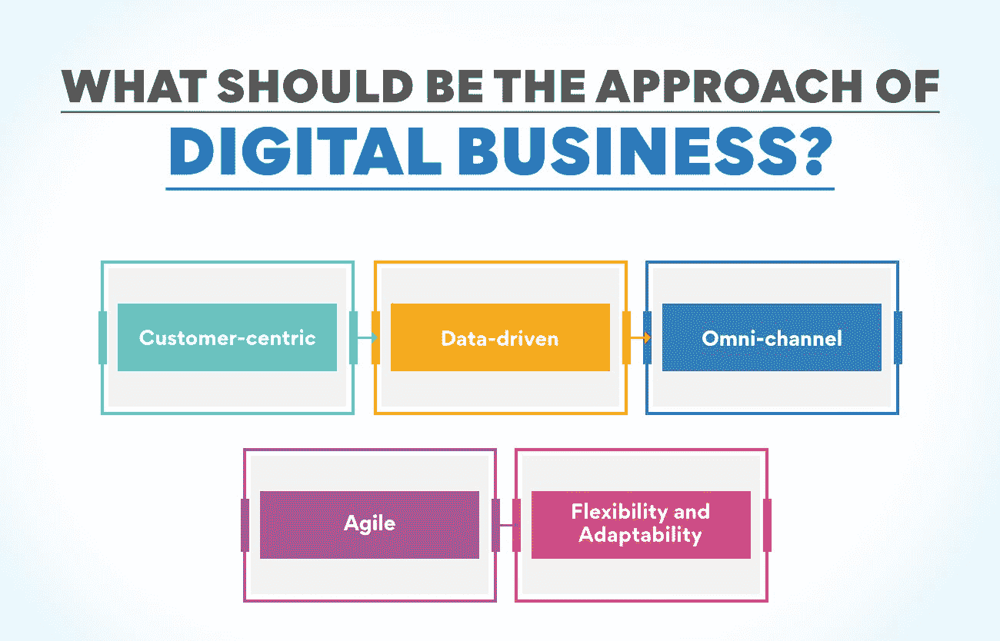
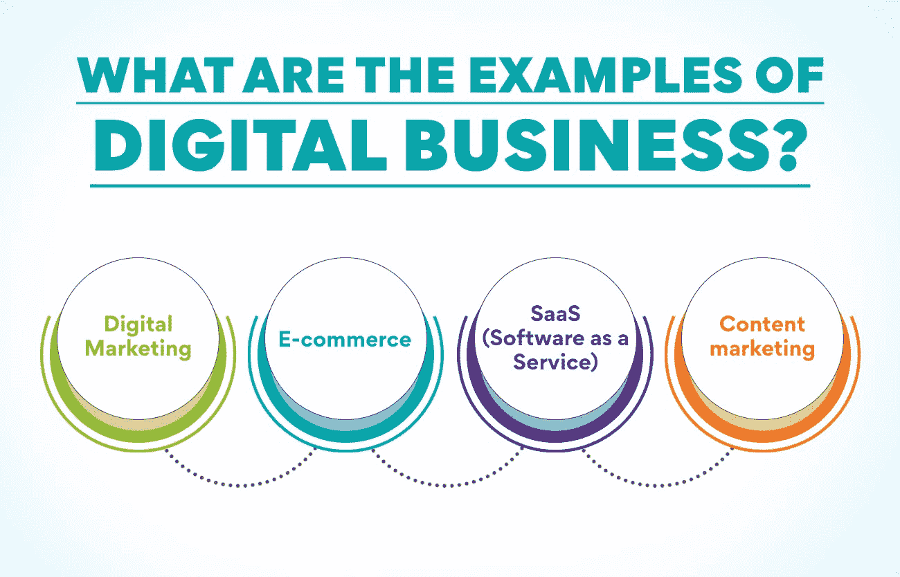
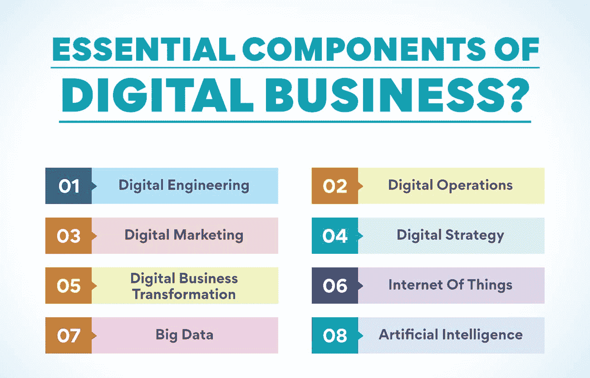

# 什么是数字商业？介绍

> 原文：<https://www.edureka.co/blog/what-is-digital-business>

在数字世界里，几乎所有事情都可以在网上完成。这导致了数字业务的兴起——主要或完全在线运营的业务。那么到底什么是数字商业呢？这是一个用来描述在数字时代如何开展业务的术语。它涵盖了商业的所有方面，从市场营销和销售到产品开发和运营。在这篇博文中，我们将介绍数字业务，并讨论其中涉及的一些关键概念。

## **什么是数字商业？**

数字业务使用数字技术来创建新的或改进的业务流程、产品或服务。它也可以被定义为数字技术在公司运营的各个方面的应用，从产品开发和生产到营销和销售。

数字业务的一个重要特征是它们是由数据驱动的。也就是说，他们依靠数据来决定下一步做什么。这些数据可能来自许多来源，包括客户、员工和传感器。

数字业务通常能够快速发展，快速迭代。这是因为他们可以使用数字工具快速廉价地测试新想法。例如，它可能会使用一个网站或应用程序，在向整个用户群推出之前，让一些用户尝试一项新功能。它们通常也是全球性的。这是因为他们可以通过互联网等数字渠道接触到世界上任何地方的客户。

## 在当今不断发展的商业领域，数字业务有什么好处？

这种模式有几个优点，在当今的数字世界中对企业很有吸引力。

1.  **与传统业务相比，It 更加敏捷，能够更快地适应变化**

该模式依赖于不断变化和发展的数字技术。这意味着数字业务可以快速适应市场或客户需求的变化。

另一方面，传统企业通常结构僵化，难以改变。这将导致他们在市场或客户需求变化时落后。

2.  与传统业务相比，它可以更有效地接触到更多的受众

传统企业通常局限于本地。数字企业可以利用互联网获得世界各地的客户。接触更多的受众还可以帮助他们建立忠诚的客户群，并为他们的产品或服务找到新的市场。

数字企业也可以利用社交媒体和其他数字渠道与客户联系并建立关系。这是传统企业经常纠结的事情。

3.  **数字业务可以节省开销**

他们通常不需要租用办公室或购买昂贵的设备。这可以节省其他成本，如广告和营销。这意味着他们可以通过更低的价格将这些节省下来的成本传递给他们的客户。

数字企业的运营成本也比传统企业低。这是因为它们通常不需要雇佣那么多员工，也不需要支付昂贵的办公场所费用。因此，他们能够以比传统企业更低的价格提供产品和服务，这使他们更具竞争力。

4.  **它比传统企业更容易扩大规模**

这是因为数字公司在成长过程中通常不需要投资新的基础设施或雇佣更多员工。他们可以简单地利用现有的数字渠道来接触更多的客户。

传统企业通常难以扩大规模，因为它们需要投资新的场所、设备和员工。它会对增长造成巨大障碍。因此，与传统企业相比，数字企业能够更快地发展，更有效地进入新市场。

## **什么是数字化商业模式？**

该模式是一家公司在网上销售其产品或服务的方式。这可以通过网站、应用程序或数字平台来实现。数字商业模式改变了许多公司的运营方式，并为企业创造了接触客户的新机会。

经营数字业务有很多优势。最显著的优势之一是，它允许企业接触全球受众。有了它，就没有了地理界限。企业可以接触到世界任何角落的客户。

数字企业的另一个优势是运营成本通常比传统的实体企业低得多。无需维护实体店位置，企业可以节省租金、水电和员工等间接成本。

此外，这种模式还能让企业更加敏捷地应对变化。有了它，公司可以快速推出新产品或服务，并以最少的成本和努力对其产品进行更改。这种灵活性可以让企业在市场中获得竞争优势。

## **数字业务的方法应该是什么？**

以客户为中心:客户应该是所有活动、策略和过程的中心。为了给客户创造价值，客户的需求应该是首要关注点。

**数据驱动:** 视数据为王道。所有重要的决策都应该基于已经收集和分析的数据。这将有助于根据客户行为和趋势做出更好的决策。

**全渠道:** 为所有渠道的客户提供无缝体验至关重要。这意味着他们应该能够毫不费力地在频道之间移动，而不会丢失任何数据或有负面体验。

**敏捷:** 敏捷是关键，快速响应市场和客户需求变化的能力是成功的关键。敏捷性还允许实验和创新，这是增长所必需的。

**灵活应变:** 灵活应变是必不可少的。这意味着快速改变策略、流程，甚至产品或服务，以满足客户不断变化的需求。

## **数字商业的例子有哪些？**

数字业务可以采取多种不同的形式。一些常见的例子包括:

**数字营销:** 这包括企业可以用来接触和吸引目标受众的各种数字渠道。这包括从社交媒体营销和内容营销到搜索引擎优化(SEO)和电子邮件营销的一切。

**电子商务:** 这是最明显的形式概念。电子商务是指任何在网上进行的业务。电子商务的范围从销售实物产品到数字服务。

**SaaS(软件即服务):** SaaS 的企业提供在线访问和使用的软件。这可能是从生产力软件到视频编辑工具的任何东西。

**内容营销:** 内容营销是一种数字化的商业策略，包括创造和发布有价值的内容来吸引和留住客户。这可能包括博客帖子、信息图表、电子书等。

数字业务不仅限于这些例子。事实上，几乎任何类型的业务都可以以某种方式进行数字化。确定对你的业务最有意义的数字渠道是至关重要的，并专注于有效地使用它们。

## **数字业务的基本要素**

这一切都是为了将数字技术整合到企业的核心领域，从而导致企业运营的根本性变化。以下是该概念的关键组成部分:

**数字工程:** 将数字技术应用于产品和服务的设计、开发和部署。它是模型的数字支柱，对于创造竞争优势至关重要。

**数字化运营:** 利用数字化技术管理产品和服务的端到端生命周期，包括数字化资源的管理。它将帮助企业实现卓越运营和客户亲密度。

**数字营销:** 利用数字技术吸引客户和潜在客户，建立关系，创造价值。这是创造数字化客户体验的关键。

**数字战略:** 应用数字技术来实现商业目标。这是创建模型的基础。

**数字业务转型:** 数字技术用于创造一种新的或不同的业务模式，为客户提供更高的价值。这是企业在数字时代参与竞争所能做的最重要的事情。

**物联网:** 连接到互联网并能收集、交换和处理数据的物理对象网络。它是数字业务的重要推动者，并有可能改变企业的运营方式。

**大数据:** 数字设备和数字交互产生的大量数据。它是数字业务的重要资源，可以用来创造推动竞争优势的洞察力。

**人工智能:** 人工智能可用于自动化和改善决策，是数字业务的关键使能因素。它将帮助企业创造新的体验和服务，并将推动数字化转型。

数字技术正在彻底改变企业的运作方式，这是未来的趋势。你准备好乘风破浪了吗？

如果你想开始从事数字业务，请查看我们的[数字业务管理高级执行官证书](https://www.edureka.co/highered/advanced-executive-program-digital-business-management-iitg)。对于在数字时代刚刚起步的企业来说，这是一个极好的资源。

## **数字业务是前进的方向**

数字商业是未来。这是毫无疑问的。但是到底是什么呢？简而言之，数字业务就是利用数字技术创造新的或改进的业务流程、产品或服务。它可以包括从自动化手动流程到开发新的数字产品和服务的所有内容。

然而，这不仅仅与技术有关。也是人和文化的问题。为了取得成功，数字企业需要专注于创造一种创新和持续改进的文化。他们必须让员工能够使用数字技术来提高生产力、效率和效果。

数字业务的好处显而易见。通过数字化运营，企业可以变得更加敏捷、高效和以客户为中心。他们还可以开发新的市场，创造新的收入来源。

然而，转型可能会很有挑战性。组织必须仔细考虑他们的战略、结构、过程和文化。他们还需要投资于正确的数字技术和技能。

但是回报是值得的。通过接受这一概念，组织可以在竞争中保持领先，并在数字时代蓬勃发展。

## **数字业务中的职业机会**

它为那些拥有合适技能的人提供了各种各样的职业机会。从数字营销和网页设计到数据分析和网络安全，有很多方法可以涉足数字业务。

开始探索数字商业职业的最佳方式是确定你的技能和兴趣。一旦你知道自己擅长什么，你就可以开始研究符合你标准的数字商务工作。

你必须随时了解最新的风景。有许多在线资源和工具可以帮助您了解更多关于数字业务的知识。你越了解这些错综复杂的事情，你就越能找到适合你的工作。它也在不断发展，因此跟上最新趋势至关重要。及时了解动态转型将有助于您发现新的机会，并为不断变化的业务环境做好准备。

报名参加我们的[数字商业管理高级执行官证书](https://www.edureka.co/highered/advanced-executive-program-digital-business-management-iitg)涵盖各种数字商业概念和工具，将帮助您更好地理解它。

在本课程的帮助下，您将能够为您的组织制定数字化业务战略，并推动数字化转型。如果你想在这个领域取得成功，让你的职业生涯更上一层楼，那么这个课程就是为你准备的。