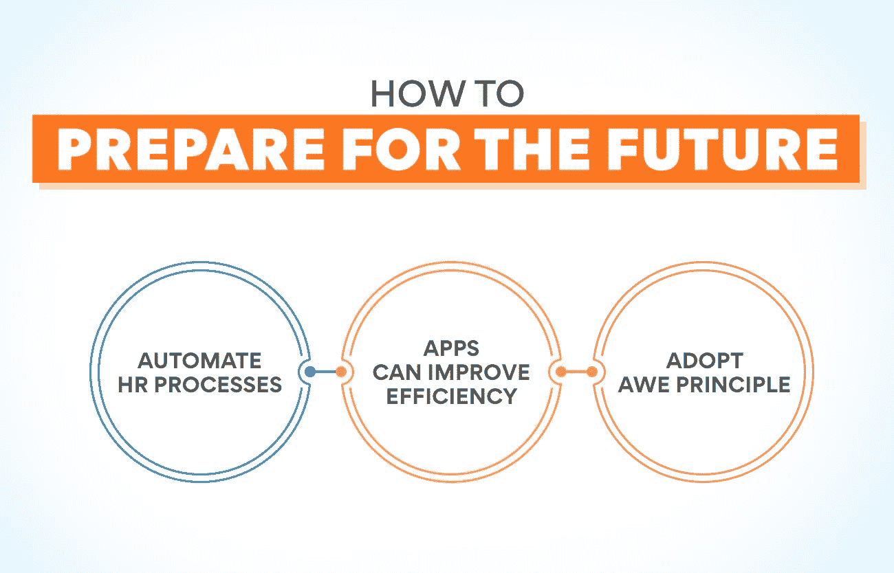

# 人力资源管理的演变:过去与未来

> 原文：<https://www.edureka.co/blog/evolution-of-human-resource-management>

那些渴望有一天成为人力资源专业人士的人肯定会对这个领域有所了解。如果你打算加入这一行业，你必须研究过人力资源经理是做什么的，他们是如何取得成功的。但是如果你想了解这份工作以及你的未来，有必要了解人力资源管理的演变。了解过去将会显示工作将会如何发展，以及一个人必须采取什么步骤来为未来做准备。

让我们先来看看什么是[人力资源管理](https://www.edureka.co/blog/role-of-human-resource-management-in-an-organization/)对那些还没有决定要专攻哪个领域的人有好处。更好的了解这个职业，有助于知道自己是否适合这个职业。

**了解人力资源管理**

简而言之，这个部门处理与在公司工作的人有关的所有事情。人力资源专业人员确保每个业务部门的最佳员工力量。这意味着他们处理招聘过程。这些官员负责寻找合适的候选人，对他们进行面试，并从公司名册上挑选最合适的人。看看人力资源管理的演变就知道，在古代有个人受雇雇佣和管理被奴役的人。

人力资源经理的工作不仅仅是雇佣员工。此人必须确保员工得到他们应得的福利。奖励那些出色完成工作并为公司进步做出贡献的人也是人力资源部门的工作。人力资源经理负责提供一个健康的工作环境。他们必须确保雇员之间没有任何形式的歧视。研究人力资源管理的演变清楚地表明，在早期没有给予员工福利应有的考虑。

向员工提供定期培训，让他们掌握未来所需的技能也是[人力资源部](https://www.edureka.co/blog/ultimate-guide-to-developing-an-effective-hr-strategy/)的职责之一。另一个重要的功能是解决冲突。员工之间以及他们与管理层之间的纠纷很常见。人力资源经理必须确保这种冲突迅速得到解决，工作进展顺利。他们还必须在不同时期成为员工和管理层的代言人。起草就业政策并传达给工作人员也是他们工作的一部分。

那些对人和他们的福利感兴趣的人会发现人力资源人员的工作非常令人兴奋。但是，让自己具备做好这份工作所需的足够知识和技能是至关重要的。查看我们的[人力资源管理研究生证书课程](https://www.edureka.co/highered/human-resourse-management-course-iim-shillong)。这可能是你通向激动人心的职业生涯的大门。

**人力资源管理的演变**

不难理解，在主人雇佣奴隶积累财富的时代，没有适当的“人力资源管理”。但随着时间的推移，这种情况发生了变化。随着机械化的发生和大工厂的出现，一个地方需要大量的工人。工人们有机会相互交流。政府也明白他们必须采取措施确保工人的安全并防止剥削。这可能是人力资源管理变革的开始。

**也读:[什么是战略人力资源管理？](https://www.edureka.co/blog/strategic-human-resource-management)定义和例子**

**工业革命时期**

工业革命开始于十九世纪中叶。大型工厂正在美国和欧洲的特定地区出现。机器的使用开始增加。需要大量的雇员。人们开始迁移到有好工作机会和更高工资的城市。许多公司老板开始实施人力资源管理的基本方法。这包括雇佣工人，培训他们工作，以及管理他们。在人力资源管理发展的这个阶段，这种关系仍然是主人和奴隶的关系。

**工会的成立**

工会的成立是照顾员工利益的重要一步。从事类似工作的工人开始组成协会来讨论他们的问题。这些后来成为工会，与管理层谈判，争取更好的工作条件。在最初阶段，讨论主要是关于童工、工作时间和条件。后来，工会和管理层之间的谈判包括工资和福利等其他方面。工会使用各种方法，如罢工、罢市和抵制，来满足他们的要求。这迫使公司所有者实施申诉处理系统。

**社会责任感**

在二十世纪的最初几年，许多公司开始对员工采取更人性化的方式。这被称为家长式作风，在这种作风下，老板把工人视为孩子，把自己视为父亲。他们认为，父亲应该自然地照顾他们的孩子，并开始在工作场所提供改善的设施。批评者说，人力资源管理发展的这一阶段更多的是由于工会和业主希望避免停工的压力。这与其说是旨在改善工人条件的哲学，不如说是一种强制。

**开始科学管理**

大约在同一时间，弗雷德里克·温斯洛·泰勒进行了各种实验来提高工人的生产力。他写了许多论文，被誉为科学管理之父。按照他的说法，找到让工人发挥最大生产力的方法是管理层的责任。他提倡和谐，并建议管理层必须尽可能避免冲突。他强烈推荐差别计件工资制度。他有助于实现工作的标准化和简单化。

**人际关系的重要性**

在 20 世纪 20 年代，管理专家和研究人员开始注意工作场所中的人的因素。1924 年至 1932 年间的工业研究显示了影响工人生产力的因素。研究表明社会因素对工厂有很大的影响。据观察，群体形成和群体影响也影响员工的生产力。沟通和领导者或管理者的素质也被认为是重要的方面。正是在人力资源管理发展的这个时期，人际关系变得更加重要。

**行为科学家的贡献**

行为科学家也为人力资源管理做出了巨大贡献。他们提出了人力资源的概念，这不同于人际关系模型。他们的研究促使企业关注经理的角色、组织的性质以及公司内部员工的行为。正是在人力资源管理发展的这个阶段，关于充分发挥员工潜力的讨论开始出现。研究表明，许多员工有很多未开发的潜力。这些研究人员坚持认为，使用这些未被利用的能力是管理者的工作。

**人力资源管理**

随着大型工厂员工的管理变得越来越复杂，许多公司都成立了劳资关系部门。这个部门主要与工人打交道。当职责扩展到管理人员时，名称更改为人事部。这些专业人员也管理管理人员的事务。随着招聘合格员工的竞争日益激烈，公司开始将员工视为人才库。员工被认为是组织效率的源泉。在二十世纪后期，公司开始将这个部门命名为人力资源部。

想在人力资源领域出类拔萃吗？报名参加我们的人力资源管理研究生证书课程。请立即访问我们的网站，了解课程详情。

**也读:[HRM 中的薪酬是什么？](https://www.edureka.co/blog/compensation-in-hrm)你需要知道的一切**

**人力资源管理的未来趋势**

我们已经看到了人力资源管理的演变，以及这些年来事情是如何变得更加科学的。我们现在必须看看这一领域的未来趋势。据预测，在不久的将来，人力资源官员将指导公司度过预期的中断。他们也会变得更加敏捷，决策速度更快。员工绩效将以更加个性化的方式进行评估。年度审查系统将被实时绩效报告取代。这将有助于向员工提供指导，以提高生产率。

人力资源人员将更加重视数字专业知识。专家们看到了从关注每个员工的收入到计算每个员工的价值的转变。人工智能在人力资源管理中的应用将会越来越多。公司有可能使用这种技术来创建更加多样化的远程工作人员。分析可用于确定员工的年龄、性别和种族，以组成混合背景的劳动力。每个人都知道拥有如此多样化的员工构成的好处。使用现代技术可以很容易地做出这样的决定。

作为人力资源管理变革**、** 的一部分，该部门的大部分任务很可能会被分解成离散的组成部分。通过这种方式，公司可以变得敏捷和精益。即使是大公司也会变小，比如创业公司。这一举措已经开始，一些公司在多个地方寻找针对入职员工的敏捷人力资源教练。微创新越来越重要。这导致了以产品为中心的团队，人力资源团队将不得不准备好雇用这样的人。

**如何为未来做准备**

随着人力资源管理的发展，该领域的专业人士必须为未来的挑战做好准备。让我们看看人力资源人员必须如何改变以适应新的设置。Edureka 提供的人力资源管理研究生证书课程等在线课程不断更新其课程，以使参与者掌握最新技能。请访问我们的网站，了解更多关于本课程的信息。

**自动化人力资源流程**

随着人力资源团队成为公司成长和发展的关键因素，他们手中将会有更多的工作。他们将需要花更多的时间想出创新的解决方案来提高员工的生产力和满意度。这意味着正常工作的时间会减少。在这种情况下，人力资源部门必须从手工工作转向自动化。他们必须着眼于现代软件，这将有助于加快常规流程，并给他们更多的时间进行创新。

**应用程序可以提高效率**

今天，人力资源经理被期望比以前收集更多的细节。这只会增加，因为决策将取决于数据分析。以传统方式从每个人那里收集信息是不可能的。为此使用应用程序将大大减轻人力资源人员的负担。有各种各样的应用程序可以帮助提高员工的参与度。薪资和休假计算的应用程序也是可用的。其中许多可以与公司现有的软件集成。改编应用程序将帮助你跟上未来人力资源管理的发展。

**采用敬畏原则**

采用敬畏原则，人力资源经理可以变得更有效率。

代表敏捷。让人力资源流程变得灵活将会减少浪费。您还必须授权部门员工专注于增值工作。

**W** 很精彩。公平对待员工，让工作变得精彩。它将把工作变成所有员工更愉快的活动。生产率和员工保留率将大大提高。

E 代表订婚。需要更多的员工参与来激励员工。随着市场竞争越来越激烈，企业需要每个员工都发挥出自己的最佳能力。有些软件程序有助于改善与员工的互动。

**总结**

这篇文章清楚地表明，人力资源管理的变革让公司和员工都受益匪浅。随着竞争的加剧，找到合适的人做一份工作并不容易。未来更重要的是让员工对公司忠诚，并确保他们在公司一直呆到退休。人力资源部一定会在帮助公司[实现目标](https://www.edureka.co/blog/objectives-of-human-resource-management/)方面发挥更积极的作用。新的和现有的人力资源专业人员必须装备自己，以面对未来的挑战。

## **更多信息:**

[目标&人力资源管理的本质](https://www.edureka.co/blog/nature-of-human-resource-management/)

[人力资源管理的关键基础](https://www.edureka.co/blog/fundamentals-of-human-resource-management/)

[什么是人力资源管理系统？](https://www.edureka.co/blog/human-resource-management-system/)

[人事管理与人力资源管理的区别](https://www.edureka.co/blog/difference-between-personnel-management-and-human-resource-management/)