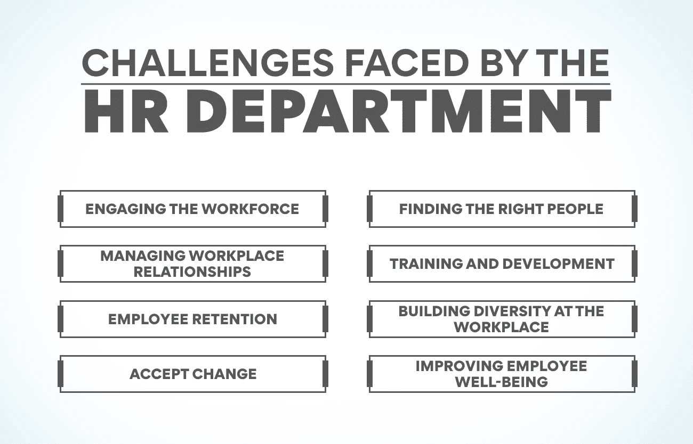
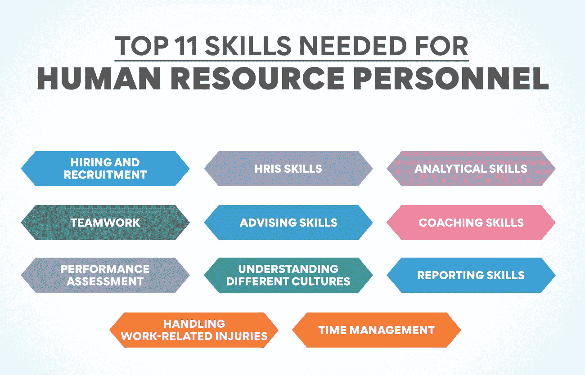

# 人事管理人员的 11 项基本技能

> 原文：<https://www.edureka.co/blog/people-management-skills/>

人力资源管理对任何组织都至关重要，因为员工推动着组织的成长和发展。没有他们的积极贡献和忠诚，任何机构都无法前进。这样，人力资源部门就被赋予了很大的重要性，在许多现代公司中，这个部门的领导与高层管理人员共享空间。人力资源部门必须具备各种人员管理技能，以应对他们在工作中面临的挑战。

在我们研究这些官员必须具备哪些技能之前，我们必须知道他们为什么需要这些技能。只有当我们知道他们面临的挑战时，才有可能理解对各种技能的需求。加入我们的[人力资源管理研究生证书](https://www.edureka.co/highered/human-resourse-management-course-iim-shillong)，你可以了解更多关于人力资源部门官员的工作。访问我们的网站会让你了解课程细节。

**人力资源部面临的挑战**

**吸引劳动力**

人力资源人员最困难的工作之一是吸引员工。虽然这些专业人士在疫情之前对此进行了热烈的讨论，但当疾病来袭时，他们不得不寻求新的策略。人事管理专业人员必须掌握新的人事管理技能，以保持员工的参与，即使他们在家工作。旨在向员工展示他们在公司发展中所扮演的角色的有意和深思熟虑的沟通非常有助于吸引员工。

**找到合适的人**

随着国内外新公司的开业，员工们发现了更多的机会。这个时候，HR 部门要吸引好的人才到事务所来，并不容易。公司对员工友好的形象有助于获得有才华的候选人。管理层必须考虑的另一个重要方面是拥有强大的价值观并坚持这些价值观。许多人在参加面试前会查看公司各方面的政策。人力资源官员必须具备必要的人事管理技能，以吸引潜在员工并吸引他们加入公司。

**管理职场关系**

员工之间健康的关系有助于提高生产力。当他们相互理解并合作时，更多的工作得以完成，这有助于公司快速发展。但是，当有来自不同社会和教育背景的人时，维持这种温暖的关系并不容易。在疫情会议之后实施的混合工作模式尤其如此。人力资源官员必须努力在员工之间建立健康的关系，并确保良好的工作环境。同样，这里有一些特殊的人事管理技巧可以帮助人力资源部门建立良好的工作关系。

**培训和发展**

雇员们希望在职业生涯中迅速发展。但他们可能不具备承担更高责任的必要能力。人力资源部的职责是确保他们定期接受培训以提高技能。技术进步的速度快得让人跟不上。在不断变化的工作场所，员工必须用最新的技术技能武装自己。劳动力管理团队面临的另一个挑战是向员工传授软技能。良好的人员管理技能有助于制定最佳的培训计划。这种可转移的品质是领导力发展所必需的。

**员工保留率**

留住员工是当今的一个重要问题。许多公司员工流失率很高。这不仅增加了他们的开支。这也使得公司的进展缓慢。新员工需要时间来适应并发挥他们的全部潜力。他们也需要时间来适应新的环境和同事。所有这些都使得公司很难以他们希望的速度增长。人力资源人员应该开发人员管理技能，如良好的沟通，与员工互动，并发现他们离开公司的原因。

**在工作场所建立多样性**

今天，在办公室实现多元化、公平和包容非常重要。许多年轻人希望为重视多元化、让每个人都有归属感的组织工作。当新的空缺出现时，只有这样的公司才能吸引最优秀的人才。但这并不是一件容易实现的事情。公司里有许多员工可能不喜欢这种多样化的环境。某些群体可能会受到歧视。人力资源部门必须获得新的人员管理技能，以说服现有员工并确保达到 DEI 状态。

**接受变更**

在这个技术飞速发展的世界里，变化是不可避免的。疫情带来的各种变化比公司准备好的要早得多。远程工作给了员工很多自由，这是他们即使回到办公室也期待的。在一个技能人才不足的劳动力市场，倾听员工的意见是必要的。公司必须改变他们的人力资源政策，使他们对员工更加友好。人力资源官员必须学习必要的人事管理技能，以帮助他们带来变化，而不会对工作造成太大干扰。

**改善员工福利**

疫情不仅给工作场所带来了很多变化。这也造成了比以前更多的健康问题。这些都是生理和心理疾病。雇主必须注意这些，并确保员工的健康和福利得到照顾。需要改变的不仅仅是医疗福利。公司还必须提供更好的工作条件，以确保员工没有压力。必须有灵活的工作时间和更多的带薪休假。带来这样的变化需要人力资源工作者获得更多的人事管理技能。

以上是人力资源官员在努力成功完成工作时面临的常见现代挑战。成为我们[人力资源管理研究生证书项目](https://www.edureka.co/highered/human-resourse-management-course-iim-shillong)的一部分可以教你如何应对这些挑战。我们的网站将为您提供更多关于该课程的细节，以及它将如何帮助您在工作中取得成功。

**人力资源人员成功所需的 11 大技能**

1.  **雇佣和招聘**

这可能是每个人力资源专业人员必须具备的最重要的人事管理技能之一。公司里不断出现新的职位空缺，他们必须把合适的人放在这些位置上。仅仅看简历或候选人的资历是不够的。一个好的人力资源专家知道如何分析简历，找到最适合公司的那份。同样，在面试过程中，官员们必须能够看到未来员工所说之外的东西。他们必须知道这个人的意图和愿望。

2.  **HRIS 技能**

HRIS 代表人力资源信息系统。这种软件程序有助于人力资源部门各种基本任务的自动化。有各种各样的这样的包，一个好的人管理专业人员必须选择一个最适合公司。这些项目有助于节省大量时间，你可以用这些时间为主要问题找到创新的解决方案。雇主非常重视熟悉这种解决方案。你还必须知道如何使用工资单和考勤软件。这些都是有用的人事管理技巧，有助于让你的工作变得简单。

3.  **分析技能**

每个公司都会不断出现问题，人力管理部门也是如此。人力资源经理必须能够解释问题并找到最佳解决方案。分析现有数据有助于提出独特的解决方案。为此，你必须具备收集所需数据的必要技能。您必须熟悉数据分析技能，这有助于解释现有数据并提出解决方案。数学建模是每个人力资源专业人员必须掌握的其他人事管理技能之一。

4.  **团队合作**

团队合作在公司的所有部门都很重要。但这在人力资源部门更为重要，因为他们必须与自己的团队以及其他业务部门的团队合作。如果人力资源人员想在工作中取得成功，团队合作是他们必须发展的一项必要技能。真诚地与他人合作有助于完成工作和收集信息。沉迷于各种团队运动，如足球、板球等。，有助于培养这种必要的能力。这是重要的人事管理技能之一，有助于管理和指导公司的不同团队。

5.  **建议技巧**

作为一名人力资源官员，你需要就各种问题向工厂的工人提供建议和指导。所有部门的人都会联系员工经理，就工作和个人问题寻求建议。积极倾听他们的意见，并给予他们正确的建议，这有助于你得到公司每个人的高度重视。发展倾听别人的技巧是获得建议技巧的开始。这是用人单位非常追捧的人事管理技能之一。

6.  **教练技能**

除了为员工组织培训项目，人力资源官员还负责在各种问题上对他们进行指导。这些专业人士的工作是教导员工如何在工作中保持友好的关系。他们还必须在包容性方面对他们进行指导。雇员必须学会如何重视所有工人的意见。人力资源官员还必须告诉员工包容的必要性，不要歧视任何特定人群。这是帮助人力资源官员保持对他人有价值的重要人事管理技能之一。

7.  **绩效评估**

公司的员工经常需要被评估和奖励。没有这一点，没有人会在公司呆很长时间。所有人力资源专业人员都必须具备为不同团队开发评估方法的技能。他们还必须知道如何使用这些方法来分析单个员工的绩效。只有通过恰当的评估，员工才能得到奖励，也只有这样才能让他们留在组织中。这是有助于留住员工的人员管理技能之一。

8.  **了解不同的文化**

这是在大公司工作的人力资源官员必须具备的重要人事管理技能之一。这些公司的员工属于不同的种族。印度有多元文化，所有这些人都在同一家公司工作。人力资源部门必须确保和平的工作氛围。为此，很好地理解不同的文化和这些特性是至关重要的。

9.  **汇报技巧**

报告是每个人力资源部门的一部分。他们必须准备好各种报告，发给部门领导、员工和高层管理人员。这些专业人员必须能够创建准确的报告，帮助做出重要决策。他们还必须能够阅读各部门发送的报告，并对其采取必要的行动。熟悉 HRIS 有助于你掌握这一重要的人事管理技能。

10.  **处理工伤**

伤害可能发生在工作场所。在有大型机器或危险材料的地方，这种情况会更频繁。重要的人事管理技能之一是知道如何处理这种情况，并确保员工得到及时的治疗。此外，你还必须知道公司应该坚持的保险和赔偿政策。

11.  **时间管理**

由于人力资源专业人员在任何时候都要处理多项工作，因此拥有出色的时间管理技能是非常必要的。这将帮助你完成所有的工作，同时也有时间看看公司在人力资源管理方面可以做哪些改进。

**结论**

在人力资源部工作需要你承担各种各样的职责。这意味着你必须具备各种人事管理技能，这将有助于你成功完成工作。在你以人力资源管理为职业之前，最好报名参加我们的[人力资源管理](https://www.edureka.co/highered/human-resourse-management-course-iim-shillong)研究生证书课程。这是一个让自己具备工作所需基本技能的好方法。请访问我们的网站了解课程详情。