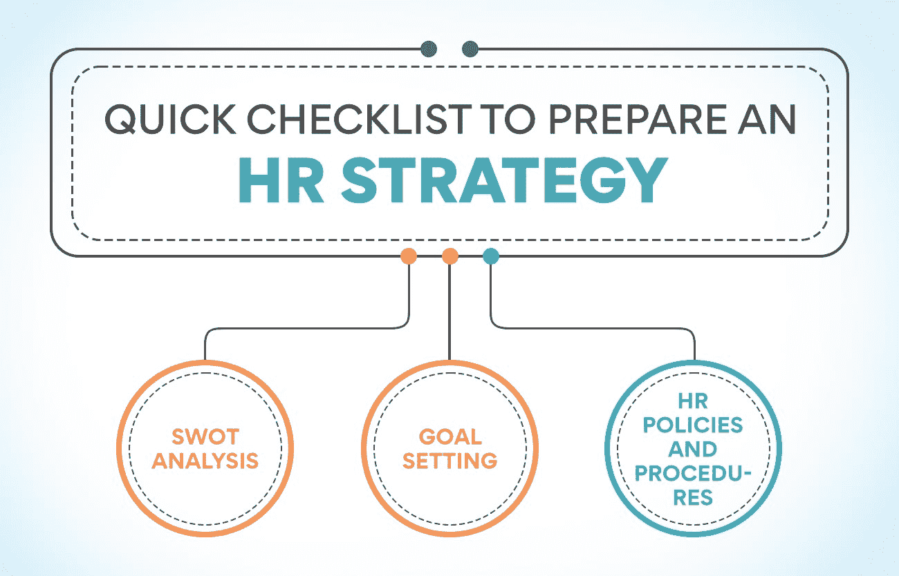
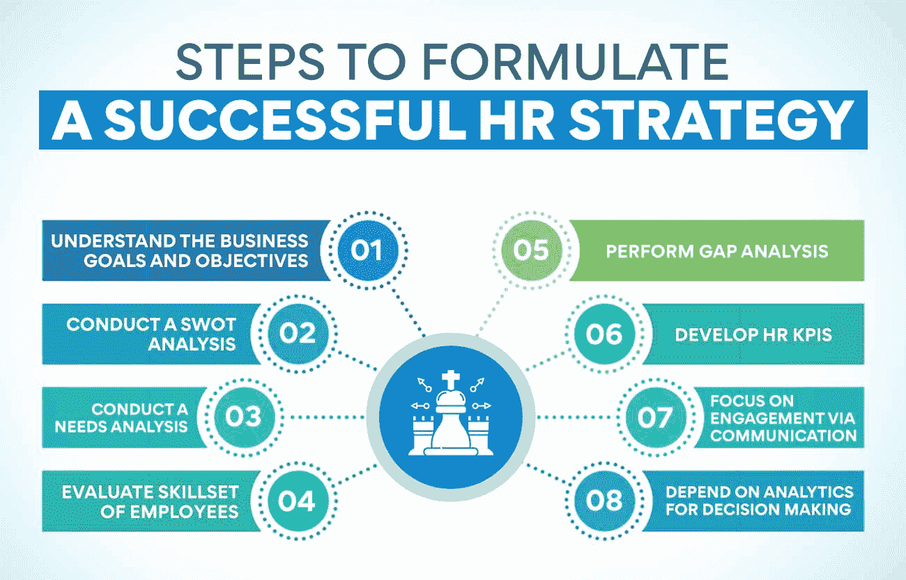

# 制定有效人力资源战略的终极指南

> 原文：<https://www.edureka.co/blog/ultimate-guide-to-developing-an-effective-hr-strategy/>

人力资源是公司的驱动力，因此，人力资源部门成为吸引、雇用和留住员工的重要部门。有效的人力资源战略可以帮助公司节省资金、时间和资源。创建和实施人力资源战略可能是一项艰巨的任务。重要的是要记住，人力资源是任何企业最重要的方面之一——它让你的员工保持乐观和高效。

这份全面的人力资源指南将带你完成创建和实施适合你公司的人力资源战略的必要步骤。我们将讨论从招聘新员工到让你现有的员工满意的所有事情。我们开始吧！

## 什么是人力资源战略，为什么它很重要？

人力资源战略是一项旨在实现组织人力资源目标的行动计划。它必须与业务战略保持一致，以支持业务目标的实现。

有效的人力资源战略将有助于吸引、培养和留住最优秀的人才，从而提高生产力和绩效。一个设计良好的人力资源战略也将有助于创造一个积极的工作环境和文化，让你的员工实现公司的目标。

制定人力资源战略有很多好处，但其中最重要的包括:

*   **提高组织绩效:** 通过将人力资源计划与业务战略相结合，组织可以确保其人力资源计划专注于实现业务目标，从而提高组织绩效。
*   **提高员工的参与度和满意度:** 有效的人力资源战略将使员工对工作更加投入和满意，为提高创造力和降低离职率铺平道路。
*   **提高人才的获得和保留:** 人力资源战略可以帮助你发现和吸引顶尖人才，留住你最好的员工。通过创造积极的工作场所文化和提供有竞争力的福利，你可以鼓励你的员工留下来。
*   **降低人员流动成本:** 你制定的人力资源战略应该有助于降低人员流动成本。当员工离开时，你的公司会在生产力损失、培训新员工的需要等方面损失金钱。
*   **加强对人力资源法规的遵守:** 人力资源战略通过确保将这些法规传达给员工和经理，并通过实施流程和程序来确保遵守，从而有助于确保遵守人力资源法规。
*   **降低人力资源成本:** 人力资源对企业来说可能是一笔巨大的开支，因此制定一项有助于降低人力资源成本的战略至关重要。实现这一点的一个方法是自动化人力资源流程。通过自动化人力资源，您可以减少在人力资源任务上花费的时间和金钱。

作为一名人力资源专业人士，你想享受人力资源战略的好处吗？[查看我们的人力资源管理研究生证书](https://www.edureka.co/highered/human-resourse-management-course-iim-shillong)，在这里你可以了解人力资源管理的来龙去脉以及更多。

**也读:[什么是战略人力资源管理？](https://www.edureka.co/blog/strategic-human-resource-management)定义和例子**

## 如何为你的公司制定有效的人力资源战略？

人力资源战略对任何企业的成功都至关重要。这可能是一家繁荣的公司和一家挣扎的公司之间的区别。

**准备人力资源战略的快速清单:**

**SWOT 分析:**

*   它应该基于对公司严格的 SWOT 分析。SWOT 分析研究了公司的优势、劣势、机会和威胁。
*   它的目标应该是最大化公司的优势，最小化其劣势。
*   它还应该致力于利用机遇，最大限度地减少威胁。

**目标设定:**

*   它应该与商业目标相联系。
*   它应该是具体的、可衡量的、可实现的、相关的和有时限的(SMART)
*   它应该与公司的整体经营战略相一致
*   应定期审查和更新人力资源目标。

**人力资源政策及流程:**

*   人力资源政策和程序应支持人力资源战略和业务目标。
*   应当定期审查和更新人力资源政策和程序。
*   人力资源政策和程序应传达给所有员工。

**制定成功人力资源战略的步骤**

人力资源战略的制定不是一蹴而就的。这是一个持续的过程，需要随着公司的成长和转型而不断修正和更新。看看这些步骤，你可以制定一个有效的人力资源战略:

**了解业务目标和目的**

第一步是了解总体业务目标。你需要为公司制定一些重要的目标，作为战略的基础。

公司的总体目标是什么？人力资源可以帮助实现哪些具体目标？一旦你清楚地理解了业务目标，你就可以开始相应地调整人力资源战略。

当务之急是理解所有的业务目标，以便制定人力资源战略，在给定的资源和规定的时间内实现这些目标。业务目标可能会随着时间的推移而变化，因此人力资源战略也应该定期审查和更新。

**进行 SWOT 分析**

确定业务目标后，是时候进行 SWOT 分析了，这是旅程中最关键的一步，在每个阶段都会派上用场。它将帮助你了解公司的优势、劣势、机会和威胁。你可以利用这些信息来制定战略，帮助公司实现目标。

确保让员工参与 SWOT 分析。他们可能有宝贵的见解，你可以用来制定一个有效的和富有成效的战略。如果没有 SWOT 分析，你可能会制定一个不能解决公司最迫切需求的人力资源战略。

SWOT 分析结果将帮助你制定与公司总体目标相一致的人力资源目标。例如，如果公司的目标是增加销售额，你的人力资源目标可能是雇佣更多的销售人员或提供培训以帮助员工更有效地销售。

**进行需求分析**

评估贵公司的[需求和目标，以确定人力资源在实现这些需求和目标中的](https://www.edureka.co/blog/role-of-human-resource-management-in-an-organization/)角色。要做到这一点，你必须分析你公司的人力资源实践，政策和计划。您可以使用各种方法来评估人力资源，包括调查、访谈、焦点小组和人力资源数据分析。

人力资源部门还可以分析公司内外的人力资源趋势，以确定潜在的人力资源战略。例如，如果你试图降低员工流动率，你可以研究流动率低的公司的人力资源实践。

需求分析在强大的人力资源战略开发中经常派上用场，因为它提供了对人力资源缺口的洞察——人力资源可以改进的领域。

**评估员工的技能组合**

人力资源战略始于评估有助于实现目标的员工的技能。一旦你清楚地了解了你的团队的技能和经验，你就可以开始制定一个计划来最好地利用这些技能。

这可能包括培训或发展计划，或者只是将任务重新分配给更适合他们的员工。无论哪种方式，确保你的人力资源战略基于你团队的特定技能和经验是至关重要的。

有几种不同的方法来分析你的员工的技能组合。你可以从工作描述和绩效评估开始。它将全面概述每个员工的技能。你也可以进行采访和调查，以获得更多关于员工技能的具体信息。

**执行差距分析**

毫无疑问，差距分析是人力资源战略不可或缺的一部分。它将帮助你了解你的人力资源战略的现状，什么是有效的，什么是无效的，以及你需要改进的地方。一旦你对人力资源战略中的差距有了清晰的认识，你就可以开始制定计划来弥补这些差距。

在差距分析期间问自己:

*   我们目前有哪些人力资源流程？
*   我们的人力资源流程与我们的业务目标一致吗？
*   我们的人力资源流程是否支持我们的员工实现他们的目标？
*   我们的人力资源流程有助于我们吸引和留住顶尖人才吗？
*   我们的人力资源流程能提高员工参与度吗？
*   我们的人力资源流程是否高效且具有成本效益？

如果你发现你的人力资源战略与你的业务目标不一致，或者没有支持你的员工实现他们的目标，那么是时候做出一些改变了。

**制定人力资源关键绩效指标**

HR KPIs 是帮助您衡量和跟踪战略进展的指标。要制定人力资源关键绩效指标，首先要审视你的人力资源战略，确定你想要衡量的关键领域。然后，选择能够准确反映这些领域进展的指标。一些常见的人力资源 KPI 包括员工满意度、人员流动和培训完成情况。

一旦你选择了你的人力资源关键绩效指标，你需要定期跟踪它们。您可以手动或使用人力资源软件来完成此操作；如果您使用人力资源软件，请设置警报，以便在 KPI 低于或超过特定阈值时通知您。

监控人力资源关键绩效指标对于确保您的人力资源战略步入正轨至关重要。定期审查人力资源关键绩效指标可以及早发现问题，并做出必要的调整，以保持您的人力资源战略的方向。

**通过沟通关注互动**

人力资源战略应该旨在通过改善沟通来提高员工参与度。可以有几种方式，比如:

*   鼓励员工和管理层之间的双向沟通。
*   建立员工反馈和建议的渠道。
*   提供培训和发展机会。
*   支持员工分享他们的想法和建议。

通过增加沟通，你可以创造出一个更有参与度、更有生产力和积极性的员工队伍。它将对你的业务核心产生重大影响。但这不会是一次性事件，而是一个持续的过程，需要定期审查和调整。

**依靠分析进行决策**

人力资源团队可以通过使用数据来做出决策，从而提高他们的效率和效力。人力资源专业人员需要能够用数据来证明他们的决策。这意味着人力资源团队在解决问题的方法上必须变得更具分析性。人力资源分析有助于在早期发现问题，并防止它们在以后变成更严重的问题。

人力资源团队也应该使用数据来衡量他们的计划是否成功。这些信息可以帮助人力资源团队调整他们的策略，以更好地满足他们组织的需求。

人力资源分析是帮助人力资源团队提高绩效的强大工具。然而，人力资源分析并不是灵丹妙药。人力资源团队仍然需要运用他们的决心和经验为他们的组织做出最佳决策。人力资源分析应该作为人类判断的补充，而不是替代。

**也读作:[分解人力资源管理的范围](https://www.edureka.co/blog/scope-of-human-resource-management/)**

## 什么是人力资源战略最佳实践？

这个问题没有放之四海而皆准的答案——对你的组织来说，最佳的人力资源战略取决于不同的因素，包括公司的规模、行业和人力资源目标。然而，人力资源团队应该记住一些最佳实践:

**人力资源专业人员必须深入参与这一过程:**

人力资源战略不应该在真空中制定——它必须通过人力资源专业人员和其他关键利益相关者之间的密切合作来制定。

**人力资源预算甚至管理层的支持都是执行的关键要素:**

没有人力资源预算和管理层的支持，人力资源战略不可能成功。预先分配必要的资源，以避免以后的执行问题。

**人力资源战略必须符合公司的具体需求:**

永远不要复制另一家公司的战略。适用于一家公司的方法可能不适合你的公司。人力资源战略必须根据你公司的个性化需求精心定制。

**人力资源战略应定期审查和更新:**

像所有的商业战略一样，人力资源战略应该被修订和更新，以确保它仍然是相关的，而不是偏离其目标。

## **底线**

人力资源战略是任何企业的重要组成部分。通过制定和实施有效的人力资源战略，公司可以获得多种好处，包括提高员工生产率、敬业度和保留率。

虽然没有多用途的人力资源战略，但企业可以利用本指南中概述的技巧和建议来制定满足其特定需求和目标的定制人力资源战略。只需一点时间和努力，企业就可以制定一个人力资源战略来帮助他们实现理想的结果。

无论你是人力资源专业人士还是有志于进入人力资源行业，我们都有助于你事业腾飞的完美课程。查看我们的[人力资源管理研究生证书](https://www.edureka.co/highered/human-resourse-management-course-iim-shillong)，这是实现人力资源专业职业生涯的理想路线图。

## 更多信息:

[人力资源管理的性质和目标](https://www.edureka.co/blog/nature-and-objectives-of-human-resource-management/)

[人力资源管理的演变:过去和未来](https://www.edureka.co/blog/evolution-of-human-resource-management)

[什么是战略人力资源管理？定义和例子](https://www.edureka.co/blog/strategic-human-resource-management)

[什么是人力资源管理？角色和功能](https://www.edureka.co/blog/objectives-of-human-resource-management/)

[什么是人才管理？基础知识和重要性](https://www.edureka.co/blog/talent-management-and-its-importance/)