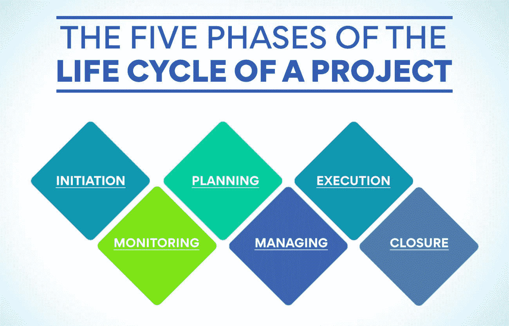
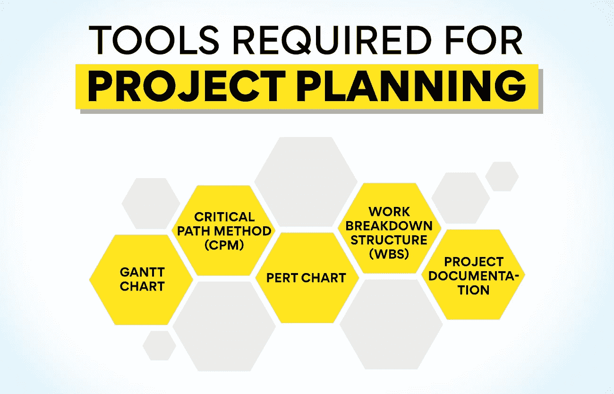

# 项目规划:重要性、工具和基础

> 原文：<https://www.edureka.co/blog/project-planning>

项目规划确保及时交付和项目成功，这在任何科技公司都是一个至关重要的过程。这是消除威胁和项目失败的最关键阶段。瞄准一个理想的项目计划有助于增加消费者满意的可能性和他们对公司未来投资的信心，因为如果执行不成功，商业计划就不会成功。

项目规划需要几个关键步骤来帮助公司产生一个高效和成功的过程。任何公司在制定项目计划的过程中，都可以使用多种项目计划工具，如关键路径法、PERT 图或甘特图。

以下文章讨论了项目规划的基础知识、其阶段、其基本原理、为什么它对公司如此重要、用于项目规划的一些常用工具以及主要步骤。

## **什么是项目策划？**

一个项目包括五个阶段:启动、计划、实施、监控和管理以及结束。规划是任何项目生命周期的第二阶段，在启动阶段之后，制定计划，以便开始执行该计划。项目计划是项目管理整个过程的路线图。项目策划包括:

*   定义目标: 定义必须包含项目由什么组成，它的主要目的，它计划实现什么，以及什么表示它的结束。
*   **澄清范围:** 该解释提供了项目计划解决的问题以及谁将从项目中获益的事实。
*   **组织任务:** 每项任务都分配有开始日期和结束日期，并提供给定任务完成所需时间的估计。
*   **提交进度报告:** 该文档包含项目要完成的工作、可交付成果和计划的结果。

也被称为[项目管理](https://www.edureka.co/blog/how-to-become-a-better-project-manager-top-10-tips/)计划，项目规划对项目的内容、人员、原因、地点、时间和方式做出反应——制定项目的指导方针，规定项目的截止日期和任务。项目管理计划的目标是指导项目阶段的执行和管理。如上所述，项目计划包括下列文件:

*   **项目章程:** 提供了项目的大致轮廓。它解释了项目的目标、原因、约束、目的和利益相关者，以及其他因素。
*   **工作说明书:** 工作说明书(SOW)描述了项目的时间表、范围、里程碑、可交付成果和任务。
*   **工作分解结构:** 将项目范围分解为项目阶段、可交付成果、子项目以及导致公司最后一个可交付成果的工作包。
*   **项目计划模板:** 项目计划模板分为几个部分，包括以下内容:质量管理、范围管理、资源管理、风险评估、进度管理、利益相关者管理和过渡管理计划。

### **项目生命周期的五个阶段**

任何项目，无论大小，都可能非常复杂。通过按照阶段来考虑你的项目，分解项目计划的所有必要内容要容易得多。项目管理协会确定了项目的以下五个阶段，这将有助于我们理解项目规划的正确程序:

*   项目的开始，通过商业案例确定目标，并通过可行性研究确定项目的适宜性。
*   **计划:** 在项目计划的这个阶段，项目的范围是由一个叫做工作分解结构(WBS)的项目计划工具和处理所决定的项目的项目方法来确定的。评估资源、质量和成本，并确定具有里程碑和任务相关性的项目时间表。此阶段的主要可交付成果是项目团队创建的项目规划。
*   **执行:** 项目可交付成果在此阶段实现。通常，这一阶段从启动会议开始。随后是正式的团队会议和状态报告，同时项目团队正在进行项目。
*   **监控和管理:** 该阶段与项目计划的执行阶段同步进行。计算进度和性能指标是为了跟踪项目，这与项目的规划是一致的。
*   **结束:** 当涉众得到最终的可交付成果时，项目就结束了。资源被释放，协议被签署，并且，理想地，将会有一个成功和失败的评估。

本文旨在为您提供创建项目计划所需的所有资源和信息，并获得您的消费者和利益相关方的授权。 现在我们已经了解了项目计划及其阶段，让我们深入了解项目计划的基本原理、重要性和所需工具。

**另请阅读:[项目管理流程和阶段说明！](https://www.edureka.co/blog/project-management-processes-and-phases-explained/)**

## **项目规划基础**

项目规划指的是描述任何业务在进入规划和执行阶段之前必须分析的基础。其中一些基本原理如下:

*   **确定资源、成本和范围**

确定资源、成本和范围的程序有助于估计完成项目所需的时间、所需的人数和所需的技能。工作分解结构(WBS)通过将整个任务分解成更小的、可管理的元素来协助这一过程。

*   **识别问题**

会议或调查等技术的结合被用来收集数据以评估问题。可能有许多问题；然后，项目团队挑选出最需要立即关注的问题。

*   **确定利益相关方**

风险承担者的识别提供了实际问题的更精确的图像，尤其是哪些人和职能可能会受到项目的影响。利益相关者和项目团队一起工作，为项目的成功做出贡献。

*   **项目目标的定义**

牢记利益相关者的各种期望，制定一个计划。项目的成功完全取决于项目能满足多少预期。

想找机会提高你的项目管理技能吗？报名参加我们的[运营、供应链和项目管理高级证书](https://www.edureka.co/highered/advanced-program-in-operations-supply-chain-project-management-iitg)，利用这个机会将你的职业生涯推向更高的高度。

## **项目规划对企业的重要性**

项目规划保证在每个阶段监控进度和预算。项目计划包含一个时间表，指导团队成员完成他们的任务，并使他们能够了解他们将需要的工具以及何时需要。它还允许团队致力于更高的项目绩效。项目计划确保所有团队成员的热情参与，并让他们对自己的工作持一种机会主义的态度。

项目规划提供了对每个阶段结果的及时测试。当成功执行时，作为一个团队在项目中工作的所有人都可以在情况发生之前预测到它们。这提高了效率，保证了计划的成功实施。

此外，项目规划能够对各种风险进行分析、优先排序并确保一个合适的计划。准确的规划确保有更多的风险可以预期，并且可以对它们进行适当的优先排序和管理。这一步确保了不会有任何事情失败，并且该计划使得项目团队能够毫不费力地记住所有重要的事实和截止日期。

## **项目规划所需的工具**

项目规划工具让每个有兴趣的人都能跟踪项目需求和期限。一些最受欢迎的项目规划工具如下:

*   **甘特图**

甘特图是一个行业基准，有助于跟踪给定任务之间的时间和相互依赖性。甘特图是展示与项目管理相关的各种工作、阶段和资源的重要工具。

*   **关键路径法(CPM)**

关键路径法(CPM)是规定项目进度的重要工具，以保证项目按计划完成。CPM 通过发现最长的相互依赖的任务来帮助决定关键或必要的过程。

*   **PERT 图**

项目评估和评审技术(PERT)有助于检查完成项目的任务以及完成这些任务所需的时间。PERT 简化了大规模复杂项目的计划和进度安排。

*   **工作分解结构(WBS)**

工作分解结构(WBS)是一种将团队工作组织成可管理元素的方法。WBS 是完成项目所需的可交付成果的分级系统。

*   **项目文件**

项目文档在项目生命周期中编制，包括项目时间表、范围和风险评估。项目文档有助于对项目进行更合理的解释和风险评估。

现在，我们已经了解了项目规划对任何业务的重要性，以及高效项目规划所需的基础知识和工具，让我们来看看对项目规划过程至关重要的一些步骤。

**也读:[什么是产品策划，是怎么做的？](https://www.edureka.co/blog/what-is-product-planning-and-how-is-it-done/)**

## **项目规划涉及的步骤**

项目规划中的步骤对于帮助项目规划团队在规划阶段有条不紊地做出明智而高效的决策至关重要。项目规划涉及七个重要步骤:

*   **认可并与利益相关方举行会议**

利益相关者可以包括消费者、项目经理或项目团队本身。最重要的一步是认识并与利益相关者会面，讨论他们的期望并指定项目的范围。

*   **确定项目范围**

项目范围包括确定一系列精确的项目目标、预算、可交付成果和截止日期。项目范围有助于指定项目的限制和每个团队成员的义务。

*   **设定目标并确定优先顺序**

一旦确定了股东对项目的期望，项目的目标就确定了，并按优先顺序排列。提供了关于初始概念的更多具体细节，作为整个项目的参考点。

*   **确定可交付成果**

项目是为可交付成果的唯一目的而创建的。项目规划中最关键的步骤之一是确定这些可交付成果是什么，以及如何在指定的时限内交付。

*   **为项目创建时间表**

项目时间表概述了项目中各项任务的开始和完成时间。项目进度表能够衡量项目的进展并编写进度报告。

*   **风险分析**

识别风险并计划如何应对风险是项目规划中的重要一步。应该记住防止风险发生或限制其影响的关键步骤。

*   **设定进度指引**

需要有一个沟通计划，向利益相关者提供项目进展的最新信息。这可以每天、每周或每月进行一次，以便所有相关成员可以观察进度。

**结论**

项目规划确保每一步都遵守进度和预算。它还保证在每一步都完成及时的结果测试。此外，项目规划支持对各种风险进行优先排序、分析和确保适当的计划。有效的规划承诺，如果有多种风险，可以根据优先级对它们进行定位，并相应地进行处理。项目计划是一份指导性文件。它方便了项目团队处理所有重要的事实和最后期限。

无论这个计划在最初阶段看起来多么有希望，如果执行不当，都不会有利润。保证成功的最佳方式是利用当今世界上一些最大和领先的公司已经采用的经过验证的项目规划流程。

我们的[运营、供应链和项目管理高级证书课程](https://www.edureka.co/highered/advanced-program-in-operations-supply-chain-project-management-iitg)包含如此有价值的案例研究，提供了深刻的见解。如果你正在寻找一份在项目管理领域的职业，参加这个课程是你理想的成功之路。由于实时课程安排方便，即使是在职专业人士也可以利用本课程的优势。

更多信息:

[产品变化的原因是什么？原因&原因](https://www.edureka.co/blog/what-are-the-reasons-of-variations-in-product-causes-reasons/)

[项目管理基础讲解](https://www.edureka.co/blog/project-management-fundamentals)

什么是项目生命周期？了解所有阶段

[了解项目选择及其重要性](https://www.edureka.co/blog/project-selection)

[什么是产品流程矩阵？](https://www.edureka.co/blog/what-is-the-product-process-matrix/)