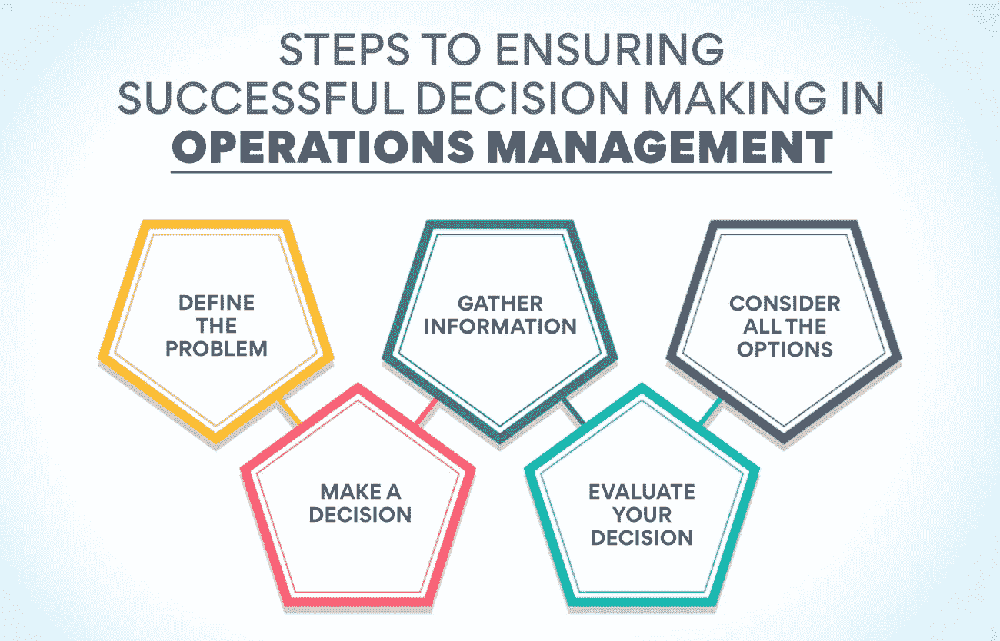
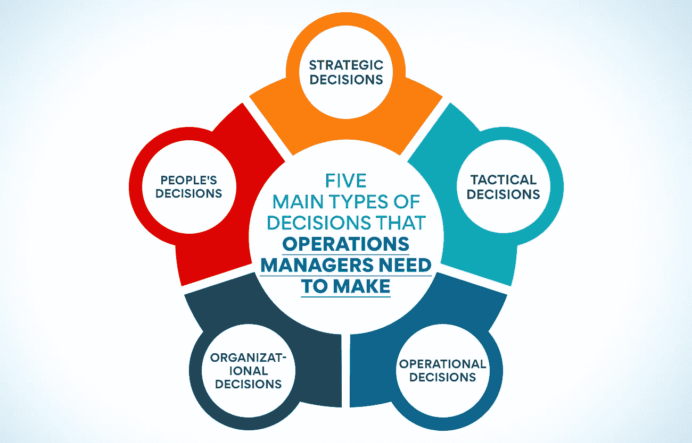

# 运营管理中的决策:要点

> 原文：<https://www.edureka.co/blog/operations-management-decisions>

健全的运营管理(T2)对任何组织的成功都至关重要。如果你做了一个错误的决定，它会波及整个组织。这就是为什么理解运营管理中与决策相关的关键点非常重要。这篇博客文章将讨论你在做运营管理决策时需要考虑的最有影响力的因素。

## 什么是运营管理中的决策？

运营管理是计划、安排和控制组织运营的过程。它包括协调人力和资源来生产商品和服务。

运营管理中的决策是关于有效利用资源生产商品或服务的决策过程。运营管理决策旨在最大限度地提高效率，同时满足客户需求。

运营经理必须做出许多决定，这并不奇怪。事实上，他们每天可能会做出几十个决定。其中一些决策是常规性的，而另一些则更为复杂，需要更大的透明度。

虽然决策并不总是容易的，但它对运营管理来说是必不可少的。决策可能很困难，但运营经理必须迎接挑战。他们需要必要的知识和技能来做出正确的决策，以帮助他们的组织实现其目标。

运营经理负责做出会影响其组织运营的决策。他们需要能够发现问题，制定解决方案，并做出符合组织最佳利益的决策。

## **影响运营管理决策的关键点**

有几个关键点会影响运营管理决策。以下是你需要知道的八个要点:

**确定公司目标:** 运营经理需要知道公司的目标，以便做出与这些目标一致的决策。它将简化操作，更容易实现预期的结果。这没有捷径可走；运营经理必须熟悉业务的各个方面。

**数据驱动分析:** 在[运营管理](https://www.edureka.co/blog/beginners-guide-to-operations-management/)中，决策往往基于数据和分析。运营经理需要能够分析数据并从中获得洞察力，以做出明智的决策。这需要很强的分析能力。

**利益相关者分析:** 运营经理需要能够识别和评估不同利益相关者的利益。这将有助于他们了解其决策的影响，并选择对所有相关方最有利的行动方案。

**成本收益分析:** 没有比做成本收益分析更好的决策方式了。运营经理需要能够在做出决策之前权衡不同选项的成本和收益。这将帮助他们选择对公司最有利的方案。

**风险分析:** 运营经理必须在做出任何决策之前识别和评估风险。这将帮助他们避免潜在的陷阱，并为公司做出最佳决策。例如，如果运营经理正在考虑一个新的行动方案，他们将需要考虑所涉及的风险，并决定潜在的利益是否值得冒险。

**决定范围:** 目标一旦确定，经理需要决定决定的范围。这将有助于他们确定需要做出决定的参数。例如，对于一个全新的计划，他们需要决定需要多少资源以及需要投资多少时间。

**分析可用选项:** 运营经理需要能够在做出任何决策之前识别和评估可用选项。这将帮助他们选择对公司最有利的方案。例如，可能有多个选项可用，但从长远来看，一个选项可能更有价值，即使它需要更多的前期资源。

**做出决策:** 运营经理必须能够快速高效地做出决策。它需要很强的独立思考和在压力下做出决定的能力。它可能还需要运营经理授权进行决策。

## [也可阅读:运营管理中的流程设计是什么？](https://www.edureka.co/blog/process-design-in-operations-management/)

## **确保运营管理中成功决策的步骤**

根据运筹学和管理科学研究所(INFORMS)的说法，决策有五个步骤:

**第一步:定义问题**

做决定的第一步是定义问题。运营经理必须确定问题以及需要如何解决问题。这将帮助他们确定问题的参数，并选择最佳的行动方案。定义问题还将帮助运营经理理解他们的决策的影响及其潜在后果。

**第二步:收集信息**

收集足够的信息对制定战略信息至关重要。经理们需要在这个领域进行研究，找出可行的选择。管理者在做决策时必须考虑成本、时间和资源。一旦收集了所有的信息，管理者就可以做出对企业最有利的战术决策。

第三步:考虑所有选项

第三步是考虑你的选择。在这里，经理们需要考虑如果他们做出一个特定的决定会发生什么。每个选项的风险和回报是什么？这一步是要实事求是，考虑每个决定的可能结果。

**第四步:做决定**

这看起来似乎很简单，但实际上可能相当棘手。管理者必须权衡每一种选择的风险和回报，为他们的经营做出最佳决策。他们必须利用他们的经验和知识做出最好的决定。

**第五步:评估你的决定**

在评估之前，这个决定不是最终的。这一步很重要，因为它让他们看到决策是如何影响运营的。这也让他们从错误中学习，并在未来做出更好的决定。他们应该定期评估您的决策，以确保它仍然是您运营的最佳决策。这将有助于他们改善运营，并在未来做出更好的决策。

## [也读:运营管理的范围是什么？](https://www.edureka.co/blog/what-is-the-scope-of-operations-management/)

## **重要运营管理决策**

运营管理涉及许多决策，但有些决策比其他决策更重要。

**质量管理:** 质量管理决策确保产品和服务满足或超过顾客期望。它是运营管理最重要的方面之一，因为它可以直接影响客户满意度和忠诚度。

设计战略: 设计战略决策包括为如何生产产品和服务制定计划。它包括从决定最佳生产方法到选择合适的材料和供应商的一切。

资源规划运营经理负责制定组织内资源分配的决策。它包括人力资源和物质资源。目标是确保资源得到有效利用。资源规划最重要的一个方面是预测。它是预测未来资源需求的过程。这些信息然后被用来决定如何有效地分配这些资源。

**流程和产能设计:** 运营经理还必须参与流程和产能设计决策。运营经理负责确保设施能够处理所需的工作量，并且流程能够达到预期的质量水平。如果运营经理不参与这些决策，工厂很可能无法满足业务需求。

**库存管理:** 运营管理的另一个关键领域是库存管理。库存管理是关于确保公司在正确的时间拥有正确的库存产品。为了确保公司手头有适量的库存，运营经理需要能够快速有效地做出决策。这是运营管理中最关键的决策，将为您节省大量资金。

**供应链管理:** 经营决策是通过变革过程来创造价值的。运营经理负责高效和有效地利用资源来生产商品和服务。运营经理就技术使用、质量控制、[产能规划](https://www.edureka.co/blog/what-is-capacity-planning-in-operations-management/)和库存管理做出决策。

**人力资源决策:** 运营管理是一个与生产商品和服务有关的商业领域，包括对原材料、设备和劳动力等资源的管理。人力资源永远是运营经理面临的重要决策领域。原因是运营经理必须管理工人以实现公司目标，同时确保员工的安全。通过决策矩阵、SWOT 分析和成本效益分析，运营经理可以做出战略决策。

**调度决策:** 这个决策涉及到为生产过程创建一个时间表。这包括决定何时开始和完成每项任务，以及为每项任务分配多少时间。这一决定至关重要，因为它会影响生产过程的整体效率。它将直接影响交付周期，即生产一件产品所需的时间。

地点决策: 运营经理的决策不仅影响他们工作的公司，也影响他们周围的社区。一个糟糕的决定会导致金钱和工作的损失，而一个好的决定可以创造新的机会和财富。您选择的业务运营地点是您为公司繁荣所做的最重要的决定之一。考虑土地和劳动力的成本、资源的可用性以及靠近市场将有助于做出明智的决策。

## **决策是运营管理的生命线**

运营管理就是做决策。每天，运营经理都面临着直接影响其运营效率和效果的选择。

有些决定很容易，但许多决定很复杂，需要仔细考虑。为了做出最好的决策，运营经理需要了解他们将面临的不同类型的决策，以及在做出每种类型的决策时应该考虑的关键因素。

## **成为运营经理并做出有计划的决策**

《哈佛商业评论》的一项研究发现，善于决策的运营经理成功实现运营目标的可能性是其他人的两倍。

[运营经理的角色](https://www.edureka.co/blog/roles-and-functions-of-operations-management/)是确保公司的运营平稳高效。为此，他们需要能够快速有效地做出决策。

运营经理需要做出五种主要类型的决策:

**战略决策:** 这些是长期决策，将对公司的运营产生重大影响。

**战术决策:** 运营经理做出与其组织日常运营相关的决策。这些决定通常是短期的，对组织的运作有直接影响。

**经营决策:** 经营活动涉及利用资源生产商品和服务。运营决策处理将输入转换为输出的转换过程。

**组织决策:** 组织决策是为了实现组织目标而做出的。运营经理负责资源的有效利用。

**人的决定:** 顾名思义，人的决定都是关于劳动力的。运营经理确保正确的人在正确的时间出现在正确的位置。

每种类型的决策都需要不同的方法，但一些通用原则适用于运营管理中的所有决策。运营经理负责做出最有利于业务目标并为公司带来实质性成果的高效决策。所有重要的决定应该:

*   基于对运营环境的清晰了解
*   有数据和信息支持
*   使用系统的逻辑方法

借助我们的三合一[运营、供应链和项目管理课程](https://www.edureka.co/highered/advanced-program-in-operations-supply-chain-project-management-iitg)，在运营管理领域一飞冲天，并学习如何做出更好的决策。你将拥有按照自己的进度学习的灵活性和自由，并获得运营管理认证，这将使你在这个蓬勃发展的行业中找到一份好工作。你还在等什么？立即开始您的运营管理之旅！

**更多信息:**

什么是运营和供应链管理(OSCM)？

运营管理的目标是什么？

为什么企业需要运营战略？