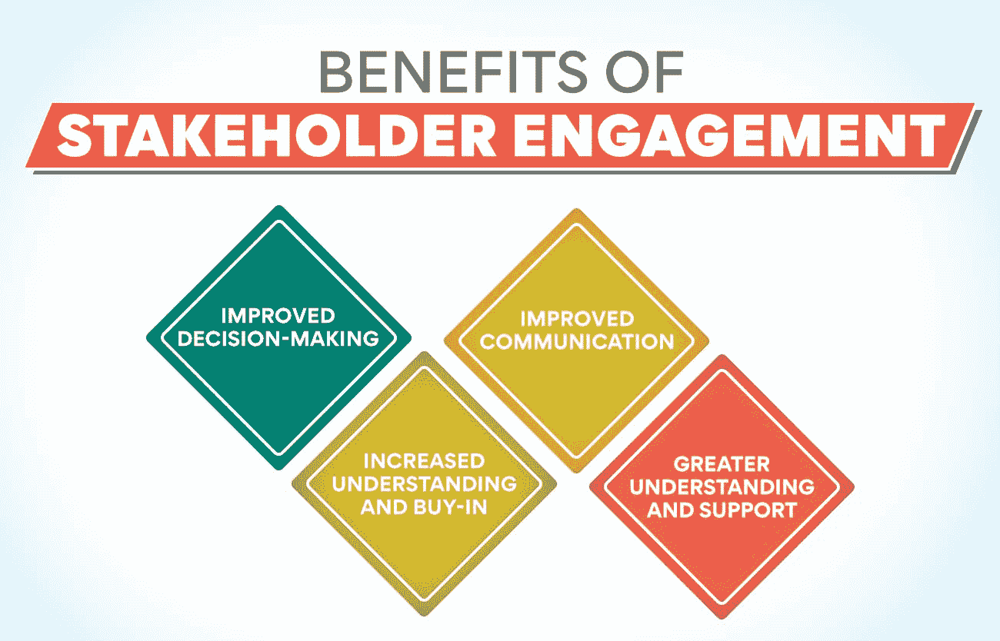
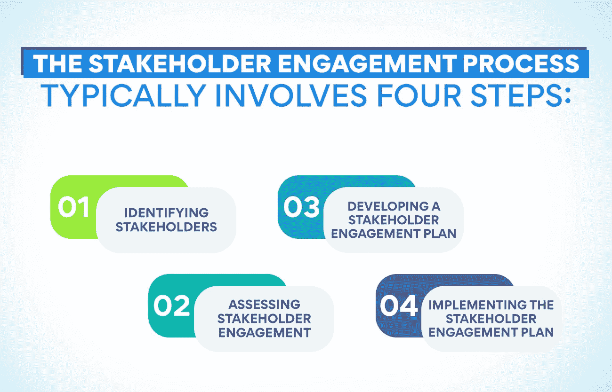

# 什么是利益相关者参与？重要性、规划和实施

> 原文：<https://www.edureka.co/blog/stakeholder-engagement>

什么是利益相关者参与？这是一个与对项目成败有既得利益的人合作和交流的过程。当在一个重要的项目中工作时，与所有的利益相关者合作是很重要的。

谈到利益相关者参与(SE ),许多组织甚至不知道从哪里开始。这是一个复杂的过程，看起来让人不知所措。尽管如此，重要的是要记住利益相关者的参与不是一次性的事件，而是你的组织与其利益相关者之间的持续对话。

在这篇博文中，我们将讨论 it 的重要性，以及规划和实施有效的利益相关者参与策略的技巧。

## **什么是利益相关者参与度？**

利益相关者的参与包括在决策过程中可能受到组织活动影响或对组织活动感兴趣的人。这是一种让人们尽早参与进来的方式，以获得他们的意见和反馈，并确保他们理解和支持所做的决定。

利益相关者的参与可以帮助组织:

*   预测和管理风险
*   改善沟通
*   增加透明度
*   加强利益相关者的关系
*   做出更好的决策

组织必须采用战略方法进行系统工程，这从识别利益相关者开始。一旦确定了利益相关者，组织需要确定利益相关者的利益是什么，以及如何最好地与他们合作。不要忘记，利益相关者的参与过程应该根据组织和特定的项目或计划来定制。

## **好处之 SE**

利益相关者的参与在企业管理过程中占有非常重要的地位。这对企业和客户都非常有利。

SE 有很多好处，包括:

**改进决策:** 通过让利益相关者参与决策，组织可以在不同的事项上做出更好的决策。考虑到所有相关的观点，决策更有可能成功，并得到需要执行决策的人的支持。

**增加理解和认同:** 当利益相关者参与决策过程时，他们会更好地理解为什么要做出决策，也更有可能支持和认同研究结果。

**改善沟通:** SE 可以帮助改善组织与其利益相关者之间的沟通。利益相关者被给予所有的更新，并被允许在他们完全沉迷于这个过程时提供反馈。

**更大的理解和支持:** 利益相关者的参与有助于建立对决策的认知和认同以及对决策的信任。当利益相关者感到他们的意见被优先考虑，并且他们在重大决策中有发言权时，他们更有可能表现出对组织最大利益的尽职调查。

另请阅读:[了解人才管理及其重要性](https://www.edureka.co/blog/talent-management-and-its-importance/)

## **SE 对于战略规划的意义**

SE 流程对于任何成功的战略规划计划都至关重要。利益相关方的参与确保所有利益相关方在规划过程中有发言权，并确保他们的需求和关切得到考虑。此外，利益攸关方的参与建立了对战略计划及其实施的认同和承诺。

有许多方法可以让利益相关者参与到战略规划过程中。一些标准方法包括焦点小组、调查、访谈和公共论坛。选择最适合利益相关者团体和组织需求的程序或程序组合是至关重要的。

系统工程流程应根据每个利益相关方群体的具体需求进行定制。然而，所有利益相关方参与计划中应包含一些共同要素。这些元素包括:

*   确定利益主体参与流程的目的和目标
*   确定将涉及的利益主体群体
*   确定将要使用的参与方法
*   制定沟通计划
*   开展利益主体参与活动
*   评估利益主体参与流程的结果

利益相关者参与流程对于任何着手[战略规划](https://www.edureka.co/blog/strategic-workforce-planning)计划的组织来说都是至关重要的。通过让所有利益相关者参与到这一过程中，组织可以确保其战略计划满足所有利益相关者群体的需求。

## **什么是利益相关者参与战略？**

在商业中，SE 战略指的是一家公司采取的行动和计划，涉及到对其成功或失败有既得利益的重要团体或个人。利益相关者可以是与项目、计划或决策的结果有利害关系的任何人，如客户、员工、股东、供应商、合作伙伴和社区。

利益主体参与流程通常包括四个步骤:

**确定利益相关者:** 第一步也是最重要的一步是确定所有可能会受你的项目、计划或决策影响或对其感兴趣的个人和团体。确定利益相关者可以通过利益相关者映射来完成，这是一个帮助你可视化谁是你的利益相关者，他们的兴趣，以及他们可能如何受到你的项目的影响的工具。

**评估利益相关者参与度:** 一旦确定了利益相关者，下一步就是评估他们的参与度。这包括了解他们的需求和期望，以及确定与他们沟通的最佳方式。

**制定利益相关者参与计划:** 第三步是制定一个你将如何与利益相关者互动的计划。这应包括沟通战略和让利益相关方参与决策过程的具体策略。

**实施利益相关者参与计划:** 最后一步是实施利益相关者参与计划。这包括将你制定的沟通和参与策略落实到位。

利益相关者参与策略应该根据您的项目、计划或决策的具体需求进行微调。利益相关方的参与是一个持续的过程，而不是一次性事件。因此，应该定期审查和更新。

## **利益相关者参与战略的关键要素**

利益主体参与战略包括四个主要元素:

*   倾听并理解利益相关者的需求和期望
*   有效沟通，确保利益相关方了解情况
*   在信任和相互尊重的基础上建立关系
*   通过协商和谈判管理利益相关方的期望。

这些要素中的每一个都有其自身的重要性，但它们共同构成了与利益相关方合作的综合战略。

## **如何与你的利益相关者沟通？**

沟通是 SE 的关键。如前所述，利益相关方的参与过程是持续的、互动的，因此始终保持沟通渠道的畅通至关重要。关于如何与利益相关者进行有效沟通，请牢记以下建议:

沟通要清晰简洁利益相关者的参与是一个复杂的过程。因此，在与利益相关者交流时，保持清晰和简洁至关重要。

对利益相关者的询问做出反应是保持与他们良好关系的必要条件。

**使用不同的沟通渠道:** 有许多其他的沟通渠道，所以使用对你的利益相关方最有效的渠道是很重要的。

**让利益相关者了解情况:** 让利益相关者了解利益相关者参与过程中的进展是与他们保持良好关系的一种方式。

与利益相关者沟通的最佳方式是定期发送利益相关者参与度更新。这将确保他们及时了解流程中的所有最新进展，同时也有助于与他们建立并保持良好的关系。

## **组织在试图与利益相关者合作时面临哪些挑战？**

一个常见的挑战就是简单地开始。很难发现从哪里开始，甚至很难让决策者接受利益相关者参与的重要性。

另一个挑战是规划和开展实际参与活动。这包括从确定与哪些利益相关者合作，到使用什么方法或工具，到如何衡量成功的一切。

最后，一旦参与活动开始，保持势头并确保其持续有效可能是一项挑战。这通常需要持续投入时间和资源，这可能难以为继。

尽管面临这些挑战，se 对于任何想要实现其目标的组织都是至关重要的。通过花时间了解受我们工作影响的人的需求和顾虑，我们可以做出更好的决策，避免潜在的问题，并创建更可持续的解决方案。

另请参阅:[人力资源管理的关键基础知识](https://www.edureka.co/blog/fundamentals-of-human-resource-management/)

## 利益相关者的参与如何成就或毁灭你的企业？

不可否认，利益相关者的参与对任何企业的成功都至关重要。毕竟，没有关键利益相关者的支持，很难实施变革，实现目标，甚至很难开始行动。利益相关者是对你的企业及其成败有既得利益的个人。他们可以是客户、员工、股东，甚至是你的企业所在的社区。

虽然 SE 对所有企业都至关重要，但它对小型企业尤其重要。这是因为小企业通常没有大企业那样的资源。他们可能没有足够的预算进行广泛的市场调查或组建庞大的营销团队。小企业更依赖口碑和个人关系来吸引和留住客户。

所有这些都意味着 SE 对于小型企业来说是必不可少的。但是，小企业如何确保他们有效地做到这一点呢？

SE 是一项持续的活动，让与你的业务有利害关系的人参与影响他们的决策和活动。目标是获得利益相关者的意见并与他们建立关系。

利益相关者的参与对小型企业如此重要，有几个主要原因。首先，它可以帮助你做出更好的决定。当你让利益相关者参与决策过程时，你将能够得到有价值的输入和反馈。这可以帮助你避免做出可能疏远或激怒利益相关者的决定。

第二，利益相关者的参与可以帮助你培养关系。与利益相关者建立牢固的关系对小型企业至关重要。他们可以提供宝贵的网络机会，帮助吸引和留住客户，甚至让你获得资本。

最后，利益相关者的参与可以帮助你为自己的企业创造良好的声誉。当利益相关者感觉他们被倾听，他们的意见被重视，他们更有可能对你的业务做出积极的评价。这将吸引新的客户和合作伙伴，甚至可以增加销售额。

既然你已经知道利益相关者的参与如此重要，那么你如何确保你在有效地做这件事呢？这里有几个小技巧:

*   确保你清楚自己的目标。你想通过利益相关者的参与实现什么？确保你的目标是现实可行的。
*   做好倾听的准备。利益相关者的参与就是倾听他人的意见。你可能不总是同意你所听到的，但是虚心倾听是很重要的。
*   要透明。当你与利益相关者交流时，要诚实和坦率地谈论你的业务。分享好消息和坏消息。
*   履行你的承诺。如果你说你要做某事，一定要做到。这将与你的利益相关者建立信任和信誉。

利益相关者的参与是经营成功企业的关键部分。通过遵循这些建议，你可以确保你有效地做这件事。

## **人力资源专业人员在利益相关者参与中的角色是什么？**

人力资源在利益相关方参与中的作用至关重要。作为员工和管理层之间的纽带，人力资源专业人员处于独特的地位，可以在不同的组织团体之间建立关系和信任。

通过利益相关方的有效参与，人力资源部门可以帮助创造一个积极的工作环境，让员工感到自己受到重视和尊重。这将提高创造力和生产力，减少人员流动。

在规划和实施利益相关方参与计划时，人力资源专业人员应牢记以下几点:

*   定义参与计划的目标。你希望实现什么？
*   确定关键利益相关方。谁将受到该计划的最大影响？
*   制定清晰的沟通计划。您将如何让每个人都了解该计划？
*   设定现实的时间表。不要试图太快实现一切。
*   监控和评估进展。你实现你的目标了吗？有哪些可以改进的地方？

通过遵循这些最佳实践，人力资源专业人员可以在确保利益相关方参与计划成功方面发挥重要作用。

现在你知道人力资源专家在一个组织中起着重要的作用，那么来接替他们的工作怎么样？为了启动你的职业生涯，作为一名人力资源专业人员，花点时间来看看我们的人力资源管理研究生证书，它深入探讨了人力资源管理的问题。

**更多信息:**

[分解人力资源管理的范围](https://www.edureka.co/blog/scope-of-human-resource-management/)

[人力资源管理的关键目标](https://www.edureka.co/blog/objectives-of-human-resource-management/)

[人力资源管理在组织中的作用](https://www.edureka.co/blog/role-of-human-resource-management-in-an-organization/)

[人力资源管理的性质和目标](https://www.edureka.co/blog/nature-and-objectives-of-human-resource-management/)

[人力资源管理的演变:过去和未来](https://www.edureka.co/blog/evolution-of-human-resource-management)