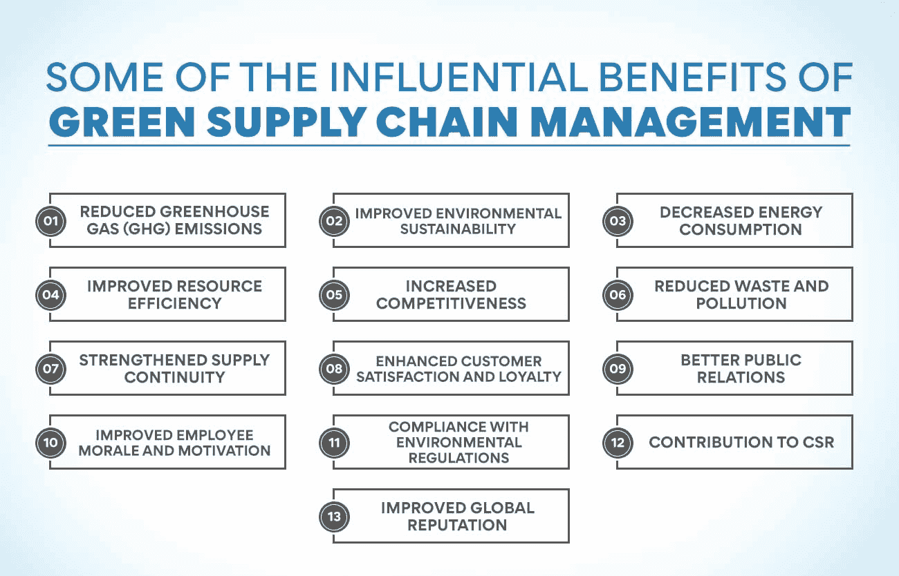
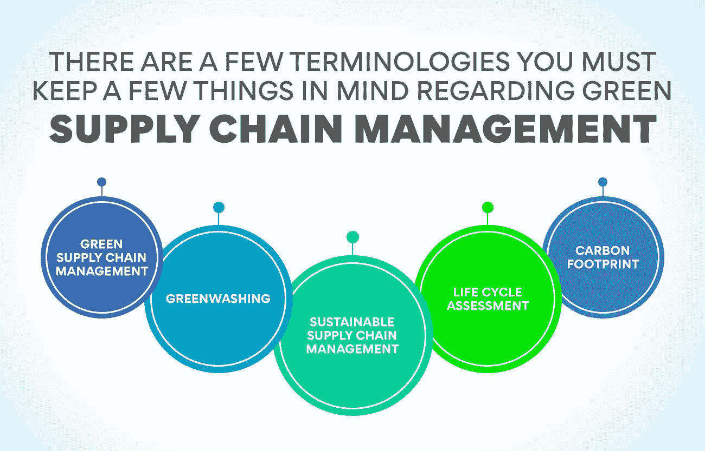

# 绿色供应链管理:它是什么？为什么重要？

> 原文：<https://www.edureka.co/blog/green-supply-chain-management>

绿色供应链管理是可持续发展和减少碳足迹的关键部分。通俗地说，就是管理供应链环境影响的过程。它可以包括从减少能源消耗到回收和堆肥的任何东西。

为什么绿色供应链管理很重要？越来越多的消费者对购买对环境影响最小的产品表现出兴趣。如果企业想要在今天的市场中保持竞争力，他们需要开始实施绿色供应链管理实践。让我们详细了解绿色供应链管理(Green SCM ),看看它是如何造福企业和环境的。

## **什么是绿色供应链管理？**

绿色供应链管理是一套绿色管理实践，旨在帮助企业更可持续、更高效地运营。它有时也被称为可持续供应链管理或绿色物流。

它评估了从原材料采购到制造、分销和交付的供应链中每一个产品和流程的可持续性和环境影响。绿色供应链管理寻求最大限度地减少浪费和污染，节约资源，减少产品和服务的碳足迹的方法。

绿色供应链管理不仅仅是为了环保而环保。这也是为了提高可持续性和运营效率。这是一种全面的绿色方法，考虑到了可持续发展的三重底线:人、地球和利润。

有了绿色供应链管理，企业也可以为他们的企业社会责任(CSR)做出贡献。它帮助公司实现他们的环境目标，并改善他们的公众形象。许多绿色供应链管理计划还有降低成本的额外好处。例如，绿色运输倡议可以减少燃料消耗和节约资金，绿色包装倡议可以减少材料和废物处理成本。

美国制造商协会，绿色供应链管理对公司来说越来越重要。调查发现，近一半的受访者说他们有一个绿色供应链管理计划，另有三分之一的人说他们正在考虑实施一个。

简而言之，绿色供应链管理就是最大限度地减少浪费和污染，节约资源，减少产品和服务的碳足迹。越来越多的企业认识到绿色供应链管理的重要性，并正在实施计划，以提高其可持续性。

如果您对绿色供应链管理感兴趣，我们鼓励您参加我们的课程，[运营、供应链和项目管理高级证书。](https://www.edureka.co/highered/advanced-program-in-operations-supply-chain-project-management-iitg)这一互动且引人入胜的课程将为你打下坚实的供应链管理基础。

## 绿色供应链管理可能带来哪些好处？

绿色供应链管理会给公司和社会带来很多好处。绿色供应链管理带来的一些有影响力的好处是:

**减少温室气体(GHG)排放**

化石燃料燃烧时会释放出二氧化碳(CO₂)和甲烷(CH₄)等温室气体。绿色供应链管理可以通过推广使用绿色能源、绿色运输方式和节能制造流程来帮助减少这些气体的排放。定期采用绿色供应链管理实践可以随着时间的推移显著减少 GHG 排放量，这将有助于缓解气候变化。

**改善环境可持续性**

绿色供应链管理实践有助于提高公司运营的环境可持续性。这是因为绿色供应链管理实践通常会减少资源消耗、废物产生和提高能源效率。反过来，这些好处有助于减少公司的环境影响，提高其整体可持续发展的表现。

**降低能耗**

很明显，绿色供应链管理实践将会降低能源消耗。这是因为绿色实践通常围绕着更有效地利用资源这一事实。换句话说，绿色实践旨在用更少的能源消耗做更多的事情。因此，有理由认为绿色供应链管理会降低整体能源消耗。

**提高资源效率**

不言而喻，绿化你的供应链会使它更节约资源。毕竟，绿色运营的主要目标之一是最大限度地减少浪费和优化流程。通过与绿色供应链合作伙伴合作，你可以确保他们也致力于提高资源效率和减少浪费。还有可能分享最佳实践，相互学习，以推进绿色运营。

**竞争力增强**

在当今的商业环境中，环保不再只是一种选择，而是一种必须。绿色供应链可以帮助公司提高利润，增加客户群，从而为公司带来竞争优势。被视为绿色和可持续发展的企业将在未来蓬勃发展。因此，保持领先地位并在供应链中采用绿色实践是至关重要的，这将使企业经得起未来考验。

**减少浪费和污染**

每个企业都应该寻找减少浪费和污染的方法，绿色供应链管理可以提供帮助。与绿色供应商合作可以减少整个供应链中产生的废物量。这不仅有利于环境，而且可以节省商业资金。减少生产和包装中的浪费可以增加利润，因此这对所有相关人员都是双赢的。因此，绿色供应链管理对环境有益，并且具有良好的商业意义。

**加强供应连续性**

许多绿色计划提高了供应链效率，减少了浪费，从而提高了可靠性并节约了成本。例如，一家公司可能选择采购当地生产的材料，以减少运输成本和排放。它将增加供应链的连续性，而不需要做任何大的改变。

**提高客户满意度和忠诚度**

在许多情况下，绿色计划可以提高客户满意度。例如，使用可持续实践制造的产品可以被视为更值得信赖且质量更高。它可以提高客户忠诚度和重复业务。顾客会倾向于他们认为对环境负责的公司。

**更好的公共关系**

走向绿色也可以改善公司的公众形象和声誉。如果公司处于高污染行业，情况尤其如此。实施绿色计划可以向公众表明公司致力于减少对环境的影响。因此，公司可能会发现更容易吸引和留住客户。很明显，绿色供应链管理可以积极影响公司运作的各个方面。随着世界越来越关注可持续发展，企业需要了解并在其供应链中实施绿色实践。

**提高员工士气和积极性**

不仅仅是客户满意度，绿色供应链管理也与员工的士气有关。积极性的提高直接关系到员工的工作效率。绿色供应链管理政策可以通过为员工提供参与绿色计划的机会并认可他们的努力来提高员工的积极性。他们将能够看到自己工作的切实成果，并对为更可持续的未来做出贡献感到满意。这些发现还会激发工作之外的绿色行为，这对环境会产生积极的连锁反应。

**符合环境法规**

许多国家都有企业必须遵守的环境法规。这对公司来说是一个挑战，尤其是如果他们在多个国家经营，有不同的法规。绿色供应链管理可以帮助公司满足这些要求，同时减少对环境的影响。有了绿色供应链管理，企业可以确保在整个供应链中使用环保做法。

**对企业社会责任的贡献**

绿色供应链管理不仅有利于环境，也有利于公司的声誉。它可以为公司的 CSR(企业社会责任)计划做出贡献。绿色供应链有助于公司被视为对环境负责并致力于可持续实践。这将对公司的品牌和声誉产生积极影响。

**提高全球声誉**

在当今的商业世界，消费者和其他利益相关者越来越有兴趣与致力于环境可持续发展的公司合作。因此，绿色供应链管理有助于提高公司在这些重要群体眼中的声誉。当一家公司绿色化其供应链时，它通常会从消费者和其他企业那里获得更好的声誉。这是因为绿色实践对公众越来越重要，不采用绿色实践的公司被视为落伍。此外，绿色供应链管理可以帮助公司与其供应商建立更密切的关系，因为他们共同努力实现一个共同的目标。

## **面向供应链经理的绿色供应链管理**

如果你渴望成为一名专业的供应链经理，你必须了解绿色供应链管理的概念，以及如何在你的企业中实施。与你的团队和客户谈论绿色供应链管理是很重要的。作为供应链经理，关于绿色供应链管理，有几个术语你必须牢记在心:

*   **绿色供应链管理:** 供应链流程的绿色化，以减少负面环境影响
*   **绿洗** :对产品或服务的环境效益做出虚假或误导性声明的行为
*   **可持续供应链管理:** 一种考虑到社会、经济和环境问题的整体供应链管理方法。
*   **生命周期评估:** 一种评估产品或服务在其整个生命周期中对环境影响的工具
*   **碳足迹:** 对个人、组织、事件或产品排放的二氧化碳(CO₂)和其他温室气体的测量。

你想学习绿色供应链管理的基础知识吗？查看我们的课程，[运营、供应链和项目管理高级证书](https://www.edureka.co/highered/advanced-program-in-operations-supply-chain-project-management-iitg)，通过灵活互动的课程计划，让您熟悉供应链管理的本质。

## **绿色供应链管理实践**

公司可以采用许多绿色供应链管理实践。一些标准做法包括:

*   提高能源效率
*   回收材料
*   使用绿色交通工具
*   使用回收或可回收的包装材料
*   与绿色供应商合作
*   减少整个供应链中的浪费
*   实施绿色制造流程
*   使用绿色能源

每个公司都有不同的绿色供应链管理目标，这取决于他们的具体情况。然而，所有公司都可以从降低成本、提高效率和减少环境足迹中受益。它不仅有潜力改善公司的底线，也有潜力改善公司与供应商、消费者和其他利益相关者的关系。实施绿色供应链管理实践可能是一个挑战，但回报绝对是值得的。

## **拥有强大绿色供应链管理的公司**

许多全球性公司已经在其供应链管理中采用了绿色实践。

例如，耐克从 20 世纪 90 年代初就开始使用绿色供应链管理。该公司有一个绿色。供应链管理团队负责确保其供应商符合耐克的绿色制造标准。

耐克还为其供应商提供绿色供应链管理培训，以便他们能够学习如何减少对环境的影响。

其他采用绿色供应链管理的公司包括 IBM、惠普和戴尔。

这些公司都在供应链中实施了绿色措施，以减少对环境的影响，提高可持续性。

## **底线**

绿色供应链管理不仅对环境有益，对商业也有好处。在供应链中采用绿色实践的公司通常会看到成本的降低和效率的提高。如果更多的公司在其供应链中采用绿色做法，我们将会看到污染的减少和资源使用量的减少。

绿色供应链管理是一个不断发展的领域，那些能够谈论绿色供应链并在业务中实施绿色实践的人将走在时代的前列。如果你想了解更多关于绿色供应链管理的知识，请查看我们的[运营、供应链和项目管理](https://www.edureka.co/highered/advanced-program-in-operations-supply-chain-project-management-iitg)高级证书。本课程将使你熟悉关于绿色供应链管理的一切，从环境可持续性的基础到更复杂的绿色供应链管理策略。