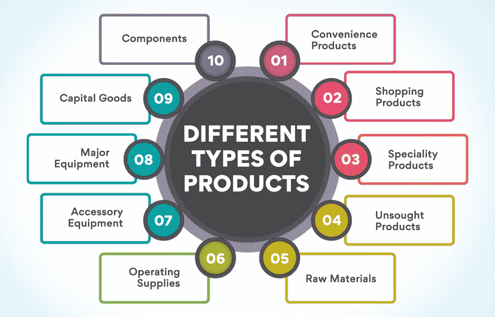
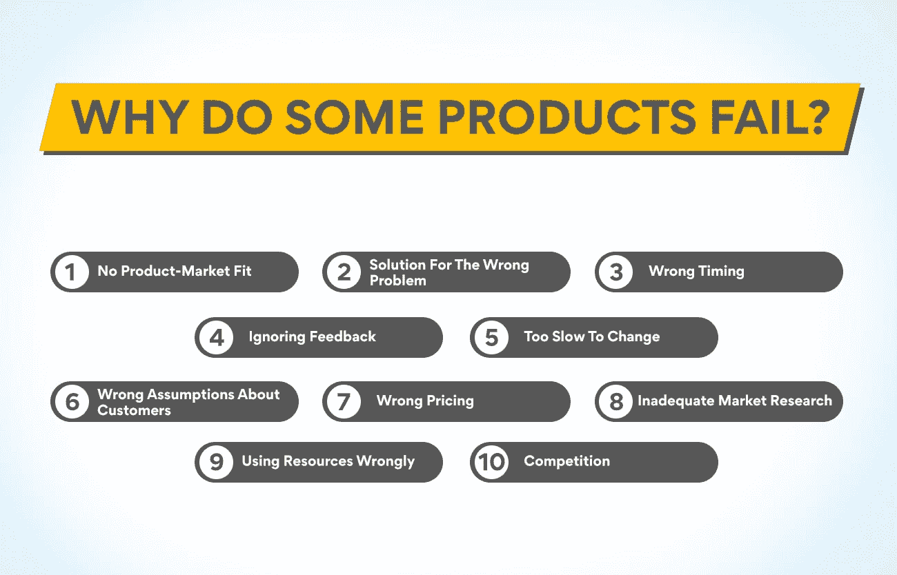

# 什么是产品？含义、示例、定义和特征

> 原文：<https://www.edureka.co/blog/product>

在我们的一生中，几乎所有人都会无数次地谈论产品。营销人员可能比其他人更经常使用这个术语。公司领导层依靠他们来实现他们的财务目标。消费者用它们来满足他们的各种需求。生产商一直在努力改进它们，以增强消费者的体验。他们是赋予金钱价值的人。但是对于一个有抱负的产品经理来说，肤浅地了解它们是必要的。他们必须知道什么是产品以及它在他们职业生活中的重要性。

## **什么是产品？**

为产品寻找一个简单的定义可能是不明智的。根据项目的用途，可以用不同的方式对其进行定义。产品是生产出来的任何东西。这是一个数学函数的结果。一个想法也是某人思考过程的产物。但我们在这里感兴趣的是，它对企业意味着什么。产品是出售给消费者以满足其需求的物品。它们可以是物理的、虚拟的或混合的。

一个产品必须为顾客提供价值。他们必须能够从中受益。用户必须从产品中获得优质服务。所有的产品都是有成本的，公司从向消费者收取的价格中收回成本。这些项目为公司提供利润，为许多人提供生计。虽然在早期，人们用它们来交换其他东西，但今天，几乎所有的产品都是用来换钱的。一部分卖给消费者；另一些卖给了用它们生产其他产品的公司。

对产品的研究是一个庞大的课题。人们可以在产品管理高级管理人员证书课程中学到很多关于它们是如何生产和营销的知识。有兴趣精通这一领域的人可以访问我们的网站，了解更多关于这门课程的信息。

## **不同类型的产品**

虽然世界上有数以百万计的产品，但它们可以很容易地分为十类。前四个与消费品有关，其余的是工业产品。分类是基于目标买家、买家行为和物品的用途进行的。任何研究产品的人都有必要了解它属于哪一类。

1.  **便利产品**

它们是人们筋疲力尽时经常购买的物品。消费者在购买这些产品时不会多想。人们会更频繁地购买这些物品，而且通常价格低廉、必不可少且容易获得。买家一般不会更换他们购买的品牌，也不会与市场上的其他类似产品进行太多比较。向顾客介绍这样一款产品很难，必须有特别的东西让顾客去尝试。消费者只有在没有常用品牌的情况下才会购买新品牌。

营销这种产品的方法之一是在没有太多信息的情况下制作引人注目的广告。另一个吸引顾客购买的方法是将新品牌放在超市收银台附近。人们对所有便利产品的看法不尽相同。可能有些商品买家会更换品牌，而在其他情况下，人们会更喜欢坚持使用他们的常规商品。为了更好地理解这一点，这些商品可以进一步分为三类。

主食——这些是人们最常购买的物品。买家通常会坚持使用相同的品牌，因为这样可以节省很多时间。

冲动购买——他们不会出现在购物清单上。顾客在商店里看到这些东西，由于突然的欲望而决定购买。

**紧急采购**——这些项目也不会出现在购物清单上。但是人们在看到这些物品之前就知道他们的需求。它们不同于冲动购买，因为这些商品是对问题的回答，而不是渴望。

**同时阅读:[如何成为更好的产品经理:10 大技巧](https://www.edureka.co/blog/how-to-become-a-better-product-manager-top-10-tips/)**

2.  **购物商品**

人们区分购买日常必需品(如食品杂货)和“购物”。该术语通常指购买衣物、设备、家具等物品。汽车和房地产等昂贵的产品也属于这一类。人们在购买这些物品时会做出个人选择。此外，像这样的产品并不经常被购买，所以人们会花大量的时间来查看选项并进行比较。质量、功能、价格、风格和适用性等各种因素都会影响购买。

随着购买者花费大量时间研究产品，公司得以影响他们。你可以通过[营销](https://www.edureka.co/blog/steps-to-create-a-successful-go-to-market-strategy-for-product-managers/)向客户提供大量信息。公司可以利用广告突出他们的产品优于竞争对手的特点。为此，营销团队可以使用各种数字平台。通过网站和社交媒体平台营销内容可能是最好的方式之一。影响现有客户来传播产品的好处是另一种有效的方式。这类产品还可以进一步分为两类。

**同质产品**–这些产品是顾客认为除了价格之外其他方面都相似的产品。家用电器就是这类产品的典型例子。

**异质产品**——消费者认为同类产品在质量或功能上互不相同。这种差异可能是真实的，也可能是感觉到的。这类产品使公司能够突出产品的质量，而不是集中在价格上。对这些商品有不同的看法有助于为不同的顾客推荐合适的商品。

3.  **特产**

这些是具有独特特征或强烈品牌认知度的商品。特色产品是独一无二的产品，当涉及到这些商品时，顾客通常不愿意改变忠诚度。人们一般不会改变他们购买的汽车的品牌。美食杂货和电子产品也是如此。提供这种产品的公司面临的挑战是不断提供同一产品的更好版本，让顾客反复购买。该公司还必须确保产品跟上最新的趋势和技术。

4.  **未购买的产品**

许多人们通常不需要的产品都属于这一类。要么是买家觉得没有必要购买它们，要么是不知道它们的存在。得益于良好的营销，这些商品中的许多已经成为人们经常购买的商品。属于这一类的一些产品有室内报警器、电池和参考书。微波炉是这类产品中的一种，并且经常被购买。营销人员已经能够将这类产品框定为消费者的必需品。对这些产品来说，积极的营销是必要的。

从消费品中，我们现在把重点转移到属于工业品类别的产品上。

5.  **原材料**

矿物、木材和牲畜等许多物品都属于这一类。顾名思义，这些不是最终产品，而是用于制造成品。此分类中的产品在转化为最终产品时会失去其独有的特性。生产商把这些产品卖给另一个行业，这个行业用这些产品为消费者制造商品。这类产品的大部分营销仍然隐藏在公众视野之外。老百姓甚至看不到这些产品的大部分。

6.  **组件**

制造商还将这些产品出售给另一家公司，后者用这些产品制造成品。然而，这些项目不会被转换成任何不同的东西。它们保持不变，但是它们本身不能为消费者提供任何益处。购买成品的人看不到它们。像那些生产芯片组和微处理器的公司很少宣传他们的产品。他们的品牌名称也会出现在最终的产品上。大多数时候，零部件的销售是基于价格和服务，而不是品牌名称。

7.  **资本货物**

这些是在生产过程中有用的产品。重型机械、建筑、工具和办公设备都属于这一类。这个分类中的产品通常只被用户购买一次。这意味着制造商必须找到大量的客户来实现其财务目标。这就是中介发挥作用的地方。这些公司还帮助制造商提供货物的安装和服务。

8.  **主要设备**

这些是公司用来生产其他商品的制造设备。机械、车辆、计算机等。就是这种商品的例子。甚至有助于加工或销售商品的小玩意也属于这一类。

9.  **附属设备**

这些工具包括帮助维护制造机器的工具。这些不同于主要设备，因为它们不直接帮助制造或加工一个项目。这些商品通常寿命较短。

10.  **操作用品**

此类别下的产品帮助公司的日常运营。固定零件和备件属于这一类。一家公司经常购买这些物品，因为它们的寿命很短。

在产品管理高级管理人员证书课程中，你一定可以学到更多关于各种产品及其实例的知识。请访问我们的网站，了解有关该计划的更多信息，以及它如何帮助您成为高效的产品经理。

既然我们已经看到了不同类别的产品，难道我们不应该知道一个产品是如何进入市场的吗？是什么触发了新产品的创造？这个发展过程有哪些阶段？你会在这个博客里找到所有的答案。产品经理参与新产品开发的所有阶段。

## **新产品开发流程**

所有产品都是由[产品经理](https://www.edureka.co/blog/what-is-product-management/)头脑中产生的想法的结果。这些想法来自于对客户问题的理解，并试图为他们找到解决方案。从一个想法到产品进入市场的过程可以分为七个阶段。

**想法产生**

在这一阶段，重点是提出许多有助于解决顾客问题的想法。这里的重点是解决买家的问题，而不是开发一个产品。一家公司必须找出并分析它能够解决的人们所面临的问题。团队必须列出所有此类问题，并根据重要性和紧迫性对其进行优先排序。公司必须提出所有问题的解决方案，并列出清单。这些必须缩小到几个有潜力的新产品开发。

**创意筛选**

所有的想法都摆在桌子上，选择成功可能性最大的一个。仅仅选择最好的想法是不够的。也必须是可行的。公司必须能够利用现有资源生产该产品。即使需要新的资源，也有必要权衡成本和产品将为公司带来的收益。该组织还必须关注竞争对手，看看新产品是否能与现有产品竞争并吸引顾客。

**概念开发和测试**

在开发新产品之前，公司应该优先考虑开发一个想法和用户故事的详细版本。团队必须计算痛苦与收获的比率。这意味着他们必须比较创造产品的努力和它将提供的利益。团队必须看看竞争对手的产品缺少什么，他们能给新产品带来什么改进。他们必须准备一份价值主张图，并将其展示给选定的客户。项目经理必须向[利益相关方](https://www.edureka.co/blog/stakeholder-engagement)提交一份客户反馈报告。

**市场策略**

市场策略就是找到接触目标受众的理想方式。在这里，必须分析并最终确定产品、价格、促销和位置。第一步，团队必须根据概念测试报告完成产品。在定价时，公司必须考虑产品的成本和类似商品的销售价格。公司必须推广该产品的独特之处，并确保其能传达给目标受众。它必须传达产品如何解决客户的主要问题。

**产品开发**

下一步是通过生命周期的不同阶段开发产品。团队首先构建一个原型，并与涉众分享，以展示它的样子。下一步，创建一个具有必要特性的最小可行产品。这将解决客户的问题，但不具备全部功能。引入这样一个版本有助于公司从项目的实际用户那里获得反馈。公司应该使用敏捷产品开发方法，因为它允许一步一步地添加功能。

**部署**

一旦制定了 MVP，就该在现场市场部署产品了。质量保证团队确保产品运行良好。随着客户接受度的提高，新功能与现有功能相结合。执行测试是为了确保产品的功能符合预期。开发人员测试新功能的性能以及它们与现有功能的交互。评估性能的手动测试已经完成。一旦结果令人满意，产品就可供客户使用了。

**也读:[什么是产品策划，是怎么做的？](https://www.edureka.co/blog/what-is-product-planning-and-how-is-it-done/)**

**市场进入**

是时候将产品商业化了。必须注意谈论的是概念，而不是物品的特征。顾客想知道它如何让他们的生活变得更轻松，而不是商品有什么独特之处。公司必须推销产品独特的销售主张。品牌还必须有独特的信息。它必须代表品牌，必须吸引顾客。营销团队必须开发能让顾客想尝试产品的内容。公司必须利用一切途径向目标受众宣传该产品。

产品的旅程不会随着进入市场而停止。正是在这之后，产品的活动才为顾客所知。公司仅仅推出产品是不够的。他们必须坚持到底，直到一个项目不再给客户或公司带来任何好处。一旦产品被引入市场，产品经理就该想办法通过增加利润来提高其性能。这是我们进入物品旅程下一阶段的地方。

**市场增长**

在这个阶段，顾客已经接受了产品，并定期购买。它的需求越来越大，公司从中获得了更多的利润。此时，营销策略从获得用户的注意转移到建立品牌存在。是时候告诉顾客为什么他们必须选择你的产品而不是其他产品了。公司会在这个阶段给产品增加一些功能。他们还将开设更多的支持中心，开始为客户提供更好的服务。销售网络正在扩大，以覆盖更多的人。

**到期日**

这是销售开始稳定而不是快速增长的阶段。随着最初对该产品的兴奋逐渐消退，在市场上保持领先地位将变得困难。此时，营销团队必须开始强调使产品区别于竞争对手的特征。创造意识的阶段已经结束。随着生产成本的下降和稳定的销售，可能会有减少对该产品关注的趋势。但这是改进产品并保持其相对于其他产品的优势的时候了。

**拒绝**

这是任何产品的最后阶段。市场上的所有商品都有寿命，销量开始下降。即使付出很大努力，也很难保持产品畅销。这有各种各样的原因。顾客可能已经失去兴趣，转而购买市场上的新产品。产品本身也会过时。人们会记得 VHS 磁带是如何被 DVD 取代的，现在即使是 DVD 也正在退出市场。市场上所有的商品都是如此。

我们已经看到了产品生命周期的不同阶段。任何一个想成为产品经理的人，都必须深入主题，产品管理高级执行官证书课程就是答案。请访问我们的网站，了解课程教授的内容，以及参加课程会有什么好处。

## **为什么有些产品会失败？**

仅仅知道一种产品是如何进入市场并如何成长的是不够的。一个有抱负的项目经理还必须知道一些项目未能成功的原因。

**没有适合市场的产品**——如果一个产品必须起飞，它必须为你关注的市场提供正确的价值。没有这一点，产品肯定会失败。

**错误问题的解决方案**——产品解决一个问题是不够的。在你的市场中，必须有足够多的人面对具体的问题。

**错误的时机**——许多产品失败是因为公司花了太长时间来完善它们。当其他公司推出一种产品时，他们会从客户那里获得反馈并加以改进。

**忽视反馈**——客户反馈非常重要。忽视它会导致公司相信它的产品是完美的，不需要任何改变。这可能会导致用户拒绝它。

**改变** 太慢——从用户那里得到反馈是不够的。组织必须迅速做出必要的改变来满足顾客。延迟会导致产品在最初几天失败。

**关于客户的错误假设**–有时，关于客户将如何使用产品的假设可能是错误的。定期反馈有助于改变这种情况。

**错误的定价**——定价过高或过低都会在产品起飞前将其扼杀。顾客不会接受太贵的产品。如果价格太低，公司不会受益。

**不充分的市场调查**——不了解市场会导致推出错误的产品，并最终导致失败。

**错误地使用资源**——将金钱、人力和时间等宝贵资源用于错误的目的也会导致产品销售失败。

**竞争**——如果公司不能迅速升级产品，使其独一无二，竞争就会扼杀一个产品。

关于一个产品是如何诞生的，以及它是如何在市场上取得成功的，还有很多可以说的。[产品管理高级管理人员证书课程](https://www.edureka.co/highered/advanced-executive-program-in-product-management-iitg)是了解更多信息的最佳途径。请访问我们的网站，了解该课程将如何帮助您成为一名高效的产品经理。

## **总结**

一个产品的成功很大程度上取决于产品经理及其团队的效率。[项目经理](https://www.edureka.co/blog/product-management-frameworks)需要不断了解市场动态和项目表现。这些专业人员需要很多技能来很好地执行他们的工作，参加一个好的课程可以很好地装备他们。

## **更多信息:**

[11 个重要的产品管理指标和 KPI](https://www.edureka.co/blog/product-management-metrics)

[产品管理学习-关键领域](https://www.edureka.co/blog/product-management-learning)

[制定优秀产品战略的指南](https://www.edureka.co/blog/how-to-formulate-an-excellent-product-strategy/)

[新时代产品开发过程的 7 个动态阶段](https://www.edureka.co/blog/dynamic-stages-of-the-new-age-product-development-process/)