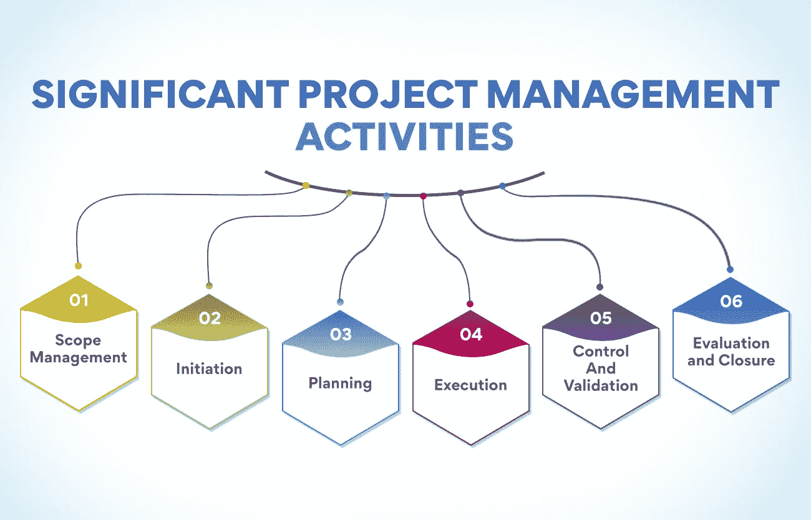
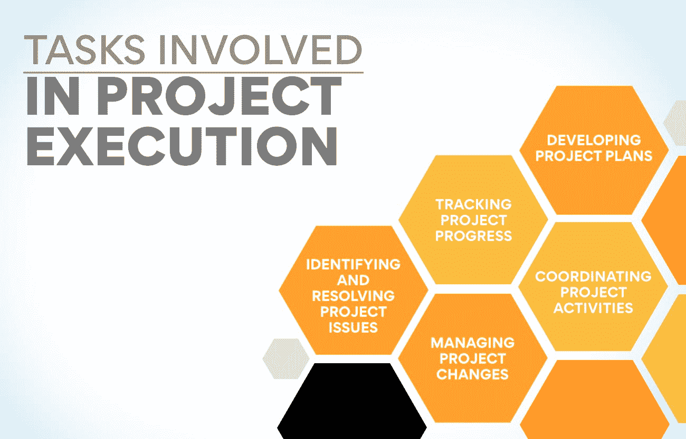

# 主要项目管理活动——你必须知道

> 原文：<https://www.edureka.co/blog/project-management-activities>

有没有想过大型项目的项目管理背后是什么？涉及到如此多的移动部件和人员，以至于要跟踪每一件事都很困难。 作为一名项目经理，了解项目中发生的所有主要项目管理活动是至关重要的。这将帮助你保持有组织性，并确保一切顺利进行。这篇博文将讨论每个项目经理都应该知道的关键项目活动。

## **项目管理活动的重要性**

作为项目经理，了解确保项目成功所需的不同项目管理活动至关重要。不同的项目活动允许项目经理跟踪进度，与[利益相关者](https://www.edureka.co/blog/stakeholder-engagement)沟通，并做出将影响整个项目的决策。

虽然项目经理可以执行许多项目管理活动，但有些活动被认为比其他活动更重要。重要的是要理解每个项目都是不同的，所进行的项目管理活动将基于项目的特定需求。

每个项目经理都应该知道的一些最重要的项目管理活动包括:

*   确定项目范围
*   创建项目进度表
*   跟踪项目进展
*   与利益相关者沟通
*   管理项目风险

这些项目管理活动中的每一项都被进一步划分为任务，为了项目的成功必须完成这些任务。

全球每年在项目和项目管理上花费 15 万亿美元

这些项目中有 70%失败了

这意味着项目经理必须意识到交付成功项目的重要活动。

无论是专业人士还是有抱负的项目经理，我们在运营、供应链和项目管理方面的高级证书将为每个人提供一个完美的开端，推动他们的职业朝着正确的方向发展。

## **重大项目管理活动:已解释**

任何项目，无论大小，都会有许多不断发展的动态。那只是野兽的本性。作为项目经理，你的工作是意识到这些活动，并理解它们如何影响你的项目。

这里有一些你应该知道的最重要的项目管理活动:

**范围管理**

这完全是关于定义和控制项目的范围，包括确定项目的可交付成果，定义完成所有可交付成果所需的工作，并确保项目中只包括授权的工作。它将忽略项目变更，并确保它们得到控制和批准。

作为一名项目经理，熟悉范围管理的所有方面是很重要的。这是必不可少的项目管理活动之一，因为它确保您的项目保持在正轨和预算之内。

范围管理步骤:

*   定义项目的可交付成果
*   说明完成任务所需的工作
*   控制和批准项目变更
*   监控项目进度，确保其不偏离轨道

**启动**

这是项目经理开始组建团队和制定项目计划的地方。这是项目管理中最关键的阶段，因为它为整个项目定下了基调。在此阶段，项目经理应该与风险承担者协商，以清楚地理解项目目标。

项目启动将使项目步入成功或失败的轨道，因此必须做好。项目经理主要负责确保咨询所有项目干系人，并确保项目目标明确。毕竟，如果项目经理不知道项目应该实现什么，他们怎么能希望实现它呢？

项目启动涉及的任务:

**制定项目章程:** 这份文件将作为你项目的基础。应该清楚地陈述项目目标、范围、时间表和预算。

**进行利益相关者分析:** 为了确保你的项目成功，你需要了解所有项目利益相关者的需求和期望。这将帮助你制定一个沟通计划，并确保每个人都在同一页上。

**制定项目范围说明书:** 该文件将概述项目可交付成果和里程碑。必须非常具体和详细，以避免范围蔓延。

**创建项目进度表:** 这将显示每个项目交付的截止时间。当务之急是起草一份考虑到可用资源的切实可行的计划。

识别项目风险: 及早识别潜在风险非常重要，这样你才能制定风险管理计划。

**制定项目预算:** 每个项目都需要一个预算来跟踪开支，控制成本。

召集项目团队: 在这里，你将召集一群拥有必要技能的技术人员，为项目做出贡献并实现目标。

**创建沟通计划:** 该文件将概述如何与项目干系人共享项目信息。

**获得项目发起人批准:** 项目发起人是对项目负有最终责任的个人或组织。他们需要签署项目章程、范围声明和预算。

项目启动是项目管理的一个关键阶段，做好它至关重要。通过这些步骤，您可以确保项目有一个良好的开端。

**也读作:[项目管理基础讲解](https://www.edureka.co/blog/project-management-fundamentals)**

**策划**

规划是主要的项目管理活动之一。它包括创建项目计划，项目计划是概述项目所有任务和目标的文档。项目经理是制定项目计划并确保计划得以执行的人。

在这个过程中，项目经理必须首先确定项目的目标，然后制定一个活动时间表。项目经理还必须确定需要哪些资源以及如何使用这些资源。

项目计划是一份战略文件，应该随着项目的进展而更新。使项目计划保持最新是至关重要的，这样参与的每个人都知道项目的当前状态，并可以做出必要的更改。

项目规划涉及的任务:

定义项目: 一个计划的好坏取决于它要实现的目标。首先要明确你需要完成的目标。

**创建项目进度表:** 项目经理必须制定一份考虑到项目中所有要完成的任务的进度表。该计划是通过从项目的截止日期向后工作而创建的。

确定项目资源: 项目经理必须确定项目需要哪些资源，以及如何使用这些资源。它包括人力资源、物力资源和财力资源。

**创建项目预算:** 项目经理负责创建考虑了与项目相关的所有成本的预算。这包括项目成本、间接成本和间接成本。

**分配资源:** 一旦项目经理确定了所需的资源，就必须将这些资源分配给项目。它包括分配任务、订购材料、预留空间和设备。

**监控项目进度:**[项目经理](https://www.edureka.co/blog/how-to-become-a-better-project-manager-top-10-tips/)必须监控项目进度，并在必要时对项目计划进行修改。它包括跟踪项目里程碑、更新项目进度和调整项目预算。

项目规划是一项不容忽视的重要项目管理活动。通过花时间对项目进行正确的规划，您可以避免未来的许多问题。

**执行**

这是项目团队完成项目可交付成果的地方。它始于[项目规划](https://www.edureka.co/blog/what-is-product-planning-and-how-is-it-done/)，止于项目收尾。在此阶段，项目经理与项目团队合作，确保这些项目活动在预算内并根据项目规范及时完成。

执行就是完成项目工作。但这不仅仅是完成项目工作，也是正确地完成项目工作。这意味着确保项目活动按照规格和项目预算完成。为此，项目经理与项目团队一起制定项目计划，跟踪进度，并确定和解决项目问题。

项目执行涉及的任务:

制定项目计划 包括创建项目进度表、确定项目任务和估算项目成本。

**跟踪项目进度:** 当项目活动正在进行时，项目经理跟踪项目进度，以确保所有的项目交付都在正轨上。它包括创建项目报告和更新项目时间表。

**识别和解决项目问题:** 在整个项目中，项目经理与项目团队一起识别和解决项目问题。这里涉及的活动是识别项目风险和制定风险缓解计划。

管理项目变更: 这完全是关于项目范围蠕变管理。随着项目活动的进行，项目经理跟踪进度并识别项目变更。一旦项目变更被批准，项目经理与项目团队一起将变更纳入项目计划。

**协调项目活动:** 这包括与项目干系人合作协调项目活动。项目经理还与其他项目经理合作，以确保多个项目的项目行动协调一致。

管理项目风险:随着项目活动的进行，项目经理识别项目风险并制定风险缓解计划。

没有项目的充分执行，项目注定会失败。这就是为什么项目经理需要密切参与每个项目活动，从项目规划到项目收尾。

**也可阅读:[为什么 PM 工具对项目成功至关重要？](https://www.edureka.co/blog/pm-tools)**

**控制和验证**

作为项目经理，你需要了解确保项目成功的各种活动。控制和验证是项目管理的两个最关键的方面，必须仔细考虑。

控制包括确保所有项目活动按计划进行。这包括跟踪进度，确保任务按时完成，并确保遵守项目预算。相反，确认是关于确保项目可交付成果满足要求的标准。它包括测试项目的可交付成果，并从涉众那里获得反馈。

控制和验证对于确保项目成功都是必不可少的。作为一个项目经理，你必须在这两个方面都保持警觉。如果你漏了一个，可能会严重影响整个项目。

**评估和关闭**

一旦项目完成，花些时间反思哪些进展顺利，哪些可以改进是很重要的。这种反馈可以用于通知未来的项目，并帮助项目经理避免犯同样的错误两次。

项目经理还应该向团队汇报项目的结果。这是一个庆祝成功和从失败中学习的机会。这被视为团队成员对[项目管理过程](https://www.edureka.co/blog/project-management-processes-and-phases-explained/)本身给予反馈的机会。

评估和汇报对于需要关注的项目管理活动至关重要。通过花时间反思项目，项目经理可以确保他们总是在学习和改进。

## **底线**

正如你已经看到的，这里有大量你需要了解的项目管理活动。然而，不要让这个列表是可管理的。从关注基础开始，随着你对项目管理越来越熟悉，慢慢地增加新的步骤。请记住，每个项目都是不同的，因此您需要定制您的项目管理活动，以满足每个项目的特定需求。只要稍加练习，你很快就会像专业人士一样管理项目！

每个项目经理都必须了解一些项目管理活动。通过理解并能够执行这些活动，项目经理可以提高他们的项目成功率。

如果你想在项目管理方面出类拔萃，掌握主要的项目管理活动是必不可少的。通过我们的[运营、供应链和项目管理高级证书，获得丰富的经验和技能。](https://www.edureka.co/highered/advanced-program-in-operations-supply-chain-project-management-iitg)

想在专心工作的同时学习吗？我们听到了你的祈祷。现在，通过我们的项目管理课程学习灵活的时间安排。今天退房，然后做决定。

## **更多信息:**

什么是项目生命周期？了解所有阶段

什么是 PMP 认证？–关于 PMP 你需要知道的一切

[了解项目选择及其重要性](https://www.edureka.co/blog/project-selection)

[项目规划:重要性、工具和基础](https://www.edureka.co/blog/project-planning)