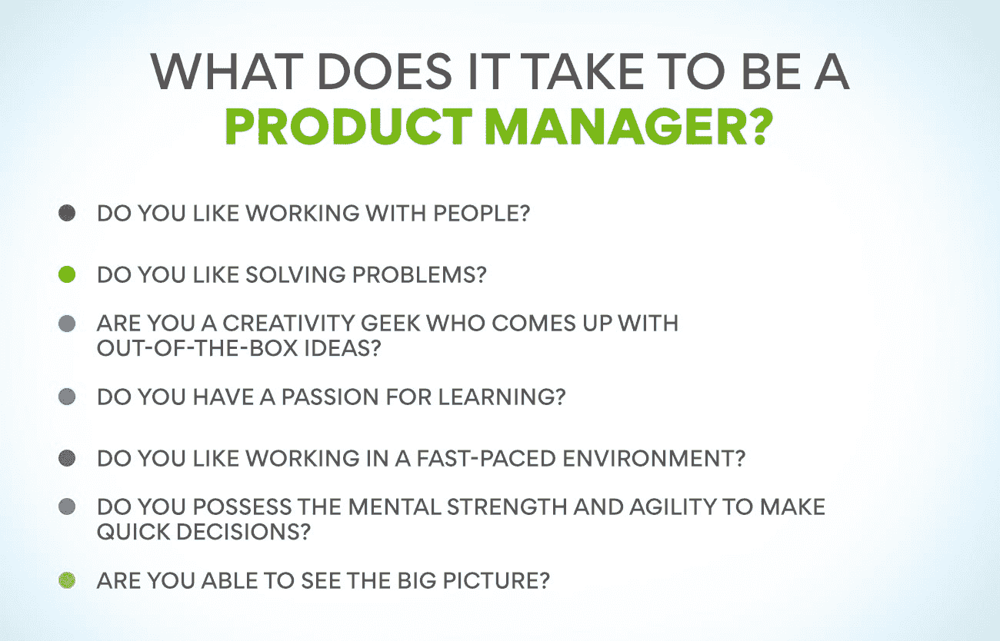
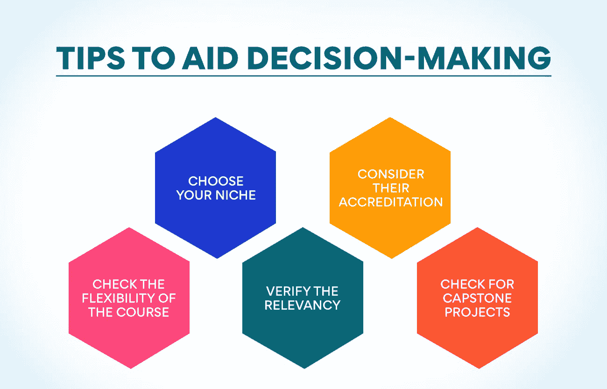

# 什么是产品管理课程？为什么它们至关重要？

> 原文：<https://www.edureka.co/blog/product-management-courses>

在印度，产品管理课程已经成为学生和职场人士职业发展的重要组成部分。PM(产品管理)课程使参与者具备有效管理项目的必备技能。如果你在产品行业工作或者渴望在这一行业发展，那么印度的产品管理课程可以成为你的跳板。

产品经理是一个组织的关键人物，因为他们指导着他们的产品从构思到上市，甚至更多。他们与设计师、工程师和营销人员团队合作，定义产品应该是什么，它将如何外观和功能，以及如何向客户营销。鉴于这一角色的重要性，难怪许多顶级公司都在寻找具有相关资历和经验的候选人。

但是项目管理到底是什么？学习项目管理课程相关吗？印度对产品经理有需求吗？这篇博文将回答你所有的问题，甚至更多。所以坐下来享受你阅读吧！

## **产品管理需要什么？**

产品管理是产品从构思到退出市场的生命周期。它包括市场研究、产品开发、产品发布和销售管理。

产品经理通常负责整个产品生命周期的产品规划和执行。他们与跨职能团队合作，确保产品满足客户和公司的需求。

例如，一家软件公司的[产品经理](https://www.edureka.co/blog/product-manager)可能负责产品市场调查、产品开发、产品发布和销售管理。他/她将从客户和公司的角度来看待产品，以确保产品成功进入市场。

成为产品经理的代价是值得的，因为产品经理是从市场中获得产品创意并将其变为现实的人。他们接触到许多新产品创意，也开始了解产品生命周期。印度的产品管理课程为有抱负的产品经理在产品管理领域的成功职业生涯做准备。

**也读:[产品管理框架每个 PM 都必须知道](https://www.edureka.co/blog/product-management-frameworks)**

## 但是，在不断变化的印度商业环境中，产品经理还有用吗？

印度的产品管理领域最近有了巨大的发展，许多新的企业开始在商业领域寻找自己的位置。产品管理领域预计每年增长 20-25%。这是因为产品管理在印度市场越来越重要。尽管增长强劲，但缺乏能够填补市场空白的产品经理。

准确地说，印度大约有 8 万名产品经理，而美国是这个数字的 6 倍。相反，在印度的[产品管理](https://www.edureka.co/blog/product-management/)有 200，000 个工作机会。现在迫切需要能够担当这些角色并帮助弥合差距的熟练产品经理。

## 那么，产品经理是当今的热门人物吗？

产品经理是组织和产品之间的关键环节。他们在产品开发和管理中发挥着关键作用，与跨职能团队合作将产品推向市场。在印度，产品管理课程的势头越来越大，因为它们为学生提供了承担这些角色所需的技能。

在印度，项目管理是一个相对较新的概念，产品管理课程仍未普及。然而，在印度商业世界的万花筒中，产品经理正变得越来越重要。随着企业转向更具创新性和以客户为中心的模式，产品经理将在确保有效开发和管理产品方面发挥重要作用。

根据 Nasscom 和 Zinnov 的报告，印度的产品管理生态系统预计在未来五年内以 20-25%的 CAGR 增长。这种增长是由印度对产品经理日益增长的需求和越来越多的产品管理课程所推动的。

项目经理课程涵盖产品开发、产品战略、产品营销和产品生命周期管理。学生和专业人士学习识别客户需求，开发产品需求，并创建路线图。此外，产品管理课程还教授学生和专业人士如何管理产品发布、产品组合和产品定价。

可以有把握地断言，在未来几年，产品经理将是印度商业机构中产品卓越和创新的旗手。从发布前到发布后，他们将是所有关键产品阶段的关键决策者。有了合适的技能组合，产品经理可以帮助组织实现目标，并在竞争中保持领先。

因此，如果你正在考虑趁热打铁，产品管理课程可能是最适合你的！

## 等等，你具备成为一名优秀产品经理的素质吗？

当您想到印度的产品管理课程时，这是萦绕在您脑海中的第一个问题。答案取决于你的能力和承诺。印度的产品管理课程旨在提高你的技能，帮助你成为更好的产品经理。然而，如果你还没有倾向于成为一名好的产品经理，项目管理课程就不能让你成为一名好的产品经理。

印度的产品管理课程教你产品管理、产品开发、产品营销和[产品策略](https://www.edureka.co/blog/product-strategy/)的诀窍。他们还允许与其他产品经理建立联系，并从他们的经验中学习。如果你想从事产品管理或产品开发，印度的 PM 课程是必不可少的。印度的产品管理课程可以教会你很多关于产品开发、产品战略和高效产品经理的知识。然而，成为一名优秀的产品经理需要的不仅仅是课程。

为了减轻你做决定的麻烦，我们设计了一个小型的性格测试(更像是现实测试),来确定你是否有成为优秀产品经理的潜质。

参加下面的性格测试，看看你是否具备成为产品经理的条件。

你喜欢和人一起工作吗？ 产品经理需要和很多人一起工作，他们来自不同的部门，有着不同的背景。如果你觉得与他人一起工作和协作令人兴奋，那么产品管理将非常适合你。

你喜欢解决问题吗？ 产品经理负责解决产品开发过程中出现的问题。如果你是一个能从创造性的解决方案中找到慰藉的人，那么产品管理就是你的圣杯。

你是一个能想出创新点子的创意极客吗？ 产品经理必须有创意，开发出新的产品创意和脱颖而出的产品功能。如果你是一个总是在思考新的和创新的想法的人，那么 PM 课程会给你展翅高飞的翅膀。

你热爱学习吗？ 产品经理必须不断学习新产品、新技术和[产品开发](https://www.edureka.co/blog/product-development/)流程。如果你是那些总是寻求发现新事物的人之一，那么产品管理就是你的职业。

你喜欢在快节奏的环境中工作吗？ 产品经理需要能够在快节奏的环境中工作，并积极应对动态变化。如果你愿意在快节奏的环境中茁壮成长，那么产品管理职业将成为你一生中最好的决定之一。

你有足够的精神力量和敏捷来快速做出决定吗？ 产品经理需要能够快速高效地做出决策。如果你是那种以强大的观点或数据为依据做出计算性决策的人，那么产品管理的职业生涯将会对你有所收获。

你能看到全局吗？ 产品经理必须有远见，了解他们的产品如何适应市场。如果你是一个对任何事情都保持开阔视野并预见每一项任务的人，那么产品管理的职业生涯会带你去很多地方。

**也可阅读:[产品管理学习-重点领域](https://www.edureka.co/blog/product-management-learning)**

你不需要拥有这一切，但是如果你觉得你已经拥有了上面提到的大部分特质，那么我的朋友，没有什么可以阻止你成为一名伟大的产品经理，一名与众不同的产品经理。印度的产品管理课程可能是你下一步的正确选择。PM 课程可以给你承担产品管理角色和责任的动力和推力。

不知从何下手？用我们最新的、令人振奋的产品管理课程给我们一个稳定的、不断加强的开始怎么样？我们的产品管理高级管理人员证书将产品管理提升到一个新的水平。

产品经理需要具备多种技能，本课程将帮助你发展这些技能。课程由产品管理专家设计，涵盖各种主题，如产品战略、产品生命周期、产品路线图、产品定位、产品品牌等。

想一想，点击这里查看我们的课程详情。

## 那么，如何知道你最终选择了正确的产品管理课程呢？

不是要打击你，但是在印度的产品管理课程多如牛毛。你不能盲目地为一门课程付费，而不核实它的真实性，不确定它给你的职业生涯带来的价值。我们说，对于我们的产品管理课程，不要去参加，直到你有 100%的把握。

的确，很难知道哪一个适合你，但幸运的是，我们有一些帮助你做决定的建议。

选择你的利基市场

首先考虑你要经营什么样的产品。你对实体产品感兴趣，还是对数码产品感兴趣，还是两者都感兴趣？如果你对实物产品管理感兴趣，你会想找一门只关注这方面的课程。

**考虑他们的注册**

印度的许多学院都提供产品管理课程。但是在注册这门课程之前，必须考虑学院的认证。有许多产品管理课程是政府不认可的，因此，你将无法在一家好公司找到工作。

**检查课程的灵活性**

产品管理课程应该允许您在方便的时候在线或离线上课。了解课程是否符合你的时间表，是否能让你轻松地按照自己的进度学习，这样你就不必在其他事情上妥协。

**验证关联性**

如果课程没有根据最新的产品管理趋势进行更新，那就不值得你浪费时间。PM 课程应定期更新，以确保学生了解最相关和最新的信息。

**检查顶点项目**

它已经成为印度的产品管理课程的卓越标志。一门好的产品管理课程会给你一些顶点项目，加强你在不同产品开发阶段的工作能力，并学习如何评估客户需求、开发产品原型、监控产品开发和跟踪产品销售。

## **总结一下**

到目前为止，您一定已经很好地理解了产品经理在印度的重要性，以及只有一门好的产品管理课程才能填补这个空白，并成功改变印度的产品管理。

简而言之，产品管理课程在印度至关重要，因为它们帮助产品经理获得在当今不断变化的市场中取得成功所需的知识、技能和经验。通过参加这些课程，产品经理可以了解产品管理的最新趋势和最佳实践。

产品管理课程侧重于各种主题，如[产品规划](https://www.edureka.co/blog/product-planning/)、产品路线图、产品生命周期、产品组合管理、上市策略、产品营销和产品销售。

此外，印度的产品管理课程也提供了一个学习最新工具和技术的机会。许多公司现在认为从一个好的机构获得产品管理证书是产品经理职位的最低要求。

所以，不要等待。马上行动起来，报名参加产品管理课程，让你的职业生涯一飞冲天！报名参加产品管理课程，该课程符合您的预算，物有所值。

在决定之前，先看一下我们的[产品管理高级执行官证书](https://www.edureka.co/highered/advanced-executive-program-in-product-management-iitg)。

## **更多信息:**

[11 个重要的产品管理指标和 KPI](https://www.edureka.co/blog/product-management-metrics)

[产品变化的原因是什么？原因&原因](https://www.edureka.co/blog/what-are-the-reasons-of-variations-in-product-causes-reasons/)

[什么是产品管理？](https://www.edureka.co/blog/what-is-product-management/)

[什么是产品流程矩阵？](https://www.edureka.co/blog/what-is-the-product-process-matrix/)