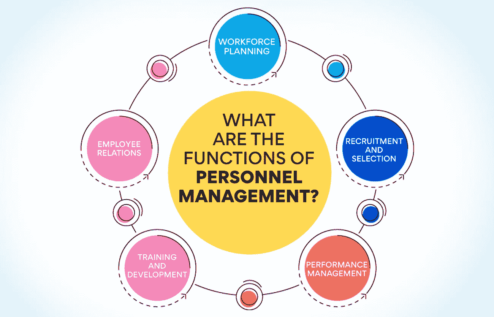
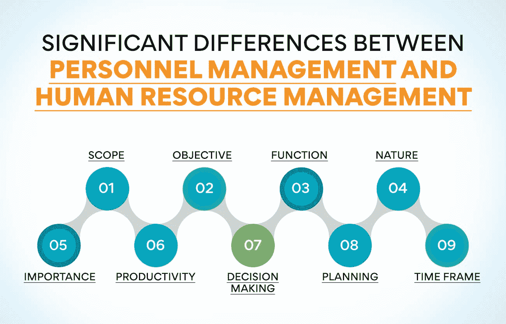

# 人事管理和人力资源管理的区别

> 原文：<https://www.edureka.co/blog/difference-between-personnel-management-and-human-resource-management/>

人事管理和人力资源管理之间有很多混淆。有时这两个术语可以互换，而其他时候，它们被视为两个完全不同的概念。如果你也面临这种普遍的困惑，这篇博文是为你而写的，在这里，我们探讨了个人管理和人力资源管理之间的区别，并帮助你理解哪种方法对企业来说是理想的。

## **什么是人事管理？**

人事管理是雇用和发展员工的技能、经验和承诺，使他们对组织的贡献更有价值。它包括工作设计、绩效评估、培训等活动。

需要注意的是，人事管理是一个相对较老的概念，早于人力资源管理(HRM)方法。在人事管理中，员工被视为可以用来实现组织目标的资源。这与人力资源管理相反，后者将员工视为有自己需求和抱负的个体。

人力资源管理协会将人事管理定义为塑造他们为公司带来的技能、经验和价值以实现其目标的过程。

## **人事管理的功能有哪些？**

人事管理是对组织中的人进行管理的过程，以便最佳地利用他们来实现组织的目标。它有助于确保正确的人被雇用来从事正确的工作，并得到必要的培训来有效地完成他们的任务。人事管理还包括制定与员工福利、工资和工作描述相关的政策和程序。

下面是人事管理涉及的一些功能:

*   劳动力计划: 这包括预测未来的员工需求，并确定满足这些需求的最佳方式。它兼顾劳动力规划的定量和定性两个方面。
*   **招聘和选拔:** 为即将进行招聘和选拔的空缺职位寻找并雇用最佳候选人。选拔过程包括筛选申请、进行面试和管理测试。
*   绩效管理: 它包括为员工设定目标，评估他们的表现，提供反馈，并在必要时采取纠正措施。
*   **培训与发展:** 这一切都是为了向员工提供有效完成工作所需的技能和知识。它包括正式和非正式的培训方法。员工在培训和发展过程中了解组织的文化、价值观和目标。
*   员工关系: 这包括通过解决冲突、申诉程序和纪律处分等问题来维持员工和管理层之间的良好关系。

**亦读:[人力资源管理的演变:过去与未来](https://www.edureka.co/blog/evolution-of-human-resource-management)**

## **人事经理的角色和职责**

人事经理负责招聘和挑选员工，以及他们的培训和发展。他们还监督员工福利和关系，并监督遵守劳动法的情况。

下面是人事经理的常见职责:

*   制定员工培训计划: 人事经理将制定计划来提高员工的生产力和技能。他们与部门经理密切合作，确定培训需求，并制定和实施满足这些需求的计划。
*   选择新员工: 当一家公司有空缺职位时，人事经理有责任进行面试并选择最合格的候选人。
*   监控员工表现: 人事经理的部分工作是确保员工达到他们的期望。他们可以通过定期检查、年度绩效评估或其他方法来做到这一点。
*   **高层管理人员的助手:** 人事经理通常负责向高层管理人员提供各种主题的信息和分析，如员工士气、保留率和培训效果。他们也可能被要求制定计划来改善这些领域。
*   **充当调停人:** 当员工之间发生矛盾时，人事经理往往会介入调停。他们将听取双方的意见，并帮助所有相关方找到一个公平的解决方案。

虽然有很多关于人事和人力资源管理的知识可以学习，但是能够丰富你的经验的有见地的课程却很少。不要担心；我们开发了一个 PG 证书课程，让事情尽可能的清晰明了。

获得人力资源管理研究生证书，让您的人力资源职业生涯更上一层楼。请立即查看课程。

## **什么是人力资源管理？**

这是组织中人员管理的过程。它包括招聘、选择、培训、分配和提升员工。人力资源管理还涉及员工福利、绩效管理和工作满意度。值得注意的是，人力资源管理在很多方面不同于人事管理。

到 2025 年，全球人力资源管理市场预计将增长到 6860 亿美元。这一统计数据清楚地表明，人力资源管理是组织中不可避免的重要职能。

每个组织都需要人力资源管理，这有几个原因。例如，它有助于组织招募和留住最优秀的人才。此外，人力资源管理有助于提高员工的生产力和积极性。

总之，人力资源管理在任何组织中都是一项至关重要的职能。这有助于确保组织拥有最优秀的人才以及员工的生产力和积极性。如果你想学习更多关于人力资源管理的知识，可以考虑参加这方面的课程。例如，我们的人力资源管理研究生证书是一个很好的起点，在那里你可以通过实践获得舒适和方便的学习。

在我们为 11 月份的课程安排座位之前，请立即查看我们的课程。

## **人力资源管理涉及哪些职能？**

根据人力资源管理协会的说法，人力资源管理负责组织中的各种职能。这些功能包括:

*   招聘和雇用员工: 它包括发布职位空缺、审核申请、面试候选人和发出工作邀请。在一些组织中，人力资源管理部门还可能负责就业前筛选，如背景调查和药物测试。
*   入职培训: 这是让新员工适应组织并让他们适应新角色的过程。入职培训可能包括向新员工概述公司的历史、使命和价值观，向他们介绍同事，帮助他们了解公司的文化，以便他们能够最好地利用自己的技能。
*   **建立积极的工作文化:** 积极的工作文化对员工满意度和保留率至关重要。人力资源管理通过制定支持员工福利的政策和程序，如围绕弹性工作安排和带薪休假的政策，在建立积极的工作文化中发挥作用。此外，人力资源管理可能负责组织员工事件和活动，如公司野餐和假日聚会。
*   **执行纪律处分:** 不幸的是，有时员工需要因违反公司政策或行为不当而受到纪律处分。人力资源管理部门负责处理纪律处分，包括发出警告、暂停员工职务或终止雇佣关系。
*   **安排奖励和认可:** 奖励员工的辛勤工作和成就是鼓舞士气和保持[员工参与的好方法](https://www.edureka.co/blog/employee-relations)。人力资源管理部门可能负责安排员工奖励和表彰计划，如月度最佳员工奖和现场奖金。
*   **维护员工记录:** 人力资源管理部门负责维护员工记录，如雇佣合同、绩效考核和休假申请。此外，人力资源管理可能负责跟踪员工对强制性培训的遵守情况，如性骚扰培训和急救认证。

**也读作:[人力资源管理的关键基础](https://www.edureka.co/blog/fundamentals-of-human-resource-management/)**

## **人力资源经理的角色和职责**

人力资源经理有广泛的职责和角色，包括工作的人事和管理方面。人力资源经理的主要职责是招聘、筛选和雇用员工，培训新员工和现有员工，等等。

除了这些与人事相关的职责，人力资源经理还负责制定和实施与员工行为、绩效和出勤相关的公司政策和程序。

人力资源经理还参与制定战略，以提高员工士气和积极性，并提高生产率和保留率。人力资源经理是管理团队的基本成员，在组织的整体成功中起着关键作用。

## **人事管理与人力资源管理的显著区别**

人事管理和人力资源管理的区别人事管理是一种传统的管理员工的方法，而人力资源管理是一种更现代的方法。

让我们对照一些重要参数来讨论人事管理和人力资源管理的区别:

**[范围](https://www.edureka.co/blog/scope-of-human-resource-management/) :** 人事管理仅限于管理一个组织的员工。另一方面，HRM 包括与管理一个组织的人力资源相关的所有方面。需要注意的是，人事管理和人力资源管理是相互关联的。

**目标:** 人事管理旨在确保组织中有适当数量的具备足够技能和知识的人来完成工作。人力资源管理的[目标是确保组织拥有一批有能力、有技能的员工来满足组织未来的需求。](https://www.edureka.co/blog/objectives-of-human-resource-management/)

**职能:** 人事管理负责执行员工福利活动，如员工的培训和发展。另一方面，HRM 负责员工管理的方方面面，比如招聘、选拔、行政、[薪酬](https://www.edureka.co/blog/compensation-in-hrm)和福利、员工关系等等。

**[自然](https://www.edureka.co/blog/nature-and-objectives-of-human-resource-management/) :** 人事管理是无功。这意味着它在与员工相关的问题出现后做出反应。同时，人力资源管理是积极主动的。这意味着它采取措施防止员工问题的发生。

**重要性:** 人事管理对于确保所有员工与共同的组织目标保持一致，以及他们的技能和经验满足公司的需求至关重要。人力资源管理对所有员工负责，并确保他们在公司的任期对员工和组织都是最有成效的。

**生产力:** 人事管理不关心员工的生产力。相比之下，人力资源管理关注的是员工的生产力。人力资源经理总是试图找到提高员工生产率的方法，而人事经理不会参与其中。

**决策:** 人事管理不参与组织的决策过程，因为他们的工作最终是发展和调整合适的技能。相反，人力资源管理涉及到一个组织在行政层面的决策过程。

**计划:** 人事管理不为未来的活动做计划。而人力资源管理总是为组织保留应急计划和未来战略，以帮助实现其未来目标并避免任何差异。

**时间框架:** 说到人事管理，时间框架是短期的。人事管理旨在满足组织的即时需求，而人力资源管理是一个长期和持续的过程。

## **底线**

总之，人事管理与人力资源管理的区别在于人事管理侧重于员工发展任务。相比之下，人力资源管理侧重于对员工的[战略管理。人力资源管理是一种更现代的管理员工的方法，它在寻求获得竞争优势的组织中越来越受欢迎。](https://www.edureka.co/blog/strategic-human-resource-management)

人事管理更关注员工行政的日常运作，而人力资源管理更关注员工的长期战略管理。人力资源管理是一种更全面的方法，它考虑整个人，而不仅仅是他们的工作角色。

因此，如果你正在寻找一种更具战略性的方法来管理你的员工，人力资源管理是一个不错的选择。然而，如果你对行政方面更感兴趣，人事管理可能更适合你。无论你选择哪条路线，只要确保你清楚两者之间的区别就行了！ 现在你已经了解了人事管理和人力资源管理之间的区别，你想在这两个垂直领域积累经验吗？如果是的话，我们有一门关于人力资源管理的[课程](https://www.edureka.co/highered/human-resourse-management-course-iim-shillong)！现在就退房，开始你成为人力资源管理专家的旅程吧！

## **更多信息:**

[什么是人力资源管理系统？](https://www.edureka.co/blog/human-resource-management-system/)

[什么是人力资源业务伙伴:终极指南](https://www.edureka.co/blog/hr-business-partner)

[制定有效人力资源战略的终极指南](https://www.edureka.co/blog/ultimate-guide-to-developing-an-effective-hr-strategy/)

[战略性劳动力规划:步骤和流程](https://www.edureka.co/blog/strategic-workforce-planning)