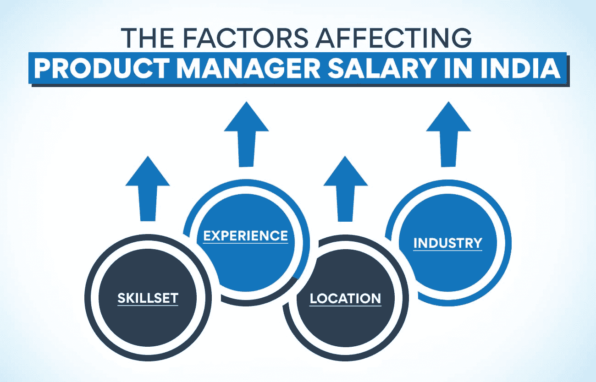
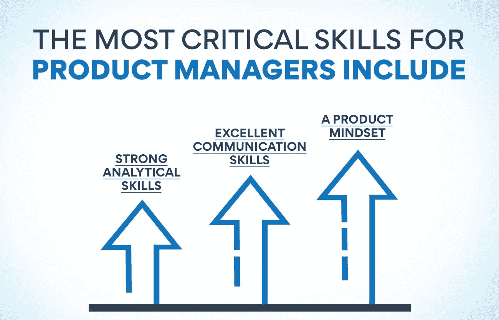

# 印度的产品经理薪酬:2023 年的重要见解

> 原文：<https://www.edureka.co/blog/product-manager-salary-in-india>

近年来，产品经理在印度的工资大幅上涨，预计未来几年还会持续。但是你认为什么会对印度产品经理的薪水产生最大的影响？在这篇博客中，我们将了解关于印度产品经理工资的关键见解和更多信息。我们将探讨是什么因素推动了这一增长，以及作为一名印度产品经理，你在 2023 年的预期收入。

## **为什么印度很需要产品经理？**

印度非常需要产品经理，因为他们在印度的产品开发和创新中扮演着举足轻重的角色。他们负责规划、设计和开发满足客户和市场需求的产品。由于对熟练产品经理的需求不断增加，印度的产品经理工资近年来大幅上涨。

在印度，产品经理的平均年薪约为 160 万到 200 万卢比。薪水取决于各种因素，如经验、技能、地点和公司。

产品经理很受欢迎，因为他们能看到全局，并从战略角度思考产品开发。需要产品经理的主要原因是:

*   印度是一个快速增长的市场，拥有大量的产品公司。
*   需要产品经理来管理产品开发流程和推动创新。
*   他们需要对客户需求和市场趋势有深刻的理解。

如果你想在[产品管理](https://www.edureka.co/blog/product-management/)开始职业生涯，你必须具备所需的技能和经验。我们还有一门[精彩的课程](https://www.edureka.co/blog/product-management-courses)，它将帮助你获得成为产品经理所需的技能和知识。

产品管理高级管理人员证书是为那些想在产品管理领域一飞冲天的学生或专业人士设计的。该课程将涵盖产品经理需要了解的所有基本主题。查看我们的 [产品管理高级主管证书](https://www.edureka.co/highered/advanced-executive-program-in-product-management-iitg) 课程，了解更多详情。

## **印度一个产品经理的平均工资是多少？**

印度产品经理的平均工资高于美国、英国和澳大利亚等其他国家的产品经理。根据最近的一项研究结果，平均而言，他们在印度的工资是卢比。每年 1369841。在印度，产品经理的工资范围从卢比到卢比不等。667000 卢比。每年 5500000。

## **影响印度产品经理薪酬的因素有哪些？**

根据产品经理的技能、经验和地点，工资会有所变化。雇佣一名产品经理并不容易，公司倾向于支付高薪来获得合适的候选人。

影响印度产品经理薪酬的因素很多，例如:

**Skillset:** 一个产品经理应该具备行业知识、技术技能、营销技能等。拥有更好技能的专业人士往往会获得更高的薪水。

**经验:** 一般来说，经验多的产品经理比刚开始职业生涯的人工资高。经验的年限和工资成正比。产品管理有不同的级别——产品分析师、产品营销经理、产品开发经理等。，工资根据级别不同。

**工作地点:** 工作地点是决定薪资的另一个因素。[产品经理](https://www.edureka.co/blog/become-a-better-project-manager)在大都市工作的人比在小城镇或二线城市工作的人工资高。

**行业:** 印度的产品管理薪资也取决于行业。一个在 IT 公司工作的产品经理会比一个在制造公司工作的人工资高。

总之，印度产品经理的工资会根据技能、经验、地点和行业等各种因素而变化。产品经理对公司的成功起着至关重要的作用；因此，他们得到了丰厚的报酬。

未来几年，几个因素将影响印度产品经理的薪酬。以下是一些关键见解:

*   产品管理的角色正在演变，变得更具战略性，因此产品经理因其专业知识而获得更高的薪酬。
*   印度经济正在蓬勃发展，对产品经理的需求越来越大，这推高了工资。
*   印度创业文化的兴起意味着对产品经理的需求很大，他们的薪酬也很高。

## **产品经理角色的层级是什么？**

印度有三个产品经理职位，每个职位都有不同的职责:

**助理产品经理**

助理产品经理进行市场调研，撰写产品需求并创建产品原型。是入门级的产品经理角色。这个职位的年薪在 30 万到 50 万卢比之间。

**也可阅读:[为什么 PM 工具对项目成功至关重要？](https://www.edureka.co/blog/pm-tools)**

**产品经理**

这是目前印度第二受欢迎和受欢迎的工作。产品经理负责开发和管理公司提供的产品/服务。

产品经理的平均年薪为 14，000，000 印度卢比。

*   最高:每年 30，000，000 印度卢比
*   最低:每年 45 万印度卢比

**高级产品经理**

一个项目经理和一个高级项目经理的区别主要是经验和专业知识。高级产品经理负责开发和管理公司提供的产品/服务。他们还负责产品的盈利和增长。

印度高级产品经理的平均年薪为 20，000，000 印度卢比。

*   最高:每年 4000 万印度卢比

**首席产品经理**

首席产品经理负责产品战略、[产品规划](https://www.edureka.co/blog/product-planning/)和产品开发。他们还负责产品营销和产品管理。印度首席产品经理的平均年薪为 25，000，000 印度卢比。

*   最高:每年 50，000，000 印度卢比
*   最低:每年 10，000，000 印度卢比

**产品管理总监**

产品管理总监是负责[产品战略](https://www.edureka.co/blog/product-strategy/)和路线图的高级专业人士。他们还负责产品开发、产品营销和产品管理。印度产品管理总监的平均年薪为 35，000，000 印度卢比。

*   最高:每年 70，000，000 印度卢比
*   最低:每年 15，000，000 印度卢比

**首席产品经理**

首席产品经理负责产品战略、产品规划、产品开发、产品营销和产品管理。他们还负责产品的整体成功。印度首席产品经理的平均年薪为 45，000，000 印度卢比。

最高:每年 90，000，000 印度卢比

最低:每年 20，000，000 印度卢比

## **成功产品经理的顶级技能**

在产品管理中，技能就是一切。要成为一名成功的产品经理，你需要具备全面的技能，包括硬技能和软技能。

对于产品经理来说，一些最重要的技能包括:

*   **强大的分析能力:** 作为一名产品经理，你需要能够分析数据和客户反馈，就产品方向和优先事项做出明智的决定。
*   出色的沟通技巧: 你需要与多个利益相关者(如工程师、设计师、销售团队等)进行有效沟通。)以确保每个人都在产品愿景和路线图上保持一致。
*   **产品思维:** 你应该深刻理解打造一个伟大的产品需要什么，从构思到发布。它包括市场研究、产品策略、用户体验设计和产品营销。

如果你拥有这些技能，你将会成为一名成功的产品经理。

## 印度产品经理的工资会进一步上涨吗？

无论你在哪个国家，产品经理的工作总是需求量很大。毕竟，他们是制定战略和计划的人，以确保产品或服务满足顾客或客户的需求。他们还对其质量和盈利能力负责。在印度，产品经理的角色最近越来越受欢迎。

印度的产品经理的工资一直在上涨，原因有几个。

首先，这个国家是一些世界上最大的公司的所在地。这些公司一直在寻找能帮助他们开发和推出新产品或服务的人才。

其次，印度经济正在快速增长。它导致越来越多的中产阶级家庭现在能够负担起曾经是他们力所不及的产品和服务。因此，对能够迎合这一不断增长的市场的产品经理有了更大的需求。

未来几年，印度产品经理的工资有望进一步增长。这是因为人们期望中国在全球经济中扮演重要角色。随着越来越多的跨国公司在印度设立基地，将更需要能够了解这些公司需求并据此开发产品或服务的产品经理。

如果你想在产品管理领域成就一番事业，现在是最好的时机。印度的产品经理的工资正在上涨，而且在未来几年只会继续上涨。所以，如果你已经具备了成为产品经理的条件，今天就开始你的旅程吧！

**又读:[重大项目管理活动——你必须知道的](https://www.edureka.co/blog/project-management-activities)**

## **为什么产品管理是一个欣欣向荣的领域？**

产品管理是目前在印度蓬勃发展的一个领域。是因为产品经理要对一个产品的成败负责。他们管理整个[产品生命周期](https://www.edureka.co/blog/product-lifecycle/)，从构思到发布到发布后分析。企业永远不会停止制造他们需要销售的产品，产品经理将始终在确保这些产品设计、开发和营销良好方面发挥重要作用。

产品管理领域的繁荣有几个原因:

**不断变化的技术格局为产品经理创造了填补** 的新机会。

随着产品经理对技术及其在产品开发中的作用越来越熟悉，他们可以为他们的组织贡献更多的价值。无论是人工智能还是物联网，产品经理都有能力帮助塑造产品的未来。

**全球化正在创造新的市场，供产品经理探索**

随着企业将触角伸向新市场。他们需要了解这些不同文化的细微差别，并能帮助他们开发在这些地区取得成功的产品的产品经理。

**产品的复杂性要求产品经理对技术和业务都有深刻的理解:**

产品经理需要了解他们的产品所采用的技术，以及他们的产品将被用于的业务。这使得他们能够对产品的开发和营销做出明智的决定。

**电子商务的增长和新产品类别的兴起给产品经理带来了新的挑战** 。

产品经理需要能够创造出在网络世界成功的产品，并在复杂的电子商务世界中游刃有余。他们需要了解销售产品的不同渠道，以及每个渠道中不同的客户需求。

**印度经济刺激了需求**

印度是世界上增长最快的经济体之一，这种增长为产品经理创造了新的机会。随着越来越多的企业向印度扩张，他们需要了解印度市场并能帮助他们开发在该地区取得成功的产品的产品经理。

产品管理领域复杂多变，但这正是它令人激动的地方。能够跟上最新趋势并了解复杂产品格局的产品经理将非常受欢迎。

## **底线**

印度的产品经理预计年薪约为 15，000，000 卢比。这一数字将因体验、地点和产品重点而异。最有经验的产品经理每年可以赚到 95，000，000 卢比。

随着印度经济的快速增长和中产阶级的崛起，对[产品](https://www.edureka.co/blog/product)和服务的需求越来越大。因此，印度非常需要产品经理。公司正在寻找能够帮助他们开发和推出满足印度消费者需求的新产品的产品经理。

如果你正在考虑在印度从事产品经理的职业，了解当地市场和塑造市场的主要趋势是至关重要的。

## **更多信息:**

[11 个重要的产品管理指标和 KPI](https://www.edureka.co/blog/product-management-metrics)

[产品管理学习-关键领域](https://www.edureka.co/blog/product-management-learning)

[每个 PM 都必须知道的产品管理框架](https://www.edureka.co/blog/product-management-frameworks)

[什么是产品流程矩阵？](https://www.edureka.co/blog/what-is-the-product-process-matrix/)