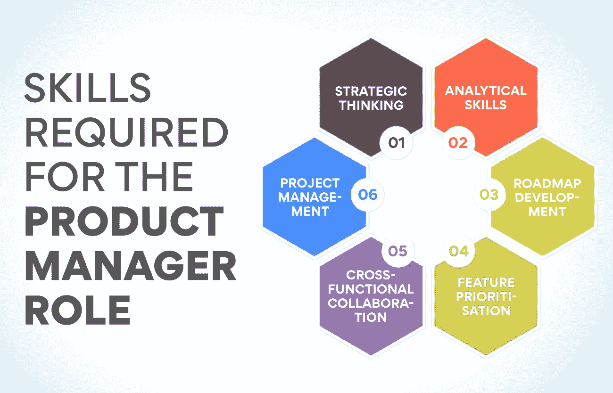
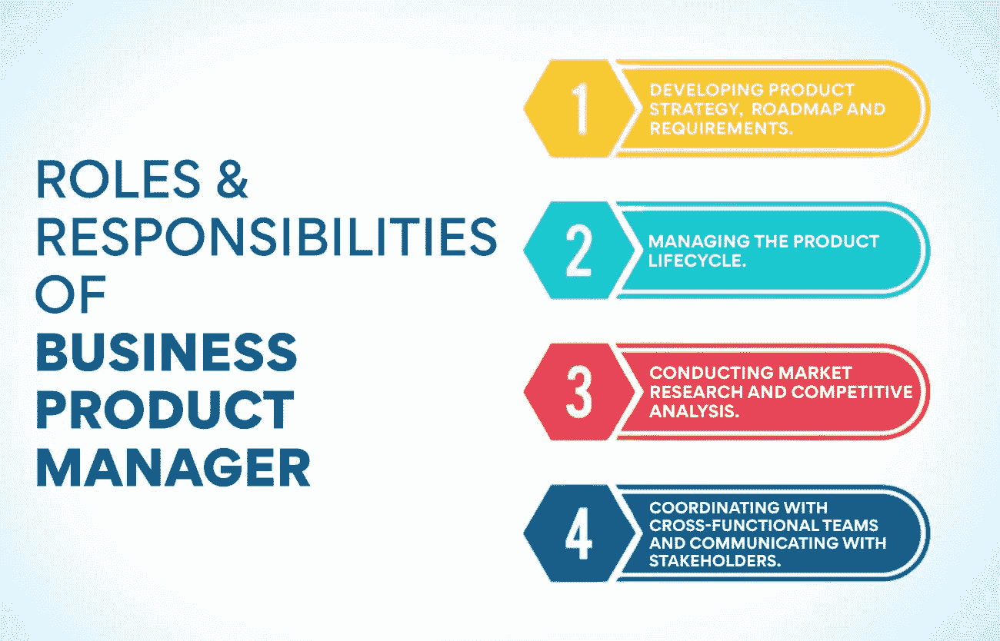

# 产品经理的角色和职责是什么？

> 原文：<https://www.edureka.co/blog/roles-and-responsibilities-of-a-product-manager/>

无论企业的规模和结构如何，产品经理都要对产品的成败负责。他们是将产品从概念推向市场的人。根据公司的不同，产品经理可能负责不同的产品生命周期阶段。产品经理的角色和职责在不断演变。随着市场的变化，产品经理的职能也在变化。这篇博文将探讨在当今充满活力的商业环境中，产品经理的角色和职责。

## 产品经理如何为公司的成功做出贡献？

产品经理带领公司的产品线走向成功。他们与开发团队一起创造和改进产品，与营销团队一起推广和销售产品。

产品经理是专业人士，他决定产品将会有什么样的特性，会做什么样的改变来改进它。他们还负责管理产品预算，确保产品满足客户需求。

随着技术变得越来越复杂，产品经理的角色也随着时间而改变。过去，[产品经理](https://www.edureka.co/blog/product-manager)只负责产品的一个方面，比如设计或价格。然而今天，他们通常负责产品生命周期的所有方面，从概念到发布到发布后的分析。

## **产品经理角色所需的技能**

产品经理负责产品的战略、路线图和功能。他们与跨职能团队合作，将产品推向市场。该角色所需的技能包括:

**战略思维:** 一个产品经理必须能够从战略上思考产品的路径，并使其与公司的业务目标保持一致。例如，他们需要决定构建哪些功能以及如何在市场中定位产品。

**分析技巧:** 管理一个产品的时候有很多数据要跟踪。产品经理必须能够分析这些数据，对产品做出明智的决策。

**路线图开发:** 一个熟练的产品经理必须为[产品](https://www.edureka.co/blog/product)开发一个清晰且可执行的路线图。例如，他们需要决定交付哪些特性。

**特性优先级:** 在特性方面，这一切都是为了平衡不同利益相关者的需求。产品经理必须能够根据功能的影响和可行性对其进行优先排序。例如，营销团队想要一个需要六个月开发的新功能。

然而，销售团队需要在两个月内开发出不同的功能。产品经理必须根据公司和客户的需求对这些功能进行优先排序。

**跨职能协作:** 产品经理必须与跨职能团队(如工程、设计、营销、销售)有效协作，将产品推向市场。在这里，有效的沟通是关键。

项目管理: 最后一点也很重要，产品经理必须能够从头到尾管理产品开发过程。它包括创建时间表、跟踪进度，以及确保产品从构思到推出都按时交付。

## 产品经理的主要职责是什么？详细解释

[产品管理](https://www.edureka.co/blog/product-management/)在印度是一个相对较新的领域，有很多理由说明它是适合你的职业。作为一个熟练的产品经理，你将不得不忽略一个产品的开发和成功。它包括管理产品生命周期的所有方面，从构思到发布到发布后分析。

你需要很强的分析能力来胜任这一职位，因为你需要不断地评估数据来做出产品决策。为产品制定战略计划很重要，因为你将负责为你的产品创造和执行愿景。

如果你的目标是一份既有挑战又有回报的职业，那么产品管理是正确的选择。查看我们的产品管理高级管理人员证书，以深刻的见解开始您的产品管理生涯。

一般来说，产品经理的关键角色和职责是开发新产品或服务的计划并监督其实施。它包括从进行市场调查和可行性研究到制定产品战略、路线图和商业案例的所有内容。

产品经理还负责管理产品生命周期，包括制定上市计划、在上市期间与跨职能团队协调，以及确保持续的上市后支持和优化。他们还跟踪[指标和 KPI](https://www.edureka.co/blog/product-management-metrics)，以评估绩效和投资回报率，确定需要改进的领域，并为未来的产品开发提出建议。

产品经理需要有很强的沟通和解决问题的技能，因为他们将与客户、团队成员和利益相关者互动。他们还必须在压力下有效工作，同时处理多项任务。

最后，产品经理还必须紧跟行业趋势和竞争形势，以制定战略来确保他们的产品保持市场领先地位。毫无疑问，成为产品经理是一个具有挑战性的角色，但也是一个非常值得的角色。如果你有所需的技能，并准备好迎接挑战，那么产品管理可能是你完美的职业选择。

**也可阅读:[印度产品经理的平均工资](https://www.edureka.co/blog/product-manager-salary/)**

## **角色&技术产品经理职责**

科技产品经理的角色和职责多种多样，但大致可以分为三个主要领域:产品战略、产品开发和产品营销。

作为产品愿景的所有者，技术产品经理负责定义如何构建产品并交付给客户的策略。它包括为工程团队设置路线图和优先级，与公司的其他团队合作以协调依赖关系，并确保产品满足客户需求和业务目标。

技术产品经理还负责产品开发流程，与工程部门紧密合作，实现产品愿景。它包括编写用户故事、定义验收标准、监督质量保证工作以及管理测试程序。

最后，技术产品经理负责通过营销努力推动产品的增长和采用。它可能包括创建[走向市场计划](https://www.edureka.co/blog/go-to-market-strategy/)，进行市场调研，发展合作伙伴关系，以及创建需求挖掘项目。

## **角色&业务产品经理职责**

业务产品经理的角色和职责因组织而异，但通常包括

*   制定产品战略、路线图和需求。
*   管理产品生命周期。
*   进行市场调查和竞争分析。
*   与跨职能团队协调并与利益相关方沟通。

业务产品经理也可能负责一些组织的产品营销和上市活动。

产品战略的制定包括了解客户的需求和市场趋势，并为产品设定方向。路线图概述了实现产品愿景所需的步骤，而需求定义了最终产品中必须包含的特性或功能。[产品生命周期](https://www.edureka.co/blog/product-lifecycle/)管理包括计划和执行上市，监控上市后的表现，并做出必要的调整。

进行市场调查有助于了解客户需求及其随时间的变化，以及发现新的机会。竞争分析用于了解市场上有哪些其他产品，以及它们与您的产品相比如何。

为了确保参与开发和推出产品的所有团队高效合作，跨职能部门的协调至关重要。最后，与利益相关方的沟通是让他们了解最新进展、寻求反馈和获得决策支持的关键。

## **角色&设计产品经理职责**

设计产品经理负责他们产品线的整体愿景和战略。他们与跨职能团队合作，确保产品的设计和开发满足客户和企业的需求。此外，他们还负责管理从概念到发布和发布后支持的产品生命周期。

设计产品经理通常拥有工业设计、工程或相关领域的学士学位。许多人也有在 T2 从事产品开发或管理工作的经验。他们通常擅长项目管理、产品开发流程和团队领导。

设计产品经理的角色和职责通常包括

*   制定产品设计策略和要求。
*   在产品的整个生命周期中提高产品的美感。
*   紧跟潮流，并将它们融入设计中。

与其他产品经理相比，设计产品经理通常更关注产品的美学和用户体验。因此，他们可能还负责监督工业设计师、用户体验设计师和其他设计团队成员的工作。

## **角色&成长型产品经理的职责**

作为成长型产品经理，他们的职责是提高产品的采用率和使用率。他们需要身兼数职，并能适应模糊和变化。他们必须能够战略性地思考，同时也要亲力亲为，并在需要时卷起袖子。

职责包括与跨职能团队合作，定义、设计和发布推动增长的新功能。他们还管理实验、A/B 测试和其他发展计划。他们需要了解用户行为和分析，以深入做出数据驱动的决策。

其他职责可能包括进行用户研究、管理测试项目，以及与[市场部合作推出](https://www.edureka.co/blog/product-planning/)计划。他们应该能够适应快节奏的工作环境，并且能够同时兼顾多个项目。

成长型产品经理通常拥有商业、营销或经济学等领域的学士学位。他们还应该有产品管理或相关职位的工作经验。此外，他们应该有很强的分析和解决问题的能力。

**也读:[如何成为产品经理？](https://www.edureka.co/blog/how-to-become-a-product-manager/)完整职业指南**

## 为什么产品管理是你在印度的理想职业？

根据最近的一项研究，印度缺少产品经理。随着中国经济的持续扩张，对产品经理的需求也在增加。因此，印度对有才华的产品经理有着巨大的需求。

产品管理是一个回报丰厚的职业，提供了许多挑战和发展机会。它需要战略思维、商业头脑和技术技能的结合。它提供了一个在快速发展的行业工作的好机会。对于最有回报的职业，产品管理是你的正确选择。

产品经理档案中一些发人深省的数据:

*   在印度，产品经理的平均年薪是卢比。每年 101.5 万。
*   印度目前有超过 4000 个产品经理职位空缺。
*   未来五年，对产品经理的需求预计将增长 22%。
*   印度目前有超过 200，000 名产品经理。

如你所见，印度对产品经理的巨大需求将会持续增长。需要填补产品管理领域的空白，以满足需求。印度为那些想进入产品管理行业的人提供了一个绝佳的机会。到 2025 年，全球产品管理市场预计将达到 2.4 万亿美元，印度将在这一增长中发挥关键作用。

因此，如果你正在寻找一份回报丰厚、充满挑战和发展机遇的职业，那么没有什么比产品管理更有回报的了。

## **结论**

产品经理负责产品的每一个方面，包括产品的开发、上市和最终退出市场。产品经理必须对他们的客户群有深刻的了解，并且能够识别他们的产品可以填补的市场空白。他们必须与开发团队合作，将他们对产品的愿景变为现实，然后管理产品在市场上的发布。

在印度，产品经理的角色和职责因组织而异。然而，产品经理在印度的典型角色和职责包括以下内容:

*   制定[产品战略](https://www.edureka.co/blog/product-strategy/)，路线图和要求。
*   进行市场调查和竞争分析。
*   管理产品生命周期。
*   监督跨职能团队的工作。

如果你拥有工作所需的技能和经验，那么产品管理是你在印度的首选职业。但是你从哪里开始呢？我们有一门很棒的课程，它会教你所有产品管理的基础知识，并帮助你过渡到这个令人兴奋和富有挑战性的领域。

那么你还在等什么？查看我们的[产品管理高级管理人员证书](https://www.edureka.co/highered/advanced-executive-program-in-product-management-iitg)，它为您提供按照自己的进度学习的灵活性和便利性，并获得全球认可的证书。

## **更多信息:**

[印度产品经理的薪酬:2022 年的关键洞察](https://www.edureka.co/blog/product-managers-salary-in-india)

[什么是产品管理课程？为什么它们至关重要？](https://www.edureka.co/blog/product-management-courses)

[每个 PM 都必须知道的产品管理框架](https://www.edureka.co/blog/product-management-frameworks)

[什么是产品管理？](https://www.edureka.co/blog/what-is-product-management/)