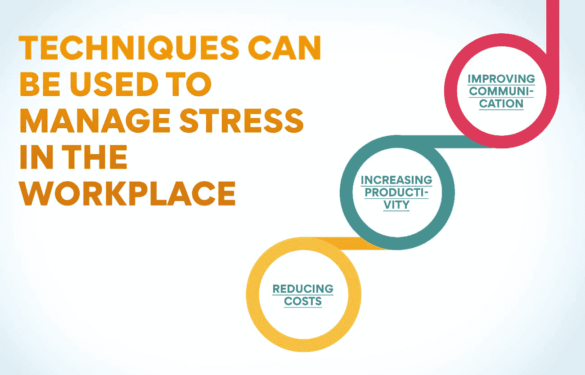
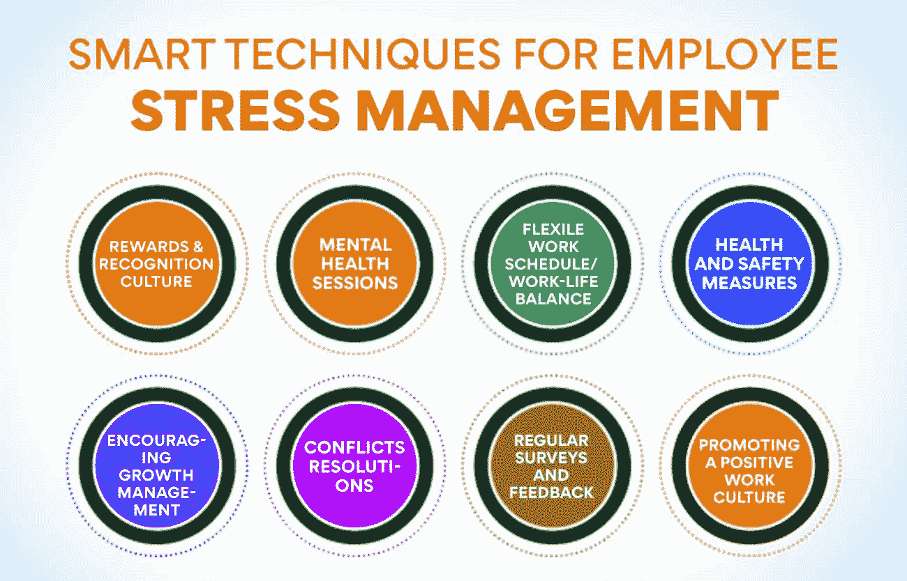

# 人力资源管理中的压力管理:为什么至关重要？

> 原文：<https://www.edureka.co/blog/stress-management/>

人力资源管理中的压力管理至关重要，原因有几个。首先，这是一种预防措施。通过管理压力，你可以防止潜在的问题，如员工缺勤、低生产率和高离职率。第二，这是一项调查措施。投资压力管理，就是投资员工的福祉。这将带来更快乐、更健康的员工队伍，这将提高生产率，降低缺勤率和离职率。那么，为什么压力管理在人力资源管理中如此重要呢？请继续阅读，寻找答案！

## 什么是人力资源管理中的压力管理？

随着工作节奏越来越快，要求越来越高，[雇主](https://www.edureka.co/blog/employer-branding/)需要认识到压力管理在人力资源管理中的重要性。不幸的是，许多企业没有看到员工生产力和压力水平之间的联系。

当员工超负荷工作或感觉自己一直处于压力之下时，会导致精疲力竭。这不仅会损害个人的健康和幸福，还会影响他们的工作表现。研究表明，工作压力是旷工和出勤的主要原因之一。

那么，什么是人力资源管理中的压力管理呢？这是一个涉及识别、评估和解决工作场所压力来源的过程。这可以通过各种方法来实现，如制定政策和程序来促进工作与生活的平衡，提供员工援助计划，或提供压力管理技术培训。

通过采取措施管理工作压力，雇主可以为员工创造一个更健康、更有效率的环境。这不仅会带来更好的个人成果，还会使整个企业受益。

## 工作场所压力的原因是什么？它是如何阻碍生产力的？

工作场所的压力是员工缺勤和生产力低下的主要原因之一。人们发现，有压力的员工更有可能请更多的病假，上班时效率更低，离职率更高。

许多因素都会导致工作压力，比如长时间、繁重的工作、不切实际的最后期限、缺少休息时间、恶劣的工作条件以及工作不稳定。压力也可能是由与同事或上司的人际冲突引起的。

**也读:[什么是战略人力资源管理？](https://www.edureka.co/blog/strategic-human-resource-management)定义和例子**

虽然一定程度的压力是不可避免的，但雇主可以采取一些措施来控制工作场所的压力水平，提高员工的工作效率。这些措施包括为承受压力的员工提供支持和资源，公开交流期望和工作量，提供灵活的工作安排，以及促进健康的工作生活平衡。

## **压力管理在人力资源管理中的重要性和意义**

压力管理在人力资源管理中至关重要，因为它有助于员工应对工作需求，保持健康的工作生活平衡。当员工有压力时，他们可能会经历焦虑、抑郁、易怒和难以集中注意力。这可能导致旷工、出勤主义和人员流动。压力管理干预可以帮助员工降低压力水平，提高工作效率。

## **员工压力管理的好处及其对成功的贡献**

员工压力管理对成功至关重要，原因如下:

1.  当员工有压力时，他们的工作效率会降低。这可能导致错过最后期限、错误和其他影响底线的问题。
2.  压力会导致旷工和出勤，进而影响生产力和盈利能力。
3.  员工压力与一系列健康问题有关，包括心脏病、焦虑和抑郁。

通过管理员工压力，组织可以提高生产力、盈利能力和员工健康。

## **员工压力管理的聪明技巧**

压力管理对人力资源管理部门的员工至关重要，因为它有助于改善沟通、提高生产率和降低成本。有几种技巧可以用来管理工作场所的压力。这些包括:

*   改善沟通: 这可以通过确保员工清楚地了解自己的角色和职责来实现。这可以通过定期会议和明确的职位描述来实现。
*   提高生产力: 通过设定现实的目标和期望，并为员工提供实现这些目标所需的资源来实现。
*   降低成本: 这可以通过减少或消除工作场所中不必要的压力来实现。这可能包括不切实际的截止日期、过多的工作量或恶劣的工作条件。

## **1。奖励&认可文化**

众所周知，员工认可是经理工具箱中最有力的工具之一。如果得到有效利用，奖励和认可可以提高员工的参与度、积极性和生产率。人力资源管理协会的一项研究发现，78%的员工表示，他们的工作得到认可是一种激励。

不幸的是，许多公司仍然没有理解有效奖励和认可文化的重要性。在 WorldatWork 最近的一项调查中，只有 60%的受访者表示他们的组织有一个有效的战略来认可员工。这意味着人力资源管理中的压力管理仍有很大的改进空间。好消息是，创造一种奖励和认可的文化并不像看起来那么困难。这里有一些让你开始的提示:

**确保你的整个团队都参与进来**

在你开始实施任何改变之前，有必要确保你的整个团队都认同奖励和认可文化的理念。如果你试图在没有团队支持的情况下实施变革，你很可能会遇到阻力。

**定义成功的样子**

对你的奖励和认可策略有一个清晰的想法很重要。你想提高员工参与度吗？鼓舞士气？提高生产力？一旦你知道成功是什么样子，你就可以

## **2。心理健康会议**

精神健康通常被视为工作场所的禁忌话题。然而，随着最近对精神健康问题认识的提高，越来越多的公司开始为员工提供精神健康服务。心理健康会议为员工提供了一个安全的空间，让他们可以与训练有素的专业人士谈论自己的心理健康。

这些课程可以帮助员工识别生活中的压力源，并发展应对机制来应对这些压力。此外，心理健康会议还可以为员工提供管理焦虑和抑郁的工具。

心理健康会议对人力资源专业人士来说至关重要，因为它们有助于发现那些正在与心理健康作斗争的员工。此外，这些会议有助于为所有员工创造一个更具支持性的工作环境。

**也读作:[分解人力资源管理的范围](https://www.edureka.co/blog/scope-of-human-resource-management/)**

## **3。灵活的工作时间表/工作生活平衡**

众所周知，长时间工作会导致精疲力竭。研究表明，每周工作超过 40 小时的员工患焦虑症和抑郁症等健康问题的风险更大。

这就是为什么公司提供灵活的工作时间表和促进工作与生活的平衡如此重要。通过允许员工调整工作时间以更好地适应他们的时间表，公司可以帮助减少压力和提高生产力。

此外，提供额外津贴，比如带薪休假去看医生或出差，也可以向员工表明他们的公司关心他们的健康。这可以大大降低压力水平，促进健康的工作生活平衡。

## **4。健康和安全措施**

当谈到管理工作场所的压力时，人力资源专业人员需要记住几件关键的事情。首先，为员工创造一个健康安全的工作环境很重要。这意味着要有关于健康和安全问题的明确政策和程序。

为员工提供管理压力水平所需的资源也很重要。这可能包括获得心理健康服务，放松技巧，甚至只是定期与他们的主管检查。

最后，人力资源专业人士需要注意工作场所的压力迹象。这些可能包括行为、生产力水平甚至身体症状的变化。通过了解这些迹象，人力资源可以在事情变得不可收拾之前采取行动帮助员工。

## **5。鼓励增长管理**

员工压力是工作场所缺勤和离职的主要原因之一。作为人力资源经理，鼓励有助于降低员工压力水平的成长管理实践非常重要。你可以做一些简单的事情来鼓励成长管理，包括:

*   为员工发展和培训提供机会。
*   鼓励员工接受新的挑战和责任。
*   支持员工实现工作与生活的平衡。
*   通过健康计划促进员工健康的生活方式。
*   对员工的辛勤工作和奉献给予认可和奖励。

## **6。冲突解决方案**

在任何工作场所，员工之间都会产生冲突。人力资源的工作是以一种对所有相关方都公平且不会对公司士气产生负面影响的方式来解决这些冲突。

有几种不同的方法可以用来解决工作场所的冲突。第一种是调解，包括人力资源部与争议双方会面，帮助他们达成和解。

如果调解不成功或不可行，下一步就是仲裁。这包括引入一个公正的第三方来听取双方的意见，并就此事做出有约束力的决定。

解决冲突的最后手段是诉讼，只有在所有其他选择都失败的情况下，才应将其作为最后手段。这包括将事情提交法庭，让法官或陪审团来裁决。

无论使用哪种冲突解决方法，都必须以对所有相关方公平且不损害公司士气的方式进行。

## 7 .**。定期调查和反馈**

对人力资源专业人员来说，另一个重要的压力管理工具是进行定期调查并收集员工的反馈。这可以通过年度绩效评估、离职面谈，甚至只是与员工的非正式交流来实现。

这些调查的目的是找出员工在工作中感到压力或不愉快的地方。一旦确定了这些方面，人力资源部门就可以采取措施来解决它们，并做出改变来降低员工的压力水平。

收集员工反馈的理想方式是让他们觉得简单方便。这可能意味着使用在线调查工具或为员工设置专用电子邮件地址来提交反馈。

通过定期收集员工的反馈，人力资源部门可以掌握工作场所的压力水平，并做出改变来解决任何问题。

## **8。促进积极的工作文化**

减少工作场所压力的最好方法之一是促进积极的工作文化。这包括对公司有一个清晰的愿景和价值观，促进开放的沟通，鼓励员工之间的友爱。

积极的工作文化可以大大降低员工的压力水平。当员工感到他们是积极的、支持性的工作环境的一部分时，他们更有可能快乐和富有成效。

人力资源在促进积极的工作文化方面发挥着至关重要的作用。通过设定基调和创建支持积极工作环境的政策和计划，人力资源可以对员工的生产力产生重大影响。

如果员工感到不堪重负，他们可以参考压力管理政策。该政策应概述员工可获得的不同压力管理资源和服务。

人力资源部门还应该确保员工了解他们可以利用的压力管理资源和服务。这可以通过定期交流来实现，比如电子邮件、时事通讯或海报。

## **结论**

没有人能在压力重重的情况下发挥自己的真正潜力。为了创造一个高效的工作场所，压力管理必须是 [HRM](https://www.edureka.co/blog/role-of-human-resource-management-in-an-organization/) 部门的首要任务。通过采取积极措施应对压力，人力资源管理可以创造一个更加积极的工作环境，并提高员工的生产力和参与度。

压力管理在人力资源管理中至关重要，因为它有助于确保员工能够应对工作需求。这也有助于提高员工的生产力和士气。几种压力管理技术可以用于人力资源管理，如为员工提供支持和培训，鼓励开放的沟通，以及缓解压力的活动。

重要的是要记住，压力管理不是一个放之四海而皆准的解决方案，对一个员工有效的方法不一定对另一个员工有效。根据每位员工的个人需求量身定制压力管理解决方案非常重要。

有兴趣了解更多这方面知识的人可以参加人力资源管理研究生证书课程。

## 更多信息:

[人力资源管理的关键目标](https://www.edureka.co/blog/objectives-of-human-resource-management/)

[目标&人力资源管理的本质](https://www.edureka.co/blog/nature-of-human-resource-management/)

[人力资源管理的演变:过去和未来](https://www.edureka.co/blog/evolution-of-human-resource-management)

[更好的员工关系可以带来快速的业务扩张:知道 11 个技巧](https://www.edureka.co/blog/better-employee-relation-can-lead-to/)