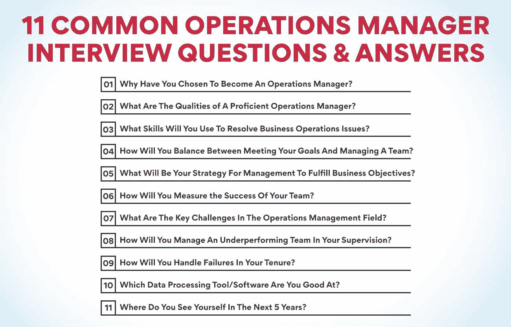
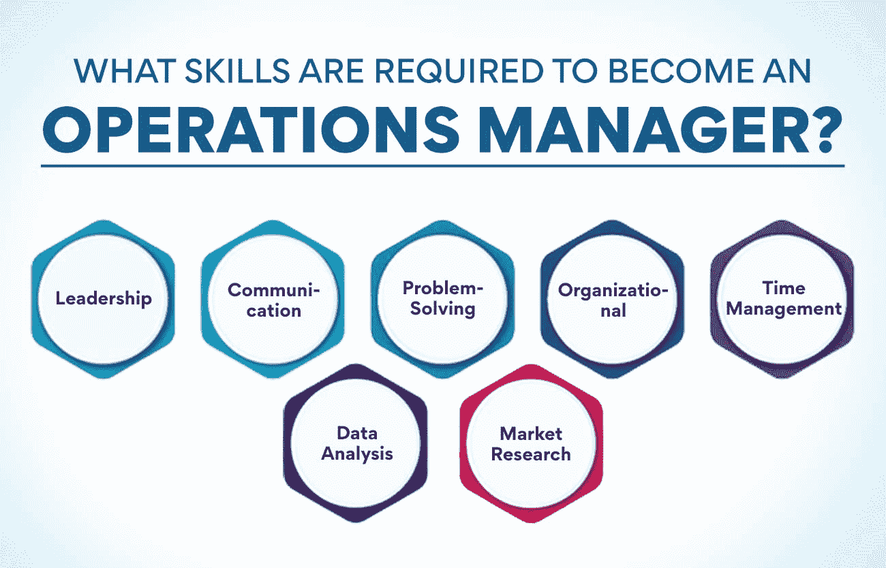

# 11 个常见的运营经理面试问题和答案

> 原文：<https://www.edureka.co/blog/operations-manager-interview-questions/>

运营经理在任何组织中都扮演着至关重要的角色。他们负责确保运营顺利高效地进行。要开始在[运营管理](https://www.edureka.co/blog/beginners-guide-to-operations-management/)的职业生涯，你必须为你的工作面试做好准备。这篇博文将提供 11 个常见的运营经理面试问题和答案。我们还将为您提供有效回答这些运营经理面试问题的技巧。

## **1。你为什么选择成为运营经理？**

运营经理负责公司的整体运营。他们监督生产过程，确保所有部门高效合作。运营经理通常有商业管理或工程背景。带着这个问题，雇主想看看你是否对这个职位头衔所带来的机会和责任做好了心理准备。

如何回答运营经理面试中的一个问题:我一直对企业如何运营很感兴趣，我喜欢能够解决问题并帮助提高效率。我选择成为一名运营经理，通过我的战略和远见技能来帮助领导一家公司，确保它实现其目标。

## **2。一个熟练的运营经理具备哪些素质？**

这是运营经理面试中最直接的问题之一，你可以自信地回答。一个熟练的运营经理是一个高度组织化和注重细节的人，能够有效地监督企业的日常运营。他们必须有很强的领导能力，能够激励和鼓舞周围的人实现共同的目标。

他们必须是优秀的沟通者，并具备战略性思考的能力，以有效地解决问题。一个熟练的运营经理还将对财务有敏锐的理解，并知道如何有效地管理预算。

## **3。你将使用什么技能来解决业务运营问题？**

运营经理确保业务运营平稳高效。他们将使用各种技能来解决任何可能出现的问题，如解决问题、决策、人员管理和项目管理。

运营经理需要快速发现问题并找到切实可行的解决方案。他们必须能够迅速做出决策，并有能力同时兼顾多个项目。强大的人际交往能力对运营经理来说至关重要，因为他们经常与公司各个层面的员工打交道。

如果你申请的是运营经理的职位，准备好讨论你解决问题、决策和项目管理的能力。你也应该准备好举例说明你过去是如何有效地管理人员和项目的。

**也可阅读:[什么是运营管理中的能力规划？](https://www.edureka.co/blog/what-is-capacity-planning-in-operations-management/)**

## **4。你将如何在实现目标和管理团队之间取得平衡？**

假设你被问到这个关于工作中战略平衡的问题，你必须记住几件事。

首先也是最重要的一点是，要清楚目标是什么。团队应该知道需要完成什么以及何时完成。其次，根据团队的规模和项目的复杂程度，创建一个相应地分配任务和期限的计划。最后，有效的沟通是确保每个人都步调一致、朝着相同目标前进的关键。

如果做得正确，平衡会议目标和管理团队可以是一个无缝的过程。重要的是要记住，授权并不意味着推卸所有责任——作为运营经理，你仍然需要定期检查并在需要时提供支持。但是通过遵循这些步骤，你可以成功地管理你的目标和你的团队。

## **5。为了实现业务目标，你的管理策略是什么？**

作为运营经理，你的主要职责是确保公司的运营平稳高效。你需要设计并[实施管理人员、流程和资源的战略](https://www.edureka.co/blog/why-do-businesses-need-an-operations-strategy/)。

你可以采取几种不同的管理方法，但你的策略必须与公司的业务目标相一致。例如，如果公司的目标是增加销售额，那么你的管理战略应该着眼于最大限度地提高生产率和效率，以满足客户需求。

最终，这取决于你来决定什么样的管理风格最适合公司及其目标。然而，不管你采取什么方法，重要的是你能有效地向你的团队传达你的愿景和目标，并一起工作来实现共同的目标。

## **6。你将如何衡量你的团队的成功？**

运营经理面试中的一个问题没有唯一的答案——这将取决于你的团队的具体[目标和目的](https://www.edureka.co/blog/what-are-the-objectives-of-operations-management/)以及在这些方面的成功。然而，一些常用的衡量成功的方法包括生产力水平、工作质量、客户满意度、员工满意度、保留率等等。

为你的团队设定清晰且可实现的目标，并根据这些目标制定衡量成功的计划是至关重要的。它将帮助您确定您的团队在哪些方面表现出色或不足，并使您能够做出必要的改变以提高绩效。

## **7。运营管理领域的主要挑战是什么？**

管理运营会带来一些关键挑战。第一个挑战是预测未来需求。它包括查看过去的数据，并使用它来预测客户未来想要或需要什么。这可能很困难，因为客户的行为往往是不可预测的。

另一个挑战是确保运营的各个部分平稳高效地运行。它包括从制造过程到客户服务的一切。当操作的一部分运行不正常时，它可能会破坏整个系统。

最后，运营管理部门面临的另一大挑战是跟上技术的发展。新技术有助于提高效率和质量，但实施起来也很昂贵和困难。运营经理必须掌握本领域的最新进展，以确保他们的公司使用最好的方法。

## **8。在你的监督下，你将如何管理一个表现不佳的团队？**

不可避免的是，在某个时候，你将不得不管理一个表现不佳的团队。准备好这些技巧来应对这种情况:

*   与每个团队成员单独交谈，找出问题所在，并制定解决方案。
*   为团队设定明确的期望和目标，并让他们负起责任。
*   创造一个积极的、支持性的环境，让团队成员能够自在地公开交流。
*   定期提供积极而有建设性的反馈。
*   在帮助团队改进的过程中，要有耐心并持之以恒。

## **9。你将如何处理任期内的失败？**

运营经理负责确保企业平稳高效地运营。他们制定并实施计划来提高生产率和质量，同时降低成本。运营经理工作的一个关键部分是预测和准备可能中断业务运营的问题。

运营经理必须有效地处理任期内的失败，以保持业务的平稳运行。面对失败时，一个有效的[运营经理](https://www.edureka.co/blog/operations-managers/)可以采取以下几个步骤:

1.  首先，评估形势，找出问题的根源。这将有助于你制定计划，防止问题再次发生。
2.  接下来，制定一个应急计划来处理失败的直接后果。这可能包括实施措施来减轻任何客户影响或财务损失。
3.  最后，实施改进流程或程序的步骤，以防止故障在未来再次发生。它可能涉及培训计划、工作流程或运营管理的其他方面的变更。

**也读:[运营管理的范围是什么？](https://www.edureka.co/blog/what-is-the-scope-of-operations-management/)**

## 10。你擅长哪种数据处理工具/软件？

有各种各样的数据处理工具和软件可供使用，了解自己擅长使用哪些工具和软件至关重要。这将向面试官展示你拥有完成这份工作所必需的技能。

一些常见的数据处理工具和软件包括 Microsoft Excel、Access 和 SQL。如果你擅长使用这些程序，向面试官提及这一点。其他数据处理工具包括统计分析软件，如 SAS 和 SPSS。如果你熟悉这些程序，让面试官知道。

除了提及你擅长哪些数据处理工具和软件，一定要说明你是如何使用的。比如说，如果你擅长使用 Excel，那就提及你是如何组织数据或者创建图表和图形的。这会让面试官更好地了解你的技能。

## **11。你对自己未来 5 年有什么看法？**

这是任何面试中最常见的总结问题，是关于了解你的能力和你对自己职业生涯的设想。你必须回答这个问题。你必须表现出你雄心勃勃，有长远目标。然而，你也应该现实一点，解释你目前的技能和经验如何帮助你实现这些目标。以一种战略性的方式回答，这将使你成为一个强大而有远见的人。

例如，如果你想被提升到一个高级管理职位，你应该描述你的领导能力和解决问题的能力将如何发挥作用。

同样重要的是证明你对公司的忠诚，并且没有短期离职的打算。你可以通过突出你对工作的忠诚和奉献来做到这一点。

如何回答运营经理面试中的一个问题:在接下来的几年里，我将继续发展我作为运营经理的技能。我想继续增长我在运营管理各个领域的知识，这样我就能成为团队中更有效的领导者。

此外，我希望继续与我的团队成员和公司内的其他部门建立牢固的关系，以便我们能够更有效地合作。最后，我希望通过帮助简化流程和改善整体运营来为公司的发展做出贡献。

## 为什么运营管理在印度是一个蓬勃发展的领域？

运营管理是一个不断发展的领域，它在印度蓬勃发展的原因有很多。一个原因是印度的人口正在增长，这意味着对商品和服务的需求不断增加。此外，印度经济正在蓬勃发展，为企业扩大业务创造了机会。

此外，印度拥有大量有才华的技术工人。这使得它成为计划建立或扩展其垂直市场的公司的一个有吸引力的目的地。此外，印度政府一直支持运营管理行业的发展，提供各种激励和福利。

## 成为运营经理需要哪些技能？

公司的整体管理和协调是由运营部门来承担的。他们制定并实施策略来提高效率和生产率，同时确保符合质量标准。作为一名成功的专业人士，运营经理必须有很强的领导能力、沟通能力、解决问题的能力和组织能力。他们还必须在压力下工作良好，同时处理多项任务。

一些关键技能是:

**领导力:** 一个运营经理必须具备很强的领导能力，才能有效地管理和激励员工。他们应该激励他人实现公司目标。

**沟通:** 运营经理必须与员工、部门主管和其他[利益相关者](https://www.edureka.co/blog/stakeholder-engagement)进行有效沟通。他们必须能够清楚地表达公司的政策和目标。

**解决问题:** 必须能够发现问题并制定创造性的解决方案。他们必须跳出框框思考，开发新的想法来提高效率。

**组织:** 必须高度组织化，才能有效协调公司运营。他们应该制定并实施时间表、计划和预算。

**时间管理:** 必须高效地管理自己的时间，以满足最后期限并实现公司目标。他们应该分清任务的轻重缓急，适当地分配工作。

**数据分析:** 必须能够分析数据以[做出明智的决策](https://www.edureka.co/blog/operations-management-decisions)。应该对财务报告、绩效指标和其他数据集有很好的理解和解释。

**市场调查:** 必须能够进行市场调查，以确定趋势和机会。他们应该能够研究竞争对手，了解客户需求。

**结论**

如果你在面试一个运营经理的职位，你必须准备好回答一些关于你领导和管理团队经验的关键运营管理面试问题。此外，期待回答关于你处理冲突、解决问题和提高效率能力的问题。

如果你想进入这一具有挑战性但回报丰厚的职业，亲身体验运营经理的所有职责，我们为你准备了一门课程。我们的[运营、供应链和项目管理高级证书](https://www.edureka.co/highered/advanced-program-in-operations-supply-chain-project-management-iitg)将为您提供运营管理方面的知识和技能。通过我们的课程，您可以在所有面试中获得领域专业知识。

听起来很诱人，对吧？马上去看看我们的课程吧！

## **更多信息:**

[医院运营管理——了解关键职能](https://www.edureka.co/blog/operations-management-in-hospitals)

[什么是订单管理？综合指南](https://www.edureka.co/blog/order-management/)

[运营管理的角色和职能](https://www.edureka.co/blog/roles-and-functions-of-operations-management/)

[运营管理入门指南](https://www.edureka.co/blog/operations-management/)