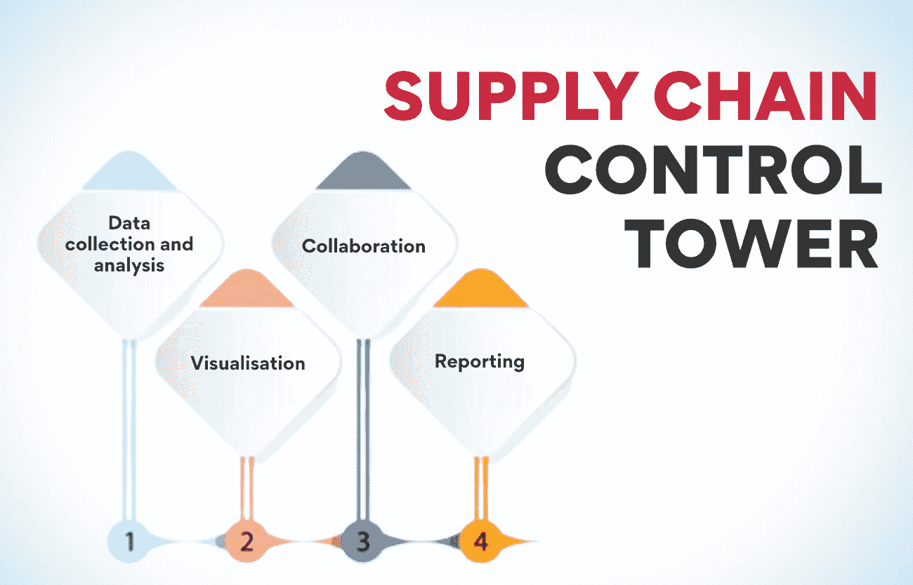
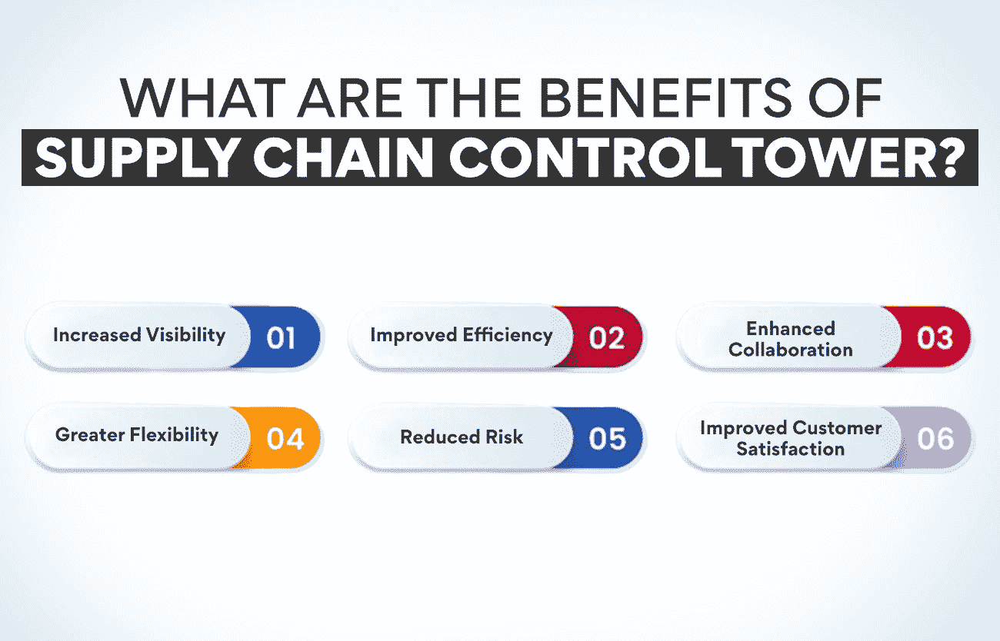
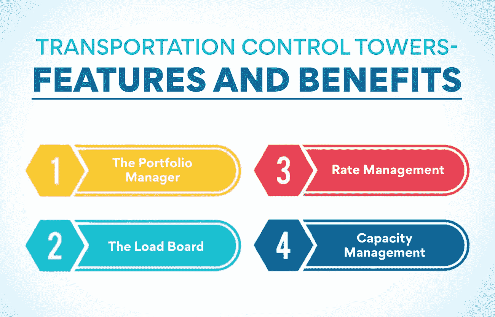

# 什么是供应链控制塔？类型和用途

> 原文：<https://www.edureka.co/blog/supply-chain-control-tower/>

供应链控制塔是一个集中式平台，提供实时数据和分析，帮助公司管理供应链。它让管理者对供应链有一个全面的了解，并做出明智的决策，从而提高效率和优化成本。

供应链控制塔是帮助企业管理供应链的软件。有许多不同类型的供应链控制塔，每一种都有其独特的功能和优势。您企业的正确供应链控制塔将取决于您的具体需求和目标。然而，所有的供应链控制塔都可以帮助你提高供应链的效率和可见性。

这篇博文将深入探讨供应链控制塔，并为您提供详细的见解。

## **供应链控制塔:是什么？解释**

供应链控制塔(SCCT)是一个使用数据分析和可视化的平台，让公司实时了解其供应链。SCCT 的目标是通过为企业提供做出更好决策所需的信息，帮助企业优化供应链。

SCCT 从多个来源收集数据，包括传感器、企业资源规划(ERP)系统和运输管理系统。然后对这些数据进行处理和分析，以提供关于供应链当前状态的信息。SCCT 平台还包括协作工具，因此组织内的不同团队可以合作改善供应链。

有许多不同类型的供应链合作伙伴，但都有一个共同的目标，那就是帮助组织改善他们的供应链管理。SCCTs 的一些常见功能包括:

**数据收集和分析:** 如上所述，SCCT 的关键功能之一是从各种来源收集数据，并使用这些数据来洞察供应链的当前状态。这些数据可用于识别需要改进的地方，如瓶颈或延迟。

**可视化:**SCCTs 的另一个常见功能是可视化工具，帮助用户理解数据并做出更好的决策。这些工具可以采取多种形式，如图表、图形或热图。

**协作:** 如前所述，协作是 SCCTs 的另一个本质特征。这个特性允许一个组织内的不同团队在供应链管理上合作。

**报告:**scct 通常还包括报告功能，允许用户生成关于供应链当前状态的报告。这些报告可用于跟踪进度或与其他利益相关者共享信息。

## **供应链控制塔的意义是什么？**

在瞬息万变的商业环境中，了解和控制供应链的能力变得越来越重要。供应链控制塔是一个集中式平台，它利用数据和分析来提供对扩展供应链的更新和实时可见性。它允许组织主动识别和管理风险，优化绩效，并提高敏捷性。

供应链控制塔的好处是巨大的，可以取决于一个组织的具体需求。一般来说，运行良好的控制塔有助于提高效率，降低成本，提高客户满意度。此外，控制塔可以改善供应商关系，更好的库存管理，并减少交货时间。

如果实施得当，供应链控制塔可以成为任何希望优化运营的组织的强大工具。

## **供应链控制塔是如何工作的？**

控制塔可以跟踪货物，优化路线，监控库存水平。它还可以用于识别供应链中的潜在问题和中断。

供应链控制塔通常由一组分析师操作，他们使用来自多个来源的数据来提供对供应链的洞察。分析师与[公司的运营](https://www.edureka.co/blog/beginners-guide-to-operations-management/)团队紧密合作，以确保供应链顺畅运行。

对于依赖复杂供应链的公司来说，控制塔已经成为一个必不可少的工具。它提供了有效管理供应链所需的可见性和洞察力。

物流服务提供商(LSP)首先引入控制塔概念，以管理其客户的货运。然而，术语“供应链控制塔”已经被不同行业的许多公司用来描述他们的中央决策平台。

典型的供应链控制塔包括四个主要部分:数据管理、商业智能&分析、绩效管理和可操作的洞察力。数据管理负责收集和存储供应链中各种来源的数据。商业智能&分析部门负责分析这些数据，以确定趋势和模式。绩效管理负责跟踪 KPI 和设定目标。基于所有这些信息生成可操作的见解，以提出改进供应链的建议。

## **供应链控制塔有什么好处？**

**能见度增加**

供应链控制塔提高了供应链的可见性，允许更好的控制和管理。这种可见性有助于在问题和潜在问题导致重大中断之前及早发现它们。

**提高效率**

通过提高整个供应链的可见性和可追溯性，控制塔有助于提高效率和优化运营。它可以节省成本和提高性能。

**增强协作**

供应链控制塔还可以促进供应链中不同利益相关者之间的合作。为信息共享和交流提供一个集中的平台有助于改善协调和减少延误。

**更大的灵活性**

供应链控制塔的另一个好处是它可以提供更大的灵活性来适应不断变化的需求或条件。这种灵活性在动态或不确定的环境中非常重要。

**降低风险**

凭借对供应链更好的可见性和控制，控制塔有助于降低整个系统的风险。它可以最大限度地减少中断，确保整体运营更加顺畅。

**提高客户满意度**

最后，通过提供更高效、更可靠的供应链，控制塔最终可以提高客户满意度。这是因为客户将更快地收到订单，减少错误或延迟。

**也读:[什么是绿色供应链？](https://www.edureka.co/blog/green-supply-chain)概述**

## **供应链控制塔有哪些不同的用途？**

供应链控制塔是一个集中式平台，它使用数据和分析来更好地覆盖供应链的各个方面。它支持整个供应链中的实时决策、协作和沟通。

供应链控制塔的主要用途是优化整个供应链中的货物和信息流动。它包括管理库存水平、跟踪装运和协调运输。控制塔还可以监控供应商的表现，跟踪客户订单，预测需求。

供应塔的另一个常见用途是识别和管理整个供应链的风险。它包括识别潜在的中断，如供应商短缺或自然灾害，并制定应急计划以避免或减轻这些中断。

除了这些用途，许多公司现在还使用供应链控制塔来推动数字化转型计划。它包括使用该平台连接孤立的数据源，实现自动化决策，以及开发预测分析和机器学习等新功能。

## **不同类型的供应链控制塔**

供应链控制塔有不同的类型，每一种都有自己的特点和功能。每种控制塔类型都有其优点和缺点，因此根据您的需求选择合适的类型非常重要。选择正确的 SCCT 取决于影响商业模式的各种因素。

## **物流控制塔——举例说明**

物流控制塔(LCT)是一个使用数字技术监控和协调整个供应链中货物流动的中央单元。LCT 旨在优化货物流动，提高效率，降低成本。

LCT 可用于监控和跟踪货物，发现问题和延误，并管理库存水平。它创造了整个供应链的透明度，使所有利益相关者都能在任何给定的时间看到货物在哪里。

使用 LCT 有很多好处，包括以下几点:

*   改善供应链不同部分之间的协调和沟通
*   提高装运和库存水平的可见性
*   更快地识别和解决问题
*   通过提高效率降低成本

实施 LCT 的公司包括可口可乐、IBM、雀巢、宝洁(T2)和联合利华。

## **操作控制塔——举例说明**

操作控制塔是一个组织的重要组成部分之一。它们提供了一个集中的位置，从这里可以监视和控制所有的操作。操作控制塔可以在许多行业中找到，包括制造业、医疗保健、物流和零售业。

运行控制塔通常配备一组专业人员，负责监督组织运行的各个方面。这个团队可能包括经理、分析师、工程师和其他专家。控制塔的概念是基于“分而治之”通过将组织的运作分成更小的单元，每个单元都可以得到更有效的监控。

运行中的控制塔最重要的功能是确保所有的操作都顺利进行。要做到这一点，控制塔团队必须清楚地了解组织的总体目标和目的。他们还必须能够识别潜在的问题，并在问题造成重大破坏之前加以纠正。

有不同类型的控制塔，但它们都有一个共同的目标，那就是提供供应链的可见性。一些常见的操作控制塔类型包括:

1.  **运营控制塔:** 这些塔专注于优化供应链内的日常运营。例如，一个操作控制塔可以用来实时跟踪库存水平，以便在供应开始减少时触发再订购。
2.  **战略控制塔:** 这些塔从供应链的长远角度出发，关注产能规划和供应商管理等问题。例如，一座[战略控制](https://www.edureka.co/blog/how-to-formulate-advanced-supply-chain-strategy/)塔可能被用来制定应对意外需求高峰的计划。
3.  **财务控制塔:** 这些塔专注于供应链的财务方面，如成本管理和收入优化。例如，可以使用财务控制塔来跟踪供应链不同部分的支出，以便识别和解决成本高的领域。

## **H2——交通控制塔——举例说明**

供应链控制塔是一个平台，它使用数据和分析来提供供应链所有方面的可见性。这种可见性使组织能够做出实时决策，以提高绩效和优化成本。

有许多不同类型的交通控制塔，每一种都有其独特的功能和优势。下面举几个例子:

1.  **投资组合经理:** 这个控制塔提供了对整个运输资产和资源组合的可见性。它帮助企业识别未充分利用或表现不佳的资产，然后提出优化这些资产的建议。
2.  **装载板:** 这个控制塔提供了对由各种运输伙伴运输的货物的可视性。它帮助托运人确定运力短缺或过剩，然后提出优化装载计划和路线的建议。
3.  **运费管理** :这个控制塔提供当前和历史运费的可见性。它帮助组织确定基准费率，了解趋势，然后就与运营商合作伙伴谈判合同提出建议。
4.  **容量管理:** 这种类型的控制塔提供对运营商合作伙伴的可用容量的可见性。它有助于托运人确定运力限制，然后就优化可用运力的使用提出建议。

## **分析控制塔——举例说明**

分析控制塔是一个中央单元，它使用数据驱动的分析来优化和管理整个供应链中的货物和资源的流动。

分析控制塔配备了强大的数据管理和分析工具，能够识别低效和瓶颈，以及节约成本、提高质量和客户服务的机会。

通过持续监控供应链网络的性能，分析控制塔可以在问题造成中断之前主动解决问题。此外，分析控制塔可以提供对装运状态、库存水平和其他关键指标的实时可见性。

如何使用分析控制塔的一个例子是监控供应商的表现。控制塔可以通过跟踪关键指标(如准时交货率和订单准确性)来确定哪些供应商没有达到预期。然后，这些信息可用于与这些供应商合作，以提高他们的绩效或寻找能够更好地满足公司需求的新供应商。

另一个例子是使用分析控制塔优化运输路线。控制塔可以通过分析历史数据来确定哪些路线一直在造成延误或问题。然后，这些信息可用于规划替代路线或对当前路线进行调整，以避免未来的中断。

使用分析控制塔包括提高供应链绩效的可见性、主动识别问题和改进决策。分析控制塔提供了整个供应链的综合视图。

**也可阅读:[绿色供应链管理:它是什么，为什么重要？](https://www.edureka.co/blog/green-supply-chain-management)**

## **库存控制塔——举例说明**

库存控制塔是专注于管理库存的供应链控制塔。他们利用数据和分析优化库存水平，将缺货风险降至最低。

有许多不同类型的库存控制塔，每一种都有其优点和缺点。最常见的有:

1.  **集中库存控制塔:** 这些通常被拥有复杂供应链的大型组织使用。他们将所有数据和决策集中在一个团队或部门。这可以改善协调和决策，但也可能僵化和迟缓地应对变化。
2.  分散式库存控制塔: 这些通常用于较小的组织或供应链较简单的组织。他们分散数据和决策，给每个团队或部门更多的自主权。它可以带来更快的决策和更大的灵活性，但也可能导致不协调和重复劳动。
3.  混合库存控制塔 :这些结合了集中和分散模式的各个方面，让组织两全其美。但是，它们的设置和管理也可能比任何一种纯模型都更复杂。

选择使用哪种库存控制塔取决于组织的具体需求。没有放之四海而皆准的解决方案，这取决于哪种方案最适合您的业务。

## **结论**

供应链控制塔是一个集中的实时决策平台，协调公司供应链的所有活动部分。它允许组织监控、管理和优化其供应链，以提高效率、降低成本和增加客户满意度。

使用供应链控制塔的好处很多。首先，它提供了供应链的每一个[组成部分的可见性，这样问题就可以被迅速发现和纠正。它还允许公司对需求变化或其他干扰做出迅速反应。此外，它还可以帮助公司制定更好的库存水平、生产计划和运输路线决策。最终，一个运行良好的控制塔可以带来更高效、更有利可图的业务。](https://www.edureka.co/blog/components-of-supply-chain-management/)

想在供应链管理领域开始自己的职业生涯并获得 SCCT 冠军吗？我们为你准备了一个很棒的课程。查看我们的[运营、供应链和项目管理高级证书。](https://www.edureka.co/highered/advanced-program-in-operations-supply-chain-project-management-iitg)

## **更多信息:**

[运营管理的角色和职能](https://www.edureka.co/blog/roles-and-functions-of-operations-management/)

[运营管理入门指南](https://www.edureka.co/blog/operations-management/)

[物流和供应链管理有什么区别？](https://www.edureka.co/blog/difference-between-logistics-and-supply-chain-management/)

[了解供应链管理的基本要素](https://www.edureka.co/blog/components-of-supply-chain-management/)