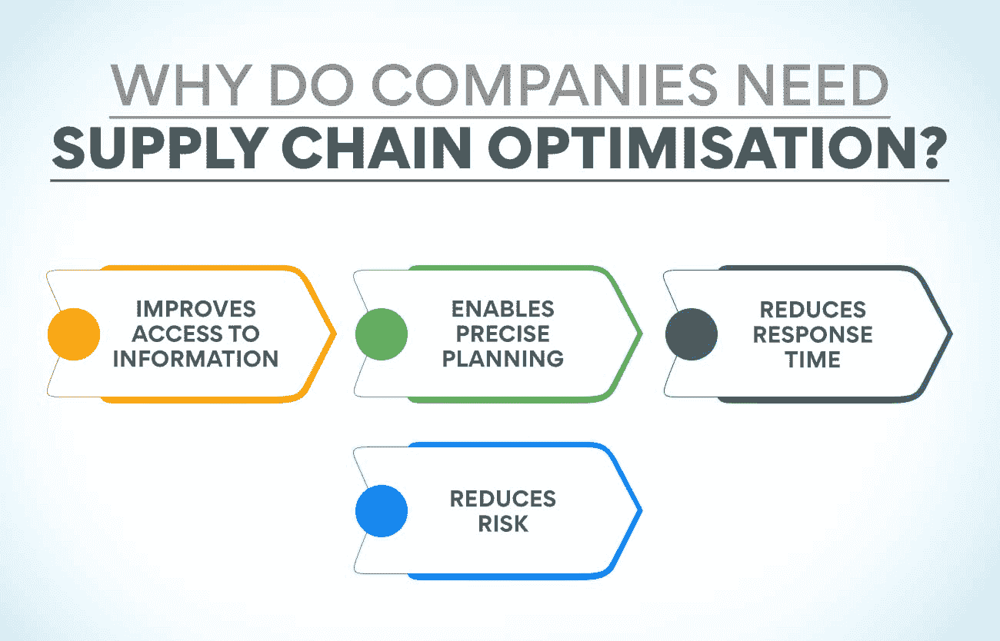
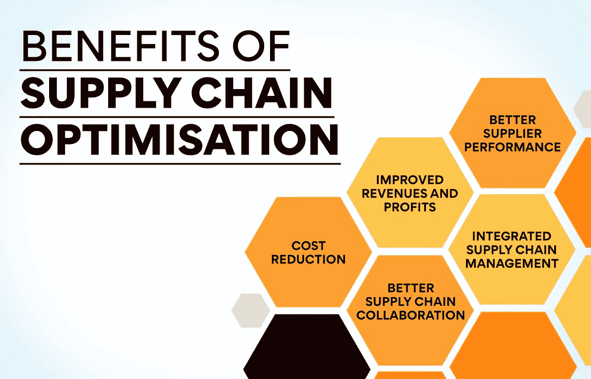

# 什么是供应链优化？概述

> 原文：<https://www.edureka.co/blog/supply-chain-optimisation/>

供应链是企业中至关重要的元素之一。它包括货物的采购、制造、储存和交付。所有这些都是必须最有效执行的关键任务。困难的产生是因为不同的人处理它们，并且不总是联系在一起。如果供应链效率低下，可能会导致成本增加和盈利能力下降。供应链问题也将极大地影响客户体验，这甚至可能导致失去他们。解决方案是供应链优化。

什么是供应链优化？

简而言之，供应链优化意味着让供应链发挥最高效率。目标是以最低的成本向客户交付产品，同时确保公司获得最高的利润。实现这一目标的方法是让所有供应链官员平衡制造、库存、运输、订单履行和客户服务期望的成本。在计算供应链效率时，会考虑总运营费用和库存毛利率等关键绩效指标。

供应链优化并不是任何人都可以快速完成的事情，因为其中涉及的复杂性。公司必须为一个长期的过程做好准备。此外，由于许多因素在不断变化，因此需要持续监控。提供最佳利润和最低成本的供应链组合可以根据其他因素而变化。原材料成本、运输费用和客户期望会随着时间而变化。它甚至可以被称为一个连续的过程，因为随着供应链各种要素的变化，需要做出相应的改变。

那些渴望成为[供应链经理](https://www.edureka.co/blog/major-decision-areas-in-supply-chain-management/)的人必须熟悉这一流程，并且应该知道应该如何执行。运营、供应链和项目管理高级证书课程是了解它的最佳地方。访问我们的网站将有助于你获得更多的课程信息。

**为什么要优化供应链？**

由于各种重大事件，公司通常会选择供应链优化(T2)。当对公司的财务表现存在担忧时，就会这样做。有时，当运输费用增加、客户服务不令人满意或者供应链的其他[组件对流程有抱怨时，也会这样做。随着公司争相满足不断变化的客户期望，供应链以一种无计划的方式增长。由于电子商务业务的增加，向直销的转移也导致了交付成本的增加。这也会导致公司考虑优化他们的供应链。](https://www.edureka.co/blog/components-of-supply-chain-management/)

**为什么公司需要供应链优化？**

在开始这一过程之前，有必要了解为什么组织进行这项工作很重要。有必要知道它会对供应链运作产生什么影响。

1.  **改善信息获取**

供应链是一种跨部门的运作。这可能导致信息被孤立在某些地方，并不是链中的每个人都可以看到。这种情况会降低管理的有效性，并使系统更容易出现问题。一旦优化完成，供应链中的所有参与者都将获得信息。

2.  **实现精确规划**

计划对于供应链的高效运作非常重要。供应链优化确保所有信息与所有人共享。这有助于更好地计划任何可能破坏系统的事件。它还有助于供应链团队通过正确的需求预测制定更好的生产计划。他们还可以准确地编制预算，因为所有数据都可用。

3.  **减少响应时间**

更好的可视性和规划有助于避免严重的问题。随着透明度的提高，供应链优化帮助团队更快地应对突发事件。他们可以预测未来的事件并采取预防措施。

4.  **降低风险**

由于各种意外事件，供应链总是充满风险。公司必须努力降低可能会造成金钱损失和令客户失望的风险。优化系统有助于降低生产延迟、供应链中断、数据泄露和交付预期失败等风险。

**也读:[运营管理的范围是什么？](https://www.edureka.co/blog/what-is-the-scope-of-operations-management/)**

**关键供应链优化特性**

虽然不同公司的特点可能不同，但你可以在大多数优化流程中找到一些。

**供应链可见性**–优化供应链将确保所有利益相关方对流程有良好的可见性。

**订单管理**–一个好的供应链会有跟踪设施，捕捉、履行和管理订单，以确保最大限度的客户满意度。

**库存控制**–一个优化的供应链管理将拥有使用现代技术跟踪和维护库存的先进方法。它有助于保持最佳库存。

**分析&报告**–有效管理和利用历史和当前数据是 **供应链优化** 的另一个特点。

**可持续性**–优化的供应链在端到端供应功能方面具有可持续性。这导致了更多的客户忠诚度。

在运营、供应链和项目管理高级证书课程中，你可以学到更多关于这个过程的知识。您可以通过访问我们的网站了解更多关于该计划的信息。

**供应链优化的目标**

不同的公司有不同的供应链。选择优化目标可能很困难。最好的方法是将你的流程建立在公司的业务和运营目标上。

**库存优化**

库存是要花钱的，每个公司都必须努力保持最佳状态。但库存优化还有其他原因。在进行这项工作时，该公司可以确定快速和慢速流动的项目。这将有助于决定哪些产品必须存放在更容易接近的地方。它可以决定仓库必须位于何处。库存控制还为改进多个业务流程提供了非常有价值的信息。

**缩短运输和订单履行时间**

物流是供应链的重要组成部分。优化它将导致运输和订单履行时间的减少。供应链优化应关注这一目标，因为这是实现组织[目标](https://www.edureka.co/blog/objectives-of-supply-chain-management-explained/)的途径。实现这一目标也意味着更好的客户满意度。这也将大大降低运输成本，增加收入。

**提高运营效率**

这是确保客户满意和更好销售的另一种方式。优化供应链中的任何一个环节都会影响到公司的所有运营方面。当运作更有效率时，将会减少货物到达顾客手中的时间。它带来了更好的客户满意度和忠诚度。

**增加收入和利润**

供应链优化应该专注于增加收入和利润。当你减少供应链中的浪费时，这种情况就会发生。意思是不应该有不走向市场的产品。另一种方法是降低送货成本。应该想办法用同样数量的车辆和司机运送更多的物品。供应链成本的任何降低都会自动提高收入和利润。

**降低成本**

公司可以通过多种方式降低供应链上的成本。有如此多的组件，它是组织中提供大量降低成本机会的流程之一。公司必须考虑降低固定成本和可变成本。降低仓库租金总是有可能的。优化还应着眼于降低其他成本，如原材料价格、运输费用等。

**更好的客户服务**

在一个几乎所有商品都有多家供应商的世界里，客户满意度至关重要。公司必须通过在各个层面提供更好的服务来努力让顾客满意。这是任何供应链改进的最终目标。缩短交付时间将是让客户满意的一个绝佳方式，而供应链优化流程必须以此为重点。

**实现供应链优化的方法**

1.  **外包业务活动**

大多数组织喜欢自己完成所有的活动。但这并不总是有益的。通常，将一些流程外包给致力于该活动的公司会产生更好的结果。将采购、物流和客户服务等许多活动外包给其他机构是可能的。可以大大降低成本。这将有助于优化供应链流程。

2.  **确保透明沟通**

这是供应链优化的一个非常重要的方面。组织必须确保它和供应商之间有透明的沟通。这将大大有助于确保原材料的及时供应。这种事实的自由交流也将有助于面对意想不到的情况。供应商也愿意分享价格上涨和原材料短缺的信息。

3.  **使用移动和互联网技术**

现代科技有助于信息交流。它们也可以用来优化供应链。使用移动应用程序有助于追踪商品流向顾客。顾客也将受益于知道他们将在什么时候收到物品。社交媒体是了解客户偏好最新趋势的绝佳场所。这将有助于判断对某一产品需求的突然增加。

4.  **使用集中管理系统**

如果供应链要高效运作，与之相关的各个部门必须能够高效合作。使用有助于从一个地方管理所有部门的软件有助于更好地协调。对供应链有一个全面的了解将有助于了解任何地方是否有任何障碍。此类软件程序可以帮助成功完成供应链优化流程。

5.  **使用多通道方法**

订单履行在任何业务中都至关重要。对于电子商务企业来说尤其如此。要求必须及时传达给供应商，以确保客户及时收到货物。使用多渠道方法有助于预测趋势和计划库存。这将确保订单的及时执行，使客户满意。

**也读:[如何制定先进的供应链战略？](https://www.edureka.co/blog/how-to-formulate-advanced-supply-chain-strategy/)**

6.  **了解供应商**

供应链优化在很大程度上取决于价格合理的采购。但是还必须确保原材料或货物的质量是最好的。只有当你了解你的供应商，知道他们的优势和劣势，这才有可能。这将有助于为不同的订单找到合适的供应商。公司必须继续寻找能以合理的价格销售高质量产品的供应商。

7.  **好的规划**

良好的计划是确保及时供货而不产生额外成本的关键。如果有良好的计划，即使是紧急订单也可以执行，而无需支付任何额外费用。如果库存计划得很好，并存放在离客户很近的仓库里，就有可能在短时间内供应货物，而不会产生更多的费用。良好的计划还将确保所有的原材料都到位，以便按时执行订单。

8.  **了解客户趋势**

了解客户及其购买趋势对于优化供应链至关重要 。公司必须了解客户的购买模式，以便随时保持最佳库存。这将确保不会因库存过多而产生额外成本。分析销售数据是确保有足够的商品来完成订单的最好方法。

9.  **使用分析工具**

数据分析是了解销售趋势的绝佳方式。提前了解顾客的需求有助于你做好准备。这也有助于避免货物滞销。公司还可以使用分析工具找出每种产品的最佳库存水平。它还有助于为您的客户找到最短的路线，从而节省运输成本。

10.  **定期协商**

供应链优化的最终目标是提高收入和降低成本。公司必须与供应商谈判以获得最好的价格。这将降低库存成本，带来更好的利润。但是谈判不是一蹴而就的。采购团队必须了解原材料的最新市场价格，并定期谈判以获得最佳价格。

**供应链优化的优势**

**降低成本**

有了供应链优化，可以避免很多不必要的开支。公司可以消除或自动化重复或无效的流程。优化库存会降低费用。通过改善仓库容量、交付流程和物流，公司可以减少基础设施支出。

**提高收入和利润**

当供应链运作得更有效率时，顾客满意度当然会更高。订单将准时交付。该公司将能够迅速响应顾客的需求。这将改善客户体验，从而产生重复购买和口碑宣传。因此，该组织在没有额外成本的情况下获得了额外的销售额。

**更好的供应商表现**

分析是供应链优化流程的一部分。这有助于更深入地了解供应商的表现。只要供应商表现不佳，公司就能迅速纠正。供应商也可以因为改进工作方法而获得奖励。当与供应商的关系改善时，公司将从获得各种事务的高级信息中受益。这有助于做出更好的采购决策。

**更好的供应链协作**

供应链由公司内外的各种合作伙伴组成。优化供应链可以确保所有这些实体实时共享信息。这导致了不同组件之间更好的协作。公司可以做出更明智的决策，规避风险。

**集成供应链管理**

供应链优化使所有活动在一个中心点可见。公司可以从供应链的各个方面收集大量的见解。由于完全可见，很容易进行销售预测、管理现金流、了解客户忠诚度并确保及时交货。因为链中的每个元素都可以使用所有数据，所以操作是完全透明的。

[运营、供应链和项目管理高级证书课程](https://www.edureka.co/highered/advanced-program-in-operations-supply-chain-project-management-iitg)教授更多关于公司如何通过优化供应链获益的知识。您可以访问我们的网站，了解更多关于该计划的信息。

**供应链优化技术**

1.  **成本优化**–该公司着眼于供应链中涉及成本的每一个领域，看看哪里有可能降低成本。为实现这一目标，它带来了短期和长期的变化。
2.  **库存优化**–通过这种方法，团队寻找所有可以优化库存的领域，以确保客户满意度。公司使用分析找出供需不确定性以及克服这些不确定性的解决方案。有了这种技术，组织可以在整个供应链中保持最少的库存。
3.  **网络优化**——公司必须知道供应链中的每个实体将如何应对变化。这种方法有助于组织对当前供应链系统中的许多假设情况做出反应。基于这些发现，公司可以制定计划，以确保在这些变化期间降低成本和风险。

**结论**

供应链是每个组织的关键职能。如果表现不好，公司可能会遭受巨大的损失。成本可能会增加，客户忠诚度也会降低。为了避免这种情况，供应链必须以最佳状态运行。供应链优化是确保公司充分利用其供应链的方法。每个有抱负的供应链专业人士都必须知道如何成功完成这一过程。

## **更多信息:**

[什么是绿色供应链？概述](https://www.edureka.co/blog/green-supply-chain)

绿色供应链管理:它是什么，为什么重要？

[什么是供应链控制塔？类型&用途](https://www.edureka.co/blog/supply-chain-control-tower/)

[什么是供应链分析？重要性、用法&举例](https://www.edureka.co/blog/supply-chain-analytics/)