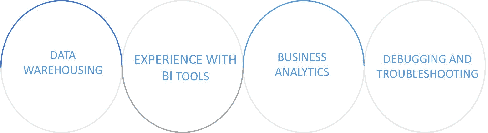

# 印度电力 BI 专业人员的工资[2023 年更新]

> 原文：<https://www.edureka.co/blog/power-bi-professionals-salary-in-india/>

最新 ***权力** **BI 专业人士** **薪资*** 根据野心盒子，印度的薪资范围从 24 万卢比到 345 万卢比不等。 ***电力 BI*** 需求较高，薪资待遇根据职务指定。 工作经验不足 1 年的电力 BI 专业人员的平均工资约为 400，000 卢比。

所以今天在这个博客中，我们将谈论以下话题:

1.  [**BI 开发者必备的顶级技能**](#Skills)
2.  [**毕职业薪资与技能**](#Salary)
3.  [**公司招聘电力 BI 开发者**](#Hiring)
4.  [**结论**](#Conclusion)

## **BI 开发者必备顶级技能:**

**数据仓库:** 数据仓库背后的概念是数据的结构化，这些数据可用作公司中存储和检索文件的信息源。此外，它允许您分析从历史数据中产生的信息。 使用数据仓库的主要原因是为了收集所有敏感的和不可复制的信息用于数据报告。 分析目的。

**使用 BI 工具的经验:** 当我们谈到原始数据时，我们觉得需要根据事件按时间顺序组织和组合它们。这就是 BI 工具发挥作用的时候了。这些工具可以用来组织大量的非结构化数据，以使它们更易于呈现。此外，每当数据事件之间存在不匹配或文件的任何重复时，都要将数据组织成它们各自的顺序。

**商业分析:** 指的是组织工作中的变革需求。它既适用于盈利组织，也适用于非盈利组织。业务分析的从业者可能担任业务分析师、系统分析师、需求工程师、过程分析师、产品经理和产品所有者等职位。

**调试和故障排除:** 调试和故障排除是非常常见的方面，其中涉及到问题的识别、问题原因的隔离、问题的纠正或找到解决方法。找出一个编码错误需要对与之相关的程序和函数有正确的理解。

## **异能 BI 职业者薪资** **和技能:**

| 名称 | 工资 | 技能 |
| 电力 BI 数据分析师 | Rs。442864 | SSAS，权力毕，权力观，权力中枢，权力查询，query |
| 电力 BI 顾问 | Rs。604，000 | Power BI(专业版、高级版、分页版)。数据流、增量数据刷新、行级安全性、DAX、超级查询、M 语言。 |
| Power BI 软件工程师 | Rs。442373 | 从 Power BI 到 SQL、Salesforce 等其他来源的数据可视化、数据分析和数据集成。 |
| 电力 BI 分析师 | Rs。494000 | SSRS, SSAS, and SSISJavaScript 和 SQL 的基础知识。 |
| 备份管理员 | Rs. 5,50,000 | EMC VMAX、PMAX、Unity、Isilon、Oracle ZFS 和 NetApp 产品 |

## **招聘 Power BI 开发人员的公司:**

1.  **亚马逊**

*   根据要求，你的主要职责是保证工作有效进行，以确保客户对技术领域的高水平服务感到满意。
*   为了充分理解客户的期望并将其转化为系统需求，你必须收集需求和规范。
*   你将在工作需求的整体评估中扮演重要角色，确保技术领导和项目经理有准确的项目评估。
*   您将为高效程序/系统的开发做出重要贡献，如果您认为自己非常适合帮助我们的客户在数字化之旅中迈出下一步，请申请。

2.  **NTT 数据**

该职位需要一名在 Power BI 和 SQL Server 方面有实践经验的数据分析师。

*   候选人必须能够理解和分析来自销售仪表板的数据，以提供汇总的输出和见解。
*   候选人必须是一个强有力的沟通者和分析思考者。
*   候选人应熟悉从 Power BI 到 SQL、Salesforce 等各种来源的数据可视化、数据分析和数据集成。

3.  **戴尔**

与销售、运营和服务团队中的许多关键利益相关者合作，确定改善客户体验(CX)的机会，并致力于改善整个订单旅程阶段的客户体验的关键项目。

你应该负责启动 CX 改进计划，开发仪表板和洞察力，以协助 CX 计划

跨部门协作以获得认同、支持和协助。

确定并记录主要客户和合作伙伴的棘手问题。

4.  **HCL**

如果你想详细了解 Power BI，那么我建议你观看这段 YouTube 视频:

## **动力 BI 初学者教程| Edureka**

[https://www.youtube.com/embed/3u7MQz1EyPY](https://www.youtube.com/embed/3u7MQz1EyPY)

## **结论**

Power BI 现在几乎已经成为一种流行的商业工具，而且它的受欢迎程度不太可能在短期内减弱。再者，它是微软的产品，已经发布了很多市场领先的商品。由于 Power BI 是一种基于云的产品，随着企业从内部工作环境迁移到云平台，它在未来有很大的潜力。

因此，我们可以得出这样的结论: ***【力量毕】*** 有着光明的未来，任何有兴趣在这个行业发展的人都可以充满信心。

在本文中，您将了解成为 ***电力商务智能专业人员所需的 ***电力商务智能专业人员的薪资和技能******查看 Edureka ***[电力商务智能培训](https://www.edureka.co/power-bi-certification-training)。*** 认证培训将帮助您获得商业分析方面的专业知识。您将掌握 Power BI 桌面、架构、DAX、服务、移动应用、报告和 Q & A 等概念，以及行业使用案例。此 Power BI 培训确保您获得实时项目的实践经验，Power BI 课程大纲由主题专家策划，帮助您通过 PL-300:Microsoft Power BI Data Analyst 考试。向 10 多年经验丰富的行业专家学习 Power BI。