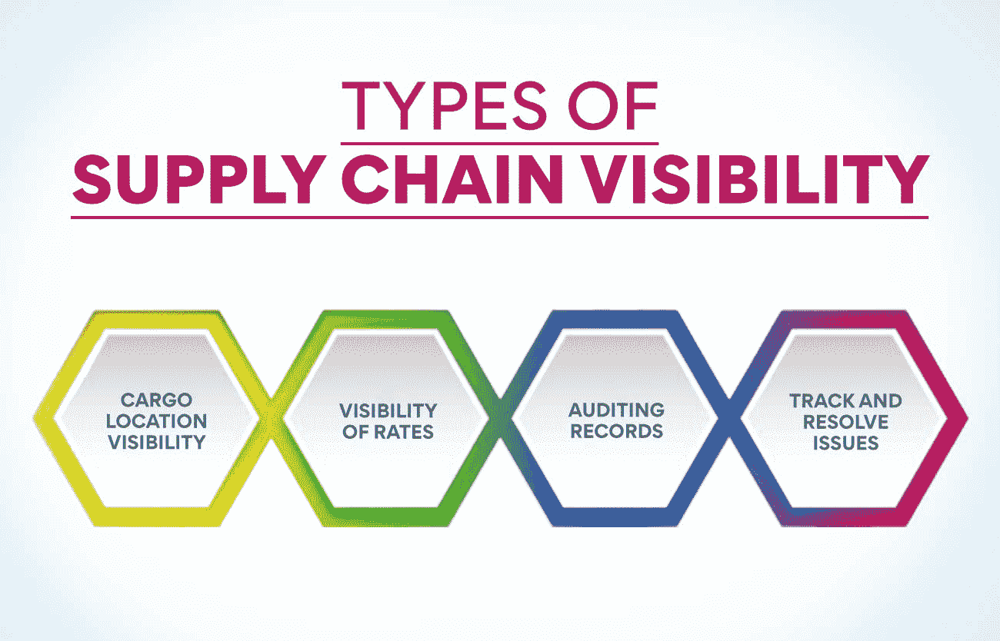

# 什么是供应链可见性？10 个关键点

> 原文：<https://www.edureka.co/blog/supply-chain-visibility/>

供应链是企业中最复杂的运作。这项任务涉及多个组件和人员。大多数供应链还包括公司以外的实体。这使得跟踪流程中的所有活动变得更加困难。但是，如果工作中的不同参与者不能有一个整体的观点，有时可能会导致中断。每个人可能都不在同一页上，这可能会导致他们有不同的目标。良好的供应链可视性是避免这种情况的解决方案。

**了解供应链可见性**

供应链有许多组成部分，而且在最近一段时间，许多公司都将各种工作外包出去。这导致了成本的降低，但供应链的可见性变得更加困难。假设公司看不到供应链的每个组成部分是如何运作的，那么就很难处理系统中的中断。为了解决这个问题，公司建立了系统来提高供应链的可见性，导致更大的透明度和更有效的运作。它还有助于公司增强内部业务流程。

*   供应链可见性不仅适用于内部要素，也适用于供应商和分销商等合作伙伴。它包括从原材料到成品到达客户手中的所有过程。
*   随着公司从全球采购原材料，现代供应链变得更加复杂。
*   拥有完整供应链的可见性有助于提高客户满意度、改善与供应商的关系、提高供应链效率并增加利润。
*   通过自动化流程(包括软件包)以及根据从数据中收集的见解做出更好的决策，可以提高整个供应链的可见性。

了解供应链可见性对于高效的物流管理至关重要。运营、供应链和项目管理高级证书课程是一个很好的学习项目。你可以访问我们的网站，了解该课程教授的内容以及它对你的益处。

**也读:[物流和供应链管理有什么区别？](https://www.edureka.co/blog/difference-between-logistics-and-supply-chain-management/)**

**为什么供应链可见性很重要**

**应对复杂性**–现代供应链高度复杂，供应商和客户遍布全球多个国家。这意味着链条中的每一项活动都必须始终在正轨上。供应链可见性提供完全的透明度，有助于立即解决供应链中的问题，确保客户满意度并防止利润率下降。

**确保客户满意**–如今的客户要求非常高。他们期望立即交付高质量的产品。供应链的完全可见性有助于确保在正确的地点提供正确的产品，从而实现快速交付。它有助于留住客户并获得新客户。

保持合规——公司必须遵守各种规章制度。这是一项艰巨的任务，尤其是对那些在海外有业务的公司来说。供应链可见性有助于跟踪供应链中所有不断变化的[组件，](https://www.edureka.co/blog/components-of-supply-chain-management/)比如不断变化的规则、汇率和天气状况。这将确保你在所有事情上保持顺从。

**保持竞争力**–供应链可见性帮助企业保持竞争力。随着竞争的加剧，公司需要保持合理的价格，这可能不会提供高利润率。供应链消耗了每个公司预算的很大一部分。但是，全面了解流程有助于尽可能地节约成本。

**提高供应链透明度的 10 个技巧**

现代客户的要求非常高，希望货物能够几乎即时送达，并能实时跟踪货物。这迫使经理们重新审视他们的供应链运作(T2 ),看看他们如何提高整个过程的透明度。

1.  **定义目标**

你应该通过定义目标来开始你的供应链可见性过程。这种可见性对客户意味着什么？要决定公司希望客户有什么样的体验。公司还必须规定他们希望通过提高可见性达到什么样的结果。

2.  **选择连接平台**

你选择的平台对于保证良好的可视性非常重要。该计划应允许供应链中的所有实体能够方便地获取信息。它应该允许你收集数据进行分析。

3.  **雇用有能力的人**

拥有最先进的项目来提高供应链的可见性还不够**。** 你必须有能够利用系统生成的数据来洞察运营的人。这将有助于做出更好的决定。如果你的公司里还没有这样的人，最好是招聘那些有分析头脑、能够解读数据以做出明智决策的人。

4.  **管理和标准化数据**

公司必须有一个清晰的数据[战略](https://www.edureka.co/blog/how-to-formulate-advanced-supply-chain-strategy/)来提高整个链条的可见度。有必要决定公司将如何使用数据以及将创建什么模型。该组织还必须决定如何将这些见解转化为决策。

5.  **保护您的数据**

链中的所有实体必须信任系统生成的数据。这意味着链中的参与者共享的信息必须有足够的安全性。

6.  **了解你的问题**

如果你想改善你的供应链，了解其中的问题是很重要的。有了良好的供应链可见性，就有可能获得有助于发现问题发生在哪里以及管理问题的信息。这肯定会让客户满意，提高你的利润。

7.  **执行解决方案**

如果整个供应链有足够的可视性，并且你知道问题出在哪里，那么迅速做出决定来解决它们是至关重要的。该公司还必须毫不拖延地对这些[决定](https://www.edureka.co/blog/major-decision-areas-in-supply-chain-management/)采取行动。

8.  **利用实时数据**

随着业务的增长，公司必然会看到系统生成的大量数据。如果他们想改善供应链，就必须能够实时使用这些信息。供应链可见性有助于向供应链中的所有合作伙伴提供实时信息。

9.  **使用中立的集成平台**

公司必须能够轻松地扩大或缩小规模，并快速调整和加快新功能的开发。它需要安装一个企业集成平台，允许公司集成而无需考虑执行系统。

10.  **创建一个扩展的生态系统**

增加系统的功能是一回事。但是公司必须能够采取合作的方式来管理供应链。最好创建一个扩展的生态系统，将所有合作伙伴的能力整合到一个生态系统中。

既然我们已经了解了什么是供应链可见性以及如何提高它，现在是时候考虑这个过程的重要性了。人们可以在运营、供应链和项目管理高级证书课程中详细学习。访问我们的网站可以让你对这个项目有更多的了解。

**供应链可见性的类型**

可见性在许多领域都会让组织受益。这将因公司而异。然而，几乎所有公司都可以考虑供应链的某些部分来提高可见性。基于可见性得到改善的组件，供应链可见性有四种主要类型。

1.  **货物位置能见度**

知道产品的确切位置非常有用。当货物的位置未知时，它有助于公司计划回购，并保持在收集的顶部。这也有助于让利益相关者了解订单的确切状态。了解订单履行的速度非常重要。这种可见性也有助于运营效率的整体提高。但主要的好处是客户可以知道他们订单的确切状态，因为这已经成为他们的主要需求之一。

2.  **费率的可见性**

供应链中的价格被定义为运输货物所产生的成本。这是一笔很大的开支，所有的公司都希望不断地被告知。随着业务的增长和赢得更多的客户，公司增加了运营商和位置的数量。很难对此进行密切监控。供应链可见性帮助公司密切跟踪此类费用。它有助于尽可能降低成本，从而提高利润。这种对费用的密切跟踪也有助于准备成本效益分析。

3.  **审计记录**

在多个国家开展业务的公司必须遵守各种各样的法规。与所有这些保持同步并确保它们始终符合要求并不容易。当审计过程有更好的透明度时，这很容易。提高供应链的可见性有助于公司更好地了解所有交易和文件。它帮助公司检查所有过去的订单并验证它们。供应链可见性对于保持公司遵守所有规则至关重要。

4.  **跟踪并解决问题**

供应链的完整视图显示了流程中发生的每一项活动。完全透明有助于检查每一个报价、订单收据、提单和交货证明。这意味着参与该流程的每个人都可以看到供应链的任何部分是否出现了任何问题。这有助于立即处理问题并快速解决问题。

**也读作:[供应链管理的目标解释](https://www.edureka.co/blog/objectives-of-supply-chain-management-explained/)**

**供应链可见性的好处**

1.  **快速响应问题**

供应链可见性让你在问题出现时就能看到。公司可以跟踪问题的来源，并确保问题得到妥善解决。良好的质量控制和合规平台有助于企业实时收集数据并提供即时沟通。这意味着质量控制团队可以在检查发生时进行观察，并在出现任何偏差时做出反应。更新数据有助于他们立即传达决策。团队之间的这种合作有助于节省时间，并确保每个项目都符合质量标准。

2.  **查看供应商绩效**

拥有足够的产品质量数据也有助于了解供应商方面是否存在任何缺陷。拥有大量数据有助于洞察产品质量和供应商绩效的变化。这在不连贯的检验报告中可能不明显。供应链可见性让你对每个供应商的表现一目了然。还可以看到采取的纠正措施以及供应商是否实施了建议的更改。根据这些信息，公司可以奖励表现优异的供应商，淘汰那些没有改善的供应商。

3.  **始终如一的质量和持续改进**

供应链可见性确保供应链中的所有实体都能看到你所遵循的质量标准。特定任务的质量控制清单将确保每个人都在同一页上。即使供应商遵循公司遵循的质量标准，他们也可能不了解公司经营的市场。平台中定制的清单有助于交付更好的结果。也有可能培训那些无法遵循公司质量标准的人。这意味着组织可以保持一致的质量。

要了解连锁店知名度带来的其他各种好处，最好参加由知名机构举办的[运营、供应链和项目管理](https://www.edureka.co/highered/advanced-program-in-operations-supply-chain-project-management-iitg)高级证书课程。我们的网站可以更好地介绍这门课程，以及它将如何惠及每一位供应链专业人士。

**结论**

供应链在每个公司都是至关重要的运作。这一过程中的任何中断都会产生影响公司利润的深远后果。供应链问题也会大大降低客户体验，迫使他们考虑其他产品。防止这种情况发生的最好方法是持续监控供应链中的所有任务。密切关注有助于公司立即解决问题，并确保客户没有理由抱怨。

## **更多信息:**

运营管理的范围是什么？

[什么是绿色供应链？概述](https://www.edureka.co/blog/green-supply-chain)

绿色供应链管理:它是什么，为什么重要？

[什么是供应链控制塔？类型&用途](https://www.edureka.co/blog/supply-chain-control-tower/)