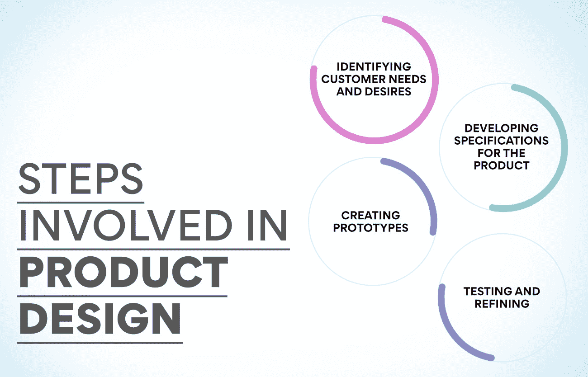
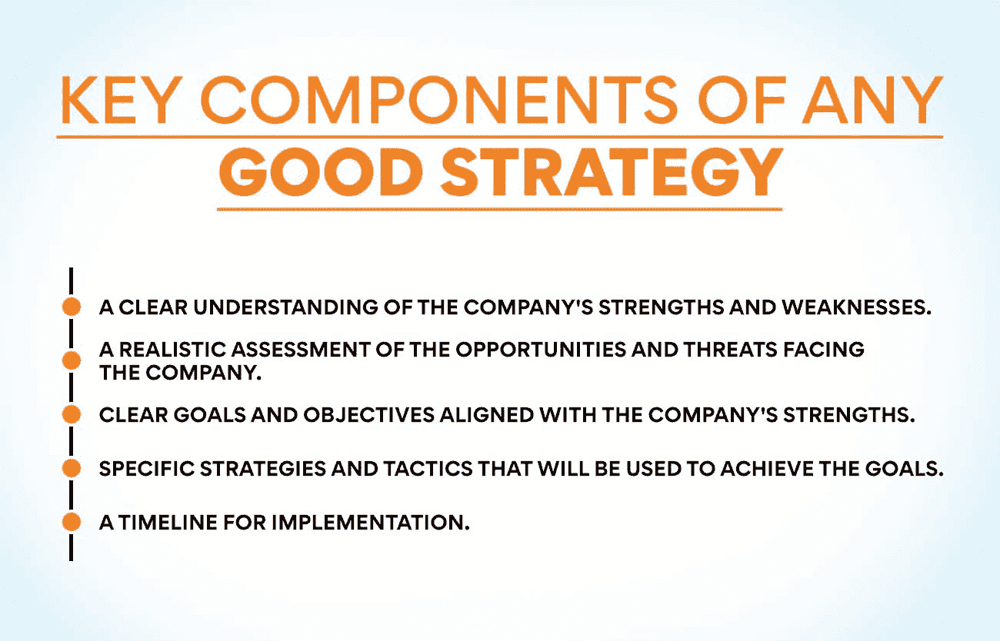

# 生产和运营管理的职能是什么

> 原文：<https://www.edureka.co/blog/functions-of-production-and-operations-management/>

运营和生产管理是一个与设计、计划和控制组织运营有关的商业领域。它包括管理原材料、人力资源和设备。生产和运营管理有许多不同的职能。尽管如此，最终的目标是确保所有的产品或服务都被及时有效地生产和交付。为了实现这一目标，企业必须仔细规划和控制其运营的各个方面。

通过这个博客，你将详细了解生产和运营管理的功能。

如果你想了解[运营和供应链管理](https://www.edureka.co/blog/what-is-operations-and-supply-chain-management-oscm/)的本质，我们有一门见解深刻的课程，完美融合了你所需要的灵活性和专业知识。马上去看看课程吧！

## **生产计划和控制**

生产和运营管理的生产计划和控制职能确保组织的生产活动与其总体目标相协调和一致。它包括开发和维护生产计划，协调材料和资源，以及监控生产进度。

生产计划和控制旨在确保组织的生产活动高效且有效，并迅速满足客户的需求。要做到这一点，生产计划员和控制员必须很好地理解组织的总体目标，以及生产部门的具体目标。他们还必须熟悉生产中涉及的各种流程和活动，以识别潜在的瓶颈或低效区域。

[生产计划](https://www.edureka.co/blog/product-planning/)和控制是一项复杂的任务，必须有系统和程序来确保有效完成。制造执行系统(MES)是支持生产计划和控制的重要工具。MES 软件提供了一个集中的平台来管理生产的各个方面，从调度到材料管理到质量控制。

通过使用 MES，组织可以改善参与生产的所有利益相关者之间的沟通，包括工程师、经理、操作员和供应商。它可以更好地协调资源，提高整体效率。

## **财务规划**

为了确保公司平稳高效地运营，生产和运营经理必须履行各种财务规划职能。它包括创建预算、预测销售和成本，以及分析财务数据。通过这样做，他们可以确保公司有足够的资金来支付其费用并继续增长。

生产和运营经理最重要的财务规划职能之一是创建预算。它包括估计公司需要多少钱来弥补成本和实现来年的目标。预算必须是现实的、可实现的、足够灵活的，以考虑到意外的开支。

**也读作:[供应链管理的目标解释](https://www.edureka.co/blog/objectives-of-supply-chain-management-explained/)**

对生产和运营经理来说，预测销售和成本是另一项重要的财务规划职能。这使他们能够就资源分配做出明智的决定，并帮助他们规划未来的增长和避免财务问题。他们使用历史数据、市场趋势和其他信息来预测公司的收入和支出。

最后，生产和运营经理必须定期分析财务数据。这有助于他们识别问题领域，并找到提高公司财务绩效的方法。他们还使用这些信息来监控预算合规性，并预测销售和成本。通过保持领先的数字，他们可以保持公司的财务健康，并确保其长期成功。

## **工艺设计**

流程设计是任何制造或服务组织的核心。它包括创建和持续改进流程，以期望的质量、成本和速度水平生产产品或服务。流程设计旨在创建一个满足客户需求的流程，同时实现公司的战略目标。

流程设计必须考虑公司可用的资源，以及公司的文化和价值观。流程的设计应该让员工能够轻松理解并遵循。它还应该足够灵活，以适应市场或客户需求的变化。

许多不同的工具和技术可用于流程设计。一些常见的包括价值流图、精益六适马和约束理论。选择使用哪种工具或技术取决于公司的具体情况和需求。

## **产品设计**

产品设计是创造新产品或改进现有产品。它包括客户需求和愿望的识别，产品规格的开发，以及原型的创建。产品设计旨在创造一种既能满足客户需求又能为公司带来利润的产品。

产品设计涉及几个步骤:

1.  **确定客户的需求和愿望:** 这一步包括研究客户对产品的需求。这可以通过调查、访谈、焦点小组和其他研究方法来实现。
2.  **制定产品规格:** 一旦确定了客户需求，就必须制定规格。这些规格包括尺寸、重量、耐用性等。
3.  **创建原型:** 一旦开发出规范，就可以创建原型了。这些原型将用于测试产品满足客户需求的程度，并使其大规模生产变得可行。
4.  测试和提炼: 在创建原型之后，必须对它们进行广泛的测试，以发现任何问题。一旦所有问题都解决了，产品就可以大规模生产了。

## **工厂布局和材料处理**

在生产和运营管理中，工厂布局是工厂内设施的安排。它是工厂工作站、机器和支持区域的物理布局。工厂布局旨在创建一个高效的工作场所，最大限度地减少浪费的空间和时间。

物料搬运是指工厂内原材料、半成品和成品的移动。它包括接收、存储、检索和运输产品。物料搬运旨在减少工厂内搬运物料的时间和成本。

## **维护管理**

维护管理是管理设备和机器维护的过程。它包括计划、安排和执行维护活动。维护管理对于确保设备得到正确维护和安全高效运行至关重要。

维护不善的设备可能不安全，并导致事故或停机。维护效率低下的设备会增加成本，并且可能无法按预期运行。组织可以通过正确管理维护来提高安全性、降低成本和改善设备性能。

## **物料管理**

材料管理是处理和储存原材料的过程。它包括采购、采购、仓储和质量控制任务。材料管理旨在确保在需要时可以获得正确的材料，同时最大限度地减少浪费和成本。

物料管理的一个重要部分是预测。预测基于历史数据、趋势和客户需求。它有助于生产计划人员了解未来需要什么材料，以便提前采购。

库存控制是物料管理的另一个关键功能。这包括跟踪库存水平，并确保需要时材料可用。库存控制也有助于最大限度地减少浪费和过时。

## **质量控制**

产品质量控制和保证是为确保产品满足或超过顾客或其他相关方的期望而设计的活动。质量控制可能涉及检查、测试和认证等任务。质量控制是材料管理的另一个重要方面。这确保了材料在用于生产之前符合要求的标准。

质量控制是一个过程，包括检查、测试和采取必要的纠正措施，以确保产品符合质量标准。质量保证是建立质量标准并确保用于生产产品的技术符合这些标准的过程。

**也读:[运营管理的范围是什么？](https://www.edureka.co/blog/what-is-the-scope-of-operations-management/)**

产品质量控制始于质量标准的[发展](https://www.edureka.co/blog/product-development/)。这些标准可能基于客户要求、法规要求或产品特性。一旦质量标准确立，就必须传达给所有参与产品生产的员工。

检验是控制产品质量最常用的方法之一。检查包括检查产品是否符合质量标准。检验可以在生产的各个阶段进行，包括进料检验(原材料)、过程检验(半成品)和最终检验(成品)。

## **预测**

预测是生产和运营管理的关键职能之一。需求预测可以帮助经理们对生产水平、劳动力需求、库存水平以及其他影响公司底线的因素做出决策。通过预测未来需求，生产和运营经理可以确保必要的资源在需要时可用。

## **战略规划**

战略规划是制定公司的长期目标和目的。战略规划旨在为公司创建一个路线图，引导其走向成功。为了制定一个有效的战略，公司必须首先了解他们当前的位置和他们经营的环境。他们还必须确定自己的目标市场，了解客户的需求。一旦理解了这些东西，公司就可以开始制定计划来帮助他们实现目标。

任何好的战略都有几个关键的组成部分:

1)清楚了解公司的优势和劣势。

对公司面临的机会和威胁的现实评估。

与公司实力相符的明确目标。

用于实现目标的具体战略和战术。

5)实施时间表。

6)定期监控和评估，以确保计划按计划进行。

## **供应链管理**

供应链管理(SCM)是一个从采购原材料开始，到向客户交付成品结束的过程。将原材料转化为成品需要几个步骤。

供应链管理的第一步是采购，即获取生产所需的原材料。下一步是制造业，即将原材料转化为成品。最后是配送，将成品送到客户手中。

成功完成这些步骤需要不同的技能和知识。例如，采购涉及对市场的了解和与供应商谈判价格的能力。制造业需要了解生产流程，并有能力解决生产过程中出现的问题。分销涉及对物流的理解和确保产品按时完好交付的能力。

运营管理确保所有这些步骤高效且有效地完成。这包括设计高效的生产流程、制定有效的采购策略以及规划高效的分销路线。它还包括监控 SCM 的所有方面，以识别潜在的问题并实施解决方案来提高性能。

## **生产管理和运营管理有什么区别？**

生产和运营管理是两个不同但相关的领域。生产管理关注生产设施的日常运行，确保以最高效率生产产品。另一方面，运营管理侧重于长期战略规划，为组织的未来设定目标。

虽然生产经理和运营经理都必须了解全局，但他们的日常职责不同。生产经理确保在预算内安全、准时地生产产品。他们监督生产的各个方面，从原材料采购到将成品运送给客户。与此同时，运营经理制定计划以提高效率和质量控制，为组织的未来发展设定目标，并决定向何处分配资源。

简言之，生产经理关注此时此刻，而运营经理则着眼于未来。两者在确保一个组织平稳高效地运行方面都扮演着重要的角色。

## **结论**

生产和运营管理职能对任何组织的成功都至关重要。生产和运营经理确保高效生产产品和服务，并满足所有质量标准。他们还在规划和预测未来需求以及管理库存水平方面发挥着至关重要的作用。通过了解这些功能的重要性，组织可以确保他们的生产和运营平稳高效地运行，最终取得巨大的成功。

查看我们的课程[运营、供应链和项目管理高级证书](https://www.edureka.co/highered/advanced-program-in-operations-supply-chain-project-management-iitg)，了解运营管理及更多相关知识。查看详细的课程，现在就做决定。

## **更多信息:**

[什么是运营管理中的能力规划？](https://www.edureka.co/blog/what-is-capacity-planning-in-operations-management/)

运营管理的目标是什么？

[医院运营管理——了解关键职能](https://www.edureka.co/blog/operations-management-in-hospitals)

[什么是产品管理课程？为什么它们至关重要？](https://www.edureka.co/blog/product-management-courses)