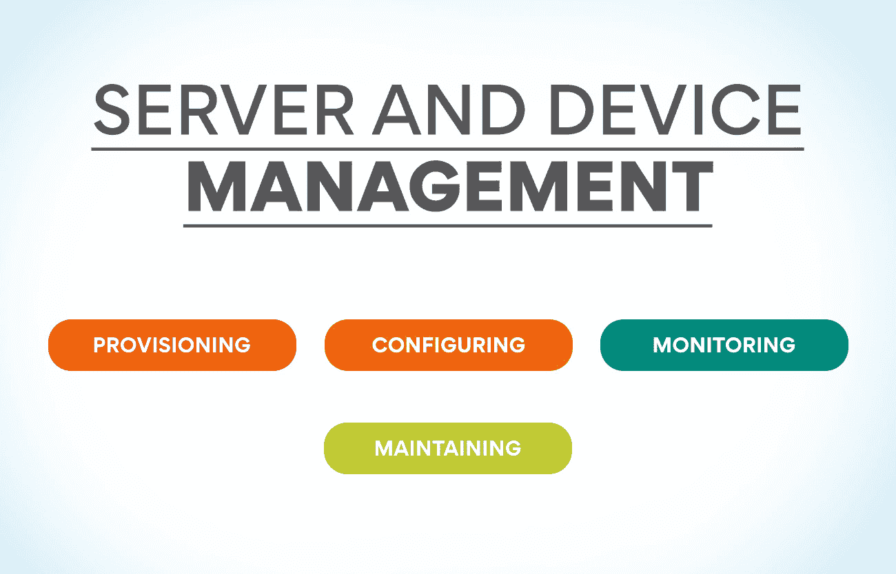

# IT 运营管理包括哪些职能？

> 原文：<https://www.edureka.co/blog/which-functions-are-included-in-it-operations-management/>

对于任何依靠 IT 来运营业务的组织来说，IT 运营管理都是一项至关重要的职能。IT 运营管理管理组织 IT 基础架构的日常运营。它包括管理网络、服务器、存储和数据中心设施。如果没有适当的管理，IT 基础架构会很快变得超载和停滞，导致性能低下和停机。这篇文章将讨论 IT 运营管理包括哪些功能。我们还将探索这些功能如何帮助提高您的 IT 基础架构的性能。

## **技术管理**

技术管理是 IT 运营管理分支，负责[规划](https://www.edureka.co/blog/what-is-capacity-planning-in-operations-management/)，设计和实施组织的技术基础设施。它包括硬件和软件组件，以及任何相关的过程和步骤。

有效的技术管理计划将考虑组织的当前和未来需求，以确保其技术基础设施能够支持这些需求。还必须尽可能考虑提高效率和降低成本的方法。

技术管理的一些关键职能包括:

*   识别和评估能够使组织受益的新技术
*   规划和设计新技术的部署
*   管理新技术的安装和配置
*   培训员工如何使用新技术
*   监控性能并确保系统和服务的可用性
*   解决问题并在需要时提供支持

**也可阅读:[什么是运营和供应链管理(OSCM)？](https://www.edureka.co/blog/what-is-operations-and-supply-chain-management-oscm/)**

## **IT 运营成本**

IT 的运营成本大致可分为两类:直接成本和间接成本。

直接成本是指 IT 人员为保持组织系统正常运行而采取的行动所产生的成本。这些包括工资、福利和承包服务。间接成本与 IT 人员采取的具体行动没有直接关联，但必须由 IT 部门承担。这些包括设施成本、管理开销和法规遵从性。

为了控制运营成本，有必要了解影响运营成本的不同类型的成本驱动因素。四个最常见的成本驱动因素是数量、复杂性、时间和风险。

卷是指一个组织的系统处理的事务或文件的数量。复杂性是指一个组织使用的不同应用程序和技术的数量。时间是指完成给定任务或过程所需的时间。风险是指系统运行期间发生错误或中断的可能性。

这些成本驱动因素中的每一个都会对运营成本产生重大影响。例如，数量的增加可能需要额外的硬件或人力资源来满足需求。同样，添加新的应用程序或技术会增加复杂性，并导致更大的培训和支持需求。最后，需要很长时间才能完成的任务会占用宝贵的资源，导致机会成本。

## **应用管理**

应用程序管理是关于管理软件应用程序的开发、部署和维护。它包括以下功能:

*   应用程序开发和部署的规划和预算
*   协调和监督开发人员、测试人员和应用程序生命周期中其他工作人员的工作
*   将应用部署到生产环境
*   监控应用程序的性能和可用性问题
*   故障排除和解决应用程序问题
*   用新功能或错误修复更新应用程序

## **设施管理**

设施管理对于保持一个组织平稳高效地运转至关重要。设施管理管理和协调组织内的物理资源和系统。它包括维护和修理基础设施，提供支持服务，以及确保安全和安保。

IT 运营管理部门负责组织 IT 系统的日常运营。这包括管理网络、服务器、存储、数据库、应用程序和安全性。IT 运营经理确保这些系统全天候运行。他们还努力解决可能出现的任何问题。

设施管理和 IT 运营管理都是保持组织正常运转的关键职能。没有这两个功能的无缝协作，一个组织将很快陷入停顿。

## **标准操作程序**

标准操作程序(sop)对 IT 运营管理至关重要。它们为执行任务和程序提供了清晰简明的说明。标准作业程序有助于确保任务得到一致和准确的执行，可用于培训新员工或更新现有员工的技能。

应当为 IT 运营部门的所有关键流程和程序制定 sop。它们应该涵盖任务的所有方面，从开始到结束，并且设计得易于理解。标准作业程序一旦制定，就要定期进行检查，以确保它们保持最新并符合目的。

## **网络基础设施管理**

网络基础设施管理是 IT 运营管理的一项关键职能。如果没有适当的管理，网络可能会过载和不可用，导致停机和生产力损失。

网络基础设施管理包括网络系统的规划、设计、实施和维护。它可以由物理和逻辑组件组成，如路由器、交换机、防火墙和其他设备。它还包括管理网络服务，如 DHCP、DNS 和 IP 地址。

适当的网络基础设施管理可确保网络可用，并能顺利处理所需流量。它还有助于通过主动识别和解决潜在问题来防止停机和减少停机时间。

**也读:[运营管理的范围是什么？](https://www.edureka.co/blog/what-is-the-scope-of-operations-management/)**

## **计算机操作和服务台**

IT 运营管理包括广泛的活动，从确保 IT 系统的平稳运行到提供用户支持和管理系统变更。

计算机操作包括计算机系统的日常运行，包括故障排除、维护和备份。计算机操作团队负责保持系统运行，并确保用户可以访问他们需要的数据和应用程序。

帮助台是需要计算机系统帮助的用户的第一联系点。服务台团队提供使用系统的支持和建议，并帮助解决问题。他们还可以就系统的新功能或更新对用户进行培训。

**服务器和设备管理**

服务器和设备管理是 IT 运营管理的重要组成部分。它包括供应、配置、监控和维护服务器和设备的任务。

**配置:** 它包括根据规范设置新的服务器和设备。这包括安装操作系统和应用程序以及配置设置。

**配置:** 这些服务器和设备包括设置它们与网络的其余部分协同工作。这包括分配 IP 地址和创建 DNS 条目等任务。

**监控:** 这些服务器和设备保证它们正常运行。这包括监视性能和检查错误等任务。

**维护:** 这些服务器和设备通过安全补丁和软件更新保持最新。这有助于确保它们保持安全和高效。

## **操作日志**

运营日志是 IT 运营管理职能部门内所有活动的中央存储库。该功能确保所有活动都被正确记录、监控和审计。操作日志提供了在 IT [操作管理功能](https://www.edureka.co/blog/roles-and-functions-of-operations-management/)中发生的所有操作的完整记录，可用于提高效率和效果。

## **IT 运营管理挑战**

IT 运营管理包括各种功能，从管理服务器和网络基础设施到确保关键业务应用的可用性。在当今快节奏的业务环境中，IT 运营经理必须能够在潜在问题影响业务之前有效地识别和解决这些问题。

IT 运营经理面临的最大挑战之一是跟上不断变化的技术形势。新技术不断推出，确定哪些技术将对业务产生最大影响是一项挑战。此外，新技术通常需要新的技能组合，这可能需要时间来获取和保持。

IT 运营经理面临的另一个挑战是平衡速度和效率需求与安全性和合规性需求。由于企业需要更快的周转时间，IT 运营部门经常面临着抄近路以满足截止日期的压力。但是，这可能会导致安全漏洞和合规性问题。IT 运营经理必须在满足截止日期和确保正确遵循流程之间取得平衡。

最后，IT 运营经理还必须应对用更少的资源实现更多目标的压力。预算经常很紧张，并且总是有压力去寻找在不增加成本的情况下提高效率的方法。这可能是一个棘手的平衡行为，但保持业务平稳运行是必不可少的。

## **如何攻克 IT 运营管理？**

IT 运营管理负责管理组织 IT 基础设施的日常运营。这包括对硬件和软件进行监控和故障排除，确保系统正常运行，以及维护系统安全。要克服 IT 运营管理，必须了解 IT 运营管理中包含哪些功能。

要克服 IT 运营管理问题，可以做很多重要的事情:

1.  尽可能自动化: 自动化任务有助于你腾出时间专注于工作的其他方面。有几个工具可以帮助你做到这一点，所以做一些研究，找到最适合你和你的组织的工具。
2.  记录一切: 保持清晰简洁的文档在任何类型的运营管理中都至关重要。这将帮助你跟踪所有需要做的事情。记录流程和程序，以便任何人都可以遵循。
3.  保持组织有序: 保持组织有序是有效 IT 运营管理的另一个重要部分。拥有一个透明的系统将有助于你保持在所有移动部件的顶部，并确保没有东西从缝隙中掉出来。
4.  有效沟通: 沟通在任何类型的管理中都至关重要，但在 it 运营管理中更是必不可少。确保参与的每个人都知道他们的角色和职责，以及期望是什么。这将有助于避免误解和混乱。
5.  **积极主动:** 克服 IT 运营管理的最佳方法之一就是积极主动。这意味着为可能出错的事情做好准备，并制定应急计划。通过积极主动，您可以避免代价高昂的停机和中断。

## **如何成为一名 IT 运营经理？**

要成为一名 IT 运营经理，你需要采取许多关键步骤。首先，你必须有很强的信息技术背景。这将让你更好地理解你将负责管理的系统和流程。

其次，你应该考虑攻读一个以管理为重点的学位或证书。这会给你必要的技能和知识来有效地领导一个 IT 专业团队。

最后，在担任管理职位之前，拥有一些 it 运营工作经验也是有益的。这将有助于你了解这类工作的挑战和机遇。

## **印度 IT 运营管理的未来**

印度 IT 业的未来[运营管理](https://www.edureka.co/blog/beginners-guide-to-operations-management/)令人着迷。随着云计算的日益流行和 DevOps 实践的日益采用，这个领域有很大的增长潜力。

IT 运营管理包含许多功能，如系统管理、网络管理、存储管理和安全管理。除了这些传统功能，云计算和 DevOps 等领域也有很大的增长潜力。

云计算在印度越来越受欢迎，见证了这一领域的巨大增长潜力。使用云服务有许多好处，例如快速轻松地扩展的能力、按需付费的定价模式以及更高的灵活性。

DevOps 是印度另一个发展迅速的领域。DevOps 被认为是一套强调开发和运营团队之间协作的实践。这种方法有助于提高组织的软件开发生命周期效率。

的确，印度 IT 运营管理的发展有着巨大的潜力。随着云计算的日益普及和 DevOps 实践的日益普及，组织有很多机会来提高其效率和有效性。

## **结论**

IT 运营管理是一个包含许多不同职能的流程，从规划和预算到资源分配和性能监控。通过了解 IT 运营管理中涉及的各种功能，您可以更好地规划和执行自己的 IT 项目。你有 IT 运营管理方面的经验吗？你想获得运营管理的实践经验吗？我们的课程[运营、供应链和项目管理高级证书](https://www.edureka.co/highered/advanced-program-in-operations-supply-chain-project-management-iitg)是最好的起点。要了解更多信息，请立即查看课程！

## **更多信息:**

运营管理的目标是什么？

为什么企业需要运营战略？

[运营管理:定义、范例和策略](https://www.edureka.co/blog/operations-management-definition)

[运营管理中的决策:要点](https://www.edureka.co/blog/operations-management-decisions)