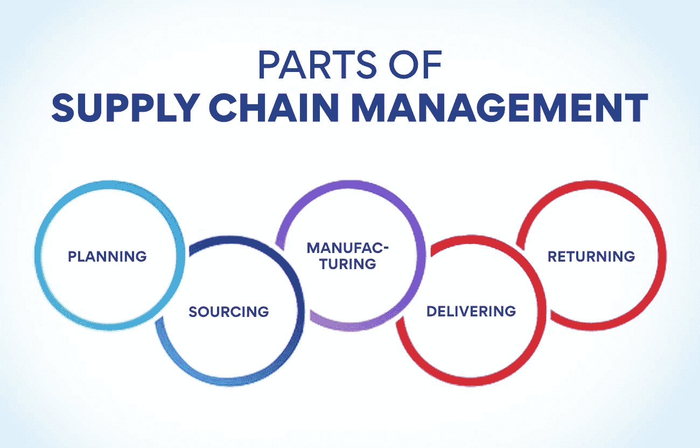
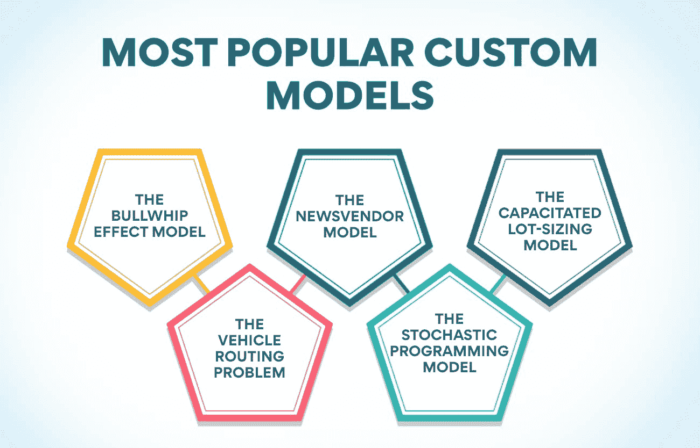

# 什么是供应链管理，为什么它很重要？

> 原文：<https://www.edureka.co/blog/what-is-supply-chain-management-and-why-is-it-important/>

一家公司的供应链是它用来将产品或服务推向市场的系统。它包括从获取原材料到将最终产品交付给客户的所有步骤。供应链管理(SCM)监督和协调这些活动，以确保它们平稳高效地运行。本指南将让你了解供应链管理的一切，从它的基础到它在当今商业环境中的重要性。

## **什么是供应链管理？**

什么是供应链管理，为什么重要？供应链管理(SCM)管理商品和服务从供应商到客户的流动。它包括协调和管理货物和服务的采购、运输、储存和分配的所有活动。

供应链管理的主要目标是确保所有的商品和服务都及时有效地交付给客户。为了实现这一目标，企业需要有一个组织良好的供应链，能够有效地管理所有的人力和物力资源。

供应链中的人力资源包括经理、工人和其他专业人员，他们负责确保货物和服务的有效采购、运输、储存和配送。资源包括原材料、零部件、成品、包装材料等。

一个有效的供应链管理系统可以帮助企业节省时间、金钱和资源，降低库存水平，提高订单的准确性，改善客户服务水平和缩短交货时间。

**也读作:[供应链管理的目标解释](https://www.edureka.co/blog/objectives-of-supply-chain-management-explained/)**

## 供应链管理重要吗？简要说明所有理由。

供应链管理是计划、执行和管理供应链运作的过程，旨在提供更好的客户服务，同时降低库存和生产成本。

公司的供应链包括将产品从原材料状态运送到最终客户手中的所有步骤。有效管理这些步骤对公司的底线至关重要。无效的供应链管理会导致生产延迟、库存成本上升和客户满意度下降。

供应链管理的一个重要部分是确保流程中的每一步都高效且有效。它包括从采购原材料到制造产品再到交付给客户的所有事情。为了供应链管理的成功，所有的供应链成员必须有效地合作。

供应链管理的重要性有很多原因。也许最重要的是，SCM 可以通过确保产品按时交付和兑现承诺来帮助提高客户满意度。此外，供应链管理可以通过提供仅在需要时订购材料和仅在有需求时生产产品来帮助降低库存成本。最后，供应链管理可以通过确保所有供应链成员高效合作来帮助提高生产效率。

简而言之，供应链管理很重要，因为它可以帮助提高客户满意度，降低库存成本，提高生产效率。这些仅仅是 SCM 对当今商业如此重要的几个原因。

## **供应链管理部分**

**策划**

在规划你的[供应链管理战略](https://www.edureka.co/blog/how-to-formulate-advanced-supply-chain-strategy/)时，需要考虑不同的方面。这里有一些 SCM 的基本部分要记住:

库存管理: 管理库存是供应链管理的一个重要部分。您需要能够跟踪您的库存水平，并知道何时订购更多的供应。

**订单管理:** 跟踪客户订单并确保订单得到正确履行是供应链管理的另一个重要方面。

**运输管理:** 计划货物如何从供应商运输到客户手中是供应链管理的另一个重要部分。你需要确保货物准时到达并且完好无损。

**仓储:** 适当的仓储对于保持库存水平有序和易于获取至关重要。

**采购**

在任何供应链管理系统中，采购流程都有四个主要部分:

1.  **计划和预测:** 这是预测未来对商品和服务的需求，并据此制定计划。它包括从市场分析和趋势预测到容量规划和库存管理的所有内容。
2.  **订单管理:** 一旦预测到需求，就需要向供应商下订单来满足这种需求。它包括采购必要的材料和[组件](https://www.edureka.co/blog/components-of-supply-chain-management/)以及管理生产进度。
3.  **运输管理:** 货物必须从供应商运输到制造商(有时从制造商运输到客户)。它需要以一种既高效又经济的方式来完成。
4.  **库存管理:** 为了确保有足够的库存来满足客户的需求，企业必须认真管理自己的库存水平。它包括设置适当的安全库存水平、监控库存水平以及在必要时重新订购库存。

## **制造**

制造过程是供应链中最重要的部分。一个公司要想成功，供应链的所有部分必须高效地合作。如果产品制造不正确，就不能满足客户的期望，公司就会亏损。

制造过程有四个主要部分:计划、生产、质量控制和包装。

计划是制造过程的第一步。公司必须决定他们将生产什么产品，需要生产多少，以及何时需要。生产是制造过程的第二步。这是公司生产产品的地方。他们必须有高效的生产线和足够的工人来满足需求。

质量控制是制造过程的第三步。公司必须测试他们的产品，以确保它们符合客户的规格，没有缺陷。包装是制造过程的第四步，也是最后一步。产品必须正确包装才能安全到达目的地，并准备好出售给客户。

**交付**

在供应链管理中，术语“交付”指的是将货物和材料从供应商处运送到客户处。这包括从采购原材料、制造产品、仓储和分销成品，以及管理退货和客户服务的一切。

充足的供应链通过以合适的价格提供合适的产品来为客户创造价值。为此，企业需要清楚地了解客户的需求和期望。他们还必须与供应商保持良好的工作关系，以确保货物和材料按时交付并符合质量标准。此外，他们需要高效的系统和流程来管理库存水平、仓储、配送和客户服务。

**返回**

谈到供应链管理，你需要了解几个不同的领域。在这一部分，我们将讨论供应链管理的不同部分，以及它们在这个过程中的关键作用。

供应链管理的第一部分是采购流程。这是公司购买原材料或产品的地方，他们需要这些原材料或产品来创造他们的最终产品。采购过程可能非常复杂，因为有许多不同的供应商可供选择，而且每个供应商都提供不同的条款和条件。

供应链管理的下一部分是制造过程。这是原材料或产品转化为最终产品的地方。制造过程可能非常复杂，因为制造最终产品涉及许多不同的步骤。

供应链管理的最后一部分是分销过程。这是最终产品交付给客户的地方。分销过程可能非常复杂，因为可以使用许多不同的渠道来分销产品。

## **供应链管理模式**

**连续流模型**

连续流模型是一种供应链管理，强调货物和材料从供应商到客户的不间断流动。这种模式也被称为“准时制”或“JIT”模式。

在连续流程模式中，供应商根据需要向制造流程提供材料。没有产成品库存；产品一完成就完成并运送给客户。

这种类型的供应链管理需要供应商和客户之间以及制造流程的不同部分之间的密切协调。因为没有库存缓冲，流程中的任何中断都会导致重大问题。

连续流模型最常用于生产大量产品且必须快速运出的制造业。这种类型的供应链管理也可以用于其他行业，如食品服务或医疗保健，在这些行业，新鲜度或及时性是至关重要的。

**也读:[运营管理的范围是什么？](https://www.edureka.co/blog/what-is-the-scope-of-operations-management/)**

**敏捷模型**

有许多敏捷模型，但最流行的是 Scrum 和看板。

Scrum 是一个非常流行的敏捷模型，经常被用在软件开发中。它基于被称为冲刺的短周期，通常为两周。在冲刺阶段，所有团队成员一起工作来完成工作。在每个 sprint 结束时，团队反思哪些进展顺利，哪些可以在下一个 sprint 中改进。然后，产品负责人对其进行审核。

看板是另一种用于软件开发或项目管理的流行敏捷模型。它是基于可视化的工作，因为它通过一个系统。工作由卡片表示，当工作完成时，卡片从一个阶段移动到下一个阶段。这允许团队成员检查必须做什么以及事情在过程中的位置。

Scrum 和看板都是敏捷供应链管理模型的绝佳选择。它们都提供了透明度和灵活性，这是成功的敏捷供应链的两个关键要素。

**快速模式**

在商业世界中，“供应链管理”(SCM)一词描述了当材料、信息和财务从供应商到制造商到零售商再到消费者的线性方向上行进时，对它们进行管理的过程。

供应链管理的目标是建立一个系统，在最大限度地减少浪费、最大限度地利用资源和降低成本的同时，有效地将货物和服务从 A 点运送到 B 点。为了实现这一目标，企业需要了解供应链的每个阶段，以识别障碍并做出必要的调整。

企业可以使用许多不同的模式来改善供应链管理。最流行的模型是迈克尔·奥尔博士开发的快速模型。

快速模型的前提是企业需要能够快速适应市场的变化。要做到这一点，公司必须清楚地了解客户的需求，并能够对需求的变化做出快速反应。Fast 模型还强调了所有供应链成员之间协作的重要性。通过合作，企业可以更有效地发现问题并找到解决方案。

快速模式是企业改善供应链管理的有效方法。为了增强你的 SCM 过程，考虑使用快速模型作为指导。

**定制型号**

供应链管理的格局在不断演变，新的模式也在不断涌现。定制模型旨在满足企业或行业的特定需求，并且可以适应不断变化的条件。

一些最受欢迎的定制车型包括:

1.  牛鞭效应模型: 该模型预测需求的变化将如何波及整个供应链。它可以帮助公司避免缺货和过剩，更有效地管理库存。
2.  **报童模型:** 该模型用于优化易腐商品的库存水平。它考虑了提前期、需求变化和库存成本等因素。
3.  **产能受限批量模型:** 该模型帮助公司确定每份订单的最佳生产数量，同时考虑产能限制和成本。
4.  **车辆路线问题:** 该模型考虑了交通、距离和时间窗等因素，为送货车辆寻找最佳路线。
5.  **随机规划模型:** 该模型在不确定性下优化决策，利用概率来确定不同行动最可能的结果。

定制模型可能很复杂，但它们为使用它们的公司带来了巨大的好处。通过更好地了解供应链，他们可以做出更明智的决策，从而提高效率和盈利能力。

## **结论**

供应链管理是一个庞大而复杂的话题，但是我们希望这篇文章已经很好地向你介绍了基础知识。无论你是想简化自己企业的供应链，还是对供应链的运作方式感到好奇，我们的供应链管理课程都能满足你的所有需求。查看[运营、供应链和项目管理高级证书](https://www.edureka.co/highered/advanced-program-in-operations-supply-chain-project-management-iitg?qId=f2c9c6cb3eea20ee876dbdc06c880a9d&objId=1861&objPos=1)，近距离了解供应链管理。

## **更多信息:**

什么是供应链优化？概述

[什么是供应链控制塔？类型&用途](https://www.edureka.co/blog/supply-chain-control-tower/)

绿色供应链管理:它是什么，为什么重要？

[什么是绿色供应链？概述](https://www.edureka.co/blog/green-supply-chain)