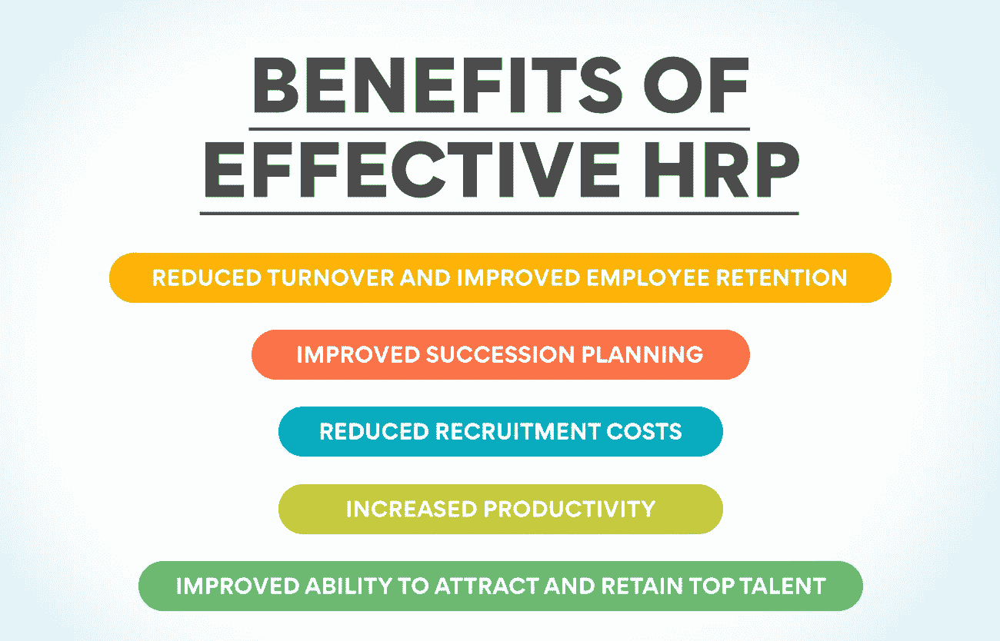
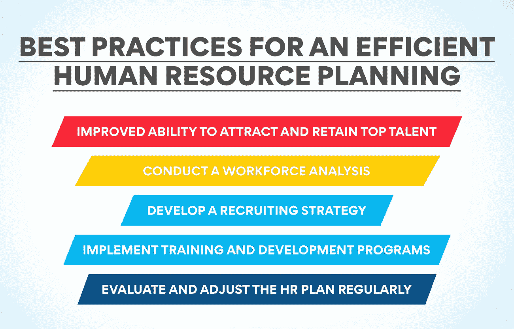

# 为什么人力资源规划对一个公司的成长是强制性的？

> 原文：<https://www.edureka.co/blog/human-resource-planning-is-compulsory-for/>

人力资源规划对于预测一个组织未来的人力资源需求和确保必要的资源在需要时可用是强制性的。这是一种管理组织最有价值的资产——人——的主动方法。虽然有些人可能认为人力资源规划是一种官僚主义的做法，但它是一项关键职能，可以对公司的底线产生重大影响。这篇博文将揭示为什么人力资源规划对于任何想要实现可持续发展的公司来说都是必须的。

## **什么是人力资源规划？**

人力资源规划(HRP)对于预测一个组织在合适的时间对合适的人才的需求是必不可少的。它包括评估当前和未来的人力资源需求，并制定战略，以确保公司拥有足够数量的具备必要技能和知识的员工来实现其业务目标。

人力资源规划对任何商业战略都至关重要，因为它确保公司拥有实现目标所需的劳动力。如果没有适当的规划，公司可能会发现自己没有保持竞争力所需的熟练工人，或者面临工人短缺。

如果做得正确，人力资源规划可以帮助公司避免许多潜在的问题，例如:

*   满足需求所需的熟练工人短缺
*   工人过剩导致成本增加
*   无力吸引和留住顶尖人才
*   人力资源使用效率低下导致成本上升

通过花时间合理规划人力资源需求，公司可以避免这些陷阱，为自己的长期成功做好准备。

**也读作:[分解人力资源管理的范围](https://www.edureka.co/blog/scope-of-human-resource-management/)**

## **HRP 的意义是什么？**

1.  人力资源规划确保公司拥有拥有必要技能的合适员工，以实现其业务目标。
2.  人力资源规划有助于公司避免人手不足和人浮于事，因为人浮于事会导致效率低下和生产力损失。
3.  人力资源规划可以确保公司只雇佣需要的员工，而不会雇佣太多员工，从而帮助公司节省资金。
4.  人力资源规划确保公司有一个人才管道，随时准备根据需要进入新的角色，帮助避免员工流动中断。
5.  人力资源规划可以帮助公司遵守与就业和劳动法相关的政府法规。

## 人力资源规划的关键好处是什么？

1.  人力资源规划确保合适的人在合适的时间做合适的工作。这最大限度地提高了员工的生产力和效率，同时减少了压力和流动。
2.  人力资源规划为组织发展提供了路线图。通过将人力资源战略与业务目标相结合，组织可以做出明智的决策，决定在哪里投入资源以实现最大影响。
3.  人力资源规划改善了组织内不同部门之间的沟通和协调。通过将人力资源目标与其他部门的目标保持一致，孤岛被打破，每个人都可以更有效地为共同的[目标而合作。](https://www.edureka.co/blog/objectives-of-human-resource-management/)
4.  人力资源规划促进持续学习和发展的文化。通过投资于员工培训和发展，组织可以保持员工的灵活性和适应变化的能力。
5.  人力资源规划有助于组织吸引和留住顶尖人才。通过了解关键职位所需的技能和经验，组织可以制定有针对性的招聘和保留策略。
6.  人力资源规划有助于继任规划和连续性管理。通过识别未来的领导者和高潜力员工，组织可以确保在变革或危机时期权力的平稳过渡。
7.  人力资源规划提高财务绩效。通过将人力资源战略与财务目标相结合，组织可以做出改善底线结果的预算决策。
8.  人力资源规划创造竞争优势。通过利用人力资源数据和分析，组织可以深入了解他们的员工，使他们能够做出有助于他们的[战略](https://www.edureka.co/blog/strategic-human-resource-management)决策。

## **人力资源规划的硬与软。有什么区别？**

人力资源规划是预测未来人力资源需求并决定如何满足这些需求的过程。人力资源规划有两种主要方法:硬方法和软方法。

硬人力资源规划基于定量方法，如统计模型和过去绩效的数据。这种方法通常用于具有稳定环境和可预测需求的企业。另一方面，软人力资源规划更多地依赖于定性方法，如访谈和调查。这种方法通常用于环境快速变化或需求不可预测的企业。

硬人力资源规划和软人力资源规划的主要区别在于对数据和分析的重视程度。硬人力资源规划在很大程度上依赖于数据和分析来预测未来的需求。相比之下，软人力资源规划更强调理解当前的情况，并利用这种理解来预测未来的需求。

## **HRP 在组织中的作用**

在预测一个组织未来的人员需求的过程中，人力资源规划是必不可少的，它可以确保只有有技能的人才能在正确的时间从事正确的工作。它是管理人才和确保组织拥有实现其战略目标所需的劳动力的重要工具。

有效的人力资源规划有许多好处，包括:

**减少人员流动，提高员工保留率:** 通过准确预测未来的人员需求，组织可以避免高流动率带来的成本和中断。

**改进的继任计划:** 组织可以确定关键角色的潜在继任者，并确保他们拥有必要的技能和经验，在需要时接替这些角色。

**降低招聘成本:** 通过清楚地了解未来的人员需求，组织可以更有效地计划招聘活动，并降低每次招聘的成本。

**提高生产力:** 确保雇佣足够的熟练劳动力来完成工作可以提高员工的生产力和敬业度。

**提高吸引和留住顶尖人才的能力:** 能够有效预测未来人才需求的组织将更有能力吸引和留住顶尖人才。

人力资源规划是人力资源部门的一项重要职能，应该与整体业务战略紧密结合。一个有效的人力资源计划将考虑诸如预期增长、技能短缺、技术和工作实践的变化以及人口趋势等因素。

**也读作:[目标&人力资源管理的性质](https://www.edureka.co/blog/nature-of-human-resource-management/)**

## **不实施人力资源规划的后果**

如果一家公司不实施人力资源规划，可能会出现几个后果。

1.  **会出现工人短缺:** 这是不实施人力资源规划最明显的后果。没有人力资源规划，公司将无法知道他们未来需要多少员工，结果可能没有足够的工人来满足需求。该公司可能很难雇佣和留住顶尖人才，因为它没有一个明确的计划来实现这一目标。这可能导致高离职率和填补关键职位的困难。
2.  **人员流动会减少:** 不实施人力资源规划的另一个后果是人员流动增加。如果公司不为他们未来的[劳动力](https://www.edureka.co/blog/workforce-planning/)需求做计划，当员工离开去寻找其他机会时，他们更有可能经历低水平的流动。
3.  **员工士气会受到打击:** 除了离职率增加，没有人力资源计划的另一个结果就是员工士气会受到打击。感到公司没有投资于他们的未来或支持他们的职业发展的员工可能会缺乏参与和动力。这可能会导致生产力下降和整体消极的工作环境。该公司还可能错过提高员工生产力和参与度的机会，因为他们需要清楚地了解自己的员工以及需要做些什么来支持他们。
4.  **公司将需要帮助来适应变化:** 最后，公司可能会发现很难适应变化并快速应对新的挑战，因为它将没有一个战略框架来指导其决策。没有人力资源规划，公司将是被动的，而不是主动的，这可能使他们在当今不断变化的商业环境中处于不利地位。

## **HRP 的一步一步流程。解释每一步。**

1.  人力资源规划的第一步是评估公司目前的劳动力。这包括考察员工的技能和经验，以及公司的整体人员需求。
2.  下一步是制定符合公司业务目标的人力资源战略。该战略应确定公司实现其目标所需的具体技能和经验
3.  一旦人力资源战略到位，下一步就是确定潜在的人才来源。它包括内部和外部来源。
4.  人力资源规划的最后一步是实施计划。这包括招聘、培训和发展活动，这些活动将帮助公司达到理想的员工水平。

## 为什么人力资源规划应该成为每个组织不可或缺的一部分？

HRP 是每一个组织不可或缺的一部分，因为它确保组织拥有合适的数量和人员组合，以及合适的技能和知识来实现其业务目标。

有效的人力资源计划将帮助组织:

*   确定满足其业务目标所需的技能和知识。
*   评估 it 部门是否拥有具备合适技能和专业知识的合适人员组合。
*   确定员工队伍中的任何缺口，并制定计划来填补这些缺口。
*   确保 it 拥有适当的组织结构和系统来支持其员工。
*   吸引、培养和留住未来成功所需的人才。

## **高效 HRP 的最佳实践**

1.  **明确公司当前和未来的经营目标:** 成功的人力资源规划的第一步是对公司当前和未来的经营目标有一个清晰的认识。这将确保人力资源计划与整体业务战略保持一致。
2.  进行劳动力分析: 人力资源规划的一个重要部分是进行劳动力分析。这将有助于识别组织内的任何技能缺口或过剩。进行劳动力分析时，考虑内部和外部因素至关重要。
3.  制定招聘策略: 一旦你确定了任何技能缺口，你就可以针对这些领域制定招聘策略。在制定招聘策略时，考虑主动和被动的候选人都很重要。
4.  **实施培训和发展计划:** 培训和发展计划对于确保员工拥有在其岗位上取得成功的技能至关重要。在实施培训和发展计划时，考虑继任计划也很重要。
5.  **定期评估和调整人力资源计划:** 成功的人力资源规划的最后一个最佳实践是，根据业务前景或劳动力人口统计数据的变化，定期评估和调整计划。

## 为什么你必须选择一门课程来开始你的人力资源职业生涯？

成功完成一门见解深刻的课程后，您将能够:

*   了解人力资源在组织中的作用，以及它如何对组织的成功做出贡献。
*   制定招聘、选拔、培训和发展员工的策略。
*   实施员工关系战略，促进积极的工作环境和员工参与度。
*   通过有效的绩效评估和反馈流程管理员工绩效。

我们的[人力资源管理研究生证书](https://www.edureka.co/highered/human-resourse-management-course-iim-shillong)是开启你人力资源职业生涯的最佳途径。本课程将为您提供在任何组织中有效管理人力资源所需的所有技能、专业知识和知识。您将了解[、](https://www.edureka.co/blog/role-of-human-resource-management-in-an-organization/)人力资源管理的方方面面，包括招聘、选拔、培训和发展、员工关系以及绩效管理。立即查看课程！

## **结论**

人力资源规划对于帮助组织确定其人力资本需求并确保其拥有有才华、有技能和专业的专业人员担任合适的角色是必不可少的。如果做得正确，人力资源规划可以帮助组织实现其增长目标，同时提高员工的参与度和满意度。通过将人力资源战略与业务目标相结合，人力资源规划可以在组织成功中发挥关键作用。

## **更多信息:**

[人力资源管理的演变:过去和未来](https://www.edureka.co/blog/evolution-of-human-resource-management)

[人力资源管理的关键基础](https://www.edureka.co/blog/fundamentals-of-human-resource-management/)

[什么是人力资源管理系统？](https://www.edureka.co/blog/human-resource-management-system/)

[什么是人力资源业务伙伴:终极指南](https://www.edureka.co/blog/hr-business-partner)