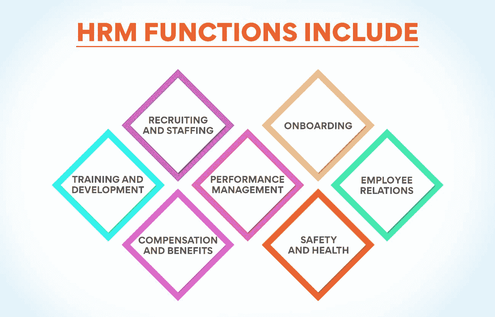
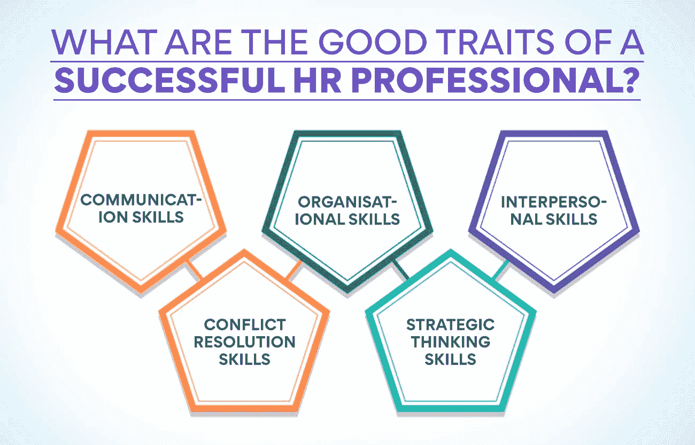
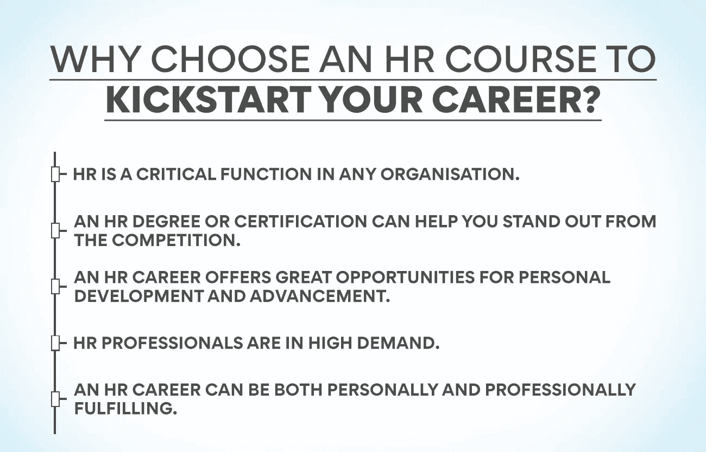

# 什么是人力资源？含义、定义和重要性

> 原文：<https://www.edureka.co/blog/human-resource-meaning/>

人力资源是用来描述组织中负责管理公司员工的部门的术语。这包括雇用和解雇，员工福利，工资，等等。对于许多公司来说，人力资源是最重要的部门之一。毕竟，员工是公司最宝贵的资产。有了它们，公司才能正常运转。如果你想从事人力资源方面的职业，或者只是好奇这份工作需要什么，那么了解人力资源的意义是你必须要做的。

## **人力资源的含义是什么？**

人力资源部是公司的一个部门，负责所有与员工有关的事情。人力资源是必不可少的，因为他们是确保公司平稳运行和员工快乐的人。

## **什么是人力资源管理？**

人力资源管理(HRM)的含义不仅仅限于招聘、选拔、入职、培训和管理组织的员工，还负责[员工关系](https://www.edureka.co/blog/better-employee-relation-can-lead-to/)、福利和工资。

人力资源管理的最终目标是创造一个员工高效、敬业并致力于组织成功的工作场所。为了实现这一目标，人力资源管理必须吸引、发展、激励和留住最优秀的人才。

人力资源管理职能包括:

*   **招聘和人员配备:** 为组织吸引和选择最优秀的人才
*   **入职:** 欢迎并引导新员工进入公司
*   **培训和发展:** 为员工提供他们在工作中取得成功所需的技能和培训
*   **绩效管理:** 通过定期反馈和评估管理员工绩效
*   **员工关系:** 创造积极的工作环境，管理员工与管理层之间的沟通
*   **薪酬福利:** 制定吸引和留住顶尖人才的薪酬计划
*   **安全与健康:** 促进安全的工作环境

## 组织中有效的人力资源管理的意义是什么？

有效的人力资源管理可以给组织带来几个关键的好处。也许最重要的是，它有助于确保组织拥有一支有技能、有积极性的员工队伍。这反过来可以提高生产率和盈利能力。

真正理解[人力资源管理](https://www.edureka.co/blog/role-of-human-resource-management-in-an-organization/)的含义也有助于为员工创造一个积极的工作环境。这可以减少员工流动和旷工，提高员工士气和承诺。此外，它还有助于建立一个强大的雇主品牌，吸引高质量的候选人加入组织。

最后，有效的人力资源管理可以确保一个组织遵守雇佣法规并履行其健康和安全义务，从而有助于该组织的整体成功。这可以保护组织免受法律诉讼和经济处罚，并有助于确保其对社会负责任地运营。

## 人力资源的 8 大职能是什么？

*   人力资源支持组织的使命、愿景和价值观。
*   人力资源吸引、培养和留住高绩效员工。
*   人力资源在工作场所吸引员工。
*   人力资源促进员工福利。
*   人力资源部管理员工福利和薪酬计划。
*   人力资源部制定并实施支持组织目标的政策和程序。
*   人力资源部与其他部门合作，实现组织[目标](https://www.edureka.co/blog/objectives-of-human-resource-management/)。
*   人力资源部门衡量、评估并不断改进人力资源计划和服务。

## 人力资源管理不善的后果是什么？

人力资源管理不善的组织会有几个潜在的后果。这些因素包括员工流动率高、士气和生产力低下以及法律诉讼风险增加。

糟糕的人力资源管理还会导致角色和职责不明确，在团队中造成混乱和冲突。此外，如果你的组织被认为人力资源管理不善，吸引和留住顶尖人才会很困难。

最终，人力资源管理不善的后果会对组织的底线产生重大负面影响。因此，对于组织来说，确保拥有健全的人力资源系统和流程以避免这些陷阱是至关重要的。

## 人力资源面临哪些挑战？

人力资源面临着许多挑战，但其中一些最常见的挑战如下:

*   吸引和留住顶尖人才
*   管理员工绩效
*   [薪酬](https://www.edureka.co/blog/compensation-in-hrm)和福利管理
*   遵守雇佣法律法规
*   员工培训和发展

**也读作:[分解人力资源管理的范围](https://www.edureka.co/blog/scope-of-human-resource-management/)**

## **理解人力资源的含义并应对挑战:**

人力资源部门一直面临着用更少的资源做更多的事情的压力。他们被要求在降低成本的同时为员工提供更多的服务和支持。对于人力资源专业人士来说，这可能是一个棘手的平衡动作。

有几种方法可以解决人力资源面临的挑战。一种方法是使用技术来自动化人力资源专业人员负责的一些任务。这可以让人力资源专业人员专注于更具战略性的任务。

应对人力资源挑战的另一种方法是将人力资源专业人员负责的一些职能外包出去。这有助于降低成本，同时还能为员工提供他们需要的支持。

最后，人力资源专业人员必须紧跟所在领域的最新趋势和发展。这将允许他们确定新的机会，以提高他们部门的效率，更好地为他们的员工服务。

## 专业的人力资源如何带领公司走向成功？

人力资源对任何公司都至关重要，一个专业的人力资源可以带领公司走向成功。专业人力资源有几个好处，包括减少流动，吸引和留住顶尖人才，改善沟通。

专业的人力资源可以通过尽早发现问题并在问题导致员工不满之前解决问题来帮助减少人员流动。他们还可以通过创造积极的工作环境和提供有竞争力的福利来吸引和留住顶尖人才。最后，他们可以通过确保所有员工了解公司政策和程序来改善沟通。

要使公司成功，拥有一支专业的人力资源团队是必不可少的。他们将帮助你减少流动，吸引和留住顶尖人才，并改善沟通。

## 一个成功的人力资源专业人士有哪些好的品质？

一个成功的人力资源专家能够有效地管理组织内的人员。他们必须有效地进行口头和书面交流，并与员工建立关系。他们还必须有很强的解决问题的能力，能够处理困难的情况。

1.  **沟通技巧:** 一个成功的人力资源专业人士应该拥有出色的沟通技巧，能够有效地管理组织各层级的员工并与之沟通。
2.  组织技能: 一个成功的人力资源专业人员应该高度组织化，以跟踪员工记录、福利项目和其他与人力资源相关的信息。
3.  人际交往技巧: 一个成功的人力资源专业人士应该有很强的人际交往技巧，与员工和客户建立积极的关系。
4.  **冲突解决技巧:** 一个成功的人力资源专员应该善于建设性地、积极地解决职场冲突。
5.  **战略思维技巧:** 一个成功的人力资源专业人士应该进行战略思考，为组织的人力资源需求制定长期计划。

## 同步良好的人力资源系统的最佳实践？

对于一个高效的人力资源部门来说，重要的是该部门的各个方面协调一致，和谐地合作。这可能是一个挑战，但一些最佳实践可以帮助确保您的人力资源系统顺利运行。

你必须确保对部门内的每个职位都有一个清晰而简明的工作描述。这将有助于确保每个人都知道自己的角色和职责。此外，您应该在所有团队成员之间建立清晰的沟通渠道，以便轻松共享信息。

准确记录员工的绩效和发展也很重要。这将帮助您确定需要改进的地方，并提供可用于未来规划的宝贵数据。最后，为您的团队提供定期培训和发展机会以继续成长和发展他们的技能是至关重要的。

**也可阅读:[如何实现最佳职业成长](https://www.edureka.co/blog/professional-growth/)**

## **如何成为一名高效的 HR 专业人士？**

要成为一名高效的人力资源专家，你必须时刻牢记这些事情:

1.  组织有序并拥有一个良好的系统来跟踪员工数据是非常重要的。
2.  在这个职位上，与员工和经理的有效沟通至关重要。
3.  积极主动地解决问题并跟上当前的人力资源趋势将有助于你在职业生涯中取得成功。

对人力资源专业人员来说，最重要的事情是提高工作效率。这可以通过几个具体步骤来实现:

*   工作要有条理。这意味着跟踪截止日期、会议和其他重要事件。这也意味着拥有一个归档和跟踪员工信息的系统。
*   在工作中要积极主动。这包括预测问题并采取措施防止问题发生。这也意味着积极主动地解决出现的问题。
*   与员工和经理有效沟通。这意味着在交流信息时要透明。这也意味着倾听他人，并对他们的问题或担忧做出适当的回应。
*   了解最新的人力资源法律法规。这包括了解可能影响公司政策或程序的法律变化。这也意味着要跟上人力资源领域的新趋势。
*   遵循这些建议，确保你的工作效率。这样做将有助于你在职业生涯中获得成功。

## **印度人力资源的意义及其未来发展潜力**

印度人力资源的未来增长潜力巨大。该国人口众多，经济快速增长，这两个主要因素推动了对人力资源服务的需求。此外，印度政府正在大力投资提高劳动力质量的举措，进一步增加了对人力资源专业人员的需求。

一些有望实现显著增长的领域包括员工培训和发展、招聘和选拔以及员工关系。随着新技术的引入和日益全球化，印度的人力资源专业人员必须擅长使用在线工具和资源来有效地[管理多样化的员工队伍](https://www.edureka.co/blog/workforce-planning/)。

为什么要选择人力资源课程来开始你的职业生涯？

学习人力资源课程来启动你的人力资源职业有很多原因。以下是一些关键原因:

1.  在任何组织中，人力资源都是一项关键职能。

人力资源课程将为你在人力资源管理的原则、实践和意义方面打下坚实的基础。您将了解人力资源在组织中的[战略角色，如何吸引和留住人才，如何管理员工绩效，以及如何设计和实施有效的员工福利计划。](https://www.edureka.co/blog/strategic-human-resource-management)

2.  人力资源学位或证书可以帮助你在竞争中脱颖而出。

在当今竞争激烈的就业市场上，拥有人力资源学位或专业证书会让你比其他求职者更有优势。雇主们越来越多地寻找受过正规人力资源培训的候选人，所以完成一门人力资源课程并深入了解人力资源的意义可以帮助你获得梦想中的工作。

3.  人力资源职业为个人发展和进步提供了巨大的机会。

如果你在寻找一份既有挑战性又有回报的职业，人力资源部是个不错的选择。你可以在人力资源领域走很多路，比如专攻招聘或培训和发展。随着你获得经验，有很多机会晋升到高级职位，如人力资源经理或总监。

4.  人力资源专业人员需求量很大。

劳工统计局预计，从 2016 年到 2026 年，人力资源领域的就业将增长 7%，这确实快于所有职业的平均水平。这种增长是由人力资源在组织成功中日益增长的重要性以及婴儿潮一代人的退休等因素推动的。

5.  人力资源职业既能满足个人需求，也能满足职业需求。

如果你正在寻找一份在个人和职业方面都令人满意的职业，人力资源部是一个很好的选择。作为一名人力资源专业人员，你将有机会积极影响员工的生活，并帮助组织实现他们的目标。

**结论**

在任何组织中，人力资源都是一项关键职能。没有充分的人力资源管理，招聘、培训和留住员工将会很困难。此外，人力资源在员工关系、福利管理和遵守劳动法方面发挥着重要作用。鉴于人力资源的重要性，组织需要有一个专门的人力资源部门。

有了我们[的人力资源管理研究生证书](https://www.edureka.co/highered/human-resourse-management-course-iim-shillong)，你就可以踏上充实的旅程，成为一名成功而高效的人力资源专业人士。无论你是想转行还是微调技能，这门课程都会完美满足你的需求。立即查看课程以了解更多信息。

## **更多信息:**

[目标&人力资源管理的本质](https://www.edureka.co/blog/nature-and-objectives-of-human-resource-management/)

[人力资源管理的演变:过去和未来](https://www.edureka.co/blog/evolution-of-human-resource-management)

[什么是利益相关者参与？重要性、规划和实施](https://www.edureka.co/blog/stakeholder-engagement)

[制定有效人力资源战略的终极指南](https://www.edureka.co/blog/ultimate-guide-to-developing-an-effective-hr-strategy/)