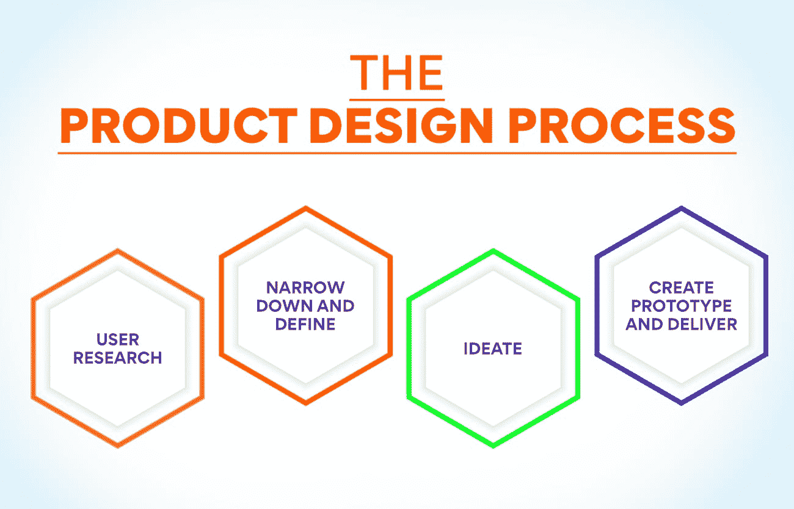
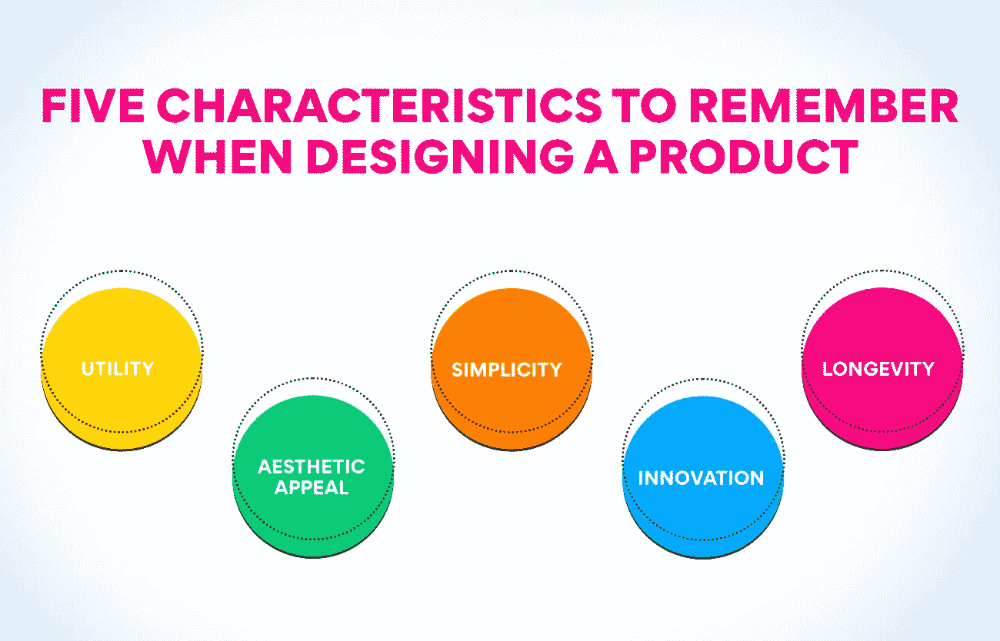
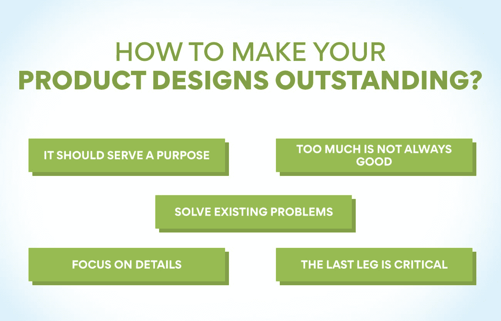

# 运营管理中的产品设计是什么？

> 原文：<https://www.edureka.co/blog/product-design-in-operations-management/>

今天的顾客有太多的选择。印度和外国公司都在营销大量类似的产品，因此公司不得不努力击败竞争对手。产品必须在功能和设计上都很好。当它们与竞争产品一起放在超市时，必须能够吸引顾客的注意力。这并不容易，因为产品吸引顾客注意力的时间很短。这就是为什么运营管理部门的产品设计是一项关键任务。

**了解产品设计**

产品设计在[运营管理](https://www.edureka.co/blog/beginners-guide-to-operations-management/) 中是至关重要的一步。顾客有许多选择。除非产品的设计能吸引他们的注意力，否则公司可能会发现很难卖出该商品。在众多有竞争力的产品中，这款产品一定有其独特之处，才能吸引顾客尝试。是产品的设计促使某人第一次尝试。在这一点上，客户不知道这些特性有多好，也不知道它是否适合他们。

一旦顾客决定试用该产品，就很容易通过交付你承诺的质量和功能来满足他们。但是在进入设计过程之前，你必须知道为什么要创造一个特定的项目。它必须在客户愿意花费的预算范围内解决问题。该产品还必须为公司赚取收入。产品设计流程在创建之前会考虑所有这些因素。运营管理中的产品设计是创建满足上述条件的产品的过程。

任何有创造力和艺术素质的人都可以成为产品设计师。参加运营、供应链和项目管理高级证书课程是加入这一职业的第一步。您可以访问我们的网站，了解更多关于该课程的信息，以及它如何让有抱负的产品设计师受益。

**产品设计流程**

正如我们之前在博客中提到的，运营管理中的产品设计不是一个单一的步骤，而是一个详细的过程。如果你渴望成为一名产品设计师，很好地了解这个过程是很重要的。这个过程从用户开始，你必须满足他的需求。组织必须确保产品有需求。

1.  **用户研究**

人们可以用不同的方式进行用户研究。至于哪种方法是最好的，这取决于产品和客户群。有时候所有的方法都会被用来了解客户想要什么。

用户访谈——这是一种面对面或通过电话采访用户的方法，以了解他们的需求以及他们对新产品的期望。这个过程很耗时，但能给你最准确的见解。

**在线调查**——在这种方法中，公司在网上发布调查问卷，并要求用户填写。这种方法可以在很短的时间内提供大量的数据。这是一种廉价的收集信息的方法，但它可能不如面试准确。

**情境调查**——顾客在自然环境中使用产品时被观察。这是一个很好的方法去同情用户，并设身处地为他们着想。

**市场调查**——研究竞争对手以及他们如何满足顾客是了解市场需求的一个绝佳方法。它让你从其他公司犯下的错误中吸取教训，并加以改进。

2.  **缩小范围并定义**

这是运营管理产品设计的下一阶段，将对大量数据进行分析，以确定客户的确切需求。在这一阶段，充分了解客户至关重要。公司在这个阶段创建用户角色来帮助他们缩小产品设计的范围。创建用户角色有助于公司理解客户的目标和动机。一个公司创建的人物角色的数量取决于产品和客户群。在这个阶段结束时，团队已经准备好就产品的特性进行头脑风暴了。

3.  **想法**

一旦团队对顾客的需求有了想法，他们就该坐下来思考了。成员们举行了一次头脑风暴会议，讨论可以为用户问题提供答案的不同功能。随着创造性想法的流动，这个阶段也有助于获得利益相关者的信任。获取创建第一个模型或原型所需的资源至关重要。运营管理中的产品设计这一步骤有助于确保想法与公司的总体[目标](https://www.edureka.co/blog/what-are-the-objectives-of-operations-management/)保持一致。

4.  **制作原型并交付**

下一步是将想法付诸实践。该公司从创建一个只有必要功能的原型开始。原型有助于公司测试产品，并确保它能实现承诺。一旦原型被测试并发现可以使用，产品设计团队就创建一个最小可行的产品或 MVP。这种产品被发布给一些选定的客户，看看他们的反应。在 MVP 测试成功后，产品进入市场。但是运营管理的产品设计会随着客户需求的变化而继续。

**设计产品时要记住的五个特征**

**效用**

参与运营管理产品设计的团队必须记住，产品必须具备的第一个品质是实用性。公司必须确保该产品对顾客有用，并能解决他们认为足够严重的问题。产品设计的每个方面都应该向用户传递一些价值。如果不是这样，用户体验可能会不如预期。

**审美情趣**

产品对顾客有用是不够的。还必须好看。美观是产品设计的重要元素。即使一个物品可以提供一个问题的所有解决方案，但如果它看起来很丑，它就不会在市场上销售。外观也很重要，吸引客户从几个竞争对手的产品中选择这个。运营管理部负责产品设计的团队绝不能错过这方面的工作。

**也念:[生产管理的职能有哪些？](https://www.edureka.co/blog/production-management-functions/)**

**简单**

人们希望无需太多学习或实践就能使用该产品。简单是产品的一个重要因素。虽然它必须服务于目的，但也必须易于使用。客户必须容易理解产品的功能和每个功能的用途。这是产品设计者必须记住的一件重要的事情，包括实用性和美学吸引力。

**创新**

推出一款与市场上已有的产品具有相同优势的产品是没有用的。当新产品进入市场时，顾客会有额外的期望。无论是在设计、易用性还是功能方面，该产品都必须比其他产品有优势。那些在运营管理中负责产品设计的人必须注意到这一点。

**长寿**

没有人想很快丢弃一个产品，去买另一个。顾客希望他们购买的东西能持续更长时间，并且物有所值。产品设计师必须确保产品能够长期服务于用户，并具备能够满足他们未来需求的功能。长寿是设计师技能的证明，也是对环境更好的证明。

任何渴望成为产品设计师的人都应该注意以上几点。他们可以在由知名机构举办的运营、供应链和项目管理高级证书课程中了解更多这些特征。您可以访问我们的网站，了解更多关于该计划的信息。

**如何让你的产品设计出类拔萃？**

1.  **它应该有一个用途**

产品必须有其用途。没有人会买任何对他们有用的东西。在运营管理的产品设计中，要记住的第一件事是确保产品设计的每个方面都能为客户提供实用价值。光是物品好看或者经济实惠是不够的。设计的每个元素都应该服务于一个目的。如果没有，产品设计师必须认真考虑去除这个元素。设计师必须记住，他们是在为别人设计产品，并确保产品对用户有用。

2.  **太多并不总是好的**

设计师很容易受到诱惑，为产品添加过多的功能。但是它可能会妨碍易用性。一个产品必须只具备使其发挥功能所需的特性。大多数用户不会使用一个产品的所有功能。所以不如减少功能，让产品更人性化。有时候，太多的功能会让客户远离一款优秀的产品。产品设计师必须记住，大多数人更喜欢能解决他们问题的简单产品。

3.  **解决存在的问题**

让人们相信一个产品可以解决他们已经面临的问题总是比较容易的。让他们相信他们将来可能面临的问题并不容易。因此，参与运营管理部门产品设计的团队必须确保他们在设计产品时关注用户存在的问题。没有必要发明一个产品可以解决的问题。一旦产品设计可以回答这样的问题，那么设计团队就可以通过添加更多的功能来改进产品。

4.  **关注细节**

在竞争激烈的市场中，正是这些小细节支撑着一个产品。人们如此习惯于只服务于目的的大规模生产的物品，以至于他们正在寻找在细节上出类拔萃的东西。注意竞争对手产品中的小瑕疵可以吸引客户的注意。产品设计师应该确保产品的每个方面都是完美的。这将有助于获得竞争优势并赢得客户。

5.  **最后一程至关重要**

从几乎完成到完成，可能只有设计的百分之十。但是这 10%会占用你超过 50%的时间，因为这是你添加细节的地方。你投资完成产品设计的最后一步的时间是你成功的原因。正是这一部分将你的产品与竞争对手的产品区分开来。那些在运营管理部门从事产品设计的人不应该在最后阶段匆忙行事，因为那会让产品变得平庸。

**也读:[运营管理的范围是什么？](https://www.edureka.co/blog/what-is-the-scope-of-operations-management/)**

**点记**

**好的想法并不总是伟大的产品**

创意是创造产品的源泉。但是，并不是所有的好主意最终都会成为让顾客兴奋并给组织带来利润的产品。有时候，伟大的想法会产生顾客不需要的东西，至少在那之前是如此。

**并非所有功能都有优势**

有时，产品设计师会对一些功能变得如此兴奋，以至于他们会添加一些在特定产品中可能根本不需要的功能。那些参与运营管理的产品设计的人必须专注于为用户提供优势，而不仅仅是添加尽可能多的功能。

**产品设计不是一次性的工作**

一旦你设计出产品并将其投放市场，你的工作就没有结束。客户的需求不断变化，因此必须改变产品设计，并不断增加或改变功能。这是确保产品击败竞争对手并保持领先地位的唯一方法。

在[运营、供应链和项目管理](https://www.edureka.co/highered/advanced-program-in-operations-supply-chain-project-management-iitg)高级证书课程中，你可以学到关于产品设计的一切。访问我们的网站可以让你对这门课程有更多的了解。

**结论**

产品设计是决定产品成败的关键功能。在创造一个产品之前，对用户需求做足够的研究是必要的。人们还必须记住，产品设计师必须与客户保持联系，了解他们不断变化的需求，并相应地对产品做出改变。对于准备不断研究和创新的人来说，这是一个令人兴奋的职业。

## **更多信息:**

[11 个常见的运营经理面试问题& Ans](https://www.edureka.co/blog/operations-manager-interview-questions/)

[什么是服务运营管理？为什么重要？](https://www.edureka.co/blog/service-operations-management/)

什么是 IT 运营管理？按键指针

IT 运营管理包括哪些职能？