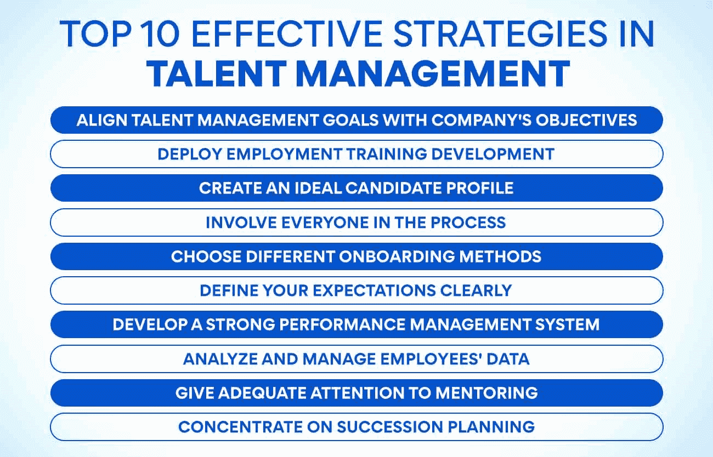
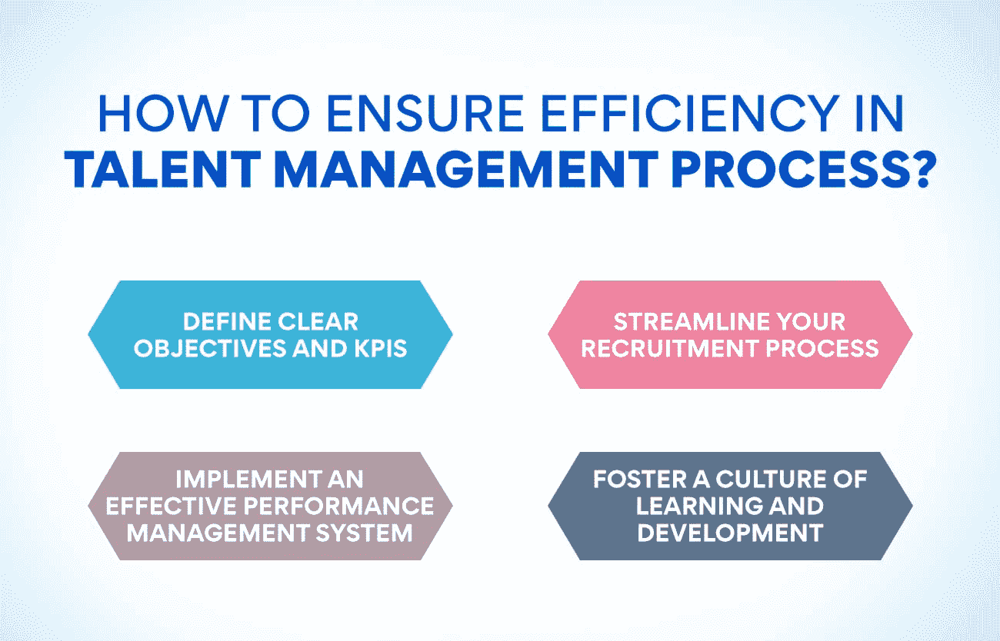

# 人才管理的十大有效策略

> 原文：<https://www.edureka.co/blog/strategies-of-talent-management/>

我们都知道人才是任何组织成功的关键。但是管理和发展你的才能的最好方法是什么呢？这就是人才管理的策略发挥作用的地方，它可能是有效的，取决于你的组织需求。这篇博文将探讨 10 个最有效的人才管理策略。这些策略将帮助您优化利用您的人才库，从识别和培养高潜力员工到继任计划。

## **人才管理的十大有效策略**

## **使人才管理目标与公司目标一致**

为了确保你的[人才管理](https://www.edureka.co/blog/talent-management/)努力与你公司的目标保持一致，首先要确定这些目标。一旦你确定了公司的目标，你就可以制定人才管理策略来支持和实现这些目标。

公司希望通过人才管理实现的一些共同目标包括:

*   提高员工生产力
*   减少人员流动和旷工
*   提高客户满意度
*   增加创新
*   提升品牌美誉度

每个组织都有希望通过人才管理实现的特定目标。通过花时间将您的人才管理目标与您公司的总体目标保持一致，您可以确保您的努力是有重点的，并将产生最大的影响。

## **部署就业培训开发**

组织应该为员工提供机会来发展和完善他们的技能和知识，这样他们才能更有效地为组织做出贡献。员工必须知道对他们的期望，以及如何提高他们的绩效。培训和发展计划可以帮助员工发挥潜力，提高工作满意度。

## **创建理想的候选人简介**

当谈到创建一个理想的候选人档案时，第一步就是要确定对你想应聘的职位来说最重要的技能和品质。在了解你在寻找什么之后，你可以开始为你的理想候选人建立一个档案。

看看这些提示，它们将帮助你创建一个理想的候选人档案:

*   定义你想要的技能和品质
*   研究你的理想候选人
*   列出必须具备和最好具备的技能和品质
*   利用社交媒体寻找潜在候选人
*   使用求职公告板和其他在线资源

## **让每个人都参与到流程中**

一个成功的组织让每个人都参与到人才管理过程中，这也是人才管理的有效策略之一。通过让所有级别的员工参与进来，您可以创建一个识别和培养顶级人才的系统，同时为所有员工提供提高技能和知识的机会。

让每个人都参与到人才管理流程中有几个关键方法:

*   鼓励员工参与评估和发展活动。
*   开诚布公地交流公司目标以及每位员工可以做出的贡献。
*   确保员工拥有成功所需的所有必要资源。
*   定期提供绩效反馈。
*   作为一个团队，一起庆祝成就并从失败中学习。

## **选择不同的入职方式**

对于新员工的入职，没有一种模式适合所有人。最好的入职计划是为个人量身定制的，并考虑到他们的具体需求和目标。

有多种不同的入职方法可供选择，最好的选择是询问每位新员工哪种方法最适合他们。一些常见的入职方法包括:

1.  **一对一会议:** 定期与主管或导师进行交流可以帮助新员工从一开始就感受到支持和参与。
2.  团队活动: 团队建设练习或社交活动可以帮助新员工感受到与同事的联系，并更好地理解他们在公司中的角色。
3.  **在线资源:** 提供在线学习材料，如电子学习课程或网络研讨会，可以让新员工灵活地按照自己的进度调整和学习。
4.  工作观察: 花时间观察有经验的员工的日常工作可以帮助新员工更好地了解他们的工作需要什么，以及他们如何为团队做出贡献。
5.  导师计划: 将新员工与更有经验的同事配对，可以在他们适应新角色时为他们提供指导和支持。

## **明确你的期望**

当涉及到为你的团队或员工设定期望时，简明扼要是至关重要的。确保你传达了对他们的工作表现、态度和对公司的总体贡献的期望。设定现实的期望也很重要，这样你的团队或员工就可以达到这些期望。请记住，设定过高的标准会导致沮丧和失望，而设定过低的标准会导致缺乏动力。

**另请阅读:[什么是利益相关者参与？](https://www.edureka.co/blog/stakeholder-engagement)的重要性、规划和实施**

## **开发强大的绩效管理系统**

强大的绩效管理系统是人才管理最重要的方面。它可以帮助您识别和培养组织中的优秀员工。

健全的绩效管理系统有几个关键组成部分:

1.  **持续反馈—**一个完善的绩效管理系统应该在年度评估过程中为员工提供持续的反馈，而不仅仅是一年一次。这种反馈应该来自他们的经理以及他们经常共事的其他人。
2.  **目标设定—**员工需要有明确的工作目标。这些目标应该与公司的整体战略保持一致。
3.  **绩效跟踪–**应该有一种理想的方法来跟踪员工的绩效，这样你就可以看到谁达到了目标，谁没有达到。这些数据可用于确定单个员工以及整个公司需要改进的地方。
4.  **认可和奖励—**员工需要感觉到他们的努力得到了认可。一个好的绩效管理系统将包括识别和奖励取得成功的员工。

## **分析和管理员工数据**

组织总是在寻找更好地理解和管理员工数据的方法。可以收集关于员工的许多不同类型的数据，从绩效数据到人力资源数据。

管理员工数据的一个有效方法是使用人才管理系统。人才管理系统帮助组织收集、存储和分析员工数据。它们还提供管理员工绩效和发展的工具。

管理员工数据的另一个策略是使用数据分析。数据分析可以帮助组织识别员工数据的趋势和模式。这些信息可用于改进人才管理流程和策略。

## **对指导给予足够的重视**

辅导是支持员工发展的一种行之有效的方式。指导可以通过提供指导和建议来帮助员工在职业生涯中取得进步，并发挥他们的潜力。

然而，指导不是临时就能完成的事情，需要给予足够的重视才能真正有效。看看如何确保你的指导计划符合标准的建议:

1.  定义您希望通过指导计划实现的目标。你的目标和目的是什么？你想要什么样的结果？没有明确的焦点，就不容易衡量你的项目是否成功。
2.  选择合适的导师。不是所有的经理或主管都会成为好的导师——寻找有时间、耐心、有能力认真倾听并提供建设性反馈的人。
3.  培训你的导师。指导他们应该做什么和不应该做什么，以及如何从与学员的关系中获得最大收益。
4.  从一开始就设定期望。确保双方都知道在时间承诺、保密等方面的期望。这将有助于避免进一步的误解。
5.  定期跟踪检查。定期与导师和学员交流，看看事情进展如何，是否有需要改进的地方。

## **专注于继任规划**

如今，首席执行官的平均任期不到五年，高层领导职位的更替率正在上升。面对这种不断增加的更替，组织必须注重继任规划，以确保连续性和成功。

虽然继任计划有许多方面，但最重要的一个方面是发现和培养高潜力员工。这些人有潜力在有空的时候担任高级职位。

组织可以使用各种方法来识别高潜力，包括评估、360 度反馈和绩效评估。一旦发现了高潜力者，就需要给他们发展技能和经验的机会。这可以通过指导、特殊任务和培训项目来实现。

通过关注继任计划，组织可以确保他们拥有一批有才能的人，在时机成熟时，他们可以随时担当领导角色。这有助于确保连续性和成功，即使在变化的时候。

**也可阅读:[战略性劳动力规划:步骤和流程](https://www.edureka.co/blog/workforce-planning/)**

## 什么是人才管理及其在企业界的意义？

【时间节点】人才管理被定义为“招募、选择、培养和留住员工的整体方法。”人才管理是当今企业的重要战略重点。对人才的争夺正在加剧，企业必须比以往任何时候都更加努力地吸引、培养和留住顶尖人才。

人才管理旨在确保一个组织在合适的时间拥有从事特定工作的技术人员。要做到这一点，组织必须清楚地了解他们当前和未来的劳动力需求。他们还必须有适当的流程和系统来识别、评估、培养和保留具有必要技能和能力的员工。

组织可以采取许多不同的策略和方法来进行人才管理。没有放之四海而皆准的解决方案；最佳方法因组织而异。最有效的计划是根据组织的具体需求量身定制的，并与其业务战略保持一致。

对于组织来说，最重要的是了解在当今竞争激烈的环境中取得成功的工作。人才管理是这个等式的关键部分。

## **如何在人才管理过程中保证效率？**

没有确定的答案，因为确保人才管理效率的最有效方法会因具体组织及其需求而异。然而，一些最佳实践有助于优化人才管理流程:

1.  **定义明确的目标和关键绩效指标:** 如果不清楚自己希望通过人才管理计划实现的目标，衡量成功或确定需要改进的领域将会非常困难。确保预先定义具体的目标和 KPI，并让关键利益相关者参与到该过程中，以便每个人都同意需要完成什么。
2.  精简你的招聘流程: 一个低效的招聘流程会浪费大量的时间和资源。使用社交媒体招聘和员工推荐等技术，确保你的招聘策略有针对性且高效。
3.  **实施有效的绩效管理系统:** 有了一个好的绩效管理系统，你就可以发现优秀的员工，并解决表现不佳的员工的任何问题。它可以节省大量的时间和挫折，同时也有助于提高整体生产力水平。
4.  **培养学习和发展的文化:** 鼓励员工不断学习新技能，发展他们在该领域的专长，会让他们感到自己受到重视，从而提高他们的工作效率。

## **结论**

谈到有效的人才管理，没有标准答案，但本文概述的策略将为您提供一个良好的起点。通过根据您的具体需求制定全面的人才管理战略，您可以确保您的企业拥有成功的所有可能性。

人才管理不是一个简单的过程；交付成果需要经验和专业知识。如果你希望从事[人力资源管理](https://www.edureka.co/blog/role-of-human-resource-management-in-an-organization/)的职业，在那里你可以参与人才管理，我们有一门课程将带你更接近你的目标。查看我们的[人力资源管理研究生证书](https://www.edureka.co/highered/human-resourse-management-course-iim-shillong)，这是新生和专业人士的理想选择。这是一个灵活的课程计划，你可以在方便的时候参加，而不会影响你目前的承诺。现在就来看看我们的课程，让你的职业生涯一飞冲天！

## **更多信息:**

[更好的员工关系可以带来快速的业务扩张:知道 11 个技巧](https://www.edureka.co/blog/better-employee-relation-can-lead-to/)

[什么是人力资源管理中的薪酬？你需要知道的一切](https://www.edureka.co/blog/compensation-in-hrm)

[什么是运营管理中的流程设计？](https://www.edureka.co/blog/process-design-in-operations-management/)

[优化人员管理以实现公司目标](https://www.edureka.co/blog/optimising-people-management-to-achieve-company-goals/)