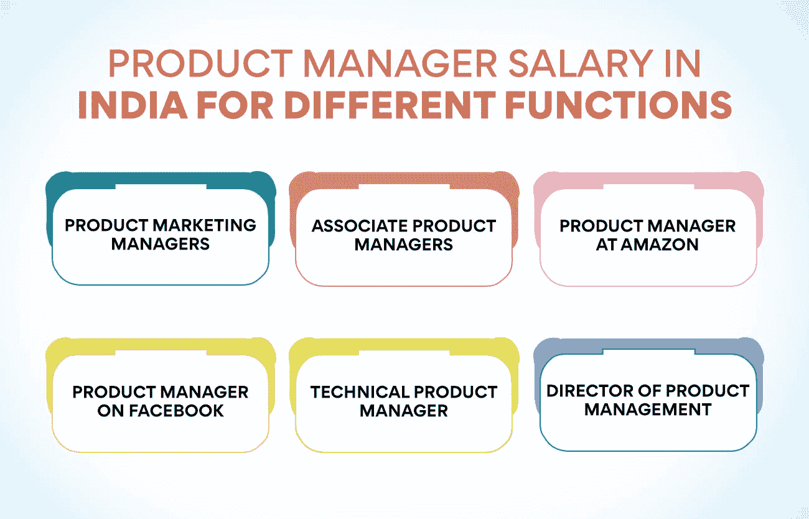
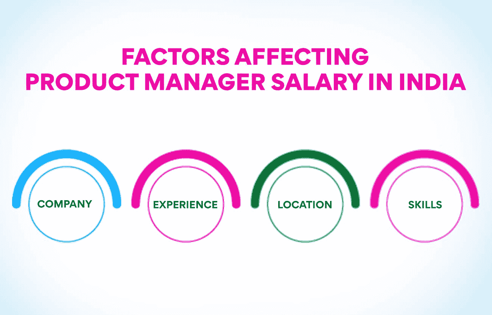

# 印度产品管理薪资:完全指南

> 原文：<https://www.edureka.co/blog/product-management-salary-in-india/>

每当人们想到他们的职业时，首先想到的是他们将获得的薪水。虽然人们在开始职业生涯时会考虑许多其他因素，但薪水仍然是首要考虑因素之一。大多数人甚至想在继续学习一门课程之前看看他们未来的收入。如今，许多毕业生认为最重要的工作之一是产品经理。但是在你继续学习这些科目之前，了解一下印度的产品管理薪水和工作前景是值得的。

产品经理需要具备必要的技能，也有资格处理这项工作。运营、供应链和项目管理高级证书课程是一个很好的项目，可以帮助你获得技能，并准备好接受一份具有挑战性的工作。你可以在我们的网站上了解更多关于这门课程的信息。

[**什么是产品管理？**](https://www.edureka.co/blog/what-is-product-management/)

如果我们看印度的产品管理薪资，我们也必须了解这份工作。顾名思义，这是从构思产品到停止在市场上占有一席之地的管理。在一家初创企业中，这项工作可能由创始人和联合创始人自己来处理。这是因为他们是负责推动增长和拥有产品愿景、战略和目标的人。但是随着公司的发展，它会把这项工作交给那些知道如何在产品的整个生命周期中管理产品的专家。

公司必须开展各种活动来确保产品在市场上保持领先地位。当公司考虑推出产品时，活动就开始了。产品经理获得市场反馈，以了解客户需求，以及产品中的哪些功能可以完全满足他们。他们也将了解竞争对手在做什么，并试图保持领先一步。[产品管理](https://www.edureka.co/blog/product-management/)还包括定价、定位和促销决策。因为这个人管理许多活动，所以在印度的产品管理工资在大多数公司都是相当不错的。

**也读作:[新时代产品开发过程的 7 个动态阶段](https://www.edureka.co/blog/product-development/)**

**印度产品管理的关键角色**

*   制定产品愿景、路线图和[战略](https://www.edureka.co/blog/product-strategy/)。
*   决定收集有关客户需求的市场信息所需的研究。
*   引导产品组合[策划](https://www.edureka.co/blog/product-planning/)。
*   审查产品规格和要求。
*   评估新产品创意。
*   通过与各部门协调，实现业务目标并确保客户满意。
*   将公司产品与竞争对手的产品进行比较，并了解其差异。
*   与客户和现场销售人员互动，了解销售电话的有效性，并评估产品市场数据。
*   确定营销传播的目标。
*   分析和预测短期和长期销售。
*   基于市场调查得出产品定价。
*   分析生产和销售成本。
*   招聘和培训产品管理人员。

我们已经看到了产品经理的关键职能。这在几乎所有的行业中都很常见，但可能会因公司而略有不同。在了解产品经理在印度**、** 的薪资之前，有必要看看现在和未来对产品经理的需求。

**印度产品管理的现状**

凭借一个拥有两万多个职位的门户网站，产品经理的职位目前在印度和海外都非常抢手。其他一些国家的工资比印度高得多，但这里的工资对这份工作来说是相当高的。公司知道合适的人可以提高产品销量，增加利润。这就是为什么企业愿意将 T2 产品经理的工资提高到其他国家的水平。

虽然专家预测全球将创造约 2200 万个工作机会，但印度只有 2 万名产品经理。这可能是公司为这些专业人士提供丰厚薪酬的主要原因。印度有大量的机会，拥有合适技能的人有望获得丰厚的薪水。随着更小的公司意识到这一点，所需的产品经理数量肯定会在短期内大幅增加。这将对印度的产品经理的工资产生积极影响。

**印度产品管理的未来**

这个职业的未来非常有前途。政府的举措导致数字初创企业的数量突然激增，刺激了对更多产品经理的需求。但未来属于数据驱动的公司。这意味着那些渴望在未来成为这一职业一部分的人应该拥有数据和分析、用户心理学、领域研究和技术方面的技能。印度的产品经理的工资也肯定会上涨，即使不会达到全球水平。

产品管理是全球未来 25 大工作之一。在印度，对产品经理的需求可能很快会翻倍。但是这项工作很有挑战性，因为这个人必须身兼数职。产品经理必须了解客户、竞争对手和团队成员。这个人必须能够与所有部门的人协调。从事这一行业的人还必须获得必要的认证，才能在职业生涯中快速进步。你不必担心印度产品经理的薪水，因为对合格人才的需求急剧增加。

虽然这些专业人士的薪水很高，但人们必须明白，正确的证书在计算薪水时非常重要。一个知名机构的运营、供应链和项目管理的高级证书课程将有助于获得必要的技能并向雇主索要高薪。

**印度产品经理工资**

现在是时候看看产品经理在印度的薪水了，不管是对应届毕业生还是有经验的人。可以看出，这些专业人士的平均工资在各行业中都相当高，可以被称为“高薪”白领员工。工资会因各种因素而有所不同。产品经理的平均年薪约为 170 万卢比。然而，这只是一个平均值，随着经验和额外技能的增加，工资每年将高达 30 万卢比。

许多在偏远地区的中小型公司工作的产品经理一年能挣 60 到 70 万卢比。如果他们跳槽到其他公司或其他地方，他们也可能渴望挣得更多。好消息是，据报道，接近 50%的产品经理年收入在 250 万到 300 万卢比之间，此外还有奖金和其他额外津贴。产品经理也在不同的部门和职能部门工作，这也会极大地影响他们的薪酬。让我们看看印度不同职能的产品管理薪资。

产品营销经理——这些专业人士在全国的大小公司工作。从各种产品营销经理那里收集的信息表明，他们的年薪约为 150 万卢比。这是针对大型跨国公司的，而那些为中型公司工作的人每年能赚 80 到 90 万卢比。另一方面，那些有 10 到 15 年工作经验的人可以获得将近 30 万卢比的奖金和一部分利润。

助理产品经理——这个职位比产品经理的职位低，因此他们挣得少。他们的平均年薪约为 110 万到 120 万卢比。也有那些在小公司或偏远地区工作的人，他们的年收入只有 60 万到 70 万卢比。从这些人必须执行的任务数量来看，这可以认为是非常低的。也有那些有经验的人，他们每年挣大约 140 万到 150 万卢比。

**亚马逊产品经理**——就产品经理而言，亚马逊是薪酬最高的公司之一。但是只有那些技术高超、经验丰富的人才能为这家公司工作。这份工作要求也很高，员工必须长时间工作。他们的工作效率也必须很高。据报道，该公司一些经验丰富的产品经理的收入接近 350 万卢比，是印度最高的产品经理工资。

这家公司里也有年薪 200 万到 220 万卢比的人。与印度的许多其他公司相比，这本身就很高了。众所周知，这家公司中一些技术高超、经验丰富的产品经理能拿到近 500 万卢比。这些专业人士拥有多年的经验，对市场了如指掌。他们有大约 15 到 20 年的工作经验。他们的工资被认为是印度最高的。现在我们知道了产品管理在印度的一个有经验的人的工资。

**也读:[品牌管理 v/s 产品管理:了解关键差异](https://www.edureka.co/blog/brand-and-product-management/)**

**脸书的产品经理**——这是另一家向产品经理支付高薪的公司。据报道，脸书的一名产品经理除了奖金和额外津贴，年薪接近 30 万卢比。这接近亚马逊支付给其 PMs 的薪酬。这些专家非常擅长设计和营销产品或服务。这就是为什么他们能拿到如此高的薪水。据报道，一些更有经验的产品经理的年薪接近 50 万卢比。

**技术产品经理**–技术产品经理的平均工资略高于其他项目经理，大约在 180 万到 190 万卢比之间。大一新生和在大城市工作不到五年的人收入在 120 万到 140 万卢比之间。有 10 到 15 年工作经验的专业人员每年能拿 300 到 350 万卢比的高薪。我们可以看到产品经理在印度的薪水相当高，这也是这个职业利润丰厚的原因。

产品管理总监——可靠的报告表明，这个职位的人平均年薪为 250 万到 300 万卢比，包括奖金和其他福利。可能有些挣的比这个少。但是行业信息也显示，有许多人有超过 20 年的工作经验，年薪大约在 80 万到 90 万卢比。这些人受到组织的高度重视，他们给他们工作的公司带来了很多好处。

虽然支付给产品经理的薪酬有一些标准，但它们也会因各种因素而有所不同。让我们看看是什么因素影响了印度产品经理的薪酬。

**影响印度产品经理薪酬的因素**

**公司**——谈到产品经理在印度的薪资，公司的规模很重要。公司的规模和所处的行业决定了它支付给产品经理的薪酬。

**经验**——这是另一个极大影响产品经理薪酬的因素。那些有很多年工作经验的人得到的薪水比大一新生高得多。这些人拥有快速解决问题并努力实现目标的能力。好的公司和经验的结合可以让[产品经理](https://www.edureka.co/blog/product-manager)拿到非常高的薪水。

**地点**——虽然公司的位置在未来可能会发挥更小的作用，但现在，公司的位置对产品经理的收入有很大的影响。在印度，据说孟加拉语能让你拿到最高的薪水。

**技能**——拥有必要的技能是获得最高工资的线索。一个人应该努力获得工作所需的所有技能。然后就有可能要求高薪。

我们已经看到了产品管理人员在印度的不同薪酬水平，以及影响该职位薪酬的因素。为了更多地了解这份工作并成为这方面的专家，你可以参加由知名机构提供的[运营、供应链和项目管理](https://www.edureka.co/highered/advanced-program-in-operations-supply-chain-project-management-iitg)高级证书课程。我们的网站会给你更多关于这个节目的细节。

**结论**

印度对产品经理的需求正在增加。这意味着这些专业人士的工资也可能大幅增长。获得高薪的关键是获得工作所需的必要技能，并加入薪酬最高的行业。你在这个领域获得的经验越多，薪水和津贴就会越多。

## **更多信息:**

产品差异的原因是什么？原因&原因

[每个 PM 都必须知道的产品管理框架](https://www.edureka.co/blog/product-management-frameworks)

[产品管理学习-关键领域](https://www.edureka.co/blog/product-management-learning)

[11 个重要的产品管理指标和 KPI](https://www.edureka.co/blog/product-management-metrics)