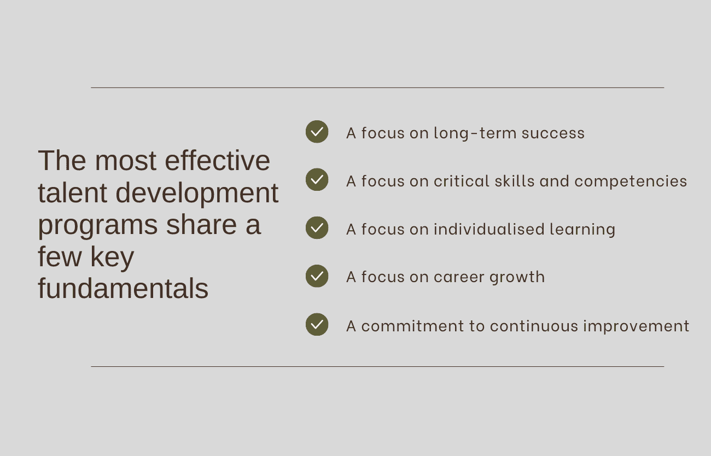
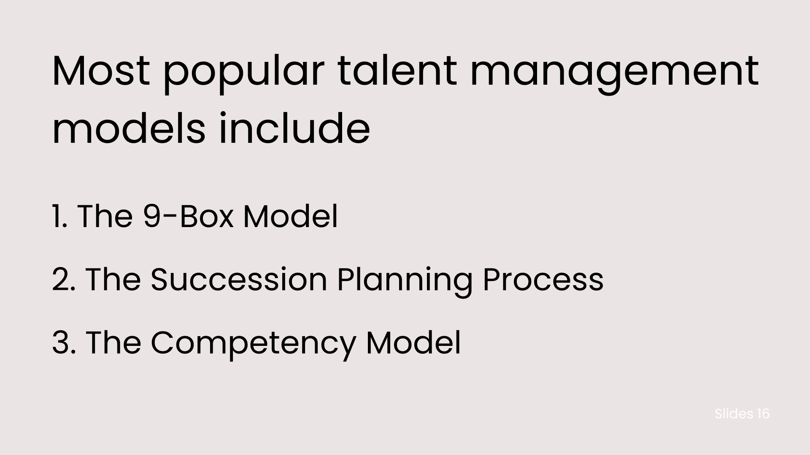

# 人才管理:模型和关键基础

> 原文：<https://www.edureka.co/blog/talent-management-models/>

要管理人才，你首先必须了解什么是人才管理。虽然这看起来很简单，但人才管理需要付出很多。人才管理的核心是吸引、培养和留住拥有必要技能和能力的员工，以帮助组织实现其业务目标。这篇博文将探讨一些不同的模式和人才管理的关键基础。最后，你应该更好地理解如何有效地管理人才。

## **策划**

[人才管理](https://www.edureka.co/blog/talent-management/)是识别、培养和留住具有潜在高绩效的员工。目标是确保您的组织拥有最有技能的人担任正确的角色。这需要良好的计划。

人才管理有几种不同的模式和方法。但所有成功的人才管理规划都有一些关键的基本原则。看看这些关键元素:

定义什么是成功: 第一步是确定你的组织成功的样子。你的高绩效员工拥有哪些技能和能力？他们的动机是什么？是什么让他们留在你的公司？一旦你清楚地了解成功是什么样的，你就可以开始识别和吸引具有同样品质的候选人。

**打造强势雇主品牌:** 强势雇主品牌将帮助你吸引顶尖人才。应聘者应该知道如何为你的公司工作，以及它的独特之处。他们必须对你公司的文化和价值观有更好的理解。

## **吸引员工**

仅仅有空缺职位是不够的，你需要积极寻找顶尖人才来填补空缺。最有效的方法是通过人才管理战略。通过了解不同类型的人才以及他们的动机，你可以制定一个计划来吸引最优秀的员工加入你的组织。

人才主要有四种类型:

*   对其领域有深入了解的职能或技术专家
*   能够看到全局并制定长期计划的战略思想家
*   总是寻找新机会的企业家类型
*   善于建立关系和激励他人的以人为本的个人

每种类型的人才都会带来不同的东西，所以确定每个职位需要哪种类型的人才至关重要。一旦你做到了这一点，你就可以开始考虑吸引他们。这里有几个想法:

*   对于职能专家或技术专家，强调他们在角色中将面临的挑战以及学习新事物的机会。一定要强调你的组织对职业发展的承诺。
*   战略思想家会对他们对整个组织的影响感兴趣。谈谈你公司的愿景，以及它如何帮助塑造未来的方向。
*   快节奏的环境和发展机会通常会吸引企业家。描述你的公司文化，强调最近的成功或扩张计划。

**也可阅读:[战略性劳动力规划:步骤和流程](https://www.edureka.co/blog/workforce-planning/)**

## **招聘**

招聘是人才管理的关键一步，组织可以采取多种不同的模式和方法。一个关键的考虑因素是使用内部还是外部招聘来源。内部招聘可能更具成本效益，有助于培养合格的候选人，但也可能更耗时。外部采购有助于扩大潜在候选人的范围，但也可能更加昂贵。

有几个申请人跟踪系统(ATS)可以帮助自动化和简化招聘流程。但是，考虑您组织的需求并确保您选择的 ATS 能够满足这些需求是至关重要的。另一个重要的考虑因素是技术在招聘过程中的正确使用和潜在使用。

最后，清楚地了解你希望填补的职位所需的技能和能力是至关重要的。这将确保您能够在招聘过程中找到合格的候选人。

## **人才培养**

人才发展领域最近出现了大量新的模式和方法。随着组织努力发现和培养未来的优秀领导者，他们正在探索各种各样的选择。最有效的人才培养计划有几个共同的关键基础:

1.  **关注长期成功:** 人才培养不是一蹴而就的；它需要组织和员工个人的长期承诺。
2.  **关注关键技能和能力:** 最好的人才发展计划确定在组织中取得成功所需的关键技能和能力，然后为员工提供发展这些技能的机会。
3.  **关注个性化学习:** 在学习和发展方面，没有一种模式适合所有人。最好的项目定制学习体验，以满足每个员工的需求。
4.  **关注职业发展:** 人才发展应该与员工的职业目标和抱负挂钩。通过为员工提供发展技能和知识的机会，组织可以帮助他们沿着职业道路前进。
5.  **致力于持续改进:** 最好的人才发展计划总是不断发展，根据员工反馈和商业环境的变化融入新的想法和方法。

## 保留时间

留住人才是人才管理的重要基础之一。人力资源管理协会表示，员工辞职的平均成本为 4129 美元。因此，组织需要有一个可靠的保留策略。

组织可以使用许多不同的模式来提高员工的忠诚度。一个流行的模型是 70:20:10 模型，该模型定义 70%的学习来自在职经历，20%来自与他人的互动，10%来自正式的学习机会。通过使用这种模式，组织可以创建一种更全面的人才管理和发展方法。

另一个关键的挽留策略是定期与员工沟通。这包括积极和建设性的反馈。感觉自己受到重视和支持的员工更有可能留在一个组织。此外，定期沟通有助于在潜在问题变得更严重之前及早发现它们。

最后，提供有竞争力的福利和薪酬也有助于留住人才。投资于员工福利的组织更有可能长期留住他们。

**另请阅读:[什么是利益相关者参与？](https://www.edureka.co/blog/stakeholder-engagement)的重要性、规划和实施**

## **转变**

对于雇员和雇主来说，过渡都是一个复杂的过程。必须清楚地了解过渡的目的和目标，并制定在此期间如何最好地支持员工的计划。在转移员工时，必须记住某些事情:

1.  **沟通是关键—**雇主和雇员之间开诚布公的沟通有助于确保每个人都在正轨上，不会出现意外。
2.  耐心–给人们时间适应变化是至关重要的，所以在你的员工进行这种转变时，对他们要有耐心。
3.  **支持他们的发展-**在这一过渡时期，为您的员工提供继续发展技能的资源和机会。

## **传统人才管理模式 Vs 现代人才管理模式**

传统的人才管理模式侧重于雇佣最优秀的候选人，并培养他们的技能以满足组织的需求。它基于这样一个假设，即组织的人才库有限，需要识别、吸引和留住最优秀的员工。现代人才管理模式采用更全面的方法来管理人才。它认为组织是由许多拥有不同技能、经验和观点的人组成的。

现代人才管理模式强调建立多元化的员工队伍，创造一个所有员工都能为组织的成功做出贡献的环境。这种模式认识到，每个员工都有所贡献，组织可以通过利用这种集体智慧取得更大的成功。现代人才管理模式也注重职业发展和继任规划。它确保员工有机会在组织内成长和发展，并确保有一个计划在人员流动的情况下保持连续性。

## **什么是好的人才管理策略？**

对于什么是优秀的人才管理战略，没有放之四海而皆准的答案。然而，所有成功的策略都有一些共同的关键原则:

1.  它们建立在对业务及其目标的清晰了解之上。
2.  他们确定实现这些目标所需的具体技能和能力。
3.  他们通过提供具有挑战性和回报性的机会来吸引、培养和留住最优秀的人才。
4.  他们提供持续的支持和反馈，以确保员工保持参与和积极性。

遵循这些原则，组织可以创造定制的人才管理战略，最大限度地发挥员工的潜力。

## **人才管理对公司的重要性**

人才管理对公司来说一直很重要，但近年来变得更加重要。原因很简单:随着全球经济竞争日益激烈，人才争夺战也愈演愈烈。能够识别、吸引和留住最优秀人才的公司将在当今市场中取得成功。

[人才管理是一个战略性的](https://www.edureka.co/blog/strategies-of-talent-management/)过程，帮助公司识别、发展和留住最优秀的员工。它包括从招聘和雇用到培训和发展、绩效监督和继任计划的一切。简而言之，这一切都是为了确保你的公司在正确的时间在正确的岗位上雇佣了最好的人才。

有几种不同的人才管理模式，但它们都有一些共同的要素。这些包括:

识别高潜力员工: 这通常是通过能力测试和性格评估等评估工具的组合，以及主管意见和 360 度反馈等更主观的措施来完成的。

**培养这些员工:** 一旦确定了高潜力员工，他们必须投资于他们的发展，以发挥他们的全部潜力。这可以通过培训计划、指导关系和延伸任务来实现。

留住这些员工: 即使你在发现和培养顶尖人才方面做得很好，重要的是你能否留住他们。

## **人才管理示例**

组织可以使用几种不同的[人才管理模式](https://www.edureka.co/blog/why-is-talent-management-important/)来发现和培养员工队伍中的人才。一些最流行的人才管理模式包括:

1.  **九箱模型:** 人才管理的九箱模型是一种工具，可用于帮助组织识别和培养其团队中的优秀员工。该模型由九个方框组成，每个方框代表不同的性能水平。表现最好的是那些在所有九个方面都得分很高的人。那些在一个或多个方框中得分较低的人被认为有改进的潜力。九格模型可以评估个人的当前表现和潜力，并确定发展需求。它可以作为做出晋升、继任计划和其他人才管理计划决策的渠道。
2.  **继任计划流程:** 继任计划流程是一个系统，用于识别和培养有潜力担任组织中关键领导职位的内部候选人。继任计划的目标一直是确保组织有一个人才管道，当他们成为可用的领导角色时，他们已经准备好了。
3.  **能力模型:** 这是一种工具，组织可以使用它来确定特定角色成功所需的关键能力。人才管理的能力模型可以帮助组织更好地理解实现其业务目标所需的能力。该模型还可用于评估个人的技能和能力，并制定培训和发展计划。

这些模式各有优缺点，没有一种管理人才的通用解决方案。然而，对于任何想要吸引、留住和发展最优秀员工的组织来说，理解人才管理的关键基础都是至关重要的。

## **结论**

人才管理是每个企业都应该考虑的吸引和留住顶尖人才的过程。通过了解人才管理的不同模式和关键基础，公司可以制定最适合自己和员工的计划。即使只实施其中的几个策略，也会对你的业务产生重大影响，并帮助你吸引和留住最优秀的人才。

想知道人才管理是如何运作的吗？查看我们的[人力资源管理研究生证书](https://www.edureka.co/highered/human-resourse-management-course-iim-shillong)——通向人力资源管理成功职业生涯的大门。

## **更多信息:**

[你必须知道的人力资源经理的 16 大素质](https://www.edureka.co/blog/qualities-of-hr-manager/)

[与 HR 的薪资谈判:成功秘诀](https://www.edureka.co/blog/salary-negotiation-with-hr/)

[人力资源招聘人员角色和职责指南](https://www.edureka.co/blog/hr-recruiter-roles-and-responsibilities/)

[人力资源管理职业的 21 大特征](https://www.edureka.co/blog/characteristics-of-human-resource-management/)